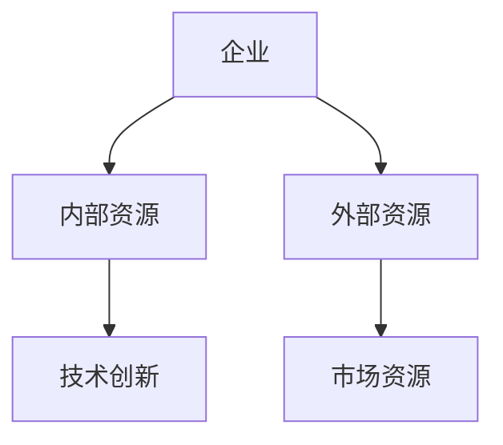
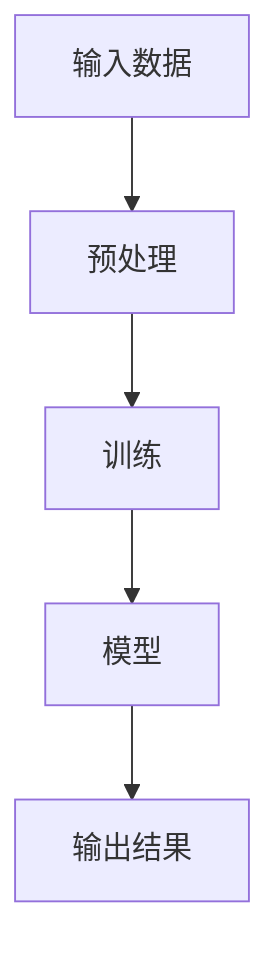
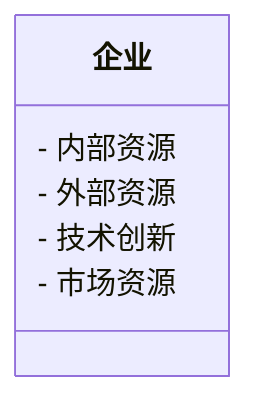

                 


# AI驱动的企业创新生态系统：内外部资源整合

> 关键词：AI驱动，企业创新生态系统，内外部资源整合，系统架构，算法原理，数学模型

> 摘要：本文探讨AI如何驱动企业创新生态系统，整合内外部资源，通过系统架构和算法原理分析，展示如何利用AI技术提升企业创新能力。

---

# 第1章: AI驱动的企业创新生态系统概述

## 1.1 问题背景与问题描述

### 1.1.1 传统企业创新的挑战

传统企业在创新过程中面临资源分散、协作效率低下等问题，限制了创新潜力的发挥。

### 1.1.2 AI技术对企业创新的机遇

AI技术能够通过数据分析和自动化流程优化，帮助企业更高效地整合内外部资源，推动创新。

### 1.1.3 企业内外部资源整合的必要性

内外部资源整合是企业利用AI技术实现创新生态系统构建的关键步骤。

## 1.2 问题解决与边界

### 1.2.1 AI驱动创新的核心目标

通过AI技术优化资源分配，提升创新效率。

### 1.2.2 创新生态系统的核心要素

包括内部资源、外部资源、技术创新、产品创新等要素。

### 1.2.3 AI驱动创新的边界与外延

明确AI在创新中的应用边界，避免过度依赖技术。

## 1.3 核心概念结构与组成

### 1.3.1 内部资源整合

整合企业内部的人力、技术和数据资源。

### 1.3.2 外部资源整合

引入外部合作伙伴、市场资源等。

### 1.3.3 内外部资源整合的协同机制

通过协同机制实现内外资源的有效结合。

## 1.4 本章小结

---

# 第2章: AI驱动创新的核心概念与联系

## 2.1 AI驱动创新的原理

### 2.1.1 AI在企业创新中的作用机制

AI通过数据处理和模型训练，为企业创新提供支持。

## 2.2 核心概念属性对比

### 2.2.1 内部资源整合与外部资源整合的对比

| 资源类型 | 描述                     |
|----------|--------------------------|
| 内部资源 | 企业内部资源             |
| 外部资源 | 企业外部合作伙伴资源     |

## 2.3 ER实体关系图



## 2.4 本章小结

---

# 第3章: 算法原理与流程

## 3.1 大模型训练流程



## 3.2 数学模型与公式

### 3.2.1 概率分布公式

$$ P(y|x) = \frac{P(x|y)P(y)}{P(x)} $$

### 3.2.2 损失函数

$$ L = -\sum_{i=1}^{n} \log P(y_i|x_i) $$

## 3.3 详细讲解与举例

### 3.3.1 大模型训练的数学模型

### 3.3.2 实际案例分析

## 3.4 本章小结

---

# 第4章: 系统分析与架构设计

## 4.1 问题场景介绍

### 4.1.1 企业创新的痛点

### 4.1.2 AI驱动创新的解决方案

## 4.2 系统功能设计

### 4.2.1 领域模型



## 4.3 系统架构设计

### 4.3.1 系统架构图


## 4.4 本章小结

---

# 第5章: 项目实战

## 5.1 环境安装

安装必要的AI框架和工具。

## 5.2 核心代码实现

### 5.2.1 核心代码

```python
def train_model(data):
    preprocessed = preprocess(data)
    model = build_model(preprocessed)
    return model
```

## 5.3 案例分析

### 5.3.1 案例分析

详细分析一个实际案例，展示如何应用AI技术。

## 5.4 本章小结

---

# 第6章: 最佳实践与注意事项

## 6.1 最佳实践 tips

### 6.1.1 数据质量的重要性

确保数据的准确性和完整性。

## 6.2 小结

总结全文内容。

## 6.3 注意事项

### 6.3.1 数据隐私保护

确保数据处理过程中的隐私保护。

## 6.4 拓展阅读

推荐相关书籍和资源。

## 6.5 本章小结

---

# 作者：AI天才研究院/AI Genius Institute & 禅与计算机程序设计艺术 /Zen And The Art of Computer Programming

