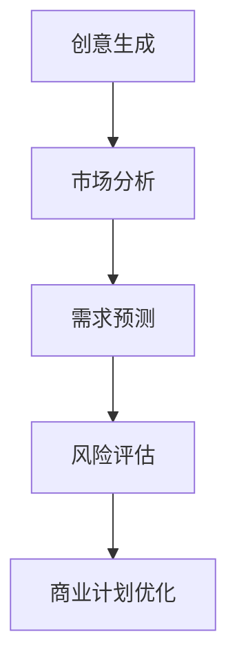
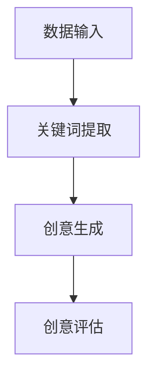
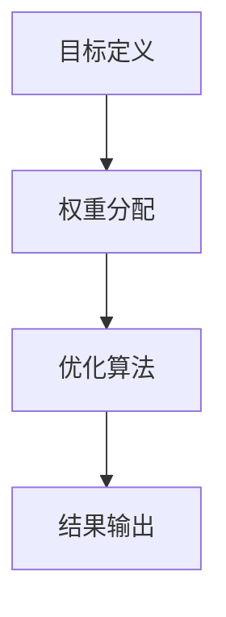
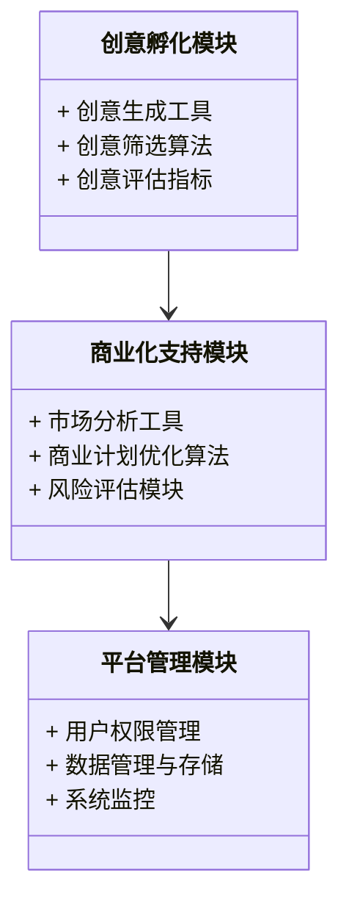
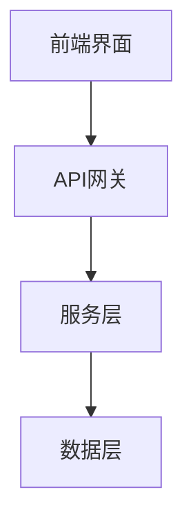
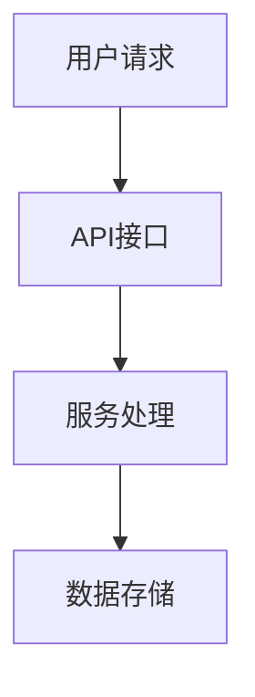
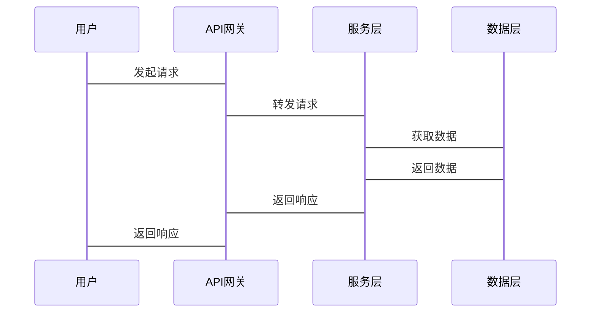

                 


# AI驱动的企业创新管理平台：从创意孵化到商业化

## 关键词：AI, 创新管理, 创意孵化, 商业化, 企业创新

## 摘要：  
本文深入探讨了AI驱动的企业创新管理平台，从创意的产生到商业化的整个过程。通过分析AI在创意孵化中的作用、商业化过程中的支持算法以及平台的系统架构设计，本文为读者提供了一个全面的技术视角。文章结合实际案例和系统设计，展示了如何利用AI技术提升企业创新能力，加速从创意到商业化的过程。

---

# 第1章: AI驱动的企业创新管理平台背景

## 1.1 企业创新管理的现状与挑战

### 1.1.1 传统企业创新管理的痛点
企业在创新管理过程中面临着诸多挑战，包括创意生成效率低、筛选过程主观性强、评估标准不统一等。传统方法依赖人工经验，难以系统化、数据化地处理创意到商业化的全流程。

### 1.1.2 数字化转型对企业创新管理的影响
随着数字化转型的推进，企业开始利用AI、大数据等技术优化创新管理流程。然而，现有系统在整合创意孵化与商业化支持方面仍存在不足，缺乏智能化的桥梁。

### 1.1.3 AI技术在企业创新管理中的潜力
AI技术能够通过数据驱动的方式，提升创意生成的效率、优化商业计划、降低风险评估的不确定性，从而为企业创新管理提供强有力的支持。

## 1.2 AI驱动创新管理的核心概念

### 1.2.1 创意孵化的定义与特点
创意孵化是指通过系统化的方法，利用AI技术生成、筛选和评估创意的过程。其特点是高效、数据驱动和智能化。

### 1.2.2 商业化过程的关键环节
商业化过程包括市场分析、需求预测、风险评估等关键环节，AI技术能够通过算法优化这些环节，提升商业化的成功率。

### 1.2.3 AI在创意到商业化中的作用
AI技术贯穿创意孵化和商业化全过程，从创意生成到市场分析，从需求预测到风险评估，AI都能提供强有力的支持。

## 1.3 本书的核心目标与结构

### 1.3.1 本书的研究目标
本书旨在探讨AI技术在企业创新管理中的应用，分析从创意孵化到商业化的过程，提供系统的解决方案。

### 1.3.2 本书的主要内容框架
- 第1章：背景介绍
- 第2章：核心概念与联系
- 第3章：算法原理
- 第4章：系统架构设计
- 第5章：项目实战
- 第6章：结论与展望

### 1.3.3 本书的读者群体
本书适合企业创新管理者、AI技术人员、创业者以及对创新管理感兴趣的研究者阅读。

---

# 第2章: AI驱动的企业创新管理平台核心概念与联系

## 2.1 创意孵化的AI驱动机制

### 2.1.1 数据驱动的创意生成
通过自然语言处理（NLP）技术，AI可以从海量数据中提取灵感，生成创意的初步想法。

### 2.1.2 AI算法在创意筛选中的应用
利用机器学习算法，AI可以对创意进行多维度评估，筛选出具有潜力的创意。

### 2.1.3 创意评估的多维度指标
创意评估需要考虑市场潜力、技术可行性、团队能力等多个维度，AI可以通过数据驱动的方法量化这些指标。

## 2.2 商业化过程的AI支持系统

### 2.2.1 市场分析与需求预测
通过AI算法，企业可以快速分析市场趋势，预测需求，为商业计划提供数据支持。

### 2.2.2 商业计划的智能优化
AI可以通过优化算法，帮助企业在资源分配、市场进入策略等方面做出最优决策。

### 2.2.3 风险评估与应对策略
AI可以通过风险评估模型，帮助企业识别潜在风险，并制定应对策略。

## 2.3 创新管理平台的系统架构

### 2.3.1 平台的功能模块划分
创新管理平台通常包括创意孵化模块、商业化支持模块和平台管理模块。

### 2.3.2 各模块之间的关系
模块之间通过数据流进行交互，例如创意孵化模块生成的数据输入商业化支持模块进行分析。

### 2.3.3 平台的核心数据流
数据流贯穿整个平台，从创意生成到市场分析，再到风险评估，形成一个完整的循环。

---

## 图2.1: 创新管理平台的核心数据流



---

## 2.4 创新管理平台的核心要素

### 2.4.1 创意孵化的核心要素
- 数据源：包括市场数据、用户反馈、技术趋势等。
- 算法：包括NLP、机器学习等。
- 评估指标：包括市场潜力、技术可行性等。

### 2.4.2 商业化的核心要素
- 市场分析：包括竞争分析、需求预测等。
- 风险评估：包括技术风险、市场风险等。
- 资源分配：包括资金、人力等。

### 2.4.3 平台架构的核心要素
- 模块化设计：确保各功能模块独立且协同。
- 数据流优化：确保数据高效流通。
- 可扩展性：确保平台能够适应未来发展。

---

# 第3章: AI驱动创新管理平台的算法原理

## 3.1 创意孵化的AI模型原理

### 3.1.1 基于NLP的创意生成模型
通过NLP技术，AI可以从大量文本数据中提取关键词，生成创意的初步想法。

### 3.1.2 创意筛选的特征提取方法
利用特征工程，AI可以提取创意的关键特征，如市场潜力、技术可行性等。

### 3.1.3 创意评估的多目标优化算法
通过多目标优化算法，AI可以在多个目标之间找到平衡点，生成最优的评估结果。

## 3.2 商业化过程的AI支持算法

### 3.2.1 市场分析的机器学习模型
通过机器学习模型，AI可以预测市场需求，识别潜在的市场机会。

### 3.2.2 风险评估的贝叶斯网络
贝叶斯网络可以通过概率推理，帮助企业评估不同风险的可能性。

### 3.2.3 商业计划优化的强化学习方法
通过强化学习，AI可以优化商业计划，找到最优的资源配置方案。

## 3.3 系统架构的AI集成机制

### 3.3.1 模块化设计的原理
系统通过模块化设计，确保各功能模块独立且协同工作，便于维护和扩展。

### 3.3.2 数据流的优化策略
通过优化数据流，确保数据在各模块之间的高效传输，减少数据冗余和瓶颈。

### 3.3.3 系统的可扩展性设计
系统设计时充分考虑未来的扩展性，确保在业务需求变化时，系统能够灵活调整。

---

## 图3.1: 创意生成的NLP模型流程



---

## 图3.2: 多目标优化算法的流程



---

## 代码示例：创意评估的多目标优化算法

```python
import numpy as np
from sklearn.metrics import pairwise_distances

def multi_objective_optimization(features, weights):
    # 计算每个创意的综合评分
    scores = np.dot(features, weights)
    # 找出最优创意
    best_index = np.argmax(scores)
    return features[best_index]

# 示例数据
features = np.array([[0.8, 0.6], [0.7, 0.9], [0.5, 0.7]])
weights = np.array([0.5, 0.5])

best = multi_objective_optimization(features, weights)
print("最优创意特征：", best)
```

---

# 第4章: 系统分析与架构设计

## 4.1 系统功能设计

### 4.1.1 创意孵化模块

#### 4.1.1.1 创意生成工具的设计
创意生成工具通过NLP技术，帮助用户快速生成创意的初步想法。

#### 4.1.1.2 创意筛选算法的实现
利用机器学习算法，系统可以自动筛选出具有潜力的创意。

#### 4.1.1.3 创意评估指标的定义
系统根据市场潜力、技术可行性等指标，对创意进行综合评估。

### 4.1.2 商业化支持模块

#### 4.1.2.1 市场分析工具的功能
市场分析工具通过大数据分析，帮助企业识别市场机会。

#### 4.1.2.2 商业计划优化算法的设计
通过强化学习算法，系统可以优化商业计划，找到最优的资源配置方案。

#### 4.1.2.3 风险评估模块的实现
系统通过贝叶斯网络，帮助企业评估不同风险的可能性。

### 4.1.3 平台管理模块

#### 4.1.3.1 用户权限管理
系统根据用户角色，分配不同的权限，确保数据安全。

#### 4.1.3.2 数据管理与存储
系统通过数据库技术，实现数据的高效存储和管理。

#### 4.1.3.3 系统监控与维护
系统通过监控工具，实时监控系统运行状态，确保系统的稳定运行。

## 4.2 系统架构设计

### 4.2.1 问题场景介绍
系统需要支持创意孵化和商业化支持两大功能，同时保证数据的安全性和系统的可扩展性。

### 4.2.2 系统功能设计

#### 4.2.2.1 领域模型
系统通过领域模型，明确各功能模块之间的关系和数据流。

## 图4.1: 领域模型的类图



### 4.2.2.2 系统架构设计

## 图4.2: 系统架构设计



### 4.2.2.3 系统接口设计

## 图4.3: 系统接口设计



### 4.2.2.4 系统交互设计

## 图4.4: 系统交互序列图



---

## 4.3 系统实现细节

### 4.3.1 环境安装
- 安装Python和相关库（如TensorFlow、Scikit-learn、Numpy等）
- 安装数据库（如MySQL、MongoDB等）
- 安装开发工具（如Jupyter、PyCharm等）

### 4.3.2 核心代码实现

#### 4.3.2.1 创意生成工具的实现

```python
import numpy as np
from sklearn.feature_extraction.text import TfidfVectorizer
from sklearn.decomposition import NMF

def generate创意(text_data):
    vectorizer = TfidfVectorizer()
    tfidf = vectorizer.fit_transform(text_data)
    nmf = NMF(n_components=3)
    nmf.fit(tfidf)
    return nmf.components_

# 示例数据
text_data = ["这是一个创意生成工具", "基于NLP技术"]
components = generate创意(text_data)
print("生成的组件：", components)
```

#### 4.3.2.2 市场分析工具的实现

```python
import pandas as pd
from sklearn.ensemble import RandomForestClassifier

def 市场分析(features, labels):
    model = RandomForestClassifier()
    model.fit(features, labels)
    return model

# 示例数据
features = pd.DataFrame({
    '特征1': [1, 0, 1],
    '特征2': [0, 1, 1]
})
labels = pd.Series([0, 1, 0])
model = 市场分析(features, labels)
print("训练好的模型：", model)
```

---

## 4.4 案例分析

### 4.4.1 案例背景
某企业希望利用AI技术优化其创新管理流程，从创意生成到商业化落地。

### 4.4.2 系统实现

#### 4.4.2.1 创意生成工具的实现
通过NLP技术，生成创意的初步想法。

#### 4.4.2.2 市场分析工具的应用
利用机器学习模型，分析市场需求，预测潜在的市场机会。

#### 4.4.2.3 风险评估模块的应用
通过贝叶斯网络，评估不同风险的可能性，制定应对策略。

### 4.4.3 实施效果
通过系统的实施，企业能够显著提升创新管理效率，降低商业化风险。

---

## 4.5 项目小结

### 4.5.1 系统功能实现
系统实现了创意孵化和商业化支持两大功能模块。

### 4.5.2 系统性能优化
通过模块化设计和数据流优化，系统性能得到了显著提升。

### 4.5.3 系统可扩展性
系统设计充分考虑了未来的扩展性，能够适应业务需求的变化。

---

## 5. 结论与展望

### 5.1 本书总结
本书系统地探讨了AI驱动的企业创新管理平台，从创意孵化到商业化的过程，提供了技术实现和系统设计的详细方案。

### 5.2 未来展望
随着AI技术的不断发展，企业创新管理平台将更加智能化、数据化，为企业创造更大的价值。

---

## 作者：AI天才研究院 & 禅与计算机程序设计艺术

---

感谢您的阅读！希望本文能够为您提供有价值的技术见解和实践指导。如您有任何疑问或建议，欢迎随时与我们联系。

