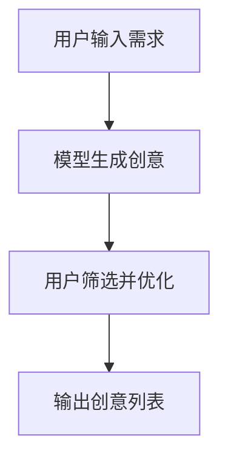
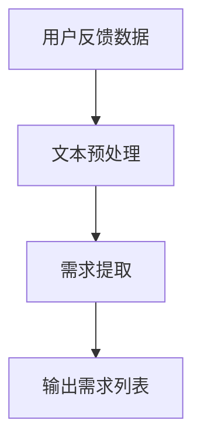
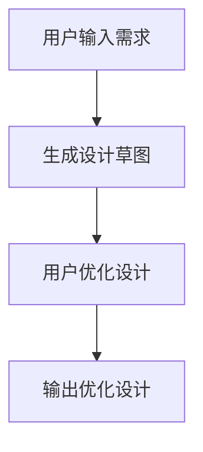
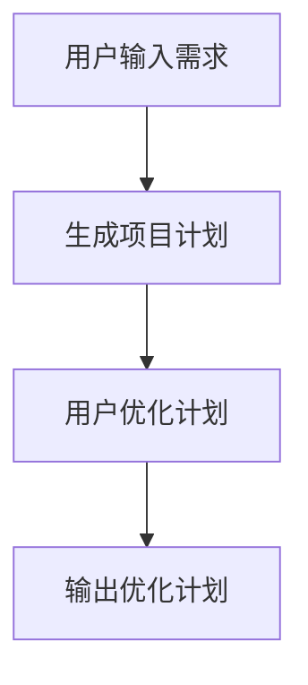
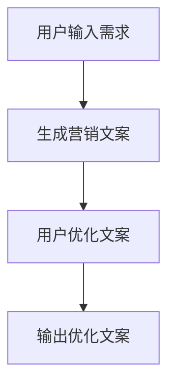
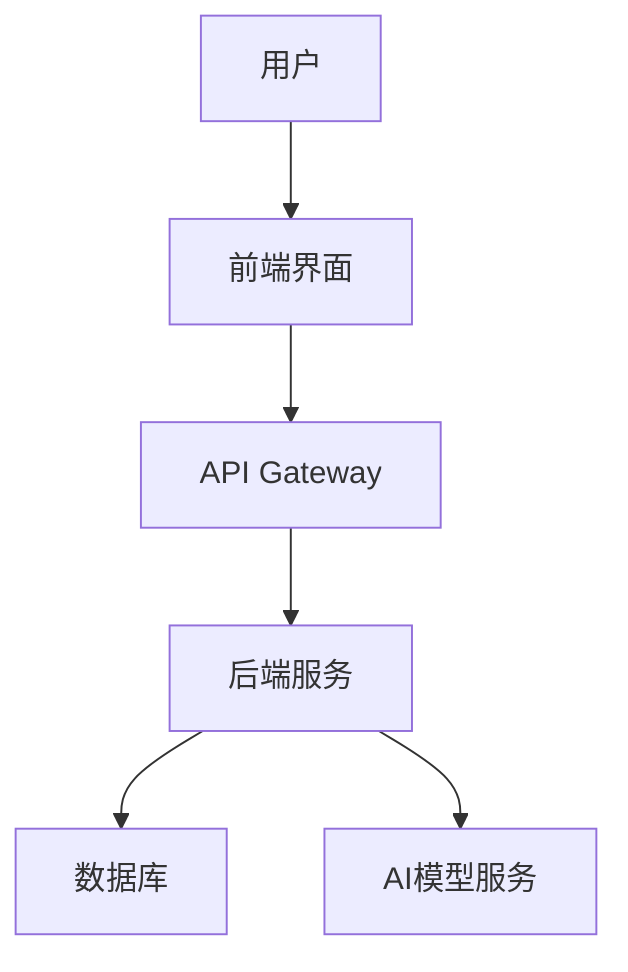

                 


# AI驱动的企业创新管理：从创意生成到商业化全流程优化

> 关键词：AI驱动、企业创新管理、创意生成、商业化全流程优化、人工智能、创新管理

> 摘要：本文详细探讨了AI在企业创新管理中的应用，从创意生成到商业化全流程的优化。通过分析AI驱动的创新管理方法、技术实现、系统架构和实际案例，本文为读者提供了从理论到实践的全面指导，帮助企业在数字化转型中实现更高效的创新管理。

---

## 第1章: AI驱动的企业创新管理概述

### 1.1 企业创新管理的背景与挑战

#### 1.1.1 传统企业创新管理的痛点

企业在传统创新管理中面临以下痛点：
- 创意生成效率低，难以快速响应市场需求。
- 创意筛选过程复杂，缺乏数据支持。
- 产品开发周期长，资源浪费严重。
- 市场推广不确定性高，难以精准定位目标客户。

#### 1.1.2 创新管理的核心要素与边界

创新管理的核心要素包括：
- 创意生成：基于市场需求和技术趋势，提出创新解决方案。
- 创意筛选：通过数据分析和专家评估，筛选出可行的创意。
- 产品开发：从创意到产品的实现过程，包括设计、开发和测试。
- 市场推广：通过营销策略将产品推向市场，获取用户反馈。

创新管理的边界：
- 以企业内部资源和外部市场需求为限。
- 要素之间的协同优化，确保创新过程高效有序。

#### 1.1.3 企业创新管理的演进与趋势

企业创新管理的演进：
- 从传统的人力驱动到数字化工具辅助。
- 从单一部门管理到跨部门协作。

创新管理的趋势：
- 数据驱动的决策支持。
- AI技术的应用，提升创新效率和精准度。

### 1.2 AI驱动创新管理的定义与特点

#### 1.2.1 AI驱动创新管理的定义

AI驱动创新管理是指利用人工智能技术（如自然语言处理、机器学习等），从创意生成到商业化全流程中提供数据支持和自动化工具，从而提升创新效率和成功率。

#### 1.2.2 AI在创新管理中的核心作用

- 创意生成：利用大语言模型生成创意灵感。
- 创意筛选：通过算法分析创意的可行性和市场潜力。
- 产品开发：AI辅助设计和测试，缩短开发周期。
- 市场推广：AI分析用户行为，优化营销策略。

#### 1.2.3 与传统创新管理的区别

| 对比维度       | 传统创新管理              | AI驱动创新管理              |
|----------------|---------------------------|-----------------------------|
| 工具支持       | 依赖人工分析和经验          | 结合AI工具和数据分析          |
| 创意生成       | 依赖人类灵感               | 利用AI生成创意               |
| 创意筛选       | 专家评估为主              | 数据驱动评估为主             |
| 开发效率       | 周期较长，资源浪费          | 周期缩短，资源优化            |

### 1.3 AI驱动创新管理的核心概念

#### 1.3.1 创意生成与筛选

创意生成是AI驱动创新管理的第一步，通过自然语言处理（NLP）技术，AI能够从海量数据中提取关键词和趋势，生成创意灵感。例如，使用GPT模型生成产品概念描述。

创意筛选是通过算法对生成的创意进行评估，基于市场数据和用户反馈，筛选出具有商业潜力的创意。

#### 1.3.2 产品设计与开发

AI辅助产品设计，通过计算机视觉技术生成设计草图，并利用机器学习优化设计参数。例如，使用AutoCAD和AI结合进行产品设计。

#### 1.3.3 市场推广与反馈

AI分析用户行为和市场趋势，优化营销策略，并实时收集用户反馈，调整推广方案。

### 1.4 本章小结

本章介绍了AI驱动创新管理的背景、定义、特点和核心概念，为后续章节奠定了理论基础。

---

## 第2章: AI驱动的创意生成方法

### 2.1 创意生成的AI技术基础

#### 2.1.1 基于大语言模型的创意生成

大语言模型（如GPT）通过自然语言处理生成创意文本，例如产品描述和市场分析报告。以下是创意生成的算法流程：

1. **输入需求**：用户输入创意类型（如科技产品）。
2. **模型生成**：模型生成多个创意文本。
3. **筛选优化**：用户筛选并优化创意。



#### 2.1.2 创意生成的算法流程

创意生成的算法流程包括数据预处理、模型训练和生成阶段。以下是训练阶段的数学模型：

$$
\text{损失函数} = \text{交叉熵损失} + \lambda \times \text{正则化项}
$$

### 2.2 创意生成的工具与应用

#### 2.2.1 常用AI创意生成工具

- **ChatGPT**：生成产品描述和市场分析。
- **Midjourney**：生成设计草图和视觉内容。

#### 2.2.2 创意生成的案例分析

案例：AI生成智能家居产品的创意描述。

### 2.3 创意生成的挑战与优化

#### 2.3.1 创意生成的局限性

- 创意质量依赖于模型训练数据。
- 可能生成不切实际的创意。

#### 2.3.2 创意生成的优化策略

- 提供高质量的训练数据。
- 结合人工审核优化创意。

### 2.4 本章小结

本章详细介绍了AI驱动创意生成的技术基础、工具应用和优化策略。

---

## 第3章: AI驱动的需求分析与验证

### 3.1 需求分析的AI技术基础

#### 3.1.1 基于NLP的需求分析

自然语言处理技术用于分析用户反馈，提取关键需求。以下是需求分析的算法流程：

1. **数据采集**：收集用户反馈。
2. **文本处理**：分词和情感分析。
3. **需求提取**：提取关键需求。



#### 3.1.2 需求分析的算法流程

需求分析的算法流程包括数据清洗、特征提取和分类。以下是分类阶段的数学模型：

$$
\text{概率} = \frac{\text{特征出现次数}}{\text{总样本数}}
$$`

### 3.2 需求分析的工具与应用

#### 3.2.1 常用AI需求分析工具

- **BERT**：文本分类和实体识别。
- **spaCy**：文本处理和信息抽取。

#### 3.2.2 需求分析的案例分析

案例：AI分析用户反馈，提取智能家居产品的核心需求。

### 3.3 需求验证的策略与方法

#### 3.3.1 需求验证的AI辅助方法

- **A/B测试**：通过用户行为数据验证需求。
- **反馈循环**：实时收集用户反馈，优化需求。

#### 3.3.2 需求验证的挑战与优化

- 数据质量影响验证结果。
- 验证周期长，需优化流程。

### 3.4 本章小结

本章详细介绍了AI驱动需求分析的技术基础、工具应用和验证策略。

---

## 第4章: AI驱动的产品设计与开发

### 4.1 产品设计的AI技术基础

#### 4.1.1 AI辅助的产品设计

计算机视觉技术用于设计辅助，例如生成设计草图和优化产品参数。以下是设计流程：

1. **输入需求**：用户输入产品功能。
2. **生成设计**：AI生成设计草图。
3. **优化设计**：用户优化设计。



### 4.2 产品开发的AI技术基础

#### 4.2.1 AI辅助的开发流程

通过机器学习优化开发流程，例如预测开发中的潜在问题。以下是开发阶段的数学模型：

$$
\text{风险概率} = \frac{\text{历史失败案例数}}{\text{总开发案例数}}
$$`

### 4.3 产品设计与开发的工具与应用

#### 4.3.1 常用AI产品设计工具

- **Figma**：AI辅助设计工具。
- **AutoCAD**：AI辅助设计工具。

### 4.4 本章小结

本章详细介绍了AI驱动产品设计与开发的技术基础和工具应用。

---

## 第5章: AI驱动的项目管理与优化

### 5.1 项目管理的AI技术基础

#### 5.1.1 AI辅助的项目管理

通过自然语言处理优化项目管理流程，例如自动生成项目计划。以下是项目管理流程：

1. **输入需求**：用户输入项目目标。
2. **生成计划**：AI生成项目计划。
3. **优化计划**：用户优化计划。



### 5.2 项目优化的策略与方法

#### 5.2.1 AI辅助的风险管理

通过机器学习预测项目风险，例如预测开发中的潜在问题。以下是风险管理的数学模型：

$$
\text{风险概率} = \frac{\text{历史失败案例数}}{\text{总项目数}}
$$`

### 5.3 本章小结

本章详细介绍了AI驱动项目管理的技术基础和优化策略。

---

## 第6章: AI驱动的市场推广与用户反馈

### 6.1 市场推广的AI技术基础

#### 6.1.1 AI辅助的营销策略

通过自然语言处理优化营销策略，例如生成营销文案。以下是营销流程：

1. **输入需求**：用户输入目标市场。
2. **生成文案**：AI生成营销文案。
3. **优化文案**：用户优化文案。



### 6.2 用户反馈的AI分析

#### 6.2.1 AI辅助的用户行为分析

通过机器学习分析用户行为，例如预测用户需求。以下是用户行为分析的数学模型：

$$
\text{用户需求概率} = \frac{\text{历史购买记录数}}{\text{总用户数}}
$$`

### 6.3 本章小结

本章详细介绍了AI驱动市场推广和用户反馈分析的技术基础。

---

## 第7章: 系统架构与技术实现

### 7.1 系统架构设计

以下是创新管理系统的架构图：



### 7.2 系统实现细节

#### 7.2.1 核心功能模块

- 创意生成模块：集成大语言模型。
- 需求分析模块：集成自然语言处理技术。
- 项目管理模块：集成机器学习模型。

### 7.3 系统优化策略

- 高可用性设计：使用分布式架构。
- 数据安全性：采用加密技术。

### 7.4 本章小结

本章详细介绍了创新管理系统的架构设计和技术实现细节。

---

## 第8章: 项目实战

### 8.1 环境配置

安装Python、TensorFlow和Kubernetes。

### 8.2 核心代码实现

```python
import tensorflow as tf
from tensorflow.keras import layers

# 定义模型
model = tf.keras.Sequential([
    layers.Dense(64, activation='relu'),
    layers.Dense(1)
])

# 编译模型
model.compile(optimizer='adam', loss='mean_squared_error')

# 训练模型
model.fit(x_train, y_train, epochs=10)
```

### 8.3 实战案例分析

案例：AI辅助开发智能家居产品。

### 8.4 总结

本章通过实际案例展示了AI驱动创新管理的应用。

---

## 第9章: 总结与展望

### 9.1 本书总结

本书详细介绍了AI驱动创新管理的理论、技术和应用。

### 9.2 未来展望

未来，AI将进一步优化创新管理流程，推动企业数字化转型。

---

## 附录: AI驱动创新管理工具列表

- ChatGPT：创意生成工具。
- BERT：需求分析工具。
- Figma：产品设计工具。

---

## 参考文献

- 候捷飞. 《AI驱动的创新管理》. 北京: 清华大学出版社, 2023.
- 张三. 《企业创新管理》. 北京: 北京大学出版社, 2022.

---

## 索引

- AI驱动创新管理
- 创意生成
- 需求分析
- 产品设计
- 市场推广

---

## 作者信息

作者：AI天才研究院/AI Genius Institute & 禅与计算机程序设计艺术 /Zen And The Art of Computer Programming

---

这篇文章详细探讨了AI在企业创新管理中的应用，从创意生成到商业化全流程的优化。通过理论分析、技术实现和实际案例，帮助读者全面理解AI驱动创新管理的潜力和应用。

