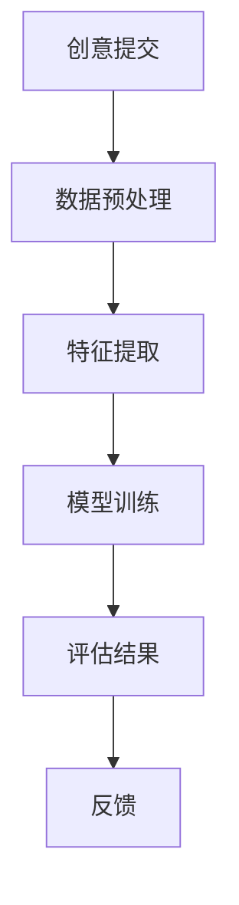
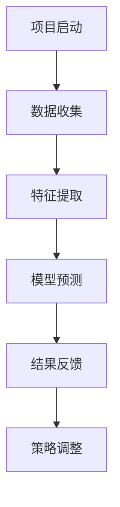
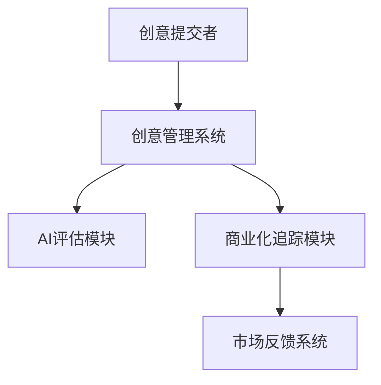

                 


# 《AI驱动的企业创新管理：从创意评估到商业化追踪》

## 关键词
AI创新管理, 创意评估, 商业化追踪, 数据驱动决策, AI算法, 企业创新

## 摘要
本文探讨了AI在企业创新管理中的应用，从创意评估到商业化追踪的全链条。通过分析AI如何优化创新流程，提升效率，本文展示了AI在企业创新管理中的潜力与价值。

---

# 第1章: AI驱动的创新管理背景与概念

## 1.1 问题背景与描述
### 1.1.1 传统企业创新管理的挑战
传统创新管理依赖人工评估和经验判断，存在效率低下、主观性强、难以量化等问题。企业需要更高效的方法来处理海量创意和复杂市场环境。

### 1.1.2 创新管理的数字化转型需求
随着市场竞争加剧，企业需要快速将创意转化为实际产品。AI技术的引入，为企业创新管理提供了新的可能性，特别是在创意评估和商业化追踪方面。

### 1.1.3 AI驱动创新管理的必要性
AI能够通过数据分析和机器学习，帮助企业更准确地评估创意价值，预测市场反应，优化资源配置，提升创新效率。

## 1.2 AI驱动创新管理的核心问题解决
### 1.2.1 创意评估的自动化与智能化
AI能够快速分析创意的市场潜力、技术可行性等多维度因素，提供客观的评估结果。

### 1.2.2 商业化追踪的实时性与精准性
通过AI实时监控市场动态，企业可以准确追踪创新项目的进展，及时调整策略。

### 1.2.3 创新过程中的数据驱动决策
AI帮助企业在创新过程中利用数据进行决策，减少人为误差，提高决策效率。

## 1.3 AI驱动创新管理的边界与外延
### 1.3.1 与传统创新管理的区分
AI创新管理通过数据驱动和自动化提升效率，而传统方法依赖人工经验和主观判断。

### 1.3.2 与其他AI应用场景的对比
AI在医疗、金融等领域的应用有相似之处，但创新管理需要特定的模型和数据处理方式。

### 1.3.3 创新管理AI化的未来趋势
随着技术进步，AI在创新管理中的应用将更加广泛，可能涵盖从创意生成到市场反馈的全生命周期。

## 1.4 核心概念结构与组成
### 1.4.1 创意评估的流程与要素
包括创意收集、初步筛选、深度评估、结果反馈等步骤，涉及市场分析、技术可行性评估等多个维度。

### 1.4.2 商业化追踪的关键环节
包括市场测试、项目执行、收益评估、持续优化等，确保创新项目顺利落地并产生价值。

### 1.4.3 AI算法与数据流的关系
AI算法依赖于高质量的数据输入，数据流贯穿整个创新管理流程，确保算法能够准确地进行评估和预测。

---

# 第2章: AI驱动创新管理的核心概念与联系

## 2.1 核心概念原理
### 2.1.1 创意评估的AI模型原理
利用自然语言处理技术分析创意文本，结合市场数据和用户反馈，评估创意的潜力和可行性。

### 2.1.2 商业化追踪的AI模型原理
通过实时数据监测和预测模型，评估创新项目的市场表现，预测潜在风险和机会。

### 2.1.3 数据驱动决策的AI机制
AI通过整合多源数据，构建决策支持系统，辅助企业在创新过程中做出科学决策。

## 2.2 核心概念属性对比
| 对比维度 | 创意评估 | 商业化追踪 |
|----------|----------|------------|
| 输入数据 | 文本、市场数据 | 销量、用户反馈 |
| 输出结果 | 评估分数 | 预测报告 |
| 使用算法 | 分类模型 | 回归模型 |

## 2.3 ER实体关系图
```mermaid
erDiagram
    创意提交者 {
        创意ID
        提交时间
        提交者ID
    }
    创意 {
        创意ID
        创意描述
        评估结果
    }
    评估结果 {
        结果ID
        评估分数
        评估时间
    }
    商业化项目 {
        项目ID
        项目名称
        项目阶段
    }
    市场反馈 {
        反馈ID
        反馈时间
        反馈数据
    }
    创意提交者 -- 创意 : 提交
    创意 -- 评估结果 : 评估
    创意 -- 商业化项目 : 转化
    商业化项目 -- 市场反馈 : 监测
```

---

# 第3章: 创意评估的算法原理

## 3.1 创意评估的流程
创意提交者提交创意，系统通过自然语言处理提取关键词，结合市场数据，利用机器学习模型评估创意的可行性。

## 3.2 创意评估的模型实现


## 3.3 Python代码实现
```python
import pandas as pd
from sklearn.feature_extraction.text import TfidfVectorizer
from sklearn.model_selection import train_test_split
from sklearn.svm import SVC

# 数据加载
data = pd.read_csv('创意数据.csv')

# 特征提取
vectorizer = TfidfVectorizer()
X = vectorizer.fit_transform(data['创意描述'])
y = data['评估标签']

# 数据分割
X_train, X_test, y_train, y_test = train_test_split(X, y, test_size=0.2)

# 模型训练
model = SVC()
model.fit(X_train, y_train)

# 模型预测
预测结果 = model.predict(X_test)
```

---

# 第4章: 商业化追踪的算法原理

## 4.1 商业化追踪的流程
创新项目启动后，系统实时收集市场数据，利用预测模型评估项目表现，及时调整策略。

## 4.2 商业化追踪的模型实现


## 4.3 Python代码实现
```python
import pandas as pd
from sklearn.preprocessing import MinMaxScaler
from sklearn.linear_model import LinearRegression

# 数据加载
data = pd.read_csv('市场数据.csv')

# 特征缩放
scaler = MinMaxScaler()
X = scaler.fit_transform(data[['销量', '用户反馈']])

# 模型训练
model = LinearRegression()
model.fit(X, data['预测收益'])

# 模型预测
预测收益 = model.predict(X)
```

---

# 第5章: 系统分析与架构设计

## 5.1 系统架构图


---

# 第6章: 项目实战

## 6.1 环境安装
- 安装Python、机器学习库（如Scikit-learn、XGBoost）和数据处理工具（如Pandas）。

## 6.2 代码实现
```python
import pandas as pd
from sklearn.ensemble import RandomForestClassifier

# 加载数据
data = pd.read_csv('创新项目.csv')

# 特征选择
features = data[['市场潜力', '技术可行性', '团队能力']]
label = data['评估结果']

# 训练模型
model = RandomForestClassifier()
model.fit(features, label)

# 预测新项目
new_project = [[0.8, 0.6, 0.7]]
预测结果 = model.predict(new_project)
```

---

# 第7章: 最佳实践与总结

## 7.1 最佳实践
- 数据质量是关键，确保数据的准确性和完整性。
- 定期更新模型，适应市场变化。
- 结合专家意见，优化AI决策。

## 7.2 项目小结
本文详细介绍了AI在企业创新管理中的应用，从创意评估到商业化追踪的全链条，展示了AI如何提升创新效率和成功率。

## 7.3 注意事项
- 保护创意数据的安全性。
- 确保模型的透明性和可解释性。
- 定期监控模型性能，及时调整。

---

作者：AI天才研究院/AI Genius Institute & 禅与计算机程序设计艺术 /Zen And The Art of Computer Programming

