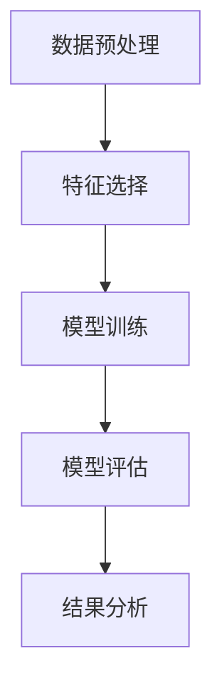
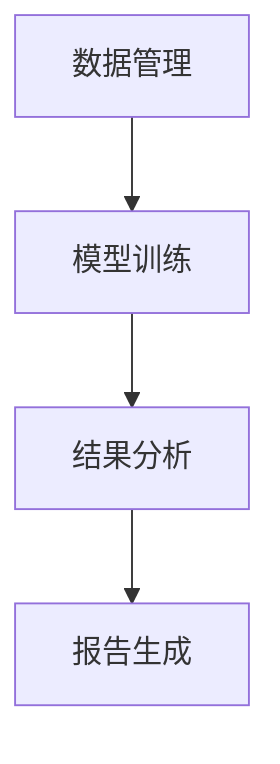

                 


# AI驱动的企业创新绩效评估：多维度创新指标量化与分析

## 关键词
AI驱动，企业创新绩效评估，多维度创新指标，量化分析，机器学习，神经网络

## 摘要
本文详细探讨了AI驱动的企业创新绩效评估的方法，从多维度创新指标的定义与分类、AI驱动的创新绩效评估模型、算法原理、系统架构设计、项目实战到最佳实践，全面分析了如何通过AI技术实现对企业创新绩效的量化评估。文章结合实际案例，深入解读了机器学习、深度学习等算法在创新绩效评估中的应用，同时提供了系统架构设计和项目实现的详细指导。

---

# 第一部分: AI驱动的企业创新绩效评估概述

## 第1章: 创新绩效评估的背景与意义

### 1.1 企业创新的重要性
#### 1.1.1 创新对企业绩效的核心作用
创新是企业发展的源动力，能够提升企业的竞争力、市场占有率和利润率。通过创新，企业可以更好地适应市场变化，抓住新兴机会。

#### 1.1.2 AI技术在创新评估中的价值
人工智能技术能够通过大数据分析和机器学习算法，帮助企业更精准地量化创新绩效，识别创新瓶颈，优化创新流程。

### 1.2 创新绩效评估的现状与挑战
#### 1.2.1 传统创新评估方法的局限性
传统方法通常依赖主观判断，难以量化创新的实际价值，且缺乏动态性和数据支持。

#### 1.2.2 数据驱动评估的优势
数据驱动的创新评估能够基于大量历史数据，利用统计分析和机器学习模型，提供客观、动态的评估结果。

#### 1.2.3 AI技术在创新评估中的应用前景
随着AI技术的快速发展，创新绩效评估将更加智能化、自动化和精准化。

---

## 第2章: 多维度创新指标的定义与分类

### 2.1 创新指标的核心概念
#### 2.1.1 创新指标的定义
创新指标是衡量企业在创新活动中表现的关键量化标准，包括创新成果、创新效率、创新投入等多个维度。

#### 2.1.2 创新指标的分类
创新指标可以分为以下几类：
- **创新成果类**：如新产品开发周期、专利申请数量。
- **创新效率类**：如创新投入与产出的比例。
- **创新投入类**：如研发经费投入、研发人员数量。

#### 2.1.3 创新指标的量化方法
创新指标的量化方法包括定性分析和定量分析，其中定量分析更为常见。

### 2.2 创新指标的属性特征对比
#### 2.2.1 创新指标的属性分析
创新指标的属性包括时间性、空间性、动态性等。

#### 2.2.2 不同创新指标的对比表格
| 创新指标 | 属性 | 描述 |
|----------|------|------|
| 专利数量 | 数量性 | 衡量企业的创新能力 |
| 新产品开发周期 | 时间性 | 衡量创新效率 |
| 研发投入 | 资金性 | 衡量创新投入 |

#### 2.2.3 创新指标的ER实体关系图
```mermaid
er
  entity 创新指标 {
    独属性：指标ID
    属性：指标名称，指标类型，指标值
  }
  entity 企业 {
    独属性：企业ID
    属性：企业名称，行业
  }
  relationship 创新指标-企业 {
    关系：企业拥有创新指标
    约束：一个企业可以有多个创新指标，一个创新指标属于一个企业
  }
```

---

## 第3章: AI驱动的创新绩效评估模型

### 3.1 创新绩效评估模型的构建
#### 3.1.1 模型构建的背景
随着企业创新活动的复杂化，传统的评估方法难以满足需求，因此需要借助AI技术构建更精准的评估模型。

#### 3.1.2 模型构建的步骤
1. 数据收集与预处理
2. 指标选择与权重分配
3. 算法选择与模型训练
4. 模型验证与优化
5. 结果分析与应用

#### 3.1.3 模型构建的核心要素
- 数据来源：企业内部数据、行业数据、公开数据
- 指标体系：多维度创新指标
- 算法选择：机器学习、深度学习

### 3.2 创新绩效评估的算法原理
#### 3.2.1 算法原理概述
AI驱动的创新绩效评估主要基于机器学习和深度学习算法，如线性回归、随机森林、神经网络等。

#### 3.2.2 算法流程图（Mermaid）


#### 3.2.3 算法实现的Python代码示例
```python
import pandas as pd
from sklearn.linear_model import LinearRegression
from sklearn.metrics import mean_squared_error

# 数据加载与预处理
data = pd.read_csv('innovation_performance.csv')
X = data.drop('performance', axis=1)
y = data['performance']

# 模型训练
model = LinearRegression()
model.fit(X, y)

# 模型预测
y_pred = model.predict(X)

# 模型评估
 mse = mean_squared_error(y, y_pred)
 print(f"均方误差: {mse}")
```

---

## 第4章: 创新绩效评估的数学模型与公式

### 4.1 创新绩效评估的数学模型
#### 4.1.1 创新绩效的线性回归模型
线性回归模型用于预测企业的创新绩效，公式如下：
$$ y = \beta_0 + \beta_1x_1 + \beta_2x_2 + \ldots + \beta_nx_n + \epsilon $$

#### 4.1.2 创新绩效的神经网络模型
神经网络模型通过多层感知机（MLP）实现创新绩效的预测，公式如下：
$$ y = f(Wx + b) $$

### 4.2 创新绩效评估的公式推导
#### 4.2.1 线性回归模型的公式推导
线性回归模型的目标是最小化预测值与实际值之间的均方误差，优化过程如下：
$$ \text{最小化} \sum_{i=1}^{n} (y_i - \hat{y}_i)^2 $$

---

## 第5章: 创新绩效评估系统的架构设计

### 5.1 系统架构设计概述
#### 5.1.1 系统架构的目标
构建一个基于AI的创新绩效评估系统，实现对企业创新绩效的实时监控和动态评估。

#### 5.1.2 系统架构的组成部分
- 数据采集模块
- 数据处理模块
- 模型训练模块
- 结果展示模块

#### 5.1.3 系统架构的设计原则
模块化设计、可扩展性、高可用性。

### 5.2 系统功能设计
#### 5.2.1 系统功能模块划分
- 数据管理模块
- 模型训练模块
- 结果分析模块
- 报告生成模块

#### 5.2.2 系统功能的流程图（Mermaid）


#### 5.2.3 系统功能的实现方法
- 数据管理：数据清洗、特征工程
- 模型训练：选择算法、参数调优
- 结果分析：可视化分析、结果解读
- 报告生成：自动生成评估报告

### 5.3 系统架构图
#### 5.3.1 系统架构图的绘制


---

## 第6章: 创新绩效评估的项目实战

### 6.1 项目环境的安装与配置
#### 6.1.1 环境搭建的步骤
1. 安装Python
2. 安装必要的库（如Pandas、Scikit-learn）
3. 下载数据集

#### 6.1.2 环境搭建的注意事项
确保Python版本与库版本兼容。

#### 6.1.3 环境搭建的常见问题解答
- 问题：库版本不兼容
- 解决：使用虚拟环境管理依赖

### 6.2 系统核心功能的实现
#### 6.2.1 数据预处理
```python
import pandas as pd
data = pd.read_csv('innovation_performance.csv')
data = data.dropna()
```

#### 6.2.2 模型训练
```python
from sklearn.ensemble import RandomForestRegressor
model = RandomForestRegressor(n_estimators=100)
model.fit(X, y)
```

#### 6.2.3 结果分析
```python
importances = model.feature_importances_
print(importances)
```

### 6.3 项目小结
通过项目实战，我们成功实现了AI驱动的创新绩效评估系统，验证了算法的有效性和系统的实用性。

---

## 第7章: 最佳实践与总结

### 7.1 最佳实践
- 数据质量是关键
- 模型选择需结合实际场景
- 系统设计需注重可扩展性

### 7.2 小结
AI技术为创新绩效评估提供了新的思路和方法，企业可以借助AI技术提升创新管理的效率和精度。

### 7.3 注意事项
- 数据隐私保护
- 模型解释性
- 系统维护与更新

### 7.4 拓展阅读
- 推荐书籍：《机器学习实战》
- 推荐博客：[AI驱动的创新管理](#)

---

作者：AI天才研究院 & 禅与计算机程序设计艺术

