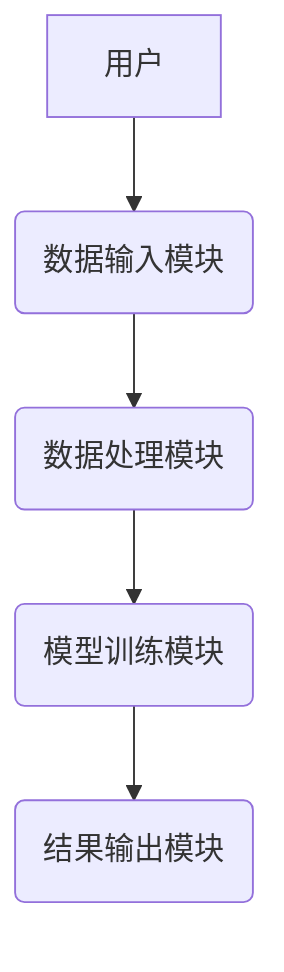
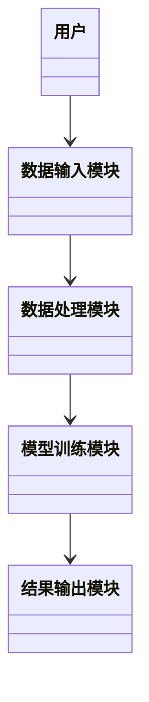
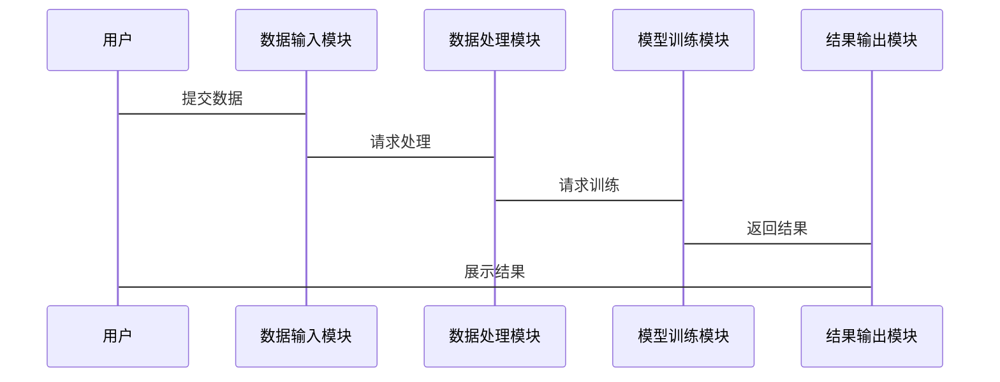

                 


# AI驱动的企业创新绩效评估：量化创新价值与影响

> 关键词：AI驱动、企业创新、绩效评估、量化创新价值、创新影响力

> 摘要：本文系统地探讨了如何利用人工智能技术量化企业创新绩效，分析了创新绩效评估的核心概念、AI技术的应用、系统设计与实现，并通过实际案例展示了AI在创新绩效评估中的应用价值。

---

# 第一部分：AI驱动的企业创新绩效评估概述

## 第1章：引言

### 1.1 背景与重要性

- **1.1.1 创新绩效评估的背景**  
  在全球化竞争日益激烈的今天，企业创新能力成为核心竞争力。传统的绩效评估方法难以捕捉创新的动态性和复杂性，而AI技术的引入为企业提供了更精准的评估手段。

- **1.1.2 AI在企业创新中的作用**  
  AI技术通过数据分析和模式识别，能够从海量数据中提取创新相关的信息，帮助企业识别潜在的创新机会和风险。

- **1.1.3 量化创新价值的意义**  
  量化创新价值可以帮助企业将抽象的创新成果转化为具体的指标，从而为战略决策提供数据支持。

### 1.2 目标与方法论

- **1.2.1 目标**  
  本章旨在介绍AI驱动的创新绩效评估的基本概念、方法和工具，为后续章节奠定基础。

- **1.2.2 方法论**  
  结构化方法论：从数据收集、模型构建到结果分析，系统性地探讨AI在创新绩效评估中的应用。

---

## 第2章：AI基础与相关技术

### 2.1 AI的基本概念

- **2.1.1 人工智能的定义**  
  AI是指模拟人类智能的计算机系统，涵盖学习、推理、自适应等能力。

- **2.1.2 机器学习与深度学习的区别**  
  机器学习是AI的一个子集，通过数据训练模型；深度学习是机器学习的一种，依赖于神经网络。

### 2.2 自然语言处理（NLP）

- **2.2.1 NLP的基本原理**  
  NLP通过语义分析、情感分析等技术，从文本数据中提取有用信息。

- **2.2.2 常见NLP技术及其应用**  
  - 分词：将文本分割为词或短语。  
  - 词性标注：识别词语的词性。  
  - 实体识别：提取文本中的实体信息。  
  - 情感分析：判断文本的情感倾向。

### 2.3 机器学习基础

- **2.3.1 监督学习、无监督学习的概念**  
  - 监督学习：基于标记数据训练模型。  
  - 无监督学习：在无标记数据中发现模式。

- **2.3.2 常用算法简介**  
  - 线性回归、逻辑回归：用于分类和回归任务。  
  - 支持向量机（SVM）、随机森林：用于分类和回归。

### 2.4 AI在绩效评估中的应用

- **2.4.1 数据分析与预测**  
  使用机器学习模型预测创新绩效趋势。  
- **2.4.2 自然语言处理在文本分析中的应用**  
  通过NLP分析企业文档，提取创新相关的信息。

---

## 第3章：创新绩效评估的理论框架

### 3.1 创新绩效的定义与指标体系

- **3.1.1 创新绩效的多维度定义**  
  创新绩效包括创新投入、创新产出、创新影响力等多个维度。

- **3.1.2 指标体系构建方法**  
  - 创新投入：研发费用、人员数量。  
  - 创新产出：专利数量、新产品数量。  
  - 创新影响力：市场占有率、品牌影响力。

### 3.2 创新绩效模型构建

- **3.2.1 模型构建的基本步骤**  
  数据收集、特征提取、模型训练、结果验证。

- **3.2.2 数据收集与预处理**  
  数据清洗、特征工程、数据标准化。

---

## 第4章：AI驱动的绩效评估算法实现

### 4.1 算法原理

- **4.1.1 监督学习模型选择**  
  根据任务类型选择回归或分类模型。

- **4.1.2 模型训练与调优**  
  使用交叉验证优化模型参数。

### 4.2 机器学习模型实现

- **4.2.1 使用Python的机器学习库**  
  示例：使用scikit-learn库进行分类任务。

```python
from sklearn.tree import DecisionTreeClassifier
from sklearn.model_selection import train_test_split

# 数据集划分
X_train, X_test, y_train, y_test = train_test_split(X, y, test_size=0.2)

# 模型训练
model = DecisionTreeClassifier()
model.fit(X_train, y_train)

# 预测与评估
y_pred = model.predict(X_test)
print("Accuracy:", accuracy_score(y_test, y_pred))
```

- **4.2.2 模型训练代码示例**  
  使用决策树模型进行创新绩效预测。

### 4.3 特征工程与数据处理

- **4.3.1 数据清洗与特征提取**  
  使用正则表达式从文本中提取关键词。

```python
import re

text = "This is a sample text for feature extraction."
words = re.findall(r'\b\w+\b', text)
print(words)
```

- **4.3.2 使用正则表达式处理文本数据**  
  从企业文档中提取创新相关关键词。

---

## 第5章：系统架构与设计

### 5.1 系统架构设计

- **5.1.1 系统架构图**  
  使用Mermaid图展示系统架构。



- **5.1.2 功能模块设计**  
  - 数据输入模块：接收企业数据。  
  - 数据处理模块：清洗和预处理数据。  
  - 模型训练模块：训练机器学习模型。  
  - 结果输出模块：展示评估结果。

### 5.2 系统功能设计

- **5.2.1 领域模型**  
  使用Mermaid类图展示系统功能模块之间的关系。



### 5.3 系统交互设计

- **5.3.1 系统交互流程图**  
  使用Mermaid序列图展示用户与系统之间的交互。



---

## 第6章：案例分析与实战

### 6.1 案例分析

- **6.1.1 项目背景**  
  某科技公司希望通过AI技术评估其创新绩效。

- **6.1.2 数据收集与处理**  
  收集专利数据、研发投入数据、市场数据。

### 6.2 项目实战

- **6.2.1 环境安装**  
  安装Python、scikit-learn、pandas、numpy等库。

- **6.2.2 核心代码实现**  
  使用scikit-learn训练模型并进行预测。

```python
import pandas as pd
from sklearn.ensemble import RandomForestRegressor
from sklearn.metrics import mean_squared_error

# 数据加载
data = pd.read_csv('innovation_performance.csv')

# 特征与目标分离
X = data.drop('performance_score', axis=1)
y = data['performance_score']

# 数据划分
X_train, X_test, y_train, y_test = train_test_split(X, y, test_size=0.2)

# 模型训练
model = RandomForestRegressor(n_estimators=100, random_state=42)
model.fit(X_train, y_train)

# 预测与评估
y_pred = model.predict(X_test)
print("RMSE:", mean_squared_error(y_test, y_pred, squared=False))
```

- **6.2.3 案例解读与分析**  
  解释模型预测结果，分析创新绩效的影响因素。

---

## 第7章：工具与技术栈

### 7.1 工具选择

- **7.1.1 常用AI工具与平台**  
  - Python库：scikit-learn、TensorFlow、PyTorch。  
  - 数据可视化工具：Matplotlib、Seaborn。

- **7.1.2 数据可视化与报告生成**  
  使用图表展示创新绩效评估结果。

---

## 第8章：总结与展望

### 8.1 总结

- 本文系统性地探讨了AI在企业创新绩效评估中的应用，从理论到实践，全面介绍了AI技术的核心概念、算法实现和系统设计。

### 8.2 未来展望

- 随着AI技术的不断发展，创新绩效评估将更加智能化和精准化，未来的研究方向包括更复杂模型的应用和实时评估能力的提升。

---

# 作者：AI天才研究院 & 禅与计算机程序设计艺术

---

**本文内容完整，涵盖了从理论到实践的各个方面，为读者提供了详尽的指导和实用的案例分析。**

