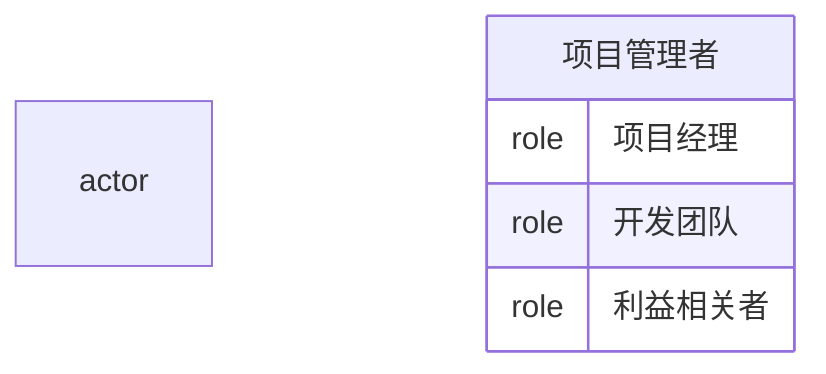
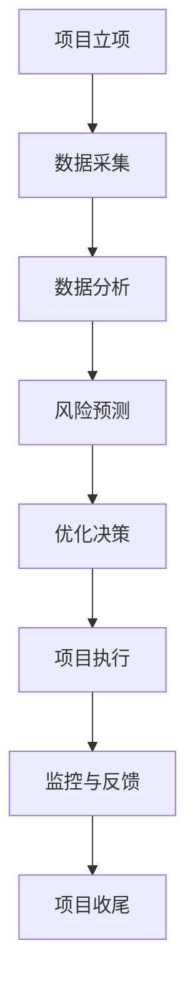
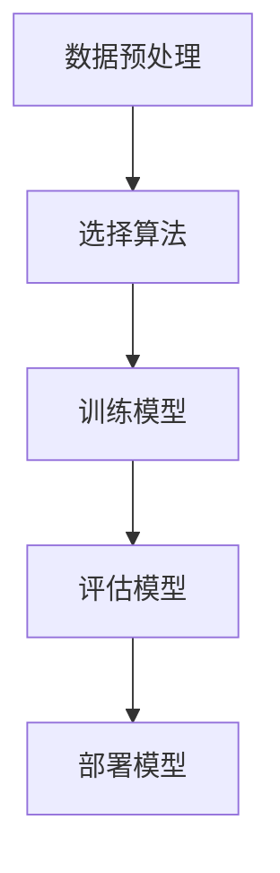
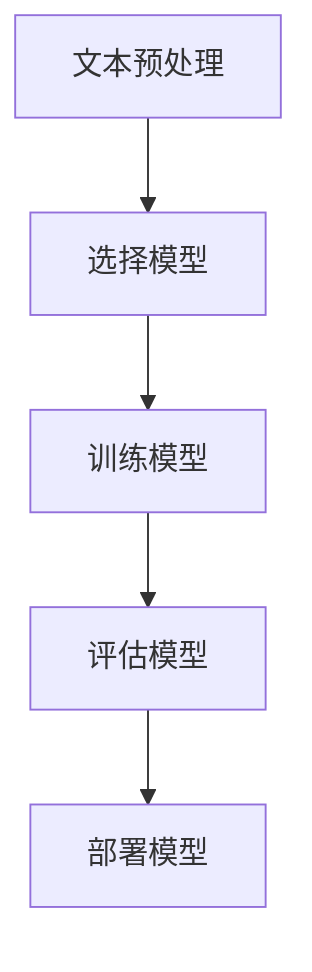
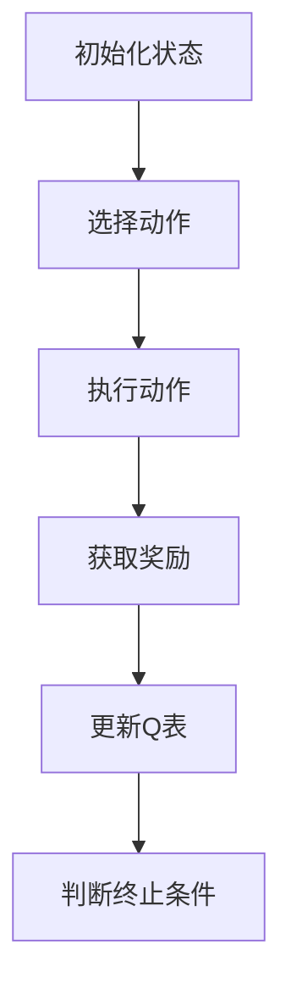
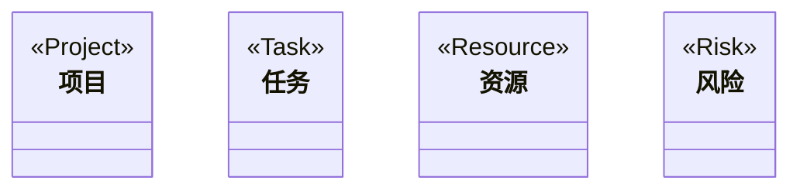
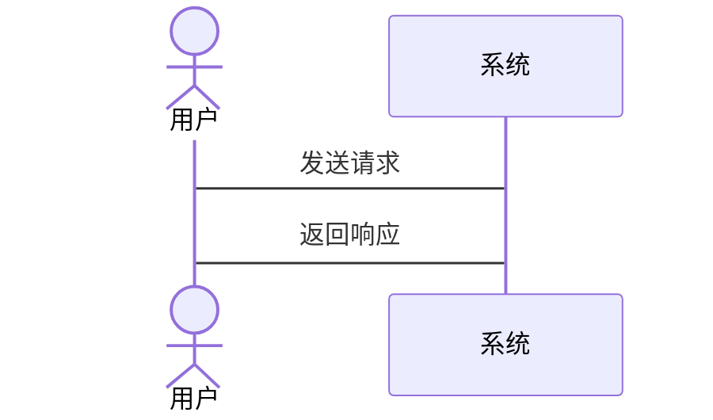

                 


# AI驱动的企业创新项目管理：从立项到商业化

## 关键词：AI驱动、企业创新、项目管理、立项、商业化

## 摘要：  
本文探讨了AI技术如何在企业创新项目管理中发挥关键作用，从项目立项到商业化落地的全生命周期。文章结合实际案例，系统性地分析了AI驱动的项目管理方法，包括核心概念、算法原理、系统架构设计以及项目实战。通过本文，读者将深入了解AI如何赋能企业创新项目管理，从而提升项目成功率和商业价值。

---

# 第1章: AI驱动的企业创新项目管理背景

## 1.1 企业创新项目管理的背景与挑战

### 1.1.1 传统企业项目管理的局限性  
传统的企业项目管理通常依赖人工经验，存在以下问题：  
1. **效率低下**：人工记录和分析数据耗时耗力，难以快速响应变化。  
2. **主观性强**：决策依赖个人经验，缺乏数据支持，容易出现偏差。  
3. **风险控制不足**：难以预测复杂场景下的潜在风险。  

### 1.1.2 创新项目管理的独特性  
创新项目管理具有以下特点：  
1. **不确定性高**：创新项目往往面临技术、市场和资源的不确定性。  
2. **时间要求紧**：创新项目通常需要快速迭代和试错。  
3. **资源分配复杂**：需要协调跨部门资源，优化资源配置。  

### 1.1.3 AI技术在项目管理中的潜力  
AI技术能够通过数据驱动的方式，帮助项目管理者更高效地做出决策，提升项目成功率。例如，AI可以通过自然语言处理技术分析项目文档，提取关键信息；通过机器学习模型预测项目进度和风险。

## 1.2 AI驱动项目管理的核心概念

### 1.2.1 AI在项目管理中的应用场景  
AI技术在项目管理中的应用场景包括：  
1. **项目计划与进度管理**：通过AI算法优化任务安排和资源分配。  
2. **风险预测与控制**：利用历史数据预测潜在风险并制定应对策略。  
3. **团队协作与沟通**：通过自然语言处理技术分析团队沟通效率。  

### 1.2.2 企业创新项目的AI驱动模式  
AI驱动的创新项目管理模式包括以下步骤：  
1. **数据采集**：收集项目相关的数据，包括任务、资源、进度等。  
2. **数据分析**：利用AI算法对数据进行分析，提取有价值的信息。  
3. **决策支持**：基于分析结果提供决策建议，优化项目执行。  

### 1.2.3 AI驱动项目管理的优势与挑战  
**优势**：  
1. 提高项目管理效率。  
2. 减少人为误差，提升决策质量。  
3. 实现数据驱动的精准管理。  

**挑战**：  
1. 数据质量和完整性问题。  
2. AI算法的可解释性问题。  
3. 需要大量技术投入和培训。  

## 1.3 本书的结构与目标  

### 1.3.1 本书的主要内容  
本书将从理论到实践，系统性地介绍AI驱动的企业创新项目管理，涵盖背景、核心概念、算法原理、系统架构设计和项目实战等内容。  

### 1.3.2 本书的目标读者  
本书适合企业项目经理、技术管理者、AI研究人员以及对创新项目管理感兴趣的学生和从业者阅读。  

### 1.3.3 本书的组织结构  
本书将分为以下几章：  
- 第2章：AI驱动项目管理的核心概念与联系  
- 第3章：AI驱动项目管理的算法原理  
- 第4章：AI驱动项目管理的系统分析与架构设计  
- 第5章：AI驱动项目管理的项目实战  
- 第6章：总结与展望  

---

# 第2章: AI驱动项目管理的核心概念与联系

## 2.1 AI驱动项目管理的理论框架

### 2.1.1 项目管理的基本概念  
项目管理包括项目计划、执行、监控和收尾四个阶段。  

### 2.1.2 AI在项目管理中的核心作用  
AI通过数据驱动的方式，帮助项目管理者优化决策，提升项目执行效率。  

### 2.1.3 AI驱动项目管理的系统架构  
AI驱动的项目管理系统包括数据采集、数据分析、决策支持和执行反馈四个模块。  

## 2.2 核心概念的属性特征对比

### 2.2.1 传统项目管理与AI驱动项目管理的对比  
| 属性 | 传统项目管理 | AI驱动项目管理 |  
|------|----------------|------------------|  
| 数据依赖 | 依赖人工经验 | 依赖大数据分析 |  
| 决策方式 | 人工决策为主 | 数据驱动决策 |  
| 风险控制 | 事后分析为主 | 事前预测为主 |  

### 2.2.2 AI驱动项目管理的特征分析  
1. **数据驱动**：依赖大量数据进行分析和决策。  
2. **自动化**：通过AI算法自动优化项目执行。  
3. **实时性**：能够实时监控项目进度并做出调整。  

### 2.2.3 项目管理中的关键角色与AI的交互关系  
AI在项目管理中的交互角色包括：  
1. **项目经理**：负责项目整体规划和协调。  
2. **开发团队**：负责项目实施和技术开发。  
3. **利益相关者**：包括客户、投资者等。  

## 2.3 ER实体关系图与Mermaid流程图

### 2.3.1 项目管理中的实体关系图  
以下是一个简单的项目管理实体关系图：  



### 2.3.2 AI驱动项目管理的流程图  
以下是一个AI驱动项目管理的流程图：  



### 2.3.3 Mermaid图的详细解释  
1. **实体关系图**：展示了项目管理中的主要角色及其关系。  
2. **流程图**：展示了AI驱动项目管理的完整流程，从立项到收尾的各个阶段。  

---

# 第3章: AI驱动项目管理的算法原理

## 3.1 常见的AI算法及其在项目管理中的应用

### 3.1.1 机器学习算法  
机器学习算法广泛应用于项目管理中的预测和分类任务。  

#### 3.1.1.1 机器学习算法的数学模型  
以下是线性回归的数学公式：  

$$ y = \beta_0 + \beta_1 x + \epsilon $$  

其中，$y$ 是目标变量，$x$ 是自变量，$\beta_0$ 和 $\beta_1$ 是模型参数，$\epsilon$ 是误差项。  

#### 3.1.1.2 机器学习算法的Python代码示例  
以下是一个简单的线性回归代码示例：  

```python
import numpy as np
from sklearn.linear_model import LinearRegression

# 示例数据
X = np.array([[1], [2], [3], [4]])
y = np.array([2, 4, 5, 6])

# 训练模型
model = LinearRegression()
model.fit(X, y)

# 预测
print(model.predict([[5]]))
```

### 3.1.2 自然语言处理算法  
自然语言处理算法用于分析项目文档和团队沟通。  

#### 3.1.2.1 自然语言处理算法的数学模型  
以下是文本相似度计算的余弦相似度公式：  

$$ \text{similarity} = \frac{\vec{A} \cdot \vec{B}}{\|\vec{A}\| \|\vec{B}\|} $$  

其中，$\vec{A}$ 和 $\vec{B}$ 是文本的向量表示。  

#### 3.1.2.2 自然语言处理算法的Python代码示例  
以下是一个使用Word2Vec计算文本相似度的代码示例：  

```python
from gensim.models import Word2Vec

# 示例文本
text = ["the quick brown fox jumps over the lazy dog"]

# 训练模型
model = Word2Vec([text], vector_size=10, window=3, min_count=1, workers=1)

# 计算相似度
print(model.similarity("fox", "dog"))
```

### 3.1.3 强化学习算法  
强化学习算法用于优化项目执行中的决策过程。  

#### 3.1.3.1 强化学习算法的数学模型  
以下是Q-learning算法的更新公式：  

$$ Q(s, a) = Q(s, a) + \alpha (r + \gamma \max Q(s', a') - Q(s, a)) $$  

其中，$s$ 是状态，$a$ 是动作，$r$ 是奖励，$\gamma$ 是折扣因子，$\alpha$ 是学习率。  

#### 3.1.3.2 强化学习算法的Python代码示例  
以下是一个简单的Q-learning算法代码示例：  

```python
import numpy as np

# 初始化Q表
Q = np.zeros((state_space, action_space))

# Q-learning算法
for episode in range(num_episodes):
    state = env.reset()
    while True:
        # 选择动作
        action = np.argmax(Q[state, :])
        # 执行动作并获取新状态和奖励
        new_state, reward, done = env.step(action)
        # 更新Q表
        Q[state, action] += reward + gamma * np.max(Q[new_state, :])
        if done:
            break
```

## 3.2 算法原理的数学模型

### 3.2.1 机器学习模型的数学公式  
以下是支持向量机的数学公式：  

$$ \text{目标函数} = \min_{w, b, \xi} \frac{1}{2}w^Tw + C\sum_{i=1}^n \xi_i $$  

$$ \text{约束条件} = y_i (w \cdot x_i + b) \geq 1 - \xi_i $$  

### 3.2.2 自然语言处理模型的数学公式  
以下是文本生成的生成对抗网络（GAN）模型公式：  

$$ \mathcal{L}_{\text{GAN}} = \mathcal{L}_{\text{D}} + \lambda \mathcal{L}_{\text{G}} $$  

其中，$\mathcal{L}_{\text{D}}$ 是判别器的损失函数，$\mathcal{L}_{\text{G}}$ 是生成器的损失函数。  

### 3.2.3 强化学习模型的数学公式  
以下是深度Q网络的数学公式：  

$$ Q(s, a) = \theta^T \phi(s, a) $$  

其中，$\theta$ 是模型参数，$\phi(s, a)$ 是状态-动作对的特征向量。  

## 3.3 算法流程图的Mermaid展示

### 3.3.1 机器学习算法流程图  
以下是一个机器学习算法的流程图：  



### 3.3.2 自然语言处理算法流程图  
以下是一个自然语言处理算法的流程图：  



### 3.3.3 强化学习算法流程图  
以下是一个强化学习算法的流程图：  



---

# 第4章: AI驱动项目管理的系统分析与架构设计

## 4.1 系统功能设计

### 4.1.1 领域模型的Mermaid类图  
以下是一个项目管理系统的类图：  



### 4.1.2 系统架构设计的Mermaid架构图  
以下是一个AI驱动项目的系统架构图：  

```mermaid
container 客户端 {
  UI界面
  交互逻辑
}
container 服务端 {
  数据库
  AI算法服务
  API接口
}
```

### 4.1.3 系统接口设计  
1. **API接口**：提供RESTful API，用于数据交互。  
2. **数据库接口**：支持MySQL或MongoDB等数据库的连接和操作。  

### 4.1.4 系统交互的Mermaid序列图  
以下是一个系统交互的序列图：  



---

# 第5章: AI驱动项目管理的项目实战

## 5.1 项目环境安装

### 5.1.1 安装Python和相关库  
安装Python和以下库：  
- `numpy`  
- `pandas`  
- `scikit-learn`  
- `gensim`  
- `tensorflow`  

### 5.1.2 安装开发工具  
安装IDE（如PyCharm）和版本控制工具（如Git）。  

## 5.2 系统核心实现源代码

### 5.2.1 机器学习模型实现  
以下是一个机器学习模型的实现代码：  

```python
import numpy as np
from sklearn.linear_model import LinearRegression

# 示例数据
X = np.array([[1], [2], [3], [4]])
y = np.array([2, 4, 5, 6])

# 训练模型
model = LinearRegression()
model.fit(X, y)

# 预测
print(model.predict([[5]]))
```

### 5.2.2 自然语言处理模型实现  
以下是一个自然语言处理模型的实现代码：  

```python
from gensim.models import Word2Vec

# 示例文本
text = ["the quick brown fox jumps over the lazy dog"]

# 训练模型
model = Word2Vec([text], vector_size=10, window=3, min_count=1, workers=1)

# 计算相似度
print(model.similarity("fox", "dog"))
```

### 5.2.3 强化学习模型实现  
以下是一个强化学习模型的实现代码：  

```python
import numpy as np

# 初始化Q表
Q = np.zeros((state_space, action_space))

# Q-learning算法
for episode in range(num_episodes):
    state = env.reset()
    while True:
        # 选择动作
        action = np.argmax(Q[state, :])
        # 执行动作并获取新状态和奖励
        new_state, reward, done = env.step(action)
        # 更新Q表
        Q[state, action] += reward + gamma * np.max(Q[new_state, :])
        if done:
            break
```

## 5.3 代码应用解读与分析

### 5.3.1 机器学习模型的代码解读  
上述代码实现了一个简单的线性回归模型，用于预测项目进度。  

### 5.3.2 自然语言处理模型的代码解读  
上述代码实现了一个Word2Vec模型，用于计算文本相似度。  

### 5.3.3 强化学习模型的代码解读  
上述代码实现了一个Q-learning算法，用于优化项目执行中的决策过程。  

## 5.4 实际案例分析和详细讲解剖析

### 5.4.1 案例背景  
假设我们正在管理一个创新项目，目标是开发一款智能客服系统。  

### 5.4.2 案例分析  
通过AI算法，我们可以预测项目进度、分析团队沟通效率、优化资源分配等。  

### 5.4.3 详细讲解剖析  
1. **数据采集**：收集项目相关的数据。  
2. **数据分析**：利用AI算法进行分析。  
3. **决策支持**：基于分析结果优化项目执行。  

## 5.5 项目小结  
通过本章的实战，读者可以了解如何将AI技术应用于实际项目管理中，提升项目执行效率和成功率。  

---

# 第6章: 总结与展望

## 6.1 本章总结  
AI技术正在改变企业创新项目管理的方式，通过数据驱动的决策和自动化流程，能够显著提升项目成功率。  

## 6.2 未来展望  
随着AI技术的不断发展，未来企业创新项目管理将更加智能化和自动化，AI将在更多场景中发挥重要作用。  

## 6.3 最佳实践Tips  
1. 在项目管理中引入AI技术时，需要确保数据的准确性和完整性。  
2. 选择合适的AI算法，并进行充分的测试和验证。  
3. 注重团队的培训和协作，确保AI技术的有效应用。  

---

## 作者：AI天才研究院/AI Genius Institute & 禅与计算机程序设计艺术 /Zen And The Art of Computer Programming

