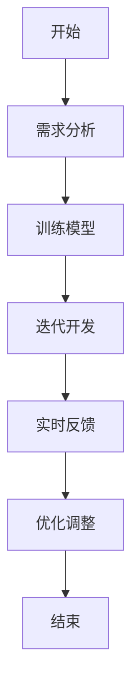
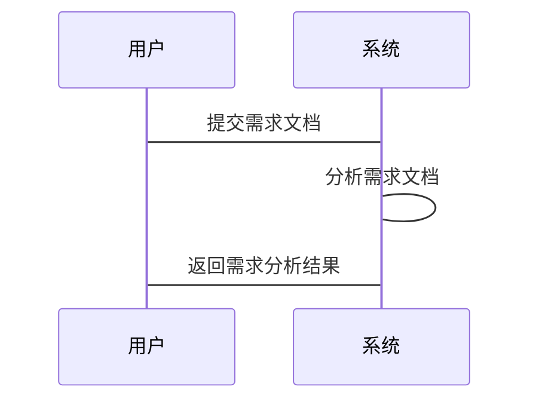

                 


# AI驱动的企业创新项目管理：敏捷方法与AI的结合

---

## 关键词：
AI技术、敏捷方法、项目管理、企业创新、系统架构、算法原理

---

## 摘要：
随着人工智能技术的快速发展和敏捷方法在项目管理中的广泛应用，企业创新项目管理正面临前所未有的变革。本文章探讨了如何将AI技术与敏捷方法相结合，以提升企业项目管理的效率和创新能力。文章从背景、概念、算法、系统架构、项目实战等多个维度展开，详细分析了AI驱动下的敏捷项目管理的核心原理和实践应用。通过理论分析和案例解读，本文为读者提供了清晰的思路和实用的方法，助力企业在数字化转型中实现高效管理。

---

# 第一部分：引言

## 第1章：引言

### 1.1 研究背景
企业创新项目管理是企业在快速变化的市场环境中保持竞争力的关键。然而，传统项目管理方法往往面临效率低下、灵活性不足等问题。AI技术的快速发展为项目管理带来了新的可能性，而敏捷方法作为一种以迭代和增量交付为核心思想的管理方法，强调快速响应变化和客户参与。将AI技术与敏捷方法相结合，能够充分发挥两者的优点，为企业创新项目管理提供更高效的解决方案。

### 1.2 研究意义
AI技术与敏捷方法的结合，不仅能够提高项目管理的效率，还能增强企业的创新能力。通过AI技术的支持，项目管理者可以更快速地做出决策，优化资源分配，降低项目风险。同时，敏捷方法的灵活性和迭代特性，使得企业在面对复杂创新项目时能够更加灵活应对变化。本文旨在探讨两者的结合方式，并为企业提供实践指导。

### 1.3 研究目标
本文旨在分析AI技术与敏捷方法在企业创新项目管理中的结合方式，探讨其核心原理和应用场景，并通过实际案例分析，为企业提供可操作的建议。同时，本文还试图总结这种结合的优势和挑战，为未来的进一步研究提供方向。

---

# 第二部分：背景介绍

## 第2章：AI驱动的企业创新项目管理背景

### 2.1 企业创新项目管理的现状
企业创新项目管理通常涉及多个部门和团队的协作，项目目标多样且复杂。传统项目管理方法（如瀑布模型）往往难以适应创新项目的不确定性和变化性。项目的复杂性和多样性使得传统的线性管理方法效率低下，难以应对快速变化的市场需求。

### 2.2 敏捷方法的起源与发展
敏捷方法起源于软件开发领域，其核心思想是通过迭代和增量的方式进行项目管理，强调客户参与和快速响应变化。敏捷方法包括Scrum、极限编程（XP）和看板（Kanban）等多种具体方法，广泛应用于软件开发和其他领域。

### 2.3 AI技术的快速发展与应用
AI技术的进步为项目管理提供了新的工具和方法。通过自然语言处理（NLP）、机器学习（ML）等技术，AI能够帮助项目管理者进行需求分析、风险预测、资源优化等。AI技术的应用不仅提高了项目的效率，还能够帮助项目管理者更好地应对复杂性和不确定性。

---

# 第三部分：核心概念与联系

## 第3章：核心概念与联系

### 3.1 核心概念定义
- **AI技术**：利用机器学习、深度学习等技术，通过数据驱动的方式进行预测、分类和决策。
- **敏捷方法**：一种以迭代和增量为核心思想的项目管理方法，强调快速响应变化和客户参与。

### 3.2 AI与敏捷方法的对比分析
通过对比分析，可以发现AI技术在数据处理和预测方面具有优势，而敏捷方法在快速响应和团队协作方面更具灵活性。两者的结合能够互补优势，提升项目管理的整体效率。

### 3.3 AI与敏捷方法的联系
- **数据驱动的决策**：AI技术可以通过数据分析为敏捷方法提供更精准的决策支持。
- **自动化与效率提升**：AI技术可以自动化处理一些重复性工作，提高项目管理效率。
- **动态调整与优化**：敏捷方法的迭代特性与AI技术的实时反馈机制相结合，能够快速调整项目方向，优化资源分配。

---

# 第四部分：算法原理讲解

## 第4章：AI算法原理与敏捷方法实现

### 4.1 AI算法核心原理
- **机器学习**：通过训练数据模型，进行预测和分类。
- **自然语言处理（NLP）**：通过文本分析技术，提取项目需求中的关键信息。
- **优化算法**：用于资源分配和项目进度优化。

### 4.2 敏捷方法的实现步骤
1. **需求分析**：通过NLP技术提取项目需求。
2. **迭代开发**：将项目分解为多个小的迭代周期，每个周期结束时交付可运行的增量。
3. **实时反馈**：通过AI技术进行实时监控和调整。

### 4.3 算法流程图（使用Mermaid）



### 4.4 代码实现
以下是一个简单的机器学习模型实现代码示例：

```python
import numpy as np
from sklearn import linear_model

# 数据准备
X = np.array([[1], [2], [3], [4], [5]])
y = np.array([2, 4, 6, 8, 10])

# 创建线性回归模型
model = linear_model.LinearRegression()
model.fit(X, y)

# 预测
print(model.predict([[6]]))  # 输出：[[12.]]
```

---

# 第五部分：系统分析与架构设计方案

## 第5章：系统分析与架构设计方案

### 5.1 项目场景介绍
假设我们正在开发一个创新项目管理平台，该平台需要支持AI驱动的需求分析、进度预测和资源优化功能。

### 5.2 系统功能设计
- **需求分析模块**：通过NLP技术分析项目需求文档，提取关键信息。
- **进度预测模块**：基于历史数据，预测项目进度。
- **资源优化模块**：通过优化算法，优化项目资源分配。

### 5.3 系统架构设计


### 5.4 接口设计
- **API接口**：提供RESTful API，供其他系统调用。
- **数据接口**：支持数据的导入和导出。

### 5.5 交互序列图（使用Mermaid）



---

# 第六部分：项目实战

## 第6章：项目实战

### 6.1 环境安装
- **Python**：安装Python 3.8以上版本。
- **库依赖**：安装numpy、scikit-learn、requests等库。

### 6.2 核心功能实现
1. **需求分析模块**：使用NLP技术分析需求文档。
2. **进度预测模块**：基于机器学习模型预测项目进度。
3. **资源优化模块**：通过优化算法优化资源分配。

### 6.3 代码实现
以下是一个简单的进度预测模块代码示例：

```python
import numpy as np
from sklearn import linear_model

# 数据准备
X = np.array([[1], [2], [3], [4], [5]])
y = np.array([2, 4, 6, 8, 10])

# 创建线性回归模型
model = linear_model.LinearRegression()
model.fit(X, y)

# 预测
print(model.predict([[6]]))  # 输出：[[12.]]
```

### 6.4 实际案例分析
通过一个实际案例，详细分析AI驱动的敏捷项目管理在企业中的应用，展示如何通过AI技术优化项目管理流程。

---

# 第七部分：总结

## 第7章：总结与展望

### 7.1 总结
本文探讨了AI技术与敏捷方法在企业创新项目管理中的结合，分析了其核心原理和应用场景，并通过实际案例展示了其优势和挑战。

### 7.2 注意事项
在实际应用中，需要注意数据质量、模型选择和团队协作等问题。

### 7.3 未来展望
未来，随着AI技术的不断发展，AI驱动的敏捷项目管理将更加智能化和自动化，为企业创新项目管理提供更多可能性。

---

## 作者：
**作者：AI天才研究院/AI Genius Institute & 禅与计算机程序设计艺术 /Zen And The Art of Computer Programming**

