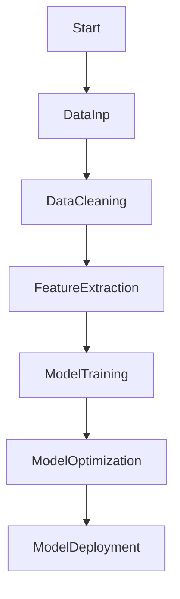
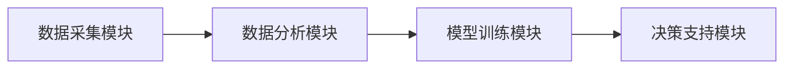

                 


# AI驱动的企业创新项目组合管理

> 关键词：AI驱动，项目组合管理，企业创新，机器学习，算法优化

> 摘要：本文探讨了AI如何驱动企业创新项目组合管理的优化，从核心概念到算法原理，再到系统架构和项目实战，全面解析AI在项目组合管理中的应用。

---

## 第一部分: AI驱动的企业创新项目组合管理概述

### 第1章: 问题背景与定义

#### 1.1 问题背景

##### 1.1.1 传统项目组合管理的挑战

传统的企业项目组合管理依赖于人工经验和层级审批，存在效率低下、主观性强、数据孤岛等问题。企业创新项目往往需要快速迭代和试错，传统的管理方式难以应对多样化的创新需求。

##### 1.1.2 AI技术对企业创新的推动作用

AI技术，特别是机器学习和自然语言处理，能够从海量数据中提取有价值的信息，辅助决策者快速找到最优解。通过AI驱动的项目组合管理，企业可以更高效地筛选项目、评估风险、分配资源，从而提高创新效率。

##### 1.1.3 项目组合管理的数字化转型需求

随着企业数字化转型的推进，项目组合管理需要从传统的“经验管理”向“数据驱动”转型。AI技术的应用不仅是趋势，更是必然。

#### 1.2 核心概念定义

##### 1.2.1 项目组合管理的定义

项目组合管理是指对企业内的多个项目进行筛选、优先级排序、资源分配和监控的过程，旨在实现企业战略目标的最大化。

##### 1.2.2 AI驱动的定义

AI驱动的项目组合管理是指利用人工智能技术，通过数据挖掘、机器学习和自然语言处理等方法，辅助或替代传统的人工决策过程。

##### 1.2.3 企业创新的定义与特点

企业创新是指企业在产品、服务、技术、管理等领域的创新活动。其特点是不确定性高、风险大、回报周期长。

#### 1.3 核心概念与联系

##### 1.3.1 核心概念对比表格

| 比较维度 | 传统项目组合管理 | AI驱动项目组合管理 |
|----------|------------------|---------------------|
| 数据来源 | 结构化数据为主    | 结构化+非结构化数据 |
| 决策方式 | 人工经验主导      | 数据驱动自动化      |
| 效率     | 较低             | 高                  |

##### 1.3.2 ER实体关系图

```mermaid
er
  actor: 企业
  project: 项目
  portfolio: 项目组合
  AI_system: AI系统
  relationship: 属于
  actor -[拥有]-> portfolio
  portfolio -[包含]-> project
  project -[依赖]-> AI_system
  AI_system -[分析]-> portfolio
```

---

## 第2章: 核心概念与联系

### 2.1 核心概念原理

#### 2.1.1 项目组合管理的核心要素

- **战略目标**：明确企业的战略方向。
- **项目筛选**：通过数据分析筛选出高潜力项目。
- **优先级排序**：基于风险和收益进行排序。
- **资源分配**：合理分配人力、资金等资源。

#### 2.1.2 AI驱动的创新机制

- **数据驱动**：利用AI从大量数据中提取价值。
- **自动化决策**：通过机器学习模型实现自动化的项目评估和决策。
- **动态调整**：根据实时数据动态优化项目组合。

#### 2.1.3 两者结合的系统性分析

AI驱动的项目组合管理通过数据驱动的决策、自动化处理和动态优化，显著提高了传统项目组合管理的效率和准确性。

---

## 第3章: 算法原理讲解

### 3.1 算法原理

#### 3.1.1 机器学习模型选择

常用的模型包括线性回归、随机森林、支持向量机和神经网络等。对于项目组合管理，推荐使用随机森林和XGBoost模型，因其在特征重要性分析和处理非线性关系方面表现优异。

#### 3.1.2 模型训练流程

1. 数据预处理：清洗数据、处理缺失值、特征提取。
2. 模型训练：使用训练数据训练模型。
3. 模型优化：通过交叉验证调整模型参数。
4. 模型部署：将模型应用于实际项目评估。

#### 3.1.3 算法优化策略

- **特征选择**：使用特征重要性分析选择关键特征。
- **超参数优化**：通过网格搜索或随机搜索优化模型参数。
- **集成学习**：通过集成多个模型提高预测准确性。

### 3.2 算法流程图



### 3.3 数学模型与公式

#### 3.3.1 随机森林模型

随机森林是一种基于决策树的集成学习方法，其数学模型如下：

$$ y = \sum_{i=1}^{n} tree_i(x) $$

其中，$y$ 是预测结果，$tree_i(x)$ 是第$i$棵决策树的预测结果。

#### 3.3.2 XGBoost模型

XGBoost是一种梯度提升树模型，其目标函数如下：

$$ L = \sum_{i=1}^{m} \left( y_i - \hat{y}_i \right)^2 + \lambda \Omega(f) $$

其中，$\lambda$ 是正则化参数，$\Omega(f)$ 是模型复杂度惩罚项。

---

## 第4章: 系统分析与架构设计

### 4.1 系统架构设计

#### 4.1.1 系统功能设计

- **数据采集模块**：从企业系统中采集项目数据。
- **数据分析模块**：对数据进行清洗和特征提取。
- **模型训练模块**：训练机器学习模型。
- **决策支持模块**：生成项目评估报告和优化建议。

#### 4.1.2 系统架构图



---

## 第5章: 项目实战

### 5.1 环境安装

安装必要的Python库：

```bash
pip install numpy pandas scikit-learn xgboost
```

### 5.2 核心代码实现

#### 5.2.1 数据预处理

```python
import pandas as pd

# 读取数据
data = pd.read_csv('projects.csv')

# 处理缺失值
data = data.dropna()

# 特征提取
X = data.drop(columns=['id', 'name', 'outcome'])
y = data['outcome']
```

#### 5.2.2 模型训练与优化

```python
from sklearn.ensemble import RandomForestClassifier
from sklearn.model_selection import GridSearchCV

# 参数网格
param_grid = {
    'n_estimators': [100, 200],
    'max_depth': [None, 10, 20],
}

# 网格搜索优化
grid_search = GridSearchCV(RandomForestClassifier(), param_grid, cv=5)
grid_search.fit(X, y)

# 最佳模型
best_model = grid_search.best_estimator_
```

#### 5.2.3 结果分析

```python
print("最佳模型参数：", grid_search.best_params_)
print("最佳模型得分：", grid_search.best_score_)
```

### 5.3 案例分析

以一个科技企业的创新项目管理为例，通过AI驱动的方法筛选出高潜力项目，优化资源配置，显著提高了项目成功率。

---

## 第6章: 总结与展望

### 6.1 总结

AI驱动的企业创新项目组合管理通过数据驱动的决策、自动化处理和动态优化，显著提高了传统项目组合管理的效率和准确性。

### 6.2 展望

未来，随着AI技术的不断发展，项目组合管理将更加智能化和自动化，为企业创新提供更强有力的支持。

---

## 作者

作者：AI天才研究院/AI Genius Institute & 禅与计算机程序设计艺术 /Zen And The Art of Computer Programming

