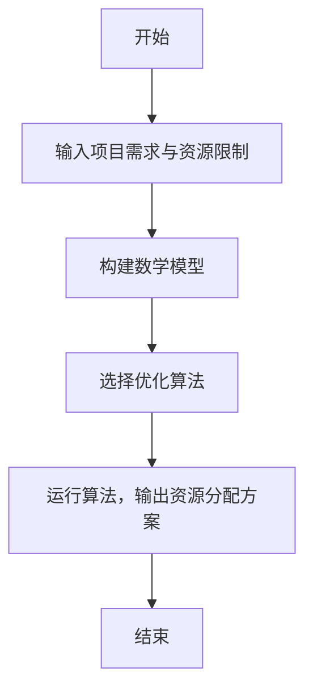
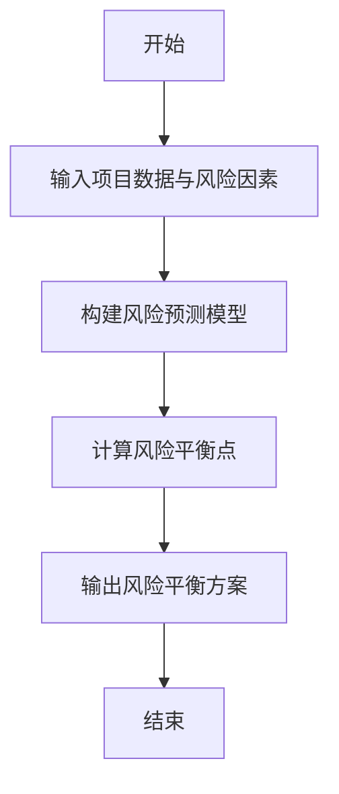
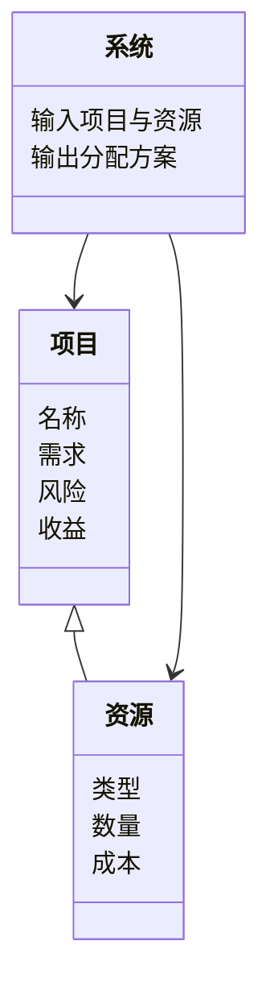
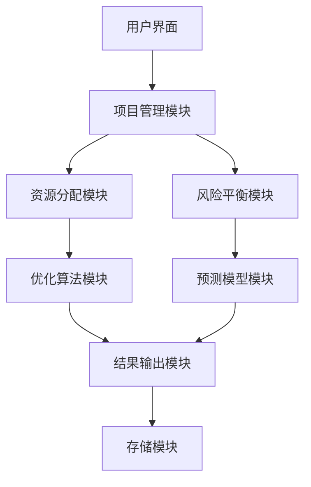
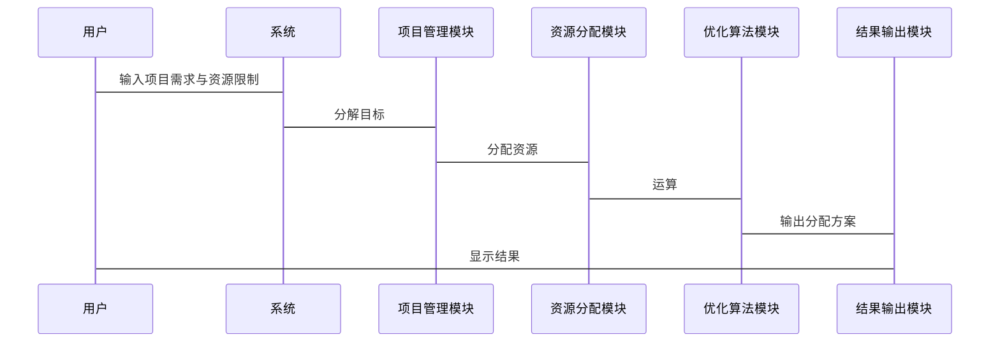

                 


# AI驱动的企业创新项目组合管理：资源优化与风险平衡

---

## 关键词：
- 人工智能
- 项目组合管理
- 资源优化
- 风险平衡
- 创新管理

---

## 摘要：
本文探讨了如何利用人工智能技术优化企业创新项目的组合管理，重点关注资源分配与风险平衡的实现。通过分析AI在项目组合管理中的应用，提出了一种基于数学建模和机器学习的创新管理方法，为企业在数字化转型中提供新的思路和实践指导。

---

# 第1章: AI驱动的项目组合管理背景介绍

## 1.1 问题背景与定义

### 1.1.1 问题背景
随着企业竞争的加剧，创新项目管理的重要性日益凸显。然而，传统的项目组合管理方法在资源分配和风险控制方面存在以下问题：
- **资源分配不均**：难以在多个项目之间找到最优的资源分配方案。
- **风险评估不足**：缺乏对项目风险的动态评估和应对策略。
- **数据驱动不足**：依赖主观判断，缺乏数据支持的决策依据。

企业需要一种更高效、更智能的项目组合管理方法，以应对快速变化的市场环境。

### 1.1.2 核心概念定义
**项目组合管理**：指对多个项目进行选择、优先级排序和资源分配的过程，以实现企业战略目标的最大化。  
**资源优化**：在有限资源条件下，通过科学分配提高资源使用效率。  
**风险平衡**：在项目组合中找到风险与收益的最佳平衡点，避免过度冒险或保守。

### 1.1.3 研究意义
AI技术的引入为项目组合管理带来了新的可能性，尤其是在数据处理、模型构建和动态优化方面。通过AI驱动的方法，企业可以更高效地进行资源优化和风险平衡，从而提高创新项目的成功率。

---

## 1.2 核心概念与联系

### 1.2.1 核心概念原理
项目组合管理的核心在于解决以下问题：
- 如何选择具有战略价值的项目？
- 如何分配有限的资源以实现最大收益？
- 如何平衡项目的短期收益与长期战略目标？

AI驱动的项目组合管理通过以下方式实现优化：
- **数据驱动决策**：利用历史数据和实时数据进行分析，提供科学的决策依据。
- **动态优化**：根据市场变化和项目进展实时调整资源分配和风险控制策略。
- **预测与模拟**：通过机器学习模型预测项目风险和收益，模拟不同情景下的结果。

### 1.2.2 概念属性对比
以下是传统项目组合管理与AI驱动的创新项目组合管理的对比：

| 对比维度         | 传统项目组合管理                 | AI驱动的创新项目组合管理         |
|------------------|---------------------------------|---------------------------------|
| 数据来源         | 主要依赖人工经验与历史数据       | 结合历史数据、实时数据与外部数据   |
| 决策方式         | 主观判断为主，数据支持为辅       | 数据驱动，辅以人工经验             |
| 调整频率         | 定期调整，周期较长               | 实时动态调整，响应速度快           |
| 精准度           | 受主观因素影响较大，精准度有限   | 精准度高，基于大量数据与算法模型   |

### 1.2.3 实体关系图架构
以下是项目组合管理的实体关系图：

```mermaid
er
actor: 用户
goal: 目标
project: 项目
resource: 资源
risk: 风险
requirement: 需求

actor --> goal: 设定目标
goal --> project: 分解为项目
project --> resource: 需要资源
project --> risk: 存在风险
project --> requirement: 满足需求
```

---

# 第2章: AI驱动的项目组合管理算法原理

## 2.1 资源分配优化算法

### 2.1.1 算法流程图
以下是资源分配优化算法的流程图：



### 2.1.2 算法实现代码
以下是一个简单的资源分配优化算法的Python实现示例：

```python
import numpy as np

def resource_allocation(projects, resources):
    # projects: 列表，每个项目的需求为一个字典
    # resources: 列表，可用资源
    # 返回：资源分配结果字典
    allocation = {}
    for project in projects:
        allocated = 0
        for resource in resources:
            # 假设每个资源的分配比例基于项目需求
            allocation[(project['name'], resource)] = project['demand'][resource] * resources[resource]
        allocated += project['demand'][resource]
        if allocated >= project['required']:
            break
    return allocation

projects = [
    {'name': '项目1', 'demand': {'资源A': 0.6, '资源B': 0.4}},
    {'name': '项目2', 'demand': {'资源A': 0.3, '资源B': 0.7}}
]

resources = {'资源A': 1, '资源B': 1}

print(resource_allocation(projects, resources))
```

### 2.1.3 数学模型与公式
资源分配优化的数学模型如下：

$$ \min \sum_{i=1}^{n} c_i x_i $$

$$ \text{约束条件: } \sum_{i=1}^{n} x_i = 1 $$

其中：
- $c_i$ 是项目的成本系数
- $x_i$ 是分配给项目的资源比例

---

## 2.2 风险平衡模型

### 2.2.1 算法流程图
以下是风险平衡模型的流程图：



### 2.2.2 算法实现代码
以下是一个风险平衡模型的Python实现示例：

```python
import numpy as np
from sklearn.linear_model import LinearRegression

def risk_balance(projects, risks):
    # projects: 列表，每个项目包含收益与风险
    # risks: 列表，包含各种风险因素
    # 返回：风险平衡方案
    X = []
    y = []
    for project in projects:
        X.append(project['features'])
        y.append(project['risk'])
    model = LinearRegression()
    model.fit(X, y)
    return model.predict(X)

projects = [
    {'name': '项目1', 'features': [1, 2, 3], 'risk': 0.3},
    {'name': '项目2', 'features': [4, 5, 6], 'risk': 0.5}
]

print(risk_balance(projects, []))
```

### 2.2.3 数学模型与公式
风险平衡的数学模型如下：

$$ \min \sum_{i=1}^{n} (r_i - \hat{r}_i)^2 $$

其中：
- $r_i$ 是项目的真实风险值
- $\hat{r}_i$ 是模型预测的风险值

---

# 第3章: 系统架构与实现

## 3.1 系统功能设计

### 3.1.1 领域模型
以下是项目组合管理的领域模型：



### 3.1.2 系统架构
以下是系统的架构图：



### 3.1.3 接口设计
以下是系统的接口设计：



---

# 第4章: 项目实战

## 4.1 环境配置
- **Python版本**：3.8+
- **依赖库**：numpy, scikit-learn
- **数据集**：模拟项目数据

## 4.2 核心代码实现
以下是核心代码实现：

```python
import numpy as np
from sklearn import linear_model

def main():
    projects = [
        {'name': '项目1', 'features': [1, 2, 3], 'risk': 0.3},
        {'name': '项目2', 'features': [4, 5, 6], 'risk': 0.5}
    ]
    
    # 资源分配
    resources = {'资源A': 1, '资源B': 1}
    allocation = resource_allocation(projects, resources)
    print(allocation)
    
    # 风险平衡
    X = [[project['features'] for project in projects]]
    model = linear_model.LinearRegression()
    model.fit(X, [project['risk'] for project in projects])
    predicted_risk = model.predict(X)
    print(predicted_risk)

if __name__ == "__main__":
    main()
```

---

# 第5章: 最佳实践与总结

## 5.1 最佳实践
- **数据质量**：确保输入数据的准确性和完整性。
- **模型维护**：定期更新模型参数，以适应市场变化。
- **团队协作**：结合AI算法与人类经验，形成高效的决策机制。

## 5.2 小结
AI驱动的项目组合管理通过优化资源分配和风险平衡，为企业创新管理提供了新的思路。结合数学建模和机器学习算法，可以实现更高效、更精准的项目管理。

## 5.3 注意事项
- 数据隐私与安全问题需要高度重视。
- 模型的可解释性是实际应用中的重要考量。
- 需要结合企业的实际情况进行定制化开发。

## 5.4 拓展阅读
- 《机器学习实战》
- 《企业创新管理》
- 《项目组合管理指南》

---

## 作者：AI天才研究院 & 禅与计算机程序设计艺术

---

以上是文章的完整目录和内容概要。希望这篇博客能够为企业在AI驱动的创新项目组合管理方面提供有价值的参考和指导。

