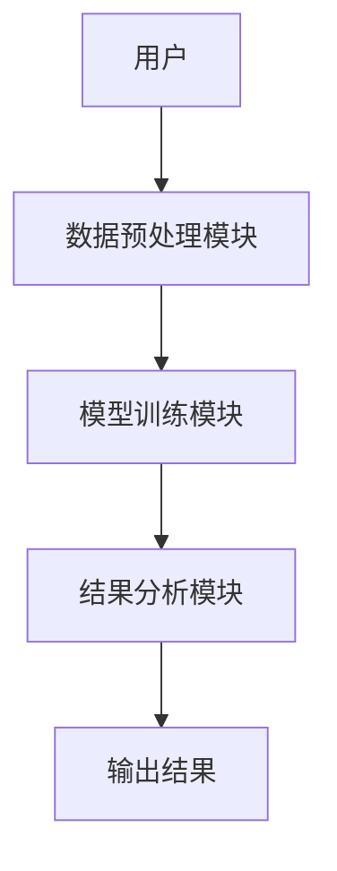

                 


---

# AI驱动的企业创新项目组合管理：风险平衡与资源优化

> 关键词：人工智能、项目组合管理、风险平衡、资源优化、机器学习

> 摘要：本文探讨了人工智能如何驱动企业创新项目组合管理，通过风险平衡与资源优化，提升企业的创新效率和成功率。文章从背景、核心概念、算法原理、系统架构到项目实战，全面解析了AI在项目组合管理中的应用，并通过实际案例展示了如何通过AI技术实现动态优化和精准决策。

---

## 第1章: AI驱动的企业创新项目组合管理背景

### 1.1 企业创新项目组合管理的背景

#### 1.1.1 传统项目组合管理的局限性

项目组合管理（Project Portfolio Management, PPM）是企业在创新过程中对多个项目进行筛选、评估、优先级排序和资源分配的重要管理方法。传统的方法依赖于人工经验和主观判断，存在以下局限性：

- **信息不全与决策偏差**：由于依赖主观判断，容易受到管理者的认知偏差影响，导致决策失误。
- **动态变化难以应对**：市场环境、技术发展和企业战略的变化会直接影响项目的优先级和可行性，而传统方法缺乏动态调整的能力。
- **资源分配效率低下**：在多个项目之间分配有限资源时，传统方法难以量化各项目的潜在收益和风险，导致资源浪费或错配。

#### 1.1.2 AI技术对企业创新的推动作用

随着人工智能技术的快速发展，AI在企业创新中的应用越来越广泛。AI技术可以通过大数据分析、机器学习和自然语言处理等手段，为企业提供更精准的项目评估和决策支持。

- **数据驱动的决策**：AI能够从海量数据中提取有价值的信息，帮助企业在项目筛选和资源分配时做出更科学的决策。
- **动态优化能力**：AI算法可以实时跟踪项目进展和市场变化，动态调整项目优先级和资源分配策略。
- **风险预测与控制**：通过机器学习模型，AI能够预测项目可能面临的风险，并提出应对策略，从而降低项目的失败率。

#### 1.1.3 项目组合管理与企业战略目标的结合

企业创新项目组合管理的核心目标是通过优化项目组合，实现企业战略目标的最大化。AI技术的引入，使得项目组合管理能够更好地与企业战略目标相结合。

- **战略一致性**：AI可以帮助企业在项目筛选过程中，优先选择与企业战略目标一致的项目，确保资源分配与企业长期发展目标一致。
- **资源优化配置**：通过AI驱动的资源分配模型，企业可以在多个项目之间找到最佳的资源配置方案，最大化资源利用率和项目成功率。

### 1.2 AI驱动的项目组合管理的核心概念

#### 1.2.1 项目组合管理的定义与目标

项目组合管理是指企业在创新过程中，对多个项目进行评估、筛选、优先级排序和资源分配的过程。其主要目标是通过优化项目组合，实现企业创新目标的最大化。

- **定义**：项目组合管理是企业在创新过程中，对多个项目进行系统性管理的过程，旨在通过优化项目组合，实现企业战略目标。
- **目标**：通过科学的方法和工具，优化项目组合，最大化企业创新成果，降低项目失败风险，提高资源利用率。

#### 1.2.2 AI驱动的项目组合管理的特点

AI驱动的项目组合管理与传统方法相比，具有以下特点：

- **数据驱动的决策**：AI技术能够从海量数据中提取信息，提供科学的决策支持。
- **动态优化能力**：AI算法可以实时跟踪项目进展和市场变化，动态调整项目优先级和资源分配。
- **风险预测与控制**：通过机器学习模型，AI能够预测项目可能面临的风险，并提出应对策略。

#### 1.2.3 项目组合管理与企业创新的关系

项目组合管理是企业创新的核心管理活动之一，其好坏直接影响企业的创新效率和成果。AI技术的应用，使得项目组合管理更加高效和精准，从而推动企业的创新能力提升。

- **关系**：项目组合管理是企业创新的管理基础，AI技术的应用使得项目组合管理更加科学化和精准化，从而推动企业的创新能力提升。
- **作用**：通过优化项目组合，企业可以在有限资源下，实现创新目标的最大化。

### 1.3 本书的核心目标与结构安排

#### 1.3.1 本书的核心目标

本书的核心目标是探讨AI如何驱动企业创新项目组合管理，通过风险平衡与资源优化，提升企业的创新效率和成功率。具体目标包括：

- **探讨AI技术在项目组合管理中的应用**：分析AI技术如何优化项目组合管理的各个环节。
- **研究风险平衡与资源优化策略**：提出如何通过AI技术实现项目组合的风险平衡与资源优化。
- **总结最佳实践与未来趋势**：总结当前AI驱动的项目组合管理的最佳实践，并展望未来的发展方向。

#### 1.3.2 本书的结构安排

本书共分为六章，内容安排如下：

- **第1章**：AI驱动的企业创新项目组合管理背景，介绍项目组合管理的背景、核心概念与AI的结合。
- **第2章**：项目组合管理的核心要素与AI的结合，分析项目组合管理的核心要素与AI技术的深度融合。
- **第3章**：AI驱动的项目组合管理算法原理，探讨AI算法在项目组合管理中的应用原理。
- **第4章**：系统分析与架构设计，分析AI驱动的项目组合管理系统的架构与设计。
- **第5章**：项目实战与案例分析，通过实际案例分析AI驱动的项目组合管理的应用。
- **第6章**：总结与展望，总结全文并展望未来发展方向。

---

## 第2章: 项目组合管理的核心要素与AI的结合

### 2.1 项目组合管理的核心要素

#### 2.1.1 项目目标与战略一致性

项目目标是项目组合管理的核心要素之一，确保项目与企业战略目标一致。

- **定义**：项目目标是指企业在实施某个项目时希望达到的具体成果或目标。
- **与战略一致性**：项目目标应与企业整体战略目标一致，确保资源分配与企业长期发展目标一致。

#### 2.1.2 项目风险与资源分配

项目风险是项目组合管理中的重要考虑因素，资源分配需要在风险可控的前提下实现最大化收益。

- **项目风险**：项目风险是指在项目实施过程中可能遇到的各种风险，包括技术风险、市场风险、资源风险等。
- **资源分配**：资源分配是项目组合管理中的关键环节，需要在有限资源下，合理分配资源以实现最大化收益。

#### 2.1.3 项目收益与时间管理

项目收益是项目组合管理的重要评估指标，时间管理是确保项目按时完成的关键。

- **项目收益**：项目收益是指项目实施后为企业带来的经济或战略收益。
- **时间管理**：时间管理是确保项目按时完成的关键，需要合理安排项目进度，确保项目按时交付。

### 2.2 AI技术在项目组合管理中的应用

#### 2.2.1 数据挖掘与预测分析

数据挖掘与预测分析是AI技术在项目组合管理中的重要应用，能够从海量数据中提取有价值的信息，帮助企业在项目筛选和资源分配时做出更科学的决策。

- **数据挖掘**：数据挖掘是指从海量数据中提取有价值的信息的过程，能够帮助企业发现潜在的项目机会和风险。
- **预测分析**：预测分析是通过分析历史数据，预测未来项目的收益和风险，帮助企业做出更科学的决策。

#### 2.2.2 自然语言处理与文本分析

自然语言处理与文本分析是AI技术在项目组合管理中的另一重要应用，能够通过分析文本数据，帮助企业更好地理解项目需求和市场趋势。

- **自然语言处理**：自然语言处理（NLP）是人工智能中的一个重要分支，能够通过分析文本数据，帮助企业理解项目需求和市场趋势。
- **文本分析**：文本分析是指通过分析文本数据，提取有价值的信息的过程，能够帮助企业更好地理解项目需求和市场趋势。

---

## 第3章: AI驱动的项目组合管理算法原理

### 3.1 项目组合管理的核心算法

#### 3.1.1 机器学习算法在项目组合管理中的应用

机器学习算法是AI驱动的项目组合管理的核心算法之一，能够通过学习历史数据，预测未来项目的收益和风险。

- **机器学习算法**：机器学习算法是通过学习历史数据，预测未来项目的收益和风险的过程。
- **应用**：机器学习算法可以应用于项目筛选、风险评估、资源分配等多个环节。

#### 3.1.2 线性回归模型

线性回归模型是一种简单但有效的机器学习算法，可以用于项目收益的预测。

- **线性回归模型**：线性回归模型是一种简单但有效的机器学习算法，可以用于项目收益的预测。
- **应用**：线性回归模型可以用于项目收益的预测，帮助企业更好地理解项目的潜在收益。

#### 3.1.3 随机森林模型

随机森林模型是一种基于决策树的集成学习算法，可以用于项目风险的评估。

- **随机森林模型**：随机森林模型是一种基于决策树的集成学习算法，可以用于项目风险的评估。
- **应用**：随机森林模型可以用于项目风险的评估，帮助企业更好地理解项目的风险。

#### 3.1.4 神经网络模型

神经网络模型是一种复杂的机器学习算法，可以用于项目的深度学习和预测。

- **神经网络模型**：神经网络模型是一种复杂的机器学习算法，可以用于项目的深度学习和预测。
- **应用**：神经网络模型可以用于项目的深度学习和预测，帮助企业更好地理解项目的潜在收益和风险。

### 3.2 算法实现与优化

#### 3.2.1 算法实现

以下是使用Python实现的线性回归模型代码示例：

```python
import numpy as np
from sklearn.linear_model import LinearRegression

# 生成数据
X = np.array([[1], [2], [3], [4], [5]])
y = np.array([2, 4, 5, 4, 6])

# 训练模型
model = LinearRegression()
model.fit(X, y)

# 预测结果
print(model.predict([[6]]))
```

#### 3.2.2 算法优化

通过交叉验证和超参数调优，可以进一步优化模型的性能。

- **交叉验证**：交叉验证是一种常用的模型评估方法，可以通过多次训练和验证，评估模型的性能。
- **超参数调优**：超参数调优是通过调整模型的超参数，优化模型的性能。

---

## 第4章: 系统分析与架构设计

### 4.1 系统功能设计

#### 4.1.1 数据预处理模块

数据预处理模块是系统的重要组成部分，负责对数据进行清洗和特征提取。

- **数据清洗**：数据清洗是通过去除噪声数据和填充缺失值，确保数据质量的过程。
- **特征提取**：特征提取是通过提取数据中的特征，为后续的模型训练提供有效的特征。

#### 4.1.2 模型训练模块

模型训练模块是系统的核心模块，负责训练机器学习模型。

- **模型训练**：模型训练是通过训练数据，训练机器学习模型的过程。
- **超参数调优**：超参数调优是通过调整模型的超参数，优化模型的性能。

#### 4.1.3 结果分析模块

结果分析模块是系统的重要组成部分，负责对模型的输出结果进行分析和解释。

- **结果分析**：结果分析是通过分析模型的输出结果，理解模型的预测结果的过程。
- **结果解释**：结果解释是通过解释模型的预测结果，理解模型的决策过程。

### 4.2 系统架构设计

#### 4.2.1 系统架构图

以下是系统架构图的Mermaid图示：



#### 4.2.2 数据流设计

数据流设计是系统设计的重要组成部分，描述了数据在系统中的流动过程。

- **数据输入**：数据输入是系统接收外部数据的过程。
- **数据处理**：数据处理是系统对输入数据进行清洗和特征提取的过程。
- **模型训练**：模型训练是系统对处理后的数据进行模型训练的过程。
- **结果输出**：结果输出是系统将模型的输出结果返回给用户的过程。

---

## 第5章: 项目实战与案例分析

### 5.1 项目环境安装

#### 5.1.1 安装Python环境

以下是安装Python环境的步骤：

1. 下载并安装Python：从[Python官网](https://www.python.org/)下载并安装适合的Python版本。
2. 安装必要的库：使用以下命令安装必要的库：
   ```bash
   pip install numpy scikit-learn
   ```

#### 5.1.2 安装机器学习框架

以下是安装机器学习框架的步骤：

1. 安装Scikit-learn：使用以下命令安装Scikit-learn：
   ```bash
   pip install scikit-learn
   ```

---

## 第6章: 总结与展望

### 6.1 总结

本文详细探讨了AI驱动的企业创新项目组合管理，通过风险平衡与资源优化，提升企业的创新效率和成功率。文章从背景、核心概念、算法原理、系统架构到项目实战，全面解析了AI在项目组合管理中的应用。

### 6.2 展望

未来，随着AI技术的不断发展，AI驱动的项目组合管理将更加智能化和精准化。以下是未来的发展方向：

- **边缘计算与实时优化**：通过边缘计算技术，实现项目的实时优化和动态调整。
- **强化学习的应用**：通过强化学习技术，进一步优化项目的优先级和资源分配。
- **多模态数据融合**：通过多模态数据融合技术，提升项目的评估和决策的准确性。

---

作者：AI天才研究院/AI Genius Institute & 禅与计算机程序设计艺术 /Zen And The Art of Computer Programming

