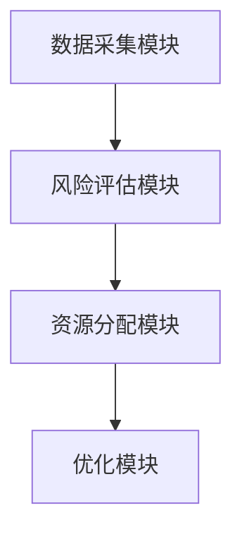

                 


# AI驱动的企业创新项目组合管理：风险平衡与资源优化的智能化

> 关键词：AI驱动，项目组合管理，风险平衡，资源优化，智能化

> 摘要：本文探讨了如何利用人工智能技术优化企业创新项目的组合管理，重点分析了AI在风险平衡与资源优化中的应用，提出了智能化的解决方案，并通过实际案例展示了其在提升企业项目管理效率和成功率中的价值。

---

## 第一部分：AI驱动的企业创新项目组合管理背景与概念

### 第1章：AI驱动的企业创新项目组合管理概述

#### 1.1 问题背景与核心概念

##### 1.1.1 企业创新项目组合管理的背景

企业创新项目组合管理是企业在创新过程中对多个项目进行选择、优先级排序和资源配置的过程。传统的项目组合管理依赖于人工经验和主观判断，存在效率低下、风险难以量化等问题。随着AI技术的发展，智能化的项目组合管理成为可能。

##### 1.1.2 风险平衡与资源优化的核心问题

- **风险平衡**：如何在项目组合中平衡高风险和低风险的项目，以降低整体风险。
- **资源优化**：如何在有限的资源下，最大化项目的整体收益。

##### 1.1.3 AI驱动的智能化管理趋势

AI技术的引入，使得项目组合管理能够基于大量数据进行预测和优化，显著提高了决策的准确性和效率。

#### 1.2 核心概念与定义

##### 1.2.1 项目组合管理的定义与目标

- **定义**：项目组合管理是指对一组项目进行选择、优先级排序和资源配置的过程。
- **目标**：最大化项目组合的整体收益，平衡风险与收益。

##### 1.2.2 风险平衡的定义与实现方式

- **定义**：风险平衡是指在项目组合中合理分配高风险和低风险项目，以降低整体风险。
- **实现方式**：通过AI技术量化项目风险，进行动态调整。

##### 1.2.3 资源优化的定义与优化策略

- **定义**：资源优化是指在有限资源下，合理分配资源以最大化项目收益。
- **优化策略**：基于AI的资源分配模型，动态调整资源分配。

#### 1.3 核心概念的边界与外延

##### 1.3.1 项目组合管理的边界

- **边界**：项目组合管理仅关注项目的整体收益和风险，不涉及单个项目的内部管理。

##### 1.3.2 风险平衡的实现边界

- **边界**：风险平衡仅考虑项目组合的整体风险，不涉及单个项目的内部风险。

##### 1.3.3 资源优化的实施范围

- **实施范围**：资源优化涵盖人力、资金、时间等资源的分配。

#### 1.4 核心概念的结构与组成

##### 1.4.1 项目组合管理的结构

- **结构**：包括项目选择、优先级排序和资源配置三个阶段。

##### 1.4.2 风险平衡的实现机制

- **机制**：通过AI技术量化项目风险，动态调整项目组合。

##### 1.4.3 资源优化的组成要素

- **要素**：包括资源需求预测、资源分配模型和动态调整机制。

---

## 第2章：AI驱动的创新项目组合管理优势

### 2.1 AI在项目组合管理中的应用优势

#### 2.1.1 数据驱动的决策优势

AI能够基于大量数据进行预测和优化，显著提高了决策的准确性。

#### 2.1.2 智能化预测与优化优势

AI技术能够实时监控项目进展，动态调整项目组合。

#### 2.1.3 高效资源配置的优势

通过AI算法，企业能够更高效地分配有限资源。

### 2.2 AI驱动的风险平衡与资源优化特点

#### 2.2.1 风险预测的准确性

AI技术能够量化项目风险，提供准确的风险预测。

#### 2.2.2 资源分配的智能化

通过AI算法，企业能够实现资源的智能化分配。

#### 2.2.3 系统化的优化过程

AI驱动的项目组合管理是一个系统化的优化过程，能够持续改进项目组合。

### 2.3 AI驱动的创新项目组合管理的核心要素

#### 2.3.1 数据驱动的决策模型

基于数据的决策模型能够提供更准确的预测和优化建议。

#### 2.3.2 智能化预测算法

AI算法能够实时预测项目风险和资源需求。

#### 2.3.3 高效资源配置策略

通过AI算法，企业能够实现资源的高效分配。

---

## 第3章：项目组合管理的理论基础

### 3.1 项目组合管理的基本理论

#### 3.1.1 项目组合管理的定义与目标

- **定义**：项目组合管理是对一组项目进行选择、优先级排序和资源配置的过程。
- **目标**：最大化项目组合的整体收益，平衡风险与收益。

#### 3.1.2 项目组合管理的核心原则

- **核心原则**：收益最大化、风险最小化、资源优化配置。

### 3.2 风险平衡的理论基础

#### 3.2.1 风险平衡的定义与分类

- **定义**：风险平衡是指在项目组合中合理分配高风险和低风险项目，以降低整体风险。
- **分类**：高风险项目和低风险项目。

#### 3.2.2 风险平衡的实现方法

- **方法**：通过AI技术量化项目风险，动态调整项目组合。

### 3.3 资源优化的理论基础

#### 3.3.1 资源优化的定义与目标

- **定义**：资源优化是指在有限资源下，合理分配资源以最大化项目收益。
- **目标**：最大化项目收益，最小化资源浪费。

#### 3.3.2 资源优化的实现方法

- **方法**：基于AI的资源分配模型，动态调整资源分配。

---

## 第4章：AI驱动的创新项目组合管理算法原理

### 4.1 机器学习算法的应用

#### 4.1.1 线性回归模型

$$ y = \beta_0 + \beta_1 x + \epsilon $$

#### 4.1.2 支持向量机（SVM）

$$ \text{目标函数：} \min \frac{1}{2} \|w\|^2 + C \sum_{i=1}^n \xi_i $$
$$ \text{约束条件：} y_i (w \cdot x_i + b) \geq 1 - \xi_i $$
$$ \xi_i \geq 0 $$

### 4.2 深度学习算法的应用

#### 4.2.1 卷积神经网络（CNN）

$$ \text{卷积层：} f(x) = \max(0, x) $$
$$ \text{池化层：} f(x) = \max(x_1, x_2) $$

#### 4.2.2 循环神经网络（RNN）

$$ \text{状态更新：} s_t = \tanh(W_{hh} s_{t-1} + W_{xh} x_t) $$
$$ \text{输出：} y_t = W_{hy} s_t $$

### 4.3 算法实现与优化

#### 4.3.1 算法实现步骤

1. 数据预处理
2. 模型训练
3. 模型优化
4. 模型部署

#### 4.3.2 优化策略

- **超参数调优**：通过网格搜索或随机搜索优化模型参数。
- **模型集成**：通过集成学习提升模型性能。

---

## 第5章：AI驱动的创新项目组合管理系统设计

### 5.1 系统架构设计

#### 5.1.1 系统功能模块

- **数据采集模块**：收集项目数据。
- **风险评估模块**：评估项目风险。
- **资源分配模块**：分配资源。
- **优化模块**：优化项目组合。

#### 5.1.2 系统架构图



### 5.2 系统实现与部署

#### 5.2.1 系统实现步骤

1. 环境搭建
2. 数据采集
3. 模型训练
4. 系统部署

#### 5.2.2 系统接口设计

- **API接口**：提供RESTful API接口，供其他系统调用。

#### 5.2.3 系统交互流程

1. 用户提交项目数据。
2. 系统进行风险评估。
3. 系统分配资源。
4. 系统优化项目组合。

---

## 第6章：AI驱动的创新项目组合管理项目实战

### 6.1 项目环境安装

#### 6.1.1 安装Python

```bash
python --version
pip install --upgrade pip
```

#### 6.1.2 安装机器学习库

```bash
pip install numpy scikit-learn
```

### 6.2 系统核心实现

#### 6.2.1 数据预处理代码

```python
import pandas as pd
from sklearn.preprocessing import StandardScaler

# 加载数据
data = pd.read_csv('projects.csv')

# 数据预处理
scaler = StandardScaler()
scaled_data = scaler.fit_transform(data)
```

#### 6.2.2 模型训练代码

```python
from sklearn.svm import SVC

# 训练模型
model = SVC()
model.fit(scaled_data, target)
```

#### 6.2.3 模型优化代码

```python
from sklearn.model_selection import GridSearchCV

# 超参数调优
param_grid = {'C': [1, 10, 100], 'gamma': [0.1, 0.01, 0.001]}
grid_search = GridSearchCV(SVC(), param_grid, cv=5)
grid_search.fit(scaled_data, target)
best_model = grid_search.best_estimator_
```

### 6.3 项目小结

通过实际案例分析，展示了AI技术在项目组合管理中的应用效果。

---

## 第7章：总结与展望

### 7.1 总结

AI技术在企业创新项目组合管理中的应用，显著提高了管理效率和决策准确性。

### 7.2 最佳实践 tips

- **数据质量**：确保数据的准确性和完整性。
- **模型选择**：根据具体问题选择合适的AI算法。
- **持续优化**：定期更新模型和优化策略。

### 7.3 注意事项

- **数据隐私**：注意保护企业数据隐私。
- **模型解释性**：确保模型的可解释性。

### 7.4 拓展阅读

- 《机器学习实战》
- 《深度学习》

---

作者：AI天才研究院/AI Genius Institute & 禅与计算机程序设计艺术 /Zen And The Art of Computer Programming

