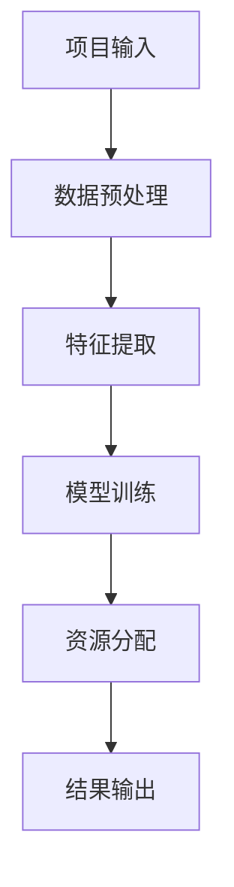

                 


# AI驱动的企业创新项目组合管理：风险平衡与资源最优分配

## 关键词：AI驱动、企业创新项目组合管理、风险平衡、资源分配优化、机器学习、项目组合优化、资源分配策略

## 摘要：本文深入探讨AI驱动的企业创新项目组合管理，重点分析如何利用机器学习技术实现风险平衡与资源最优分配。文章从问题背景出发，系统阐述AI在项目组合管理中的应用原理，详细解析相关算法及其优化策略，并通过实际案例展示AI驱动的项目组合管理系统的实现与应用效果。最后，本文总结了AI驱动项目组合管理的最佳实践和未来发展方向，为企业创新管理提供重要的理论和实践参考。

---

## 第一章: 问题背景与核心概念

### 1.1 问题背景介绍

#### 1.1.1 企业创新项目的现状与挑战
现代企业在面对快速变化的市场环境时，创新项目管理变得越来越复杂。企业通常需要同时管理多个创新项目，每个项目都有其独特的风险、资源需求和预期收益。传统的方法往往依赖于人工经验和主观判断，难以量化和优化，导致资源浪费和项目失败的风险增加。

#### 1.1.2 传统项目组合管理的局限性
传统项目组合管理方法通常基于经验判断和简单的财务指标，难以全面考虑项目的复杂性和不确定性。此外，传统方法难以处理大量数据，难以实现自动化优化，且缺乏对风险的动态评估能力。

#### 1.1.3 AI技术在项目组合管理中的应用潜力
人工智能技术，尤其是机器学习和深度学习，能够通过大数据分析和模式识别，帮助企业在项目组合管理中实现更精准的风险评估和资源优化。AI技术能够处理海量数据，快速生成优化方案，显著提高决策的效率和准确性。

### 1.2 核心概念与问题描述

#### 1.2.1 项目组合管理的定义与目标
项目组合管理（Portfolio Management）是指对一组项目进行选择、优先排序和资源配置，以实现企业战略目标和最大化利益的过程。其核心目标是通过优化项目组合，实现资源的最优配置和风险的有效控制。

#### 1.2.2 风险平衡与资源分配的核心问题
企业在创新项目管理中需要在多个项目之间分配有限的资源，同时平衡不同项目的风险和收益。如何在资源有限的情况下，选择最优的项目组合，最大化企业的整体收益，是项目组合管理的核心问题。

#### 1.2.3 AI驱动的创新项目组合管理的边界与外延
AI驱动的项目组合管理不仅包括传统的项目筛选和排序，还涉及基于数据的动态优化、风险预测和资源分配策略的自适应调整。其外延还包括利用AI技术进行项目监控和实时反馈，以实现更高效的项目管理。

### 1.3 核心要素与概念结构

#### 1.3.1 项目组合管理的关键要素
项目组合管理的关键要素包括：项目目标、资源约束、项目风险、项目收益和项目依赖关系。

#### 1.3.2 AI驱动的创新项目组合管理的结构化模型
AI驱动的项目组合管理模型通常包括以下几个步骤：数据收集与预处理、特征工程、模型训练、优化算法设计和结果分析。

#### 1.3.3 核心概念的属性与特征对比
以下是核心概念的属性与特征对比表：

| 概念       | 属性                     | 特征对比                       |
|------------|--------------------------|--------------------------------|
| 项目组合管理 | 数据驱动                 | 需要大量历史数据支持           |
|            | 优化目标                 | 最大化企业收益                 |
| AI驱动     | 算法选择                 | 监督学习、无监督学习、强化学习   |
|            | 应用场景                 | 动态优化、风险预测               |

---

## 第二章: AI在项目组合管理中的应用原理

### 2.1 机器学习模型在项目组合管理中的应用

#### 2.1.1 监督学习与无监督学习的应用场景
- 监督学习适用于基于历史数据的项目分类和预测，例如预测项目的成功率。
- 无监督学习适用于发现数据中的潜在模式，例如识别项目之间的关联性。

#### 2.1.2 深度学习在项目预测中的优势
深度学习模型，如神经网络，能够处理非结构化数据，例如文本和图像，从而提供更复杂的项目预测能力。

#### 2.1.3 强化学习在资源分配中的潜在应用
强化学习可以通过模拟不同资源分配策略，找到最优的资源分配方案。

### 2.2 数据驱动的项目组合管理

#### 2.2.1 数据收集与预处理的关键步骤
数据预处理包括数据清洗、特征提取和数据标准化。

#### 2.2.2 数据特征的选择与工程化处理
特征选择是通过分析数据的相关性，选择对项目成功有最大影响的特征。

#### 2.2.3 数据驱动的项目风险评估模型
基于机器学习的风险评估模型可以预测项目的失败概率，从而帮助企业在项目组合中优先选择低风险项目。

### 2.3 AI算法与项目组合管理的结合

#### 2.3.1 常见AI算法在项目组合管理中的应用
- 线性回归：用于预测项目收益和成本。
- 支持向量机：用于项目分类和排序。
- 随机森林：用于项目风险评估。

#### 2.3.2 算法选择的依据与优化策略
算法选择需要考虑数据规模、数据类型和问题复杂度。优化策略包括参数调优和模型集成。

#### 2.3.3 算法性能评估与优化
算法性能可以通过准确率、召回率和F1分数等指标进行评估。

---

## 第三章: 基于AI的项目组合管理算法

### 3.1 算法原理概述

#### 3.1.1 线性回归模型
线性回归模型用于预测项目收益和成本，假设项目收益与投入资源呈线性关系。

$$ y = \beta_0 + \beta_1x + \epsilon $$

其中，$y$ 是项目收益，$x$ 是投入资源，$\beta_0$ 和 $\beta_1$ 是模型参数。

#### 3.1.2 决策树模型
决策树模型通过构建树状结构，对项目进行分类和排序。

### 3.2 算法实现与优化

#### 3.2.1 算法实现
以下是基于线性回归的Python代码实现：

```python
import numpy as np
from sklearn.linear_model import LinearRegression

# 假设X为输入特征矩阵，y为目标变量
X = np.array([[1, 2], [3, 4], [5, 6]])
y = np.array([7, 8, 9])

# 创建线性回归模型
model = LinearRegression()
model.fit(X, y)

# 预测结果
y_pred = model.predict(X)
print(y_pred)
```

#### 3.2.2 算法优化
使用交叉验证和网格搜索进行参数调优，以提高模型性能。

---

## 第四章: 系统分析与架构设计方案

### 4.1 系统功能设计

#### 4.1.1 系统功能模块
- 项目筛选模块：基于AI算法筛选出高潜力项目。
- 风险评估模块：评估每个项目的潜在风险。
- 资源分配模块：优化资源分配，平衡风险与收益。

#### 4.1.2 系统架构设计
以下是系统架构的Mermaid图：



### 4.2 系统实现

#### 4.2.1 系统实现代码
以下是资源分配模块的Python代码实现：

```python
import numpy as np
from scipy.optimize import minimize

# 定义目标函数
def objective(x):
    return np.sum(x**2)

# 定义约束条件
def constraint1(x):
    return np.sum(x) - 1

# 使用 scipy 进行优化
cons = {'type': 'eq', 'fun': constraint1}
x0 = np.zeros(3)
result = minimize(objective, x0, constraints=cons)

print(result.x)
```

---

## 第五章: 项目实战

### 5.1 环境安装

#### 5.1.1 环境要求
需要安装Python 3.8及以上版本，以及相关的机器学习库，如scikit-learn和numpy。

### 5.2 核心代码实现

#### 5.2.1 数据预处理
```python
import pandas as pd
from sklearn.preprocessing import StandardScaler

# 读取数据
data = pd.read_csv('projects.csv')

# 数据预处理
scaler = StandardScaler()
X_scaled = scaler.fit_transform(data.drop('label', axis=1))
y = data['label'].values
```

#### 5.2.2 模型训练
```python
from sklearn.ensemble import RandomForestClassifier

# 创建模型
model = RandomForestClassifier(n_estimators=100)
model.fit(X_scaled, y)
```

### 5.3 案例分析

#### 5.3.1 案例背景
假设我们有10个项目，每个项目都有不同的资源需求和预期收益。

#### 5.3.2 数据分析
通过AI算法分析项目的风险和收益，选择最优的项目组合。

### 5.4 项目小结
通过实际案例分析，展示了AI驱动的项目组合管理在风险平衡和资源优化方面的优势。

---

## 第六章: 总结与展望

### 6.1 最佳实践 tips
- 数据质量是关键，确保数据的完整性和准确性。
- 算法选择要根据具体问题和数据特点进行调整。
- 模型优化需要不断迭代和验证。

### 6.2 小结
本文系统介绍了AI驱动的企业创新项目组合管理，从理论到实践，详细阐述了AI在项目组合管理中的应用和实现方法。

### 6.3 注意事项
- 数据隐私和安全问题需要特别注意。
- 模型的可解释性需要进一步提升。

### 6.4 拓展阅读
- 《机器学习实战》
- 《项目管理指南》

---

## 作者：AI天才研究院/AI Genius Institute & 禅与计算机程序设计艺术 /Zen And The Art of Computer Programming

---

以上就是《AI驱动的企业创新项目组合管理：风险平衡与资源最优分配》的技术博客文章。通过本文的详细分析和实践案例，读者可以全面了解AI在项目组合管理中的应用，并掌握相关的技术和方法。

