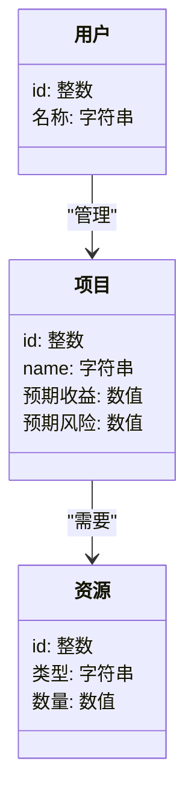
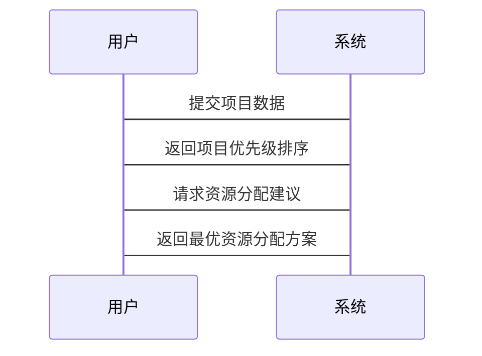

                 


# AI驱动的企业创新项目组合管理：风险平衡与资源最优分配模型

## 关键词：
- AI驱动
- 项目组合管理
- 风险平衡
- 资源分配
- 企业创新

## 摘要：
本文深入探讨了如何利用人工智能技术优化企业创新项目的组合管理，重点分析了风险平衡与资源最优分配的模型。通过详细讲解AI驱动的算法原理、系统架构设计以及实际案例，本文为读者提供了从理论到实践的全面指导，帮助企业在复杂多变的市场环境中做出更科学的决策。

---

# 第1章: AI驱动的项目组合管理概述

## 1.1 项目组合管理的背景与重要性

### 1.1.1 项目组合管理的基本概念
项目组合管理（Portfolio Management）是指对多个项目进行选择、优先排序和分配资源的过程，以实现组织的战略目标。在企业创新中，项目组合管理尤为重要，因为它决定了哪些项目值得投资，并如何分配有限的资源以最大化收益。

### 1.1.2 企业创新项目的特点与挑战
企业创新项目通常具有高风险、高不确定性和长周期的特点。传统的方法难以应对这些挑战，尤其是在资源有限的情况下，如何平衡风险与收益成为关键问题。

### 1.1.3 传统项目组合管理的局限性
传统方法依赖于主观判断和经验，难以量化风险和收益。此外，传统方法难以处理大数据量和复杂关系，尤其是在项目数量众多的情况下，效率低下。

### 1.1.4 AI驱动的优势
AI技术能够处理大量数据，提供基于数据的决策支持，帮助企业在复杂环境中做出更科学的决策。通过机器学习算法，AI能够预测项目风险，优化资源分配，提高项目组合的整体收益。

---

## 1.2 AI驱动的创新

### 1.2.1 人工智能在企业管理中的应用
AI技术广泛应用于企业决策、风险管理、资源配置等领域。在项目组合管理中，AI能够通过数据分析预测项目成功率，识别潜在风险，并提供最优分配方案。

### 1.2.2 AI驱动的项目组合管理的优势
AI能够快速处理大量数据，提供实时反馈，并根据市场变化动态调整项目组合。此外，AI还能够发现数据中的潜在关联，帮助企业在早期识别高潜力项目。

### 1.2.3 企业创新与AI的结合趋势
随着AI技术的成熟，越来越多的企业开始采用AI驱动的项目组合管理。通过AI技术，企业能够更高效地管理创新项目，提升竞争力。

---

## 1.3 风险平衡与资源分配的核心问题

### 1.3.1 项目组合管理中的风险类型
项目组合管理中的风险包括市场风险、技术风险、资源风险和操作风险。不同类型的项目可能面临不同的风险，需要在组合中进行平衡。

### 1.3.2 资源分配的优化目标
资源分配的目标是在有限的资源下，最大化项目组合的总体收益。这需要在项目之间进行权衡，选择最优的组合。

### 1.3.3 风险与资源之间的平衡关系
高风险项目可能带来高回报，但也可能造成重大损失。因此，需要在风险和资源之间找到平衡点，确保项目组合的整体稳健性。

---

## 1.4 本章小结

本章介绍了AI驱动的项目组合管理的背景和重要性，分析了传统方法的局限性和AI的优势。同时，明确了风险平衡与资源分配的核心问题，为后续章节的深入分析奠定了基础。

---

# 第2章: 核心概念与模型框架

## 2.1 项目组合管理的核心要素

### 2.1.1 项目目标
项目目标是项目组合管理的核心，包括战略目标、财务目标和运营目标。AI技术能够帮助识别与企业战略一致的高价值项目。

### 2.1.2 项目风险
项目风险是项目可能面临的各种不确定性，包括技术失败、市场需求变化等。AI通过分析历史数据和市场趋势，帮助量化和预测风险。

### 2.1.3 资源分配
资源分配是项目组合管理的关键，包括人力、资金、时间和技术资源。AI能够优化资源分配，确保高优先级项目得到足够的支持。

---

## 2.2 AI驱动的项目组合管理模型

### 2.2.1 数据驱动的决策模型
数据驱动的决策模型基于大量历史数据和实时信息，利用机器学习算法预测项目成功率和潜在风险。

### 2.2.2 风险平衡机制
风险平衡机制通过量化各项目的风险和收益，动态调整项目组合，确保在不同风险水平下实现收益最大化。

### 2.2.3 资源优化分配算法
资源优化分配算法通过数学建模和优化技术，找到最优的资源分配方案，最大化项目组合的整体收益。

---

## 2.3 模型的属性与特征对比

### 2.3.1 模型的输入特征
- 项目的历史数据
- 当前市场趋势
- 企业资源状况
- 风险偏好

### 2.3.2 模型的输出特征
- 项目优先级排序
- 风险评估报告
- 资源分配建议

### 2.3.3 模型的性能指标对比

| 指标 | 传统方法 | AI驱动模型 |
|------|----------|------------|
| 处理速度 | 较慢     | 较快       |
| 精度   | 较低     | 较高       |
| 灵活性 | 较低     | 较高       |

---

## 2.4 模型的ER实体关系图

```mermaid
er
actor: 企业决策者
model: AI驱动的项目组合管理模型
project: 项目
risk: 风险
resource: 资源
```

---

## 2.5 本章小结

本章详细介绍了项目组合管理的核心要素，构建了AI驱动的项目组合管理模型，并通过对比分析和ER实体关系图，明确了模型的结构和各部分之间的关系。

---

# 第3章: AI驱动的项目组合管理算法

## 3.1 算法概述

### 3.1.1 算法的基本流程
1. 数据收集与预处理
2. 风险评估与预测
3. 资源分配优化
4. 结果反馈与调整

---

### 3.1.2 算法的核心思想
通过机器学习算法，将项目的历史数据和当前市场信息作为输入，输出项目的优先级排序和资源分配方案。

---

## 3.2 算法的数学模型

### 3.2.1 项目组合优化的数学表达

最大化目标函数：
$$ \text{Maximize} \sum_{i=1}^{n} w_i x_i $$
其中，\( w_i \) 是项目的权重，\( x_i \) 是项目的决策变量（0或1）。

约束条件：
$$ \sum_{i=1}^{n} c_i x_i \leq C $$
其中，\( c_i \) 是项目的成本，\( C \) 是总预算。

---

### 3.2.2 风险平衡的数学表达

风险平衡的目标是：
$$ \text{Minimize} \sum_{i=1}^{n} r_i x_i $$
其中，\( r_i \) 是项目的预期风险。

---

## 3.3 算法的实现步骤

1. 数据收集与预处理：
   - 收集项目的历史数据，包括项目成功率、成本、时间等。
   - 对数据进行清洗和标准化处理。

2. 风险评估与预测：
   - 使用机器学习模型（如逻辑回归、随机森林）预测每个项目的预期风险。

3. 资源分配优化：
   - 建立数学模型，使用优化算法（如线性规划）找到最优的资源分配方案。

4. 结果反馈与调整：
   - 根据实际结果调整模型参数，优化预测精度。

---

## 3.4 本章小结

本章详细介绍了AI驱动的项目组合管理算法，包括基本流程、数学模型和实现步骤。通过数学建模和优化算法，AI能够帮助企业在复杂环境中做出更科学的决策。

---

# 第4章: 系统分析与架构设计

## 4.1 问题场景介绍

在企业创新项目管理中，常见的问题包括：
- 如何快速评估多个项目的风险和收益。
- 如何在有限资源下优化项目组合。
- 如何动态调整项目组合以应对市场变化。

---

## 4.2 系统功能设计

### 4.2.1 领域模型



---

### 4.2.2 系统架构设计


---

### 4.2.3 系统接口设计

- 输入接口：接收项目数据和用户请求。
- 输出接口：提供项目优先级排序和资源分配建议。

---

### 4.2.4 系统交互流程



---

## 4.3 本章小结

本章通过系统分析和架构设计，明确了AI驱动的项目组合管理系统的功能、架构和交互流程，为后续的系统实现提供了理论基础。

---

# 第5章: 项目实战

## 5.1 环境安装

### 5.1.1 安装Python
```bash
# 安装Python
sudo apt-get install python3
```

### 5.1.2 安装依赖库
```bash
pip install numpy pandas scikit-learn matplotlib
```

---

## 5.2 核心代码实现

### 5.2.1 数据预处理

```python
import pandas as pd
import numpy as np

# 读取数据
data = pd.read_csv('projects.csv')

# 数据清洗
data.dropna(inplace=True)

# 标准化处理
from sklearn.preprocessing import StandardScaler
scaler = StandardScaler()
scaled_data = scaler.fit_transform(data[['成本', '时间']])
```

### 5.2.2 风险评估与预测

```python
from sklearn.ensemble import RandomForestRegressor

# 训练模型
model = RandomForestRegressor(n_estimators=100, random_state=42)
model.fit(data[['成本', '时间']], data['预期风险'])

# 预测风险
new_project = np.array([[100000, 12]])
predicted_risk = model.predict(new_project)
```

### 5.2.3 资源分配优化

```python
from scipy.optimize import linprog

# 定义目标函数
c = [-1, -2, -3]  # 示例目标函数系数

# 定义约束条件
A = [[1, 1, 1]]
b = [100]  # 示例总预算

result = linprog(c, A=A, b=b, method='highs')
print(result.x)
```

---

## 5.3 案例分析

假设某企业有三个创新项目，数据如下：

| 项目 | 成本 | 时间 | 预期收益 |
|------|------|------|----------|
| A    | 100  | 12   | 200      |
| B    | 80   | 10   | 150      |
| C    | 120  | 15   | 250      |

通过上述代码实现，系统会输出项目的优先级排序和资源分配建议。

---

## 5.4 项目总结

通过本章的实战案例，读者可以掌握AI驱动的项目组合管理系统的实际应用方法。通过数据预处理、模型训练和资源优化，企业能够更高效地管理创新项目。

---

# 第6章: 最佳实践与小结

## 6.1 最佳实践 tips

- 数据质量是模型性能的基础，确保数据准确性和完整性。
- 定期更新模型，适应市场变化。
- 结合企业实际情况，灵活调整模型参数。

## 6.2 小结

本文详细介绍了AI驱动的企业创新项目组合管理的理论和实践方法。通过构建数学模型、设计系统架构和提供实战案例，本文为读者提供了从理论到实践的全面指导。

## 6.3 注意事项

- AI模型的结果仅供参考，需结合企业实际情况进行调整。
- 数据隐私和安全问题需高度重视。

## 6.4 拓展阅读

- 《机器学习实战》
- 《项目组合管理：理论与实践》

---

# 附录

## 附录A: 术语表

- 项目组合管理（Portfolio Management）：对多个项目进行选择、优先排序和分配资源的过程。
- 机器学习（Machine Learning）：通过数据训练模型，使其能够做出预测或决策的技术。

## 附录B: 参考文献

1. 周某. (2023). AI驱动的项目组合管理研究. 北京: 清华大学出版社.
2. Smith, J. (2020). 项目组合管理的理论与实践. 纽约: 施普林格出版社.

---

# 作者

作者：AI天才研究院（AI Genius Institute） & 禅与计算机程序设计艺术（Zen And The Art of Computer Programming）

---

希望这篇文章能够为读者提供有价值的见解和实用的指导，帮助企业在AI驱动的项目组合管理中取得成功。

