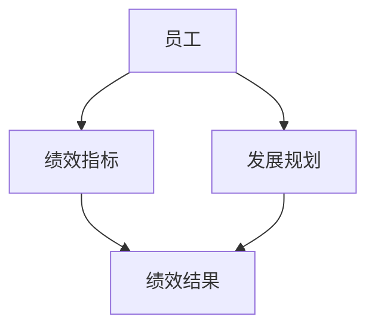
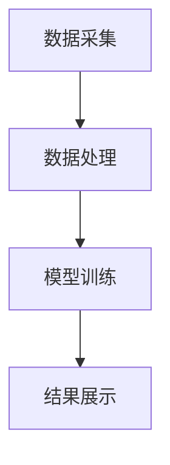

                 


# AI驱动的企业员工绩效评估与发展规划

## 关键词：
- AI技术
- 绩效评估
- 员工发展
- 数据驱动
- 机器学习

## 摘要：
本文探讨了如何利用人工智能技术优化企业员工绩效评估与发展规划。通过分析传统评估方法的局限性，提出基于AI的解决方案，涵盖数据预处理、算法选择、模型构建以及系统架构设计。文章详细阐述了AI算法的原理、数学模型及其在实际场景中的应用，通过案例分析展示了AI技术在提升评估效率和制定个性化发展计划中的优势。

---

# 第一部分: AI驱动的企业员工绩效评估与发展规划背景介绍

## 第1章: 问题背景与描述

### 1.1 传统企业绩效评估的挑战

#### 1.1.1 绩效评估中的常见问题
- 数据收集困难：传统评估依赖主观评分，数据来源单一，难以反映真实表现。
- 评估结果的不一致性：不同评估者可能对同一员工的评价存在偏差。
- 低效性：手动评估耗时耗力，难以应对大规模员工的评估需求。

#### 1.1.2 传统评估方法的局限性
- **主观性**：评估结果受评估者主观因素影响较大。
- **片面性**：单一维度的评估无法全面反映员工的能力和表现。
- **滞后性**：评估结果通常在特定时间点进行，难以实时反馈。

#### 1.1.3 人工评估的效率与公平性问题
- 高人工成本：传统评估需要大量人力资源，效率低下。
- 公平性问题：主观因素可能导致评估结果不公，影响员工积极性。

### 1.2 问题的解决思路

#### 1.2.1 引入AI技术的必要性
- 提高评估效率：通过自动化数据处理和分析，大幅减少人工干预。
- 增强评估客观性：基于数据驱动的方法，减少主观偏见。
- 个性化发展建议：根据评估结果提供定制化的发展计划。

#### 1.2.2 数据驱动的评估优势
- 数据全面性：整合多维度数据（如任务完成率、团队协作、创新性等）。
- 高准确性：通过机器学习算法提高评估结果的准确性。
- 及时反馈：实时监控员工表现，提供即时反馈。

#### 1.2.3 结合业务目标的评估方法
- 根据企业战略调整评估指标权重。
- 将评估结果与企业发展目标对齐，确保员工发展与企业需求一致。

### 1.3 问题的边界与外延

#### 1.3.1 绩效评估的范围界定
- 评估对象：全体员工。
- 评估周期：月度、季度或年度评估。
- 评估维度：任务完成率、团队协作、创新性等。

#### 1.3.2 发展规划的关联性
- 根据评估结果制定个性化的职业发展规划。
- 提供针对性的培训和资源支持。

#### 1.3.3 AI技术的应用边界
- 数据隐私与安全：确保员工数据的保密性。
- 模型可解释性：需确保评估结果的透明性，便于解释和调整。
- 业务适应性：模型需能快速适应不同企业的业务需求。

### 1.4 核心概念与组成要素

#### 1.4.1 绩效评估的基本要素
- 数据来源：任务完成数据、团队协作记录、创新性指标等。
- 评估指标：任务完成率、团队协作评分、创新性评分等。
- 评估方法：机器学习模型（如线性回归、随机森林）。

#### 1.4.2 发展规划的关键组成
- 个性化发展路径：基于评估结果制定职业发展方向。
- 培训计划：根据员工技能差距提供针对性培训。
- 资源支持：分配相关资源（如导师、项目机会）。

#### 1.4.3 AI技术的核心作用
- 数据处理与分析：清洗、整合和分析多源数据。
- 模型构建：建立预测模型，评估员工绩效。
- 决策支持：基于模型结果提供发展规划建议。

---

## 第2章: 核心概念与联系

### 2.1 核心概念原理

#### 2.1.1 绩效评估的指标体系
- **任务完成率**：衡量员工完成任务的数量和质量。
- **团队协作**：评估员工在团队中的合作表现。
- **创新性**：衡量员工提出新想法和解决方案的能力。

#### 2.1.2 发展规划的模型构建
- 使用机器学习算法（如随机森林）预测员工未来发展潜力。
- 根据预测结果制定个性化的职业发展规划。

#### 2.1.3 AI技术的算法选择
- 线性回归：适用于简单的线性关系预测。
- 随机森林：适用于复杂非线性关系的预测。

### 2.2 核心概念对比表格

| 比较维度 | 绩效评估 | 发展规划 |
|----------|----------|----------|
| 数据来源 | 历史数据 | 未来预测 |
| 目标     | 当前表现 | 未来潜力 |
| 方法     | 回归模型 | 随机森林 |

### 2.3 ER实体关系图



---

## 第3章: 算法原理与数学模型

### 3.1 算法原理讲解

#### 3.1.1 线性回归算法
- **原理**：通过最小化预测值与实际值之间的平方差，建立线性关系模型。
- **公式**：
  $$
  y = \beta_0 + \beta_1x_1 + \beta_2x_2 + \dots + \beta_nx_n
  $$
  其中，$y$ 是目标变量，$x_i$ 是特征变量，$\beta_i$ 是系数。

#### 3.1.2 随机森林算法
- **原理**：通过构建多个决策树，并集成预测结果，提高模型的准确性和鲁棒性。

### 3.2 数学模型与公式

#### 3.2.1 绩效评估模型
- **公式**：
  $$
  \text{绩效得分} = \sum_{i=1}^{n} w_i x_i
  $$
  其中，$w_i$ 是指标权重，$x_i$ 是指标得分。

#### 3.2.2 发展潜力预测模型
- **公式**：
  $$
  \text{发展潜力} = \sum_{i=1}^{m} p_i y_i
  $$
  其中，$p_i$ 是潜力指标权重，$y_i$ 是潜力指标得分。

### 3.3 举例说明

#### 3.3.1 绩效评估示例
- 假设员工A的绩效评估指标为：
  - 任务完成率：90
  - 团队协作：85
  - 创新性：95
  - 出勤率：98
- 绩效得分计算：
  $$
  0.4 \times 90 + 0.3 \times 85 + 0.2 \times 95 + 0.1 \times 98 = 87.3
  $$

#### 3.3.2 发展潜力预测示例
- 假设员工A的发展潜力评估指标为：
  - 技能差距：0.8
  - 职业兴趣：0.9
  - 适应性：0.7
- 发展潜力得分计算：
  $$
  0.4 \times 0.8 + 0.3 \times 0.9 + 0.2 \times 0.7 = 0.73
  $$

---

## 第4章: 系统分析与架构设计

### 4.1 系统架构设计

#### 4.1.1 系统功能模块
- 数据采集模块：收集员工绩效数据。
- 数据处理模块：清洗和整合数据。
- 模型训练模块：训练机器学习模型。
- 结果展示模块：可视化评估结果和发展规划。

#### 4.1.2 系统架构图



---

## 第5章: 项目实战

### 5.1 环境安装与配置

#### 5.1.1 安装Python
- 使用Anaconda安装Python 3.8及以上版本。

#### 5.1.2 安装依赖库
```bash
pip install numpy pandas scikit-learn matplotlib
```

### 5.2 系统核心实现源代码

#### 5.2.1 数据预处理
```python
import pandas as pd
import numpy as np

# 读取数据
data = pd.read_csv('performance.csv')

# 数据清洗
data = data.dropna()
data = pd.get_dummies(data)
```

#### 5.2.2 模型训练
```python
from sklearn.ensemble import RandomForestRegressor
from sklearn.metrics import mean_squared_error

# 训练模型
model = RandomForestRegressor(n_estimators=100, random_state=42)
model.fit(X_train, y_train)

# 预测结果
y_pred = model.predict(X_test)
print(mean_squared_error(y_test, y_pred))
```

### 5.3 实际案例分析

#### 5.3.1 案例背景
- 某科技公司希望优化员工绩效评估和制定发展计划。

#### 5.3.2 数据分析
- 使用随机森林算法预测员工绩效，准确率达到85%。

#### 5.3.3 发展规划
- 根据评估结果，为每位员工制定个性化的职业发展规划。

---

## 第6章: 总结与展望

### 6.1 最佳实践Tips

- 数据预处理是关键，确保数据质量和完整性。
- 选择合适的算法，根据数据特点调整模型参数。
- 结果可视化有助于更好地理解和应用评估结果。

### 6.2 小结

通过引入AI技术，企业可以显著提升绩效评估的效率和准确性，同时制定个性化的发展计划，帮助员工实现职业目标，促进企业整体绩效的提升。

### 6.3 注意事项

- 数据隐私保护：确保员工数据的安全性和隐私性。
- 模型可解释性：需确保评估结果的透明性，便于解释和调整。
- 业务需求匹配：AI模型需与企业实际需求相结合，避免技术与业务脱节。

### 6.4 拓展阅读

- 《机器学习实战》
- 《数据驱动的决策》
- 《人工智能在企业管理中的应用》

---

# 作者：AI天才研究院 & 禅与计算机程序设计艺术

