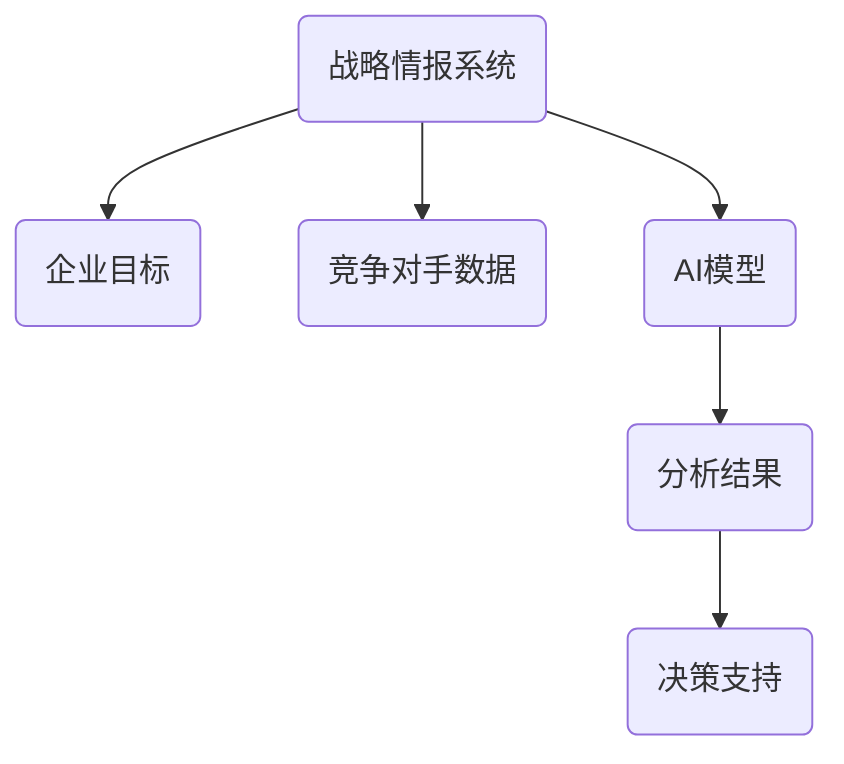
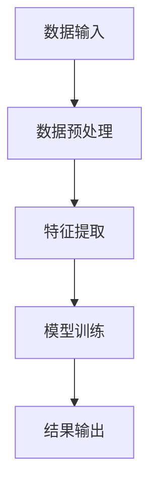
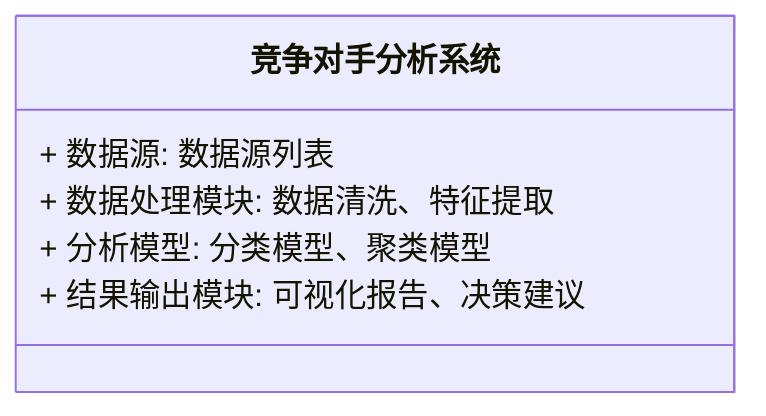
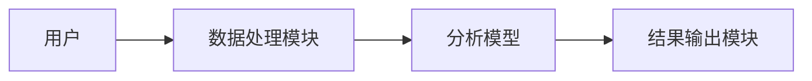
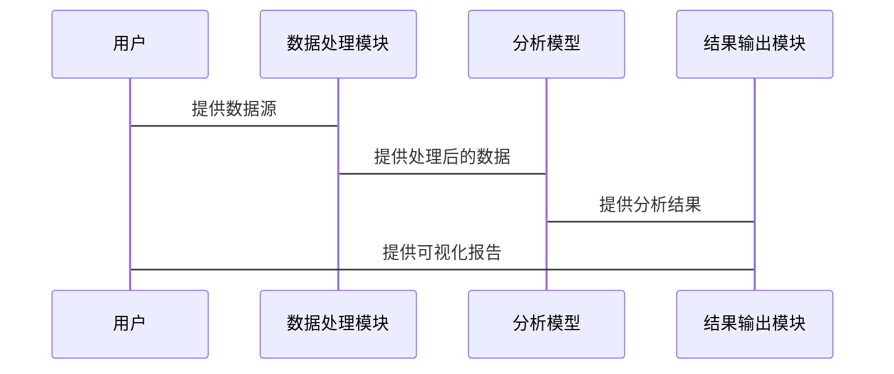

                 


# AI驱动的企业战略情报系统：竞争对手分析

> 关键词：AI技术，战略情报系统，竞争对手分析，企业决策，数据驱动

> 摘要：本文详细探讨了AI技术如何驱动企业战略情报系统，特别是竞争对手分析的实现。通过分析核心概念、算法原理、系统架构和实际案例，本文为企业提供了一套基于AI的竞争对手分析解决方案，帮助企业做出更明智的商业决策。

---

## 第一部分: 问题背景与概念背景

### 第1章: 问题背景与概念背景

#### 1.1 问题背景

##### 1.1.1 企业竞争分析的重要性
在全球化的商业环境中，企业间的竞争日益激烈。竞争对手分析是企业制定战略决策的重要依据。通过分析竞争对手的市场行为、产品特点、营销策略等，企业可以更好地把握市场动态，制定有效的竞争策略。

##### 1.1.2 传统竞争分析的局限性
传统的竞争对手分析方法依赖于人工收集和分析数据，效率低、成本高，且容易受到主观因素的影响。这种方法难以应对数据量大、变化速度快的现代商业环境。

##### 1.1.3 AI技术对企业竞争分析的推动作用
AI技术的引入为企业竞争分析带来了革命性的变化。通过机器学习算法，企业可以快速处理海量数据，提取有价值的信息，帮助决策者做出更精准、更及时的决策。

#### 1.2 问题描述

##### 1.2.1 战略情报系统的定义
战略情报系统是指通过收集、分析和利用情报信息，为企业制定和实施战略决策提供支持的系统。它涵盖了市场、竞争对手、客户等多个方面的信息。

##### 1.2.2 竞争对手分析的核心问题
竞争对手分析的核心问题是如何从海量数据中提取有价值的信息，识别竞争对手的市场行为模式，并预测其未来的战略动向。

##### 1.2.3 AI在战略情报系统中的应用场景
AI技术可以应用于数据收集、特征提取、模型训练等多个环节。例如，利用自然语言处理技术分析竞争对手的新闻报道，识别其潜在的战略动向；利用机器学习算法预测竞争对手的市场行为。

#### 1.3 问题解决

##### 1.3.1 AI如何赋能战略情报系统
AI技术通过自动化数据处理和分析，提高了战略情报系统的效率和准确性。例如，通过图像识别技术分析竞争对手的产品设计，通过情感分析技术了解客户对竞争对手产品的评价。

##### 1.3.2 数据驱动的决策优势
数据驱动的决策基于大量实际数据，具有更高的准确性和科学性。AI技术可以帮助企业从数据中发现潜在的规律和趋势，为企业制定战略决策提供有力支持。

##### 1.3.3 智能化竞争分析的实现路径
实现智能化竞争分析需要结合多种AI技术，如自然语言处理、机器学习、图像识别等，构建一个综合性的分析平台。

#### 1.4 边界与外延

##### 1.4.1 战略情报系统的边界
战略情报系统的边界包括数据的收集范围、分析的深度、系统的应用场景等。例如，系统可以专注于分析竞争对手的产品信息，而不涉及企业内部的战略讨论。

##### 1.4.2 AI技术的适用范围
AI技术适用于数据量大、变化速度快、需要快速决策的场景。例如，实时监测竞争对手的市场动态，及时调整企业的营销策略。

##### 1.4.3 竞争对手分析的伦理边界
在分析竞争对手时，需要遵守相关法律法规和商业道德。例如，不能通过非法手段获取竞争对手的敏感信息，不能利用分析结果进行不正当竞争。

#### 1.5 概念结构与核心要素

##### 1.5.1 战略情报系统的组成要素
战略情报系统主要包括数据源、数据处理模块、分析模型、结果输出模块等。数据源包括公开的市场报告、竞争对手的官方网站、社交媒体等。

##### 1.5.2 AI技术的核心组件
AI技术的核心组件包括数据预处理、特征提取、模型训练、结果解释等。例如，利用自然语言处理技术提取文本数据中的关键词，利用机器学习算法训练分类模型。

##### 1.5.3 竞争对手分析的流程模型
竞争对手分析的流程模型包括数据收集、数据清洗、特征提取、模型训练、结果分析等步骤。例如，收集竞争对手的产品评论，清洗数据，提取情感特征，训练情感分类模型，分析竞争对手的产品口碑。

---

## 第二部分: 核心概念与联系

### 第2章: 核心概念与联系

#### 2.1 核心概念原理

##### 2.1.1 战略情报系统的构建原理
战略情报系统的构建原理是基于数据驱动的方法，通过收集、处理和分析数据，生成有价值的洞察。例如，通过收集竞争对手的市场数据，分析其市场趋势，预测其未来动向。

##### 2.1.2 AI技术的核心算法原理
AI技术的核心算法包括监督学习、无监督学习、强化学习等。例如，利用监督学习算法训练分类模型，识别竞争对手的市场行为类型；利用无监督学习算法发现数据中的潜在模式。

##### 2.1.3 竞争对手分析的逻辑框架
竞争对手分析的逻辑框架包括数据收集、特征提取、模型训练、结果解释等步骤。例如，收集竞争对手的新闻报道，提取关键词，训练主题分类模型，识别竞争对手的战略重点。

#### 2.2 概念属性特征对比

##### 2.2.1 战略情报与传统情报的对比
| 属性 | 传统情报 | 战略情报 |
|------|----------|----------|
| 数据来源 | 公开报告、内部文件 | 公开数据、社交媒体、市场数据 |
| 分析方法 | 定性分析为主 | 定量分析为主 |
| 分析效率 | 低效 | 高效 |
| 分析深度 | 浅层分析 | 深度分析 |

##### 2.2.2 AI驱动与非AI驱动的竞争分析对比
| 属性 | 非AI驱动 | AI驱动 |
|------|----------|----------|
| 数据处理能力 | 有限 | 强大 |
| 分析速度 | 慢 | 快 |
| 分析精度 | 低 | 高 |
| 适用场景 | 简单分析 | 复杂分析 |

##### 2.2.3 不同AI模型的性能对比
| 模型 | 分类准确率 | 训练速度 | 解释性 |
|------|----------|----------|----------|
| 决策树 | 中等 | 快 | 高 |
| 支持向量机 | 高 | 中等 | 中等 |
| 神经网络 | 高 | 慢 | 低 |

#### 2.3 ER实体关系图



---

## 第三部分: 算法原理讲解

### 第3章: 算法原理讲解

#### 3.1 算法流程图



#### 3.2 Python源代码实现

```python
import numpy as np
from sklearn import datasets
from sklearn.tree import DecisionTreeClassifier

# 数据加载
X, y = datasets.load_iris(return_X_y=True)

# 模型训练
model = DecisionTreeClassifier()
model.fit(X, y)

# 预测
print(model.predict(X))
```

#### 3.3 数学模型与公式

##### 3.3.1 决策树模型
$$ Gini Impurity = \sum_{i=1}^{n} p_i (1 - p_i) $$

##### 3.3.2 随机森林模型
$$ \text{投票

---

## 第四部分: 系统分析与架构设计

### 第4章: 系统分析与架构设计

#### 4.1 问题场景介绍
在现代商业环境中，企业需要实时监控竞争对手的市场动态，及时调整自身的战略。传统的竞争对手分析方法效率低下，难以满足企业的需求。

#### 4.2 项目介绍
本项目旨在开发一个基于AI的竞争对手分析系统，帮助企业快速获取、分析和利用竞争对手信息，制定有效的竞争策略。

#### 4.3 系统功能设计

##### 4.3.1 领域模型（Mermaid类图）


#### 4.4 系统架构设计

##### 4.4.1 系统架构图（Mermaid架构图）


#### 4.5 系统接口设计

##### 4.5.1 系统交互图（Mermaid序列图）


---

## 第五部分: 项目实战

### 第5章: 项目实战

#### 5.1 环境安装

##### 5.1.1 安装Python
```bash
# 安装Python
sudo apt-get install python3
```

##### 5.1.2 安装依赖库
```bash
pip install numpy
pip install scikit-learn
pip install matplotlib
```

#### 5.2 核心代码实现

##### 5.2.1 数据预处理代码
```python
import pandas as pd
from sklearn.preprocessing import StandardScaler

# 加载数据
data = pd.read_csv('competitor_data.csv')

# 数据清洗
data = data.dropna()

# 特征提取
X = data[['feature1', 'feature2', 'feature3']]
```

##### 5.2.2 模型训练代码
```python
from sklearn.model_selection import train_test_split
from sklearn.ensemble import RandomForestClassifier

# 数据分割
X_train, X_test, y_train, y_test = train_test_split(X, y, test_size=0.2)

# 模型训练
model = RandomForestClassifier()
model.fit(X_train, y_train)

# 模型评估
print(model.score(X_test, y_test))
```

#### 5.3 案例分析

##### 5.3.1 案例背景
某企业希望分析竞争对手的市场行为，预测其未来的市场动向。

##### 5.3.2 数据来源
竞争对手的新闻报道、社交媒体数据、市场报告等。

##### 5.3.3 分析过程
1. 数据清洗与特征提取
2. 模型训练与评估
3. 结果分析与可视化

##### 5.3.4 分析结果
通过分析竞争对手的新闻数据，识别出竞争对手的市场重点是产品创新。因此，该企业需要在产品创新方面加大投入，以保持竞争优势。

#### 5.4 项目小结
本项目展示了如何利用AI技术进行竞争对手分析，帮助企业制定有效的竞争策略。通过实际案例的分析，验证了AI技术在战略情报系统中的有效性。

---

## 第六部分: 总结与展望

### 第6章: 总结与展望

#### 6.1 最佳实践 Tips

##### 6.1.1 数据质量的重要性
确保数据的准确性和完整性，是AI模型性能的关键。

##### 6.1.2 模型选择的策略
根据具体问题选择合适的模型，不要盲目追求高精度。

##### 6.1.3 结果解释的必要性
模型的解释性是企业决策的重要依据，需要注重结果的可解释性。

#### 6.2 小结
本文详细探讨了AI技术在企业战略情报系统中的应用，特别是竞争对手分析的实现。通过分析核心概念、算法原理、系统架构和实际案例，为企业提供了一套基于AI的竞争对手分析解决方案。

#### 6.3 注意事项

##### 6.3.1 数据隐私问题
在收集和分析竞争对手数据时，需要遵守相关法律法规，保护数据隐私。

##### 6.3.2 模型的局限性
AI模型的预测结果是基于历史数据的统计规律，不能保证100%准确，需要结合实际情况进行调整。

##### 6.3.3 持续优化
随着市场环境的变化，需要不断更新数据和模型，保持系统的有效性和准确性。

#### 6.4 拓展阅读
建议读者进一步阅读以下内容：
1. 《机器学习实战》
2. 《深度学习入门：基于Python》
3. 《自然语言处理入门》

---

## 作者

作者：AI天才研究院/AI Genius Institute & 禅与计算机程序设计艺术 /Zen And The Art of Computer Programming

---

**注意：以上内容为文章的完整目录和部分章节内容，实际撰写时需要根据具体需求进一步扩展和详细阐述每个部分的内容。**

