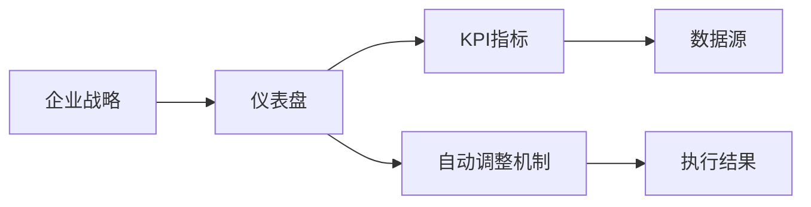
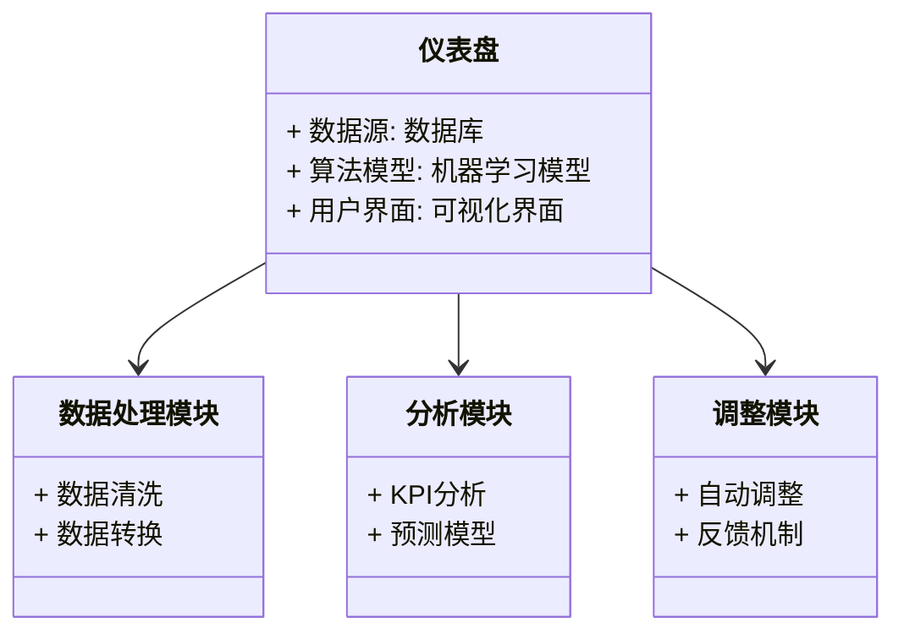

                 


# AI驱动的企业战略执行仪表盘：实时KPI追踪与自动调整

## 关键词：AI，企业战略，KPI，仪表盘，实时追踪，自动调整

## 摘要：本文详细探讨了AI驱动的企业战略执行仪表盘的设计与实现，重点分析了实时KPI追踪与自动调整的算法原理、系统架构及项目实战。通过深入的技术分析和案例解读，为读者提供了从理论到实践的全面指导。

---

# 第1章: AI驱动的企业战略执行仪表盘概述

## 1.1 问题背景与目标

### 1.1.1 传统企业战略执行的痛点
企业在战略执行过程中常常面临以下痛点：
- **数据滞后性**：传统KPI报告通常基于历史数据，无法实时反映当前情况。
- **人工干预过多**：从数据收集到分析报告生成，中间环节多，耗时长，效率低。
- **缺乏动态调整**：市场环境变化快，企业难以及时调整战略执行策略。

### 1.1.2 AI驱动的必要性
AI技术的应用可以显著提升企业战略执行的效率和效果：
- **实时数据处理**：通过AI实时分析数据，快速生成KPI报告。
- **自动化决策支持**：AI能够根据实时数据自动调整战略执行策略。
- **提高决策精度**：利用机器学习算法，预测潜在风险并优化资源配置。

### 1.1.3 仪表盘的核心目标
AI驱动的企业战略执行仪表盘的核心目标包括：
- 实现实时KPI数据的可视化展示。
- 提供动态调整战略执行的自动化工具。
- 通过数据驱动的方式优化企业运营效率。

## 1.2 核心概念与问题描述

### 1.2.1 仪表盘的基本概念
仪表盘（Dashboard）是一种信息展示工具，用于实时监控和分析关键业务指标。AI驱动的仪表盘通过集成机器学习算法，能够主动识别数据中的趋势和异常，并提供相应的决策建议。

### 1.2.2 KPI追踪的定义与分类
KPI（关键绩效指标）是衡量企业战略执行效果的重要指标。常见的KPI包括：
- **财务类KPI**：如收入、利润、成本等。
- **运营类KPI**：如生产效率、订单处理时间等。
- **客户类KPI**：如客户满意度、净推荐值等。

### 1.2.3 自动调整机制的实现方式
自动调整机制是仪表盘的核心功能之一，主要通过以下方式实现：
- **规则引擎**：基于预设的业务规则，自动触发调整行动。
- **机器学习模型**：通过预测模型生成调整建议。
- **反馈循环**：根据执行结果动态优化调整策略。

## 1.3 解决方案与边界

### 1.3.1 AI驱动仪表盘的解决方案
解决方案包括：
- **数据采集与处理**：实时采集企业运营数据，并进行清洗和预处理。
- **KPI分析与预测**：利用机器学习算法对KPI进行分析和预测。
- **自动化调整**：根据分析结果，自动触发调整行动，并实时更新仪表盘数据。

### 1.3.2 边界与外延
仪表盘的边界包括：
- **数据范围**：仅处理与战略执行相关的数据。
- **功能范围**：仅提供KPI追踪和调整建议，不涉及具体执行操作。
- **用户范围**：仅限于企业内部员工使用。

### 1.3.3 核心要素组成
核心要素包括：
- **数据源**：企业运营数据。
- **算法模型**：机器学习模型。
- **用户界面**：直观的可视化界面。

## 1.4 核心概念关系图

### 1.4.1 核心概念属性对比表
| 概念 | 定义 | 属性 |
|------|------|------|
| 仪表盘 | 数据可视化工具 | 实时更新、交互式 |
| KPI | 关键绩效指标 | 定量、可测量 |
| 自动调整 | 自动化决策支持 | 基于规则或模型 |

### 1.4.2 实体关系图（Mermaid）



---

# 第2章: AI驱动仪表盘的核心算法原理

## 2.1 算法原理概述

### 2.1.1 机器学习算法在KPI追踪中的应用
机器学习算法可以帮助企业识别KPI中的潜在问题，并提供优化建议。例如，使用线性回归模型预测销售趋势。

### 2.1.2 时间序列分析的核心原理
时间序列分析用于分析历史数据，预测未来趋势。常用的方法包括ARIMA和LSTM。

### 2.1.3 自动调整机制的算法框架
自动调整机制通常基于反馈循环，利用预测模型生成调整建议，并根据执行结果优化模型。

## 2.2 核心算法实现

### 2.2.1 线性回归模型（Mermaid流程图）


### 2.2.2 随机森林算法（代码实现）

```python
from sklearn.ensemble import RandomForestRegressor
import pandas as pd

# 数据加载
data = pd.read_csv('data.csv')

# 特征和目标变量分离
X = data[['feature1', 'feature2']]
y = data['target']

# 模型训练
model = RandomForestRegressor(n_estimators=100)
model.fit(X, y)

# 预测
predictions = model.predict(X)
```

### 2.2.3 时间序列分析（数学公式）

时间序列分析的数学公式如下：
$$
y_t = \alpha + \beta t + \gamma y_{t-1} + \epsilon_t
$$

---

# 第3章: 仪表盘系统分析与架构设计

## 3.1 系统功能设计

### 3.1.1 领域模型设计（Mermaid类图）



## 3.2 系统架构设计

### 3.2.1 分层架构设计（Mermaid架构图）


---

# 第4章: 项目实战与代码实现

## 4.1 环境搭建与安装

### 4.1.1 Python环境配置
建议使用Python 3.8及以上版本。

### 4.1.2 必要库的安装
```bash
pip install pandas numpy scikit-learn
```

### 4.1.3 数据库与API服务部署
使用MySQL数据库，并安装Flask框架搭建API服务。

## 4.2 核心代码实现

### 4.2.1 数据采集与处理

```python
import pandas as pd

# 数据加载
data = pd.read_csv('data.csv')

# 数据清洗
data.dropna(inplace=True)
data['date'] = pd.to_datetime(data['date'])
```

### 4.2.2 KPI追踪算法实现

```python
from sklearn.linear_model import LinearRegression

# 模型训练
model = LinearRegression()
model.fit(X_train, y_train)

# 预测
y_pred = model.predict(X_test)
```

### 4.2.3 自动调整机制实现

```python
def auto_adjust(current_kpi, target_kpi):
    if current_kpi < target_kpi:
        return 'Increase budget'
    elif current_kpi > target_kpi:
        return 'Decrease budget'
    else:
        return 'No adjustment needed'
```

---

# 第5章: 最佳实践与小结

## 5.1 小结
AI驱动的企业战略执行仪表盘通过实时KPI追踪和自动调整机制，显著提升了企业的运营效率和决策精度。

## 5.2 注意事项
- 确保数据质量和完整性。
- 定期更新和优化算法模型。
- 提供充分的用户培训和支持。

## 5.3 拓展阅读
推荐阅读《机器学习实战》和《数据可视化与仪表盘设计》等书籍。

---

# 作者：AI天才研究院 & 禅与计算机程序设计艺术

---

通过以上思考，我逐步构建了文章的目录结构，并详细阐述了每个部分的内容。希望这篇博客文章能够为读者提供有价值的技术指导和实践建议。

