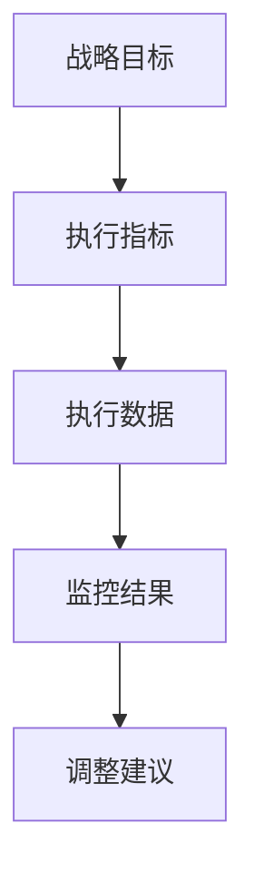
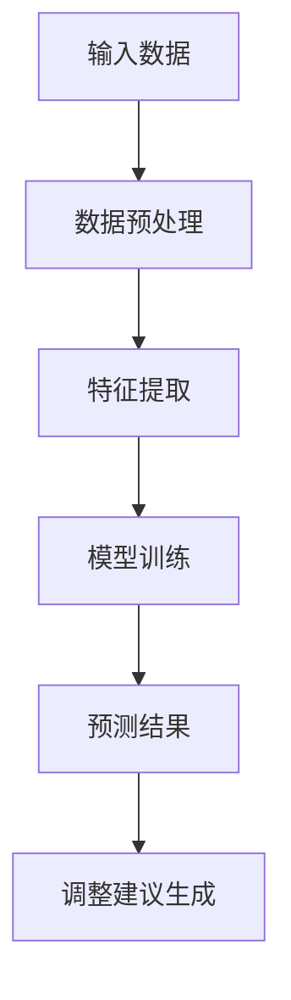
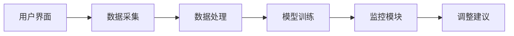
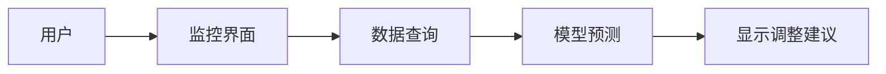

                 


# AI驱动的企业战略执行监控与调整系统

## 关键词：AI驱动，战略执行监控，系统架构，机器学习，实时反馈机制

## 摘要：本文探讨了AI技术在企业战略执行监控与调整系统中的应用，通过分析AI驱动的监控机制、算法原理、系统架构设计以及实际案例，详细阐述了如何利用AI技术提升企业战略执行效率和灵活性。文章从问题背景、核心概念、算法实现、系统设计到项目实战，全面解析了AI在战略执行监控中的潜力和实现路径。

---

## 第一部分：AI驱动的企业战略执行监控与调整系统背景介绍

### 第1章：问题背景与概念结构

#### 1.1 问题背景
企业战略执行是将企业战略目标转化为具体行动的过程，其成功与否直接影响企业的绩效和竞争力。然而，传统战略执行监控方法存在以下问题：
- **数据孤岛**：各部门数据分散，难以整合，导致监控不全面。
- **滞后性**：传统监控依赖定期报告，无法实时反馈，导致调整不够及时。
- **人工依赖**：依赖大量人工分析，效率低且易出错。

AI技术的引入为企业战略执行监控带来了新的可能性。通过机器学习、自然语言处理和大数据分析，AI能够实时处理海量数据，提供精准的监控和调整建议。

#### 1.2 问题描述
战略执行监控的核心目标是确保战略目标的实现，同时快速识别和解决问题。然而，传统方法在以下几个方面存在不足：
- **数据处理能力**：传统方法难以处理非结构化数据，导致信息利用率低。
- **预测能力**：缺乏对未来的预测能力，难以提前识别潜在风险。
- **灵活性**：面对复杂多变的市场环境，调整策略不够灵活。

#### 1.3 问题解决思路
AI驱动的战略执行监控系统通过以下方式解决问题：
- **实时数据分析**：利用AI技术实时处理结构化和非结构化数据，提供实时反馈。
- **智能预测与优化**：基于历史数据和机器学习模型，预测潜在问题并提出优化建议。
- **自动化调整**：系统能够根据反馈自动调整执行策略，提高灵活性和效率。

#### 1.4 边界与外延
- **边界**：系统专注于战略执行阶段的监控与调整，不涉及战略制定和战略分解。
- **外延**：系统可以与其他企业系统（如ERP、CRM）集成，提供更全面的支持。

#### 1.5 概念结构与核心要素
系统的核心组成模块包括：
- **数据采集模块**：负责收集企业内外部数据。
- **数据处理模块**：对数据进行清洗和预处理。
- **模型训练模块**：训练机器学习模型以预测和优化。
- **监控与调整模块**：实时监控执行情况并提出调整建议。
- **反馈模块**：将调整建议反馈给相关部门并跟踪效果。

---

### 第2章：核心概念与联系

#### 2.1 核心概念原理
- **AI驱动的战略执行监控**：通过机器学习算法分析企业数据，实时监控战略执行情况。
- **数据驱动的分析与决策**：利用大数据技术提取有价值的信息，辅助决策。
- **智能化调整机制**：基于AI的预测结果自动调整执行策略。

#### 2.2 核心概念属性对比
| 对比维度 | 传统方法 | AI驱动方法 |
|----------|----------|-------------|
| 数据处理 | 结构化数据为主 | 结构化+非结构化数据 |
| 监控频率 | 定期报告 | 实时监控 |
| 调整速度 | 建议人工调整 | 系统自动调整 |

#### 2.3 ER实体关系图


---

## 第二部分：AI驱动的战略执行监控系统算法原理

### 第3章：算法原理讲解

#### 3.1 算法原理概述
系统采用基于机器学习的预测模型，结合实时数据流处理技术，实现对战略执行情况的实时监控和预测。

#### 3.2 算法流程图


#### 3.3 数学模型与公式
- **损失函数**：用于评估模型预测与实际结果的差异。
  $$ L = \frac{1}{n}\sum_{i=1}^{n}(y_i - \hat{y}_i)^2 $$
- **优化算法**：常用随机梯度下降（SGD）。
  $$ \theta_{new} = \theta_{old} - \eta \cdot \frac{\partial L}{\partial \theta} $$
- **预测模型**：使用LSTM（长短期记忆网络）处理时间序列数据。

#### 3.4 代码实现
```python
import numpy as np
from sklearn.model_selection import train_test_split
from tensorflow.keras.models import Sequential
from tensorflow.keras.layers import LSTM, Dense

# 示例数据
X = np.random.random((1000, 64))
y = np.random.random((1000, 1))

# 模型构建
model = Sequential()
model.add(LSTM(64, input_shape=(64, 1)))
model.add(Dense(1, activation='sigmoid'))
model.compile(loss='binary_crossentropy', optimizer='adam', metrics=['accuracy'])

# 训练
model.fit(X, y, epochs=10, batch_size=32)
```

---

## 第三部分：系统分析与架构设计方案

### 第4章：系统功能设计

#### 4.1 系统功能模块
- **数据采集模块**：从企业系统中采集战略执行数据。
- **数据处理模块**：清洗、转换和集成数据。
- **模型训练模块**：训练机器学习模型。
- **监控模块**：实时监控战略执行情况。
- **调整模块**：根据预测结果生成调整建议。

#### 4.2 系统架构设计


#### 4.3 接口设计
- **API接口**：提供RESTful API供其他系统调用。
- **数据接口**：与企业数据库对接，获取战略执行数据。

#### 4.4 交互设计


---

## 第四部分：项目实战

### 第5章：项目实战

#### 5.1 环境安装
- **Python**：安装Python 3.8及以上版本。
- **深度学习框架**：安装TensorFlow或Keras。
- **数据处理工具**：安装Pandas、NumPy。

#### 5.2 核心代码实现
```python
import pandas as pd
import numpy as np
from sklearn.preprocessing import StandardScaler
from tensorflow.keras.models import Sequential
from tensorflow.keras.layers import LSTM, Dense

# 示例数据加载
data = pd.read_csv('strategic_data.csv')
X = data.drop('target', axis=1).values
y = data['target'].values

# 数据预处理
scaler = StandardScaler()
X_scaled = scaler.fit_transform(X)

# 模型构建
model = Sequential()
model.add(LSTM(64, input_shape=(X.shape[1], 1)))
model.add(Dense(1, activation='sigmoid'))
model.compile(loss='binary_crossentropy', optimizer='adam', metrics=['accuracy'])

# 训练
model.fit(X_scaled, y, epochs=10, batch_size=32)
```

#### 5.3 案例分析
假设某企业战略目标为提高销售额。系统通过实时监控销售数据，预测未来一周的销售额趋势，并根据预测结果调整营销策略。

---

## 第五部分：总结与展望

### 第6章：总结与展望

#### 6.1 关键点回顾
- AI技术在战略执行监控中的应用潜力巨大。
- 机器学习模型能够提高监控的准确性和实时性。
- 系统架构设计需要考虑数据处理、模型训练和实时反馈。

#### 6.2 最佳实践
- 数据质量是系统性能的关键，需确保数据的完整性和准确性。
- 系统应具备良好的扩展性，能够适应企业发展的需求。

#### 6.3 未来展望
- 结合区块链技术，提高数据安全性和透明性。
- 引入强化学习，进一步优化战略执行调整策略。

---

## 作者：AI天才研究院 & 禅与计算机程序设计艺术

---

以上是《AI驱动的企业战略执行监控与调整系统》的技术博客文章大纲，涵盖了从背景介绍到项目实战的完整内容。通过详细分析每个部分，确保文章结构清晰、内容丰富，为读者提供全面的技术见解。

