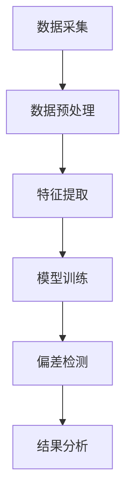
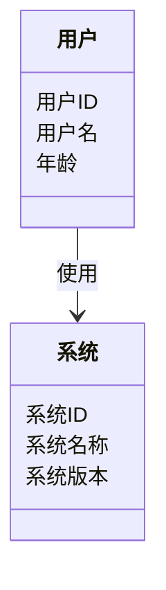
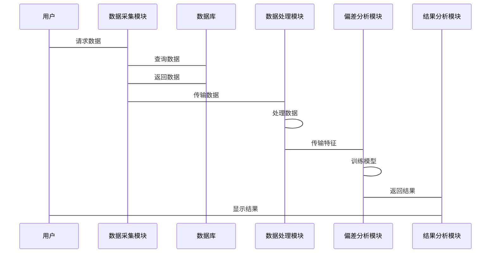

                 


# AI驱动的企业战略执行监控：KPI智能跟踪与偏差分析

## 关键词：AI驱动、KPI智能跟踪、偏差分析、企业战略、机器学习

## 摘要：本文深入探讨了如何利用人工智能技术驱动企业战略执行监控，通过智能KPI跟踪与偏差分析，帮助企业实现战略目标的高效达成。文章从问题背景、核心概念、算法原理、系统架构设计到项目实战，全面解析了AI在企业战略执行监控中的应用，并提供了具体的实现方法和案例分析。

---

# 第1章: 问题背景与核心概念

## 1.1 问题背景

### 1.1.1 企业战略执行的挑战

在企业运营中，战略执行是实现企业目标的核心环节。然而，企业在实际执行过程中常常面临以下挑战：

- **数据量大**：企业需要监控的KPI指标繁多，数据来源多样，难以高效整合和分析。
- **动态变化**：市场环境、客户需求和内部资源的变化要求KPI监控具有动态调整能力。
- **人工分析效率低**：传统KPI监控依赖人工分析，耗时且容易出错，难以实时响应问题。

### 1.1.2 KPI监控的传统方法与局限性

传统的KPI监控方法主要依赖人工设定指标和定期报告。这种方式存在以下局限性：

- **滞后性**：数据采集和分析耗时较长，无法实现实时监控。
- **主观性**：人工分析依赖个体经验，容易受到主观因素影响。
- **复杂性**：面对复杂的业务场景，人工分析难以覆盖所有关键指标。

### 1.1.3 AI技术在企业战略执行中的潜力

人工智能技术的快速发展为企业战略执行监控提供了新的解决方案。AI可以通过以下方式提升KPI监控的效率和准确性：

- **自动化数据处理**：AI能够快速处理大量数据，提取关键特征。
- **实时分析**：AI算法可以实时监控KPI指标，快速发现偏差。
- **智能预测与优化**：AI可以通过机器学习模型预测未来的KPI趋势，并提出优化建议。

## 1.2 核心概念与定义

### 1.2.1 KPI的定义与分类

KPI（Key Performance Indicators）是衡量企业战略执行效果的重要指标。常见的KPI分类包括：

- **财务类KPI**：如收入增长率、利润率等。
- **客户类KPI**：如客户满意度、客户留存率等。
- **运营类KPI**：如生产效率、订单处理时间等。
- **创新类KPI**：如新产品开发周期、研发投入占比等。

### 1.2.2 偏差分析的定义与意义

偏差分析是指对企业实际表现与预期目标之间的差异进行分析的过程。其意义在于：

- **发现问题根源**：通过偏差分析，企业可以快速定位问题所在。
- **优化决策**：偏差分析为管理层提供数据支持，帮助制定有效的调整策略。
- **提升效率**：通过自动化偏差分析，企业可以显著提高监控效率。

### 1.2.3 AI驱动的KPI监控的核心要素

AI驱动的KPI监控系统需要以下核心要素：

- **数据源**：包括财务数据、客户数据、运营数据等多源数据。
- **AI算法**：如机器学习模型、自然语言处理等。
- **实时监控**：实现KPI的实时跟踪和预警。
- **智能分析**：基于历史数据和当前数据，预测未来趋势并提出优化建议。

## 1.3 问题解决与边界

### 1.3.1 AI驱动KPI监控的目标与范围

AI驱动的KPI监控系统的目标是通过自动化和智能化的方式，实现对关键指标的实时跟踪、偏差检测和优化建议。其范围包括：

- 数据采集与处理。
- KPI指标的动态调整。
- 偏差检测与分析。
- 优化建议生成。

### 1.3.2 与传统KPI监控的对比

AI驱动的KPI监控与传统方法相比，具有以下优势：

| 对比维度       | 传统KPI监控                 | AI驱动的KPI监控             |
|----------------|----------------------------|-----------------------------|
| 数据处理       | 人工处理，效率低             | 自动化处理，效率高           |
| 分析方法       | 基于经验的分析               | 基于机器学习的智能分析       |
| 监控频率       | 定期报告，滞后性较大         | 实时监控，快速响应           |
| 可扩展性       | 有限，难以应对复杂场景       | 强大的扩展性，适应复杂场景   |

### 1.3.3 系统边界与外延

AI驱动的KPI监控系统需要与企业的其他系统进行集成，例如：

- **ERP系统**：用于数据采集和集成。
- **CRM系统**：用于客户数据的分析。
- **BI工具**：用于数据可视化和报告生成。

---

# 第2章: 核心概念与联系

## 2.1 KPI智能跟踪的原理

### 2.1.1 数据采集与处理

KPI智能跟踪的第一步是数据采集与处理。数据来源可能包括：

- **数据库**：如MySQL、MongoDB等。
- **API接口**：如ERP系统的API。
- **日志文件**：如应用程序日志。

数据预处理步骤包括：

- 数据清洗：去除无效数据。
- 数据转换：将数据转换为统一格式。
- 数据增强：对数据进行补充和扩展。

### 2.1.2 KPI指标的动态调整

KPI指标需要根据企业战略目标的变化进行动态调整。例如，当企业战略从“成本控制”转向“客户增长”时，KPI指标也需要相应调整。这种动态调整可以通过AI算法实现，例如使用机器学习模型预测未来的KPI变化趋势。

### 2.1.3 基于AI的预测与分析

基于AI的预测与分析是KPI智能跟踪的核心部分。常用的算法包括：

- **线性回归**：用于预测连续型KPI。
- **决策树**：用于分类型KPI。
- **随机森林**：用于特征重要性分析。

## 2.2 偏差分析的核心要素

### 2.2.1 数据特征提取

数据特征提取是偏差分析的基础。常见的特征包括：

- 时间特征：如时间戳、日期等。
- 数值特征：如销售额、利润等。
- 类别特征：如地区、部门等。

### 2.2.2 偏差检测算法

常用的偏差检测算法包括：

- **孤立森林**：用于无监督的异常检测。
- **K最近邻（KNN）**：用于监督的偏差检测。
- **自组织映射（SOM）**：用于可视化数据分布。

### 2.2.3 偏差原因分析与优化建议

偏差原因分析需要结合业务背景和数据特征。例如，销售额下降的可能原因包括市场需求下降、产品问题等。优化建议需要基于偏差原因，提出切实可行的解决方案。

## 2.3 核心概念的ER实体关系图

```mermaid
erDiagram
    actor 用户 {
        string 用户ID
        string 用户名
        integer 年龄
    }
    actor 系统 {
        string 系统ID
        string 系统名称
        integer 系统版本
    }
    user ~{ 系统 }<--> 1 : "使用"
```

---

# 第3章: 算法原理与数学模型

## 3.1 偏差分析算法

### 3.1.1 算法流程



### 3.1.2 机器学习模型

#### 3.1.2.1 线性回归

线性回归是一种常用的回归算法，适用于连续型KPI的预测。其数学模型如下：

$$ y = \beta_0 + \beta_1 x + \epsilon $$

其中，$y$是目标变量，$x$是自变量，$\beta_0$是截距，$\beta_1$是回归系数，$\epsilon$是误差项。

#### 3.1.2.2 决策树

决策树是一种常用的分类算法，适用于分类型KPI的预测。其数学模型如下：

$$ f(x) = \text{sign}(\sum_{i=1}^{n} \alpha_i h_i(x)) $$

其中，$h_i(x)$是弱分类器，$\alpha_i$是其权重。

---

## 3.2 系统分析与架构设计

### 3.2.1 问题场景介绍

假设某企业需要监控其销售额、利润和客户满意度三个KPI指标。企业希望通过AI驱动的KPI监控系统，实现对这三个指标的实时跟踪和偏差分析。

### 3.2.2 系统功能设计

#### 3.2.2.1 领域模型类图



#### 3.2.2.2 系统架构图

```mermaid
container 系统架构 {
    component 数据采集模块 {
        数据库
        API接口
    }
    component 数据处理模块 {
        数据清洗
        数据转换
    }
    component 偏差分析模块 {
        特征提取
        模型训练
    }
    component 结果分析模块 {
        偏差检测
        优化建议
    }
}
```

#### 3.2.2.3 系统交互序列图



### 3.2.3 接口设计

系统接口设计需要考虑以下几点：

- **数据采集接口**：提供API接口，用于从数据库或API获取数据。
- **数据处理接口**：提供数据清洗和转换的接口。
- **偏差分析接口**：提供特征提取和模型训练的接口。
- **结果分析接口**：提供偏差检测和优化建议的接口。

---

## 3.3 项目实战

### 3.3.1 环境安装

安装所需的依赖库：

```bash
pip install numpy pandas scikit-learn matplotlib
```

### 3.3.2 核心代码实现

```python
import pandas as pd
from sklearn.ensemble import IsolationForest
import numpy as np

# 示例数据
data = pd.DataFrame({
    '销售额': [100, 200, 300, 400, 500],
    '利润': [10, 20, 30, 40, 50],
    '客户满意度': [90, 80, 70, 60, 50]
})

# 偏差检测
model = IsolationForest(n_estimators=100, random_state=42)
model.fit(data)
outliers = model.predict(data)
outliers = np.where(outliers == -1, '异常', '正常')
print(outliers)
```

### 3.3.3 代码解读与分析

上述代码实现了基于孤立森林算法的偏差检测。具体步骤如下：

1. **数据加载**：使用Pandas加载数据。
2. **模型训练**：使用孤立森林算法训练模型。
3. **偏差检测**：使用训练好的模型预测数据的异常性。

### 3.3.4 案例分析

假设企业的销售额突然下降，AI驱动的KPI监控系统会自动触发偏差检测，并分析可能的原因，例如市场需求下降或产品问题。系统会提出优化建议，例如增加市场推广或调整产品策略。

### 3.3.5 项目小结

通过项目实战，我们可以看到AI驱动的KPI监控系统在实际应用中的巨大潜力。它不仅能够提高监控效率，还能够为企业提供数据支持的优化建议。

---

## 3.4 最佳实践

### 3.4.1 小结

AI驱动的KPI监控系统能够显著提升企业的战略执行效率。通过自动化数据处理和智能分析，企业可以实时监控KPI指标，快速发现偏差并提出优化建议。

### 3.4.2 注意事项

- **数据质量**：数据的准确性和完整性对偏差分析结果有直接影响。
- **模型选择**：需要根据具体业务场景选择合适的AI算法。
- **系统维护**：需要定期更新模型和优化系统性能。

### 3.4.3 拓展阅读

- 《机器学习实战》：深入理解机器学习算法。
- 《数据分析的Python方法》：掌握数据处理和分析技巧。
- 《企业战略管理》：了解企业战略执行的理论与实践。

---

## 作者：AI天才研究院/AI Genius Institute & 禅与计算机程序设计艺术/Zen And The Art of Computer Programming

