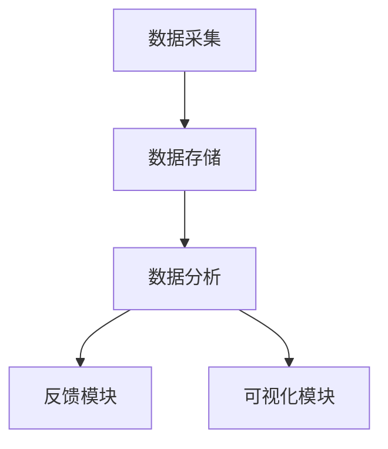

                 


# AI驱动的企业战略执行监控：KPI追踪与调整

## 关键词：AI, KPI监控, 战略执行, 机器学习, 自然语言处理, 企业绩效

## 摘要：  
本文探讨了如何利用人工智能技术优化企业战略执行监控中的KPI追踪与调整。通过分析KPI的核心概念、AI技术的应用、系统架构设计以及实际案例，展示了AI如何提升企业绩效管理的效率和精准度。文章深入探讨了机器学习和NLP在KPI分析中的应用，详细讲解了系统设计和实现过程，并提供了丰富的实战案例和最佳实践建议。

---

# 引言

## 1.1 企业战略执行监控的背景

企业战略执行监控是确保企业战略目标实现的关键环节。通过KPI（关键绩效指标）监控，企业能够实时追踪战略执行的进度，发现偏差并及时调整。然而，传统KPI监控方法依赖人工分析，效率低下且容易受主观因素影响。AI技术的引入，为企业提供了更高效、精准的监控手段。

### 1.1.1 KPI监控的定义与重要性  
KPI（Key Performance Indicators）是衡量企业战略执行效果的核心指标。通过KPI监控，企业能够量化目标的实现程度，发现潜在问题，并及时采取调整措施。

### 1.1.2 AI驱动监控的优势  
AI技术能够实时处理海量数据，自动识别KPI趋势和异常，提供数据驱动的决策支持，显著提升监控效率和准确性。

## 1.2 AI在企业战略执行监控中的作用  
AI技术通过机器学习、自然语言处理等方法，帮助企业从复杂数据中提取关键信息，优化KPI分析和预测。

---

# 第二部分：KPI的基础知识

## 第2章：KPI的定义与选择

### 2.1 KPI的基本概念  
KPI是用来衡量企业绩效的关键指标，反映了企业战略执行的效果。

#### 2.1.1 KPI的分类  
- **财务类KPI**：如净利润率、投资回报率等，衡量企业的财务表现。  
- **客户类KPI**：如客户满意度、客户保留率等，衡量客户关系管理效果。  
- **运营类KPI**：如生产效率、订单处理时间等，衡量企业运营效率。  

#### 2.1.2 KPI与企业目标的关系  
KPI是企业目标的具体化，确保战略执行与企业整体目标一致。

### 2.2 KPI的选择与设计  

#### 2.2.1 KPI选择的原则  
- **相关性**：KPI应与企业战略目标直接相关。  
- **可测量性**：KPI应可量化，便于跟踪和评估。  
- **可实现性**：KPI应具有挑战性，但可通过努力实现。  
- **时间性**：KPI应有明确的时间范围。  

#### 2.2.2 KPI设计的步骤  
1. 明确企业战略目标。  
2. 确定关键业务流程。  
3. 选择与业务流程相关的指标。  
4. 设定指标的量化标准和时间范围。  

---

# 第三部分：AI技术在KPI监控中的应用

## 第3章：机器学习与KPI预测  

### 3.1 机器学习简介  
机器学习是一种人工智能技术，通过数据训练模型，实现预测和分类。

#### 3.1.1 机器学习的核心概念  
- **数据**：输入数据是训练模型的基础。  
- **模型**：通过算法学习数据的特征，生成预测结果。  
- **训练**：通过大量数据优化模型参数。  

#### 3.1.2 常见的机器学习算法  
- **线性回归**：用于预测连续型变量。  
- **决策树**：用于分类和回归问题。  
- **随机森林**：基于决策树的集成学习方法。  

### 3.2 KPI预测的机器学习模型  

#### 3.2.1 线性回归模型  
线性回归适用于KPI的线性预测。例如，预测销售额与广告投入的线性关系。

$$ \text{销售额} = \beta_0 + \beta_1 \times \text{广告投入} $$  

#### 3.2.2 随机森林模型  
随机森林通过集成多个决策树，提高预测的准确性和鲁棒性。

---

## 第4章：自然语言处理与KPI分析  

### 4.1 自然语言处理简介  
NLP是一种处理人类语言的技术，能够从文本中提取有用信息。

#### 4.1.1 NLP的核心任务  
- **文本分类**：将文本归类到特定类别。  
- **信息抽取**：从文本中提取实体信息。  
- **情感分析**：分析文本的情感倾向。  

### 4.2 基于NLP的KPI监控  

#### 4.2.1 文本数据的预处理  
- **分词**：将文本分割成单词或短语。  
- **去除停用词**：移除无意义的词汇（如“的”、“了”）。  
- **词干提取**：将词汇还原为基本形式。  

#### 4.2.2 情感分析在KPI监控中的应用  
通过分析客户反馈文本的情感，帮助企业识别客户满意度问题。

---

# 第四部分：系统架构与设计

## 第5章：AI驱动的KPI监控系统架构  

### 5.1 系统功能设计  
系统包括数据采集、存储、分析、反馈和可视化五个模块。

#### 5.1.1 数据采集模块  
通过API接口从企业系统中获取实时数据。  

#### 5.1.2 数据存储模块  
使用数据库存储结构化数据，使用文本存储非结构化数据。  

#### 5.1.3 数据分析模块  
利用机器学习和NLP技术进行数据处理和分析。  

#### 5.1.4 反馈模块  
将分析结果反馈给业务部门，指导战略调整。  

#### 5.1.5 可视化模块  
通过图表展示KPI趋势和分析结果。  

### 5.2 系统架构设计  

#### 5.2.1 系统架构图  


### 5.3 接口设计  
系统通过RESTful API提供数据接口，方便与其他系统集成。

---

## 第6章：系统实现与实战案例  

### 6.1 环境安装  
- **Python**：安装Python 3.8及以上版本。  
- **机器学习库**：安装Scikit-learn、XGBoost等。  
- **NLP库**：安装NLTK、spaCy等。  

### 6.2 核心代码实现  

#### 6.2.1 线性回归模型实现  
```python
from sklearn.linear_model import LinearRegression
import numpy as np

# 数据准备
X = np.array([[1], [2], [3], [4]])
y = np.array([2, 4, 6, 8])

# 模型训练
model = LinearRegression()
model.fit(X, y)

# 预测
print(model.predict([[5]]))  # 输出：[[10]]
```

---

# 结语

## 7.1 未来趋势与挑战  
- **趋势**：AI技术将更加智能化，KPI监控将更加自动化。  
- **挑战**：数据隐私、模型解释性等问题需要进一步解决。  

## 7.2 最佳实践  
- 定期更新模型，确保其适应业务变化。  
- 结合业务知识，优化KPI设计。  
- 建立数据安全机制，保护企业数据。  

## 7.3 小结  
通过AI技术，企业能够更高效地监控和调整KPI，提升战略执行效果。

---

# 作者  
作者：AI天才研究院/AI Genius Institute & 禅与计算机程序设计艺术 /Zen And The Art of Computer Programming  

---

通过以上大纲，我们可以看到，从KPI的基础知识到AI技术的应用，再到系统的实现和实战案例，内容全面且深入。接下来，我将根据这个大纲撰写完整的文章内容。

