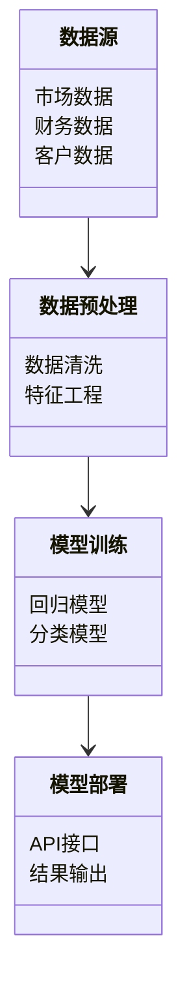
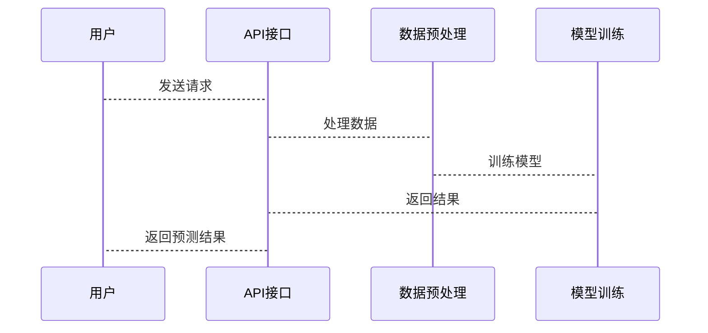

                 


# AI驱动的企业战略规划：大数据分析与预测性建模

> 关键词：企业战略规划，人工智能，大数据分析，预测性建模，机器学习，战略决策

> 摘要：随着人工智能和大数据技术的快速发展，企业战略规划的传统模式正面临巨大挑战。本文将详细探讨如何利用AI技术，通过大数据分析和预测性建模，帮助企业制定更加科学、动态和前瞻性的战略规划。文章从AI驱动的企业战略规划的背景出发，深入分析大数据分析与预测性建模的核心概念与技术，结合实际案例，详细讲解预测算法的实现与优化，系统阐述AI驱动战略规划的系统架构与项目实战，并总结最佳实践与未来发展方向。

---

# 第一部分: AI驱动的企业战略规划概述

## 第1章: AI驱动的企业战略规划背景与概念

### 1.1 企业战略规划的传统模式

#### 1.1.1 传统企业战略规划的定义与特点
企业战略规划是企业在复杂多变的市场环境中，为了实现长期发展目标而制定的一系列目标、策略和行动计划。传统战略规划通常依赖于管理者的经验、市场调研和定性分析，具有以下特点：
- **长期性**：关注未来3-5年的目标和策略。
- **综合性**：涉及企业各个部门和资源的协调。
- **静态性**：规划一旦制定，难以快速调整。

#### 1.1.2 传统战略规划的局限性
尽管传统战略规划在企业发展中发挥了重要作用，但其局限性日益显现：
- **缺乏数据支持**：依赖主观判断，难以量化分析。
- **灵活性不足**：面对市场变化，调整成本高，响应慢。
- **洞察深度有限**：难以从海量数据中提取有价值的信息。

#### 1.1.3 企业战略规划的重要性与价值
战略规划是企业生存和发展的核心，直接影响企业的市场地位和竞争优势。有效的战略规划能够帮助企业：
- **明确目标**：聚焦资源，提升效率。
- **应对变化**：快速适应市场和技术变革。
- **优化决策**：基于数据和模型，做出更科学的决策。

### 1.2 AI驱动的企业战略规划的兴起

#### 1.2.1 AI技术对企业管理的影响
人工智能（AI）技术的快速发展为企业管理带来了革命性的变化。AI能够处理海量数据，提取隐藏的模式和洞察，为战略规划提供强大的技术支持。

#### 1.2.2 大数据分析在企业决策中的作用
大数据分析能够从结构化和非结构化数据中提取有价值的信息，帮助企业在复杂环境中做出更明智的决策。

#### 1.2.3 预测性建模在战略规划中的应用
预测性建模通过历史数据和机器学习算法，预测未来的市场趋势、客户行为和潜在风险，为战略规划提供动态和前瞻性的支持。

### 1.3 本书的核心目标与结构

#### 1.3.1 本书的核心目标
本书旨在帮助企业理解和应用AI技术，通过大数据分析和预测性建模，制定更具前瞻性和灵活性的战略规划。

#### 1.3.2 本书的主要内容框架
- **第一部分**：AI驱动的企业战略规划概述。
- **第二部分**：大数据分析与预测性建模基础。
- **第三部分**：AI驱动的战略规划模型构建。
- **第四部分**：系统分析与架构设计。
- **第五部分**：项目实战与最佳实践。

#### 1.3.3 本书的读者对象与学习方法
本书适合企业管理人员、数据科学家、IT架构师以及对AI技术感兴趣的读者。建议读者结合实际案例，逐步学习理论与实践。

### 1.4 本章小结
本章介绍了AI驱动的企业战略规划的背景、核心概念和技术基础，为后续内容的学习奠定了基础。

---

# 第二部分: 大数据分析与预测性建模基础

## 第2章: 大数据分析的核心概念与技术

### 2.1 数据分析的基本概念

#### 2.1.1 数据分析的定义与分类
数据分析是通过对数据的处理、分析和可视化，提取有价值的信息的过程。根据分析目标，可分为描述性分析、诊断性分析、预测性分析和规范性分析。

#### 2.1.2 数据分析的关键技术与工具
常用工具包括Python（pandas、NumPy）、R、SQL、Tableau等。

#### 2.1.3 数据分析的流程与方法
数据分析的典型流程包括数据清洗、数据探索、建模分析和结果可视化。

### 2.2 大数据的特征与挑战

#### 2.2.1 大数据的4V特征
- **Volume（数据量）**：数据规模巨大。
- **Velocity（速度）**：数据生成和处理速度快。
- **Variety（多样性）**：数据类型多样。
- **Value（价值密度）**：数据价值密度低。

#### 2.2.2 大数据分析的挑战与解决方案
- **数据质量**：如何处理缺失值和噪声数据。
- **计算效率**：如何优化数据处理和计算性能。
- **隐私保护**：如何在数据分析中保护用户隐私。

### 2.3 预测性建模的基本原理

#### 2.3.1 预测性建模的定义与目标
预测性建模是利用历史数据，建立数学模型，预测未来事件的发生概率或结果。

#### 2.3.2 预测模型的分类与选择
- **回归模型**：用于预测连续型变量。
- **分类模型**：用于预测离散型变量。
- **聚类模型**：用于发现数据中的自然分组。

#### 2.3.3 预测模型的评估与优化
常用评估指标包括准确率、召回率、F1分数等。优化方法包括交叉验证、超参数调优等。

### 2.4 本章小结
本章介绍了数据分析的基本概念、大数据的特征与挑战，以及预测性建模的基本原理。

---

## 2.5 数据预处理与特征工程

### 2.5.1 数据清洗与预处理

#### 2.5.1.1 数据清洗的必要性与方法
数据清洗是确保数据质量的重要步骤，包括处理缺失值、重复值和异常值。

#### 2.5.1.2 数据标准化与归一化处理
数据标准化（z-score）和归一化（min-max）是常用的数据预处理方法。

#### 2.5.1.3 数据缺失值的处理策略
常用的缺失值处理方法包括删除、均值填充和模型预测填充。

### 2.5.2 特征选择与特征工程

#### 2.5.2.1 特征选择的基本方法
特征选择是通过统计方法或模型评估，选择对目标变量影响较大的特征。

#### 2.5.2.2 特征工程的核心步骤
特征工程包括特征组合、特征变换和特征衍生等步骤。

#### 2.5.2.3 特征重要性分析与评估
通过特征重要性分析，可以评估每个特征对模型的贡献程度。

### 2.5.3 数据可视化与探索性分析

#### 2.5.3.1 数据可视化的工具与方法
常用工具包括Matplotlib、Seaborn和Tableau等。

#### 2.5.3.2 探索性数据分析的流程与目标
探索性数据分析旨在发现数据中的潜在模式和异常值。

#### 2.5.3.3 数据分布与关联性分析
通过直方图、散点图等可视化工具，分析数据的分布和关联性。

### 2.6 本章小结
本章详细讲解了数据预处理和特征工程的核心步骤，为后续的预测性建模奠定了基础。

---

## 第3章: 常见预测算法与模型选择

### 3.1 监督学习算法

#### 3.1.1 线性回归与逻辑回归
- **线性回归**：用于预测连续型变量，公式为：$$y = \beta_0 + \beta_1x_1 + \beta_2x_2 + \dots + \beta_nx_n$$
- **逻辑回归**：用于预测二分类问题，公式为：$$P(y=1|x) = \frac{e^{\beta_0 + \beta_1x_1 + \dots + \beta_nx_n}}{1 + e^{\beta_0 + \beta_1x_1 + \dots + \beta_nx_n}}$$

#### 3.1.2 支持向量机（SVM）
SVM通过构建超平面，将数据点分为不同类别，适用于分类和回归问题。

#### 3.1.3 决策树与随机森林
决策树是一种基于树状结构的分类和回归方法，随机森林通过集成多个决策树提高模型的泛化能力。

### 3.2 无监督学习算法

#### 3.2.1 K-means聚类
K-means算法通过最小化簇内平方误差，将数据点划分为K个簇。

#### 3.2.2 层次聚类
层次聚类通过构建树状结构，逐步合并或分割数据点，形成不同的簇。

#### 3.2.3 管理聚类分析
管理聚类分析是一种基于密度的聚类算法，适用于发现高密度数据区域。

### 3.3 模型选择与调优

#### 3.3.1 模型选择的准则与方法
模型选择需要考虑准确率、召回率、F1分数等指标。

#### 3.3.2 超参数调优的策略与工具
常用的调优工具包括GridSearchCV和RandomizedSearchCV。

#### 3.3.3 模型评估与验证
通过交叉验证和留出法，评估模型的泛化能力。

### 3.4 本章小结
本章介绍了几种常用的预测算法，并讨论了模型选择与调优的策略。

---

# 第三部分: AI驱动的战略规划模型构建

## 第4章: 系统分析与架构设计

### 4.1 问题场景介绍
企业战略规划系统需要整合多个数据源，包括市场数据、财务数据和客户数据等。

### 4.2 系统功能设计

#### 4.2.1 领域模型（mermaid类图）


### 4.3 系统架构设计（mermaid架构图）


### 4.4 系统交互设计（mermaid序列图）



### 4.5 本章小结
本章通过系统架构和交互设计，展示了AI驱动的战略规划系统的整体结构和工作流程。

---

## 第5章: 项目实战与最佳实践

### 5.1 项目环境安装

```python
# 安装依赖库
pip install numpy pandas scikit-learn matplotlib
```

### 5.2 核心实现源代码

#### 5.2.1 数据加载与预处理

```python
import pandas as pd
from sklearn.model_selection import train_test_split
from sklearn.preprocessing import StandardScaler

# 加载数据
data = pd.read_csv('data.csv')

# 数据清洗
data = data.dropna()
data = data.drop_duplicates()

# 特征选择
features = data.drop('target', axis=1)
target = data['target']

# 特征工程
scaler = StandardScaler()
features_scaled = scaler.fit_transform(features)

# 数据分割
X_train, X_test, y_train, y_test = train_test_split(features_scaled, target, test_size=0.2)
```

#### 5.2.2 模型训练与部署

```python
from sklearn.linear_model import LinearRegression
from sklearn.metrics import mean_squared_error

# 训练模型
model = LinearRegression()
model.fit(X_train, y_train)

# 模型预测
y_pred = model.predict(X_test)

# 模型评估
mse = mean_squared_error(y_test, y_pred)
print(f'Mean Squared Error: {mse}')
```

### 5.3 项目小结
本章通过一个实际案例，展示了从数据预处理到模型部署的完整流程。

---

## 第6章: 最佳实践与未来展望

### 6.1 最佳实践 tips
- **数据质量**：确保数据的完整性和准确性。
- **模型选择**：根据业务需求选择合适的算法。
- **持续优化**：定期更新模型，适应市场变化。

### 6.2 未来展望
随着AI技术的不断发展，企业战略规划将更加依赖于实时数据分析和自适应模型。未来的研究方向包括强化学习、可解释性AI和边缘计算等。

---

## 作者：AI天才研究院/AI Genius Institute & 禅与计算机程序设计艺术 /Zen And The Art of Computer Programming

