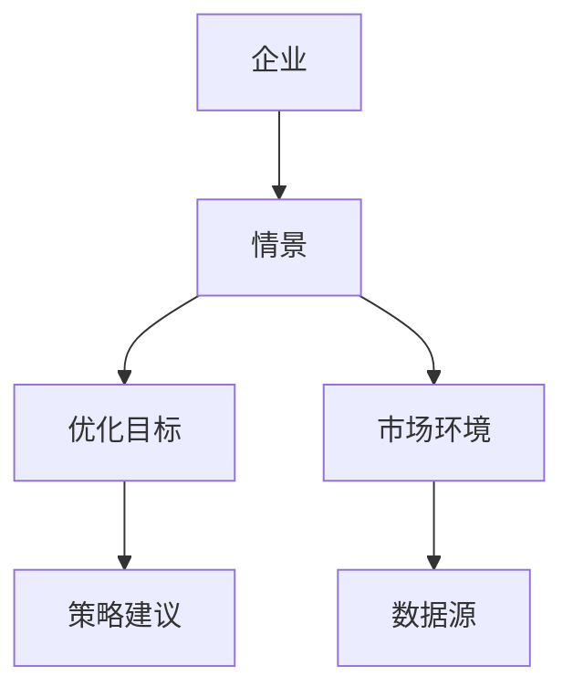
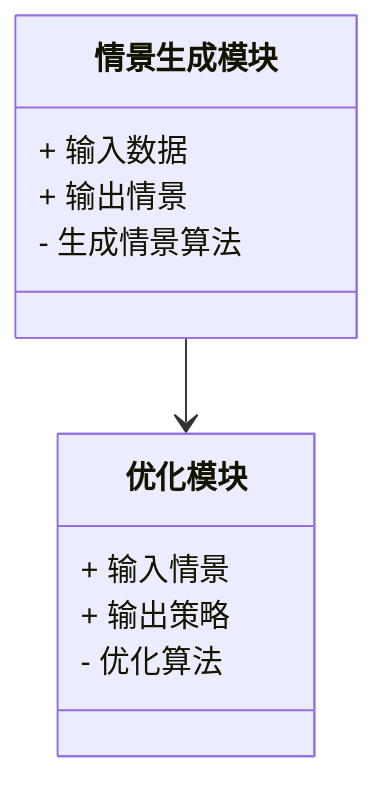
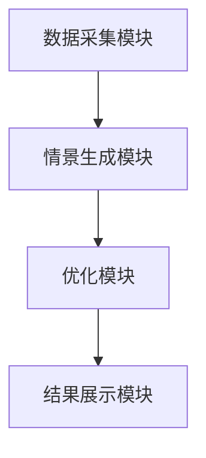

                 


# AI驱动的企业战略规划：情景模拟与优化

> 关键词：AI驱动，企业战略规划，情景模拟，优化，生成式AI，大模型，数学模型

> 摘要：本文探讨了如何利用AI技术驱动企业战略规划的优化，通过情景模拟的方式，结合生成式AI和大模型技术，帮助企业制定更加精准和高效的策略。文章从背景介绍、核心概念、算法原理、系统设计、项目实战到最佳实践，全面解析AI在企业战略规划中的应用，并通过实际案例展示其优势与价值。

---

## 第一部分：背景介绍

### 第1章：企业战略规划的背景与挑战

#### 1.1 企业战略规划的基本概念
- **1.1.1 企业战略规划的定义**
  - 企业战略规划是企业为了实现长期目标而制定的一系列行动方案，涉及市场分析、资源分配、风险评估等多个方面。
- **1.1.2 战略规划的重要性**
  - 战略规划是企业发展的指南针，直接影响企业的生存与发展。
- **1.1.3 传统战略规划的局限性**
  - 传统方法依赖经验判断，缺乏数据支持，难以应对复杂多变的市场环境。

#### 1.2 AI驱动的战略规划的优势
- **1.2.1 数据驱动的决策优势**
  - 利用AI技术，企业可以基于海量数据进行精准分析，提升决策的科学性。
- **1.2.2 情景模拟的精准性**
  - 通过AI生成多种可能的情景，帮助企业更好地预测市场变化。
- **1.2.3 优化策略的有效性**
  - AI可以通过优化算法，找到最优策略，提升企业竞争力。

### 第2章：AI在企业战略规划中的应用前景

#### 2.1 AI技术对企业战略规划的赋能
- **2.1.1 数据分析与预测**
  - 利用AI进行市场趋势预测、竞争对手分析，为企业提供数据支持。
- **2.1.2 情景模拟与风险评估**
  - 通过AI生成多种情景，帮助企业评估不同策略下的风险与收益。
- **2.1.3 竞争对手分析与市场预测**
  - 利用AI技术，企业可以实时监控竞争对手动态，制定更具针对性的市场策略。

#### 2.2 当前企业战略规划中的AI应用现状
- **2.2.1 国内外应用案例**
  - 国内某企业利用AI进行市场进入战略规划，成功预测了市场趋势。
- **2.2.2 行业发展趋势**
  - 随着AI技术的不断进步，企业战略规划的AI化将成为趋势。
- **2.2.3 技术瓶颈与挑战**
  - 数据隐私问题、模型泛化能力不足等，是当前AI在战略规划中应用的主要挑战。

---

## 第二部分：AI驱动的情景模拟与优化核心概念

### 第3章：AI驱动情景模拟的核心原理

#### 3.1 情景模拟的基本原理
- **3.1.1 情景模拟的定义**
  - 情景模拟是通过构建多种可能的市场环境，评估不同策略下的企业表现。
- **3.1.2 情景模拟的流程**
  - 数据收集 → 情景生成 → 结果分析 → 策略优化。
- **3.1.3 情景模拟的关键要素**
  - 数据来源、模型构建、情景生成算法、结果评估指标。

#### 3.2 AI在情景模拟中的应用
- **3.2.1 生成式AI在情景生成中的作用**
  - 利用生成式AI，可以快速生成多种市场情景，帮助企业进行多维度分析。
- **3.2.2 大模型在情景分析中的优势**
  - 大模型具有强大的语义理解能力，可以准确捕捉市场变化。
- **3.2.3 情景模拟的动态调整机制**
  - 根据实时数据，动态调整情景模拟的内容，确保模拟结果的准确性。

#### 核心概念对比表
| **核心概念** | **传统方法** | **AI驱动方法** |
|--------------|--------------|----------------|
| 数据来源     | 有限的市场数据 | 海量多源数据    |
| 情景生成     | 人工经验判断  | 自动生成       |
| 模型复杂度   | 简单线性模型  | 复杂非线性模型  |

#### 情景模拟的ER实体关系图


---

### 第4章：AI驱动优化的核心机制

#### 4.1 优化的基本原理
- **4.1.1 优化的定义**
  - 优化是指在给定约束条件下，找到最优解的过程。
- **4.1.2 优化算法的工作流程**
  - 确定目标函数 → 建立约束条件 → 选择优化算法 → 迭代求解 → 输出最优解。
- **4.1.3 优化模型的核心要素**
  - 目标函数、约束条件、决策变量。

#### 4.2 AI在优化中的应用
- **4.2.1 生成式AI与优化的结合**
  - 利用生成式AI生成多种可能的策略，然后通过优化算法找到最优解。
- **4.2.2 大模型在优化中的作用**
  - 大模型可以提供丰富的上下文信息，帮助优化算法更好地理解问题。
- **4.2.3 优化结果的动态调整**
  - 根据实时市场变化，动态调整优化模型，确保结果的有效性。

#### 优化算法的数学模型
- **目标函数：**
  $$ \text{Maximize } Z = \sum_{i=1}^{n} c_i x_i $$
- **约束条件：**
  $$ \sum_{i=1}^{n} a_i x_i \leq b $$
  $$ x_i \geq 0 \text{，且 } x_i \text{ 为整数} $$

---

## 第三部分：算法原理讲解

### 第5章：生成式AI的原理与实现

#### 5.1 生成式AI的基本原理
- **5.1.1 生成式AI的定义**
  - 生成式AI是一种可以生成新数据的AI技术，常用于文本生成、图像生成等领域。
- **5.1.2 生成式AI的核心算法**
  - 基于变换器架构的生成模型（如GPT）。
- **5.1.3 生成式AI的工作流程**
  - 数据预处理 → 模型训练 → 模型生成 → 结果优化。

#### 5.2 生成式AI的Python实现
```python
import torch
from torch.nn import Transformer

# 数据预处理
def preprocess_data(data):
    # 数据清洗和转换
    pass

# 模型定义
class Generator(torch.nn.Module):
    def __init__(self):
        super(Generator, self).__init__()
        self.transformer = Transformer(...)

    def forward(self, input):
        return self.transformer(input)

# 训练过程
def train_generator(generator, optimizer, criterion, data_loader):
    for epoch in range(num_epochs):
        for batch in data_loader:
            optimizer.zero_grad()
            outputs = generator(batch)
            loss = criterion(outputs, labels)
            loss.backward()
            optimizer.step()
```

#### 5.3 生成式AI的应用案例
- **5.3.1 市场情景生成**
  - 利用生成式AI生成多种市场情景，帮助企业进行风险评估。
- **5.3.2 竞争对手分析**
  - 通过生成式AI分析竞争对手的市场策略，制定针对性的应对措施。

---

### 第6章：优化算法的原理与实现

#### 6.1 优化算法的基本原理
- **6.1.1 优化算法的定义**
  - 优化算法是一种通过迭代过程寻找目标函数最优解的方法。
- **6.1.2 常见优化算法**
  - 线性规划、非线性规划、遗传算法、模拟退火等。
- **6.1.3 优化算法的工作流程**
  - 初始化 → 迭代优化 → 求解最优解。

#### 6.2 优化算法的Python实现
```python
import numpy as np
from scipy.optimize import minimize

# 定义目标函数
def objective_function(x):
    return np.sum(x**2)

# 定义约束条件
def constraint1(x):
    return np.sum(x) - 1 <= 0

# 初始化
x0 = np.zeros(3)

# 求解
result = minimize(objective_function, x0, constraints=[{'type': 'ineq', 'fun': constraint1}])

# 输出结果
print(result.x)
```

#### 6.3 优化算法的应用案例
- **6.3.1 市场进入战略优化**
  - 利用优化算法，帮助企业找到最佳市场进入策略。
- **6.3.2 产品组合优化**
  - 通过优化算法，找到最优的产品组合，提升企业利润。

---

## 第四部分：系统分析与架构设计

### 第7章：系统功能设计

#### 7.1 问题场景介绍
- **7.1.1 企业战略规划的复杂性**
  - 市场环境复杂，竞争激烈，决策难度大。
- **7.1.2 系统目标**
  - 利用AI技术，构建一个智能化的战略规划系统，帮助企业制定最优策略。

#### 7.2 系统功能设计
- **7.2.1 情景生成模块**
  - 功能：生成多种市场情景。
  - 输入：市场数据、企业目标。
  - 输出：多种市场情景。
- **7.2.2 优化模块**
  - 功能：对生成的情景进行优化，找到最优策略。
  - 输入：市场情景、优化目标。
  - 输出：最优策略建议。

#### 系统功能模块类图


---

### 第8章：系统架构设计

#### 8.1 系统架构设计
- **8.1.1 分层架构**
  - 数据层、业务逻辑层、用户界面层。
- **8.1.2 模块划分**
  - 数据采集模块、情景生成模块、优化模块、结果展示模块。

#### 系统架构图


---

## 第五部分：项目实战

### 第9章：环境安装与系统实现

#### 9.1 环境安装
- **9.1.1 安装Python**
  - 下载并安装Python 3.8或更高版本。
- **9.1.2 安装依赖库**
  - 使用pip安装必要的库，如`numpy`, `scipy.optimize`, `torch`, `transformers`。

#### 9.2 核心代码实现
```python
import torch
from torch.nn import Transformer
from scipy.optimize import minimize

# 情景生成模块
class ScenarioGenerator:
    def __init__(self):
        self.model = self._build_model()

    def _build_model(self):
        return Transformer(...)

    def generate_scenario(self, input_data):
        return self.model(input_data)

# 优化模块
class Optimizer:
    def __init__(self):
        pass

    def optimize(self, scenarios, objective_func):
        best = None
        for scenario in scenarios:
            result = minimize(objective_func, scenario, ...)
            if result.fun < best.fun:
                best = result
        return best
```

#### 9.3 代码应用解读与分析
- **9.3.1 情景生成模块**
  - 使用生成式AI生成多种市场情景。
- **9.3.2 优化模块**
  - 对生成的情景进行优化，找到最优策略。

---

### 第10章：案例分析与结果解读

#### 10.1 实际案例分析
- **10.1.1 案例背景**
  - 某企业计划进入新市场，需要制定市场进入战略。
- **10.1.2 案例分析**
  - 利用AI生成多种市场情景，然后进行优化，找到最优策略。

#### 10.2 案例结果解读
- **10.2.1 情景生成结果**
  - 生成了五种不同的市场情景，包括高增长、中增长、低增长等。
- **10.2.2 优化结果**
  - 通过优化算法，找到了最优的市场进入策略，提升了企业的市场占有率。

---

## 第六部分：最佳实践

### 第11章：小结与总结

#### 11.1 小结
- 通过AI驱动的情景模拟与优化，企业可以制定更加精准和高效的策略。
- 结合生成式AI和优化算法，企业能够更好地应对复杂多变的市场环境。

#### 11.2 总结
- AI技术在企业战略规划中的应用前景广阔，可以帮助企业提升竞争力。
- 随着技术的进步，AI驱动的战略规划将成为企业决策的重要工具。

---

### 第12章：注意事项与拓展阅读

#### 12.1 注意事项
- **数据隐私问题**
  - 在使用AI进行战略规划时，需要注意数据的隐私和安全。
- **模型泛化能力**
  - 需要确保生成式AI和优化算法的泛化能力，以应对不同市场环境的变化。

#### 12.2 拓展阅读
- **相关书籍**
  - 《机器学习实战》、《深度学习入门》、《战略管理》。
- **相关课程**
  - AI技术在企业战略规划中的应用、生成式AI的原理与实践。

---

## 作者：AI天才研究院/AI Genius Institute & 禅与计算机程序设计艺术 /Zen And The Art of Computer Programming

