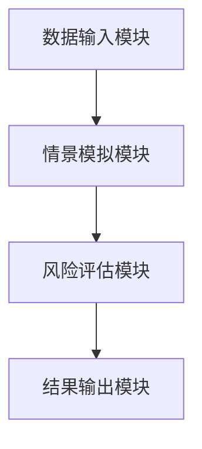

                 


# AI驱动的企业战略规划：情景模拟与风险评估

## 关键词：AI，企业战略规划，情景模拟，风险评估，数学模型，系统架构，项目实战

## 摘要：  
随着人工智能技术的快速发展，企业战略规划的制定和执行方式正在发生深刻的变化。本文将详细探讨如何利用AI技术驱动企业战略规划，通过情景模拟与风险评估的方法，为企业提供更加科学、高效的战略决策支持。文章首先介绍AI驱动的企业战略规划的核心概念与背景，接着深入分析情景模拟与风险评估的数学模型与算法原理，然后从系统架构设计、项目实战与案例分析等多个维度展开详细论述。通过本文的分析，读者可以全面了解AI在企业战略规划中的应用，掌握如何利用AI技术进行情景模拟与风险评估，从而在复杂多变的商业环境中做出更明智的决策。

---

# 第一部分: AI驱动的企业战略规划基础

## 第1章: AI驱动的企业战略规划概述

### 1.1 AI驱动的企业战略规划的背景  
企业战略规划是企业在复杂多变的商业环境中，为了实现长期发展目标而制定的一系列行动方案。然而，传统的企业战略规划方法往往依赖于经验丰富的管理者和团队，存在以下问题：  
1. **信息处理能力有限**：面对海量数据和复杂市场环境，传统方法难以高效处理和分析。  
2. **主观性较强**：依赖个人经验，可能导致决策偏差。  
3. **动态适应性不足**：市场环境变化快，静态的规划难以快速调整。  

AI技术的引入为企业战略规划带来了新的可能性。通过AI技术，企业可以更高效地处理数据，发现潜在规律，并基于数据驱动的决策支持，制定更加科学和动态的战略规划。  

### 1.2 AI驱动的战略规划的核心概念  

#### 1.2.1 AI在战略规划中的角色  
AI在企业战略规划中的角色可以分为以下几类：  
- **数据处理与分析**：AI能够快速处理大量数据，提取关键信息，为战略规划提供数据支持。  
- **情景模拟**：通过AI技术构建情景模拟模型，帮助企业预测不同策略下的结果。  
- **风险评估**：利用AI算法分析潜在风险，并制定风险缓解策略。  

#### 1.2.2 情景模拟的定义与特点  
情景模拟是一种通过构建虚拟场景，分析不同策略下可能结果的方法。其特点包括：  
- **前瞻性**：情景模拟可以帮助企业预见未来可能的变化。  
- **灵活性**：可以根据市场环境的变化快速调整模拟场景。  
- **多样性**：可以涵盖多种可能的市场情况，帮助企业做好多种准备。  

#### 1.2.3 风险评估的定义与方法  
风险评估是通过分析潜在风险的发生概率和影响程度，制定风险应对策略的过程。常用方法包括：  
- **风险矩阵法**：通过概率和影响程度对风险进行分类。  
- **蒙特卡洛模拟**：通过多次模拟计算风险的概率分布。  

### 1.3 本章小结  
本章介绍了AI驱动的企业战略规划的背景和核心概念，强调了AI技术在战略规划中的重要性。情景模拟与风险评估是AI驱动战略规划的两大关键方法，能够帮助企业更好地应对复杂环境中的挑战。

---

# 第二部分: AI驱动的战略规划的数学模型与算法原理

## 第2章: AI驱动的战略规划的数学模型  

### 2.1 概率论与决策树模型  

#### 2.1.1 概率论的基本概念  
概率论是AI驱动战略规划的重要数学基础。以下是概率论的几个基本概念：  
- **概率**：某事件发生的可能性大小。  
- **随机变量**：可能取多个值的变量，且每个值对应一定的概率。  
- **条件概率**：在已知某些条件下，某事件发生的概率。  

#### 2.1.2 决策树的构建与应用  
决策树是一种用于支持决策的树状图，广泛应用于战略规划中。以下是构建决策树的步骤：  
1. **确定决策目标**：明确需要解决的问题。  
2. **识别可能的决策方案**：列出所有可能的决策选项。  
3. **分析可能结果**：评估每个决策方案的结果及其概率。  
4. **计算期望值**：通过概率和结果计算每个方案的期望值，选择最优方案。  

**示例**：假设企业在选择进入新市场时，有两种决策方案：  
- 方案A：高投入，高回报，概率为0.7，收益为1000万。  
- 方案B：低投入，中等回报，概率为0.8，收益为500万。  

通过计算期望值，企业可以选择收益更高的方案。  

#### 2.1.3 企业战略规划中的概率模型  
在企业战略规划中，概率模型常用于预测市场需求、竞争对手行为等。例如，可以通过历史数据和市场分析，建立市场需求的预测模型，并通过概率分布评估不同策略下的收益情况。  

### 2.2 情景模拟的数学模型  

#### 2.2.1 Monte Carlo 模拟  
Monte Carlo 模拟是一种通过随机采样方法，模拟系统行为并预测结果的技术。在企业战略规划中，可以用于预测市场变化、评估投资回报等。  

#### 2.2.2 情景树的构建与分析  
情景树是一种用于分析多种可能情景的工具，常用于战略规划中。以下是情景树的构建步骤：  
1. **识别关键决策点**：确定战略规划中的关键决策点。  
2. **分析可能的情景**：列出所有可能的情景及其概率。  
3. **评估情景结果**：分析每个情景下的结果，并计算期望值。  

#### 2.2.3 模型的输入变量与输出结果  
输入变量包括市场需求、成本、竞争对手行为等；输出结果包括不同策略下的收益、风险等。  

### 2.3 风险评估的数学模型  

#### 2.3.1 风险矩阵的构建  
风险矩阵是一种用于评估风险的方法，通常基于风险发生的概率和影响程度。  

| 风险等级 | 低概率，低影响 | 高概率，低影响 | 低概率，高影响 | 高概率，高影响 |
|----------|----------------|----------------|----------------|----------------|
| 等级     | 1              | 2              | 3              | 4              |

#### 2.3.2 风险概率与影响的量化  
通过概率和影响的量化，可以将风险分为低、中、高三个等级，并制定相应的应对策略。  

#### 2.3.3 风险缓解策略的优化  
通过优化策略组合，选择成本最低、效果最佳的风险缓解方案。  

### 2.4 本章小结  
本章详细介绍了AI驱动的战略规划中的数学模型，包括概率论、决策树、Monte Carlo 模拟和风险矩阵等方法。这些模型为企业战略规划提供了强大的理论支持和技术工具。

---

# 第三部分: 系统架构与实现

## 第3章: 系统架构设计  

### 3.1 系统功能模块划分  

#### 3.1.1 数据输入模块  
负责接收和处理企业战略规划的相关数据，包括市场数据、竞争对手信息等。  

#### 3.1.2 情景模拟模块  
基于输入数据，构建情景模拟模型，生成多种可能的情景及其结果。  

#### 3.1.3 风险评估模块  
评估每个情景下的风险，并生成风险缓解策略。  

#### 3.1.4 结果输出模块  
输出情景模拟和风险评估的结果，并提供可视化展示。  

### 3.2 系统架构图  
以下是一个AI驱动的战略规划系统的架构图：  



### 3.3 系统接口设计  

#### 3.3.1 数据接口  
负责与数据源对接，包括数据库、API接口等。  

#### 3.3.2 模拟接口  
负责接收模拟参数并返回模拟结果。  

#### 3.3.3 评估接口  
负责接收风险评估参数并返回评估结果。  

### 3.4 本章小结  
本章详细介绍了AI驱动的战略规划系统的架构设计，包括功能模块划分、系统架构图和接口设计。这些设计为企业战略规划的实现提供了技术基础。

---

# 第四部分: 项目实战

## 第4章: 项目实战与案例分析  

### 4.1 项目环境安装  

#### 4.1.1 Python环境的安装与配置  
建议使用Python 3.8及以上版本，并安装以下库：  
- numpy  
- pandas  
- scikit-learn  

#### 4.1.2 必要库的安装  
```bash
pip install numpy pandas scikit-learn
```

### 4.2 核心代码实现  

#### 4.2.1 数据预处理代码  
```python
import pandas as pd
import numpy as np

# 读取数据
data = pd.read_csv('input.csv')

# 数据清洗
data.dropna(inplace=True)
data = data[['revenue', 'cost', 'profit']]

# 数据标准化
from sklearn.preprocessing import StandardScaler
scaler = StandardScaler()
data_scaled = scaler.fit_transform(data)
```

#### 4.2.2 情景模拟代码  
```python
import numpy as np
import matplotlib.pyplot as plt

# 蒙特卡洛模拟
def monte_carlo_simulation(data, iterations=1000):
    results = []
    for _ in range(iterations):
        # 随机选择数据点
        sample = np.random.choice(data, size=len(data))
        # 计算平均值
        avg = np.mean(sample)
        results.append(avg)
    return results

# 绘制结果分布图
results = monte_carlo_simulation(data_scaled)
plt.hist(results, bins=30)
plt.xlabel('Value')
plt.ylabel('Frequency')
plt.show()
```

### 4.3 案例分析  

#### 4.3.1 案例背景  
某企业计划进入新市场，需要评估不同市场策略下的风险与收益。  

#### 4.3.2 数据分析与模拟  
通过蒙特卡洛模拟，评估不同策略下的收益分布，并计算风险矩阵。  

#### 4.3.3 风险评估与策略选择  
根据模拟结果，选择收益最高且风险可控的策略。  

### 4.4 项目小结  
本章通过实际案例展示了AI驱动的战略规划系统在情景模拟与风险评估中的应用，验证了系统的可行性和有效性。

---

# 第五部分: 总结与展望

## 第5章: 总结与展望  

### 5.1 本章总结  
本文详细介绍了AI驱动的企业战略规划的核心概念、数学模型、系统架构和项目实战。通过情景模拟与风险评估的方法，帮助企业制定更加科学和动态的战略规划。  

### 5.2 未来展望  
随着AI技术的不断发展，企业战略规划将更加智能化和数据化。未来的研究方向包括：  
- 更加复杂的模型和算法。  
- 更多行业的实际应用案例。  
- 更高效的系统架构设计。  

### 5.3 本章小结  
本章总结了全文的主要内容，并展望了未来的发展方向。

---

# 作者：AI天才研究院 & 禅与计算机程序设计艺术

