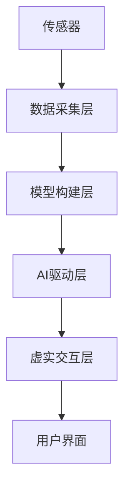
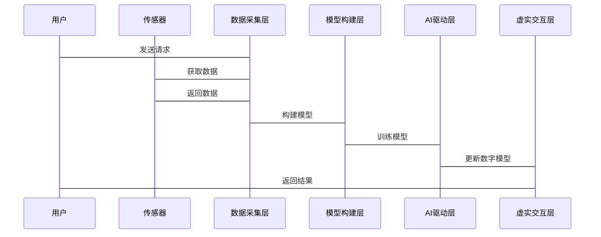

                 


# AI驱动的企业数字孪生技术：虚实结合的决策支持

> 关键词：数字孪生，人工智能，虚实结合，企业决策支持，系统架构，数据建模

> 摘要：  
> 本文深入探讨了AI驱动的企业数字孪生技术，分析了其核心概念、技术架构、数学模型与算法原理，并通过具体案例展示了其在企业中的应用。文章从数字孪生的定义、架构、算法、系统设计、项目实战等方面展开，结合数学公式、Mermaid流程图、Python代码示例等，全面剖析了AI驱动的数字孪生技术的实现过程与实际应用价值，为企业数字化转型提供了理论与实践的双重参考。

---

# 第一部分: AI驱动的企业数字孪生技术概述

# 第1章: 数字孪生技术的核心概念与背景

## 1.1 数字孪生技术的定义与背景

### 1.1.1 数字孪生的定义与起源
数字孪生（Digital Twin）是一种将物理世界中的物体、系统或过程在数字空间中进行实时映射的技术。它通过传感器、数据采集和建模技术，将物理实体的属性、行为和状态映射到数字模型中。数字孪生的概念最早可以追溯到20世纪90年代，随着物联网（IoT）和人工智能（AI）技术的发展，数字孪生技术逐渐成熟并得到了广泛应用。

### 1.1.2 数字孪生技术的发展历程
1. **萌芽阶段（20世纪90年代）**：数字孪生的概念初步提出，主要用于工业设计和仿真。
2. **发展阶段（21世纪初）**：随着传感器技术和数据处理能力的提升，数字孪生开始应用于制造业和建筑业。
3. **成熟阶段（2010年至今）**：人工智能和大数据技术的引入，使得数字孪生从简单的数据映射发展为智能化的决策支持系统。

### 1.1.3 数字孪生在企业中的应用价值
- **实时监控**：通过数字孪生模型，企业可以实时监控物理系统的运行状态。
- **预测维护**：利用AI算法，数字孪生可以预测设备故障，降低维护成本。
- **优化决策**：数字孪生提供虚实结合的决策支持，帮助企业优化运营策略。

## 1.2 AI驱动的数字孪生技术特点

### 1.2.1 数字孪生与AI的结合
AI驱动的数字孪生技术通过深度学习和强化学习等算法，实现对物理系统的智能化建模和优化。

### 1.2.2 数字孪生的虚实结合特性
数字孪生的核心是虚实结合，通过数字模型与物理实体的实时交互，实现数据的双向流动和动态更新。

### 1.2.3 数字孪生的实时性与动态性
数字孪生模型能够实时反映物理系统的状态变化，并通过AI算法进行动态优化。

## 1.3 企业数字孪生的应用场景

### 1.3.1 制造业中的数字孪生
在制造业中，数字孪生用于设备监控、生产优化和供应链管理。

### 1.3.2 建筑业中的数字孪生
在建筑业中，数字孪生用于建筑设计、施工模拟和建筑维护。

### 1.3.3 供应链管理中的数字孪生
在供应链管理中，数字孪生用于物流优化、库存管理和风险预警。

## 1.4 本章小结
本章介绍了数字孪生技术的核心概念、发展历程和应用场景，重点分析了AI驱动的数字孪生技术的特点和优势。

---

# 第2章: 数字孪生技术的核心架构与原理

## 2.1 数字孪生的系统架构

### 2.1.1 数据采集层
数据采集层通过传感器和数据采集设备，获取物理系统的实时数据。

### 2.1.2 模型构建层
模型构建层利用数据建模技术，将采集的数据转化为数字模型。

### 2.1.3 AI驱动层
AI驱动层通过深度学习和强化学习算法，对数字模型进行优化和预测。

### 2.1.4 虚实交互层
虚实交互层通过人机交互界面，实现数字模型与物理系统的实时互动。

## 2.2 数据建模与特征提取

### 2.2.1 数据采集与预处理
数据预处理包括数据清洗、数据归一化和数据增强。

### 2.2.2 数据特征提取方法
常用的数据特征提取方法包括主成分分析（PCA）和自动编码器（Autoencoder）。

### 2.2.3 数据建模的数学模型
数据建模的数学模型如下：

$$
y = \beta_0 + \beta_1x_1 + \beta_2x_2 + \cdots + \beta_nx_n + \epsilon
$$

其中，$y$ 是目标变量，$x_i$ 是特征变量，$\beta_i$ 是回归系数，$\epsilon$ 是误差项。

## 2.3 AI驱动的数字孪生算法

### 2.3.1 基于深度学习的数字孪生
深度学习模型包括卷积神经网络（CNN）和循环神经网络（RNN）。

### 2.3.2 基于强化学习的数字孪生
强化学习模型包括Q-learning和Deep Q-Network（DQN）。

### 2.3.3 算法的优缺点对比
| 算法类型   | 优点                          | 缺点                          |
|------------|-------------------------------|-------------------------------|
| 深度学习   | 高精度，适合复杂数据         | 需要大量数据，计算资源消耗大 |
| 强化学习   | 可实现动态优化，适合实时交互 | 需要设计合适的奖励函数       |

## 2.4 数字孪生的虚实交互机制

### 2.4.1 虚实交互的定义
虚实交互是指数字模型与物理系统的实时数据交换和状态同步。

### 2.4.2 虚实交互的实现方式
虚实交互可以通过物联网（IoT）技术和实时通信协议（如MQTT）实现。

### 2.4.3 虚实交互的优化策略
优化策略包括减少数据延迟、提高数据传输效率和增强数据安全性。

## 2.5 本章小结
本章详细介绍了数字孪生技术的核心架构与原理，分析了数据建模、AI算法和虚实交互的实现方式。

---

# 第3章: 数字孪生技术的数学模型与算法原理

## 3.1 数据建模的数学基础

### 3.1.1 数据预处理的数学方法
数据预处理包括数据标准化和数据归一化，常用的标准化公式如下：

$$
z = \frac{x - \mu}{\sigma}
$$

其中，$\mu$ 是均值，$\sigma$ 是标准差。

### 3.1.2 数据特征提取的数学模型
主成分分析（PCA）的数学模型如下：

$$
Y = X \cdot P
$$

其中，$Y$ 是降维后的数据，$X$ 是原始数据，$P$ 是投影矩阵。

### 3.1.3 数据建模的数学公式
线性回归的数学公式如下：

$$
y = \theta_0 + \theta_1x + \epsilon
$$

其中，$\theta_0$ 是截距，$\theta_1$ 是回归系数，$\epsilon$ 是误差项。

## 3.2 基于深度学习的数字孪生算法

### 3.2.1 神经网络模型的构建
神经网络模型的构建包括输入层、隐藏层和输出层。

### 3.2.2 深度学习算法的训练过程
深度学习算法的训练过程包括正向传播和反向传播。

### 3.2.3 算法的数学推导与公式
反向传播的数学推导如下：

$$
\frac{\partial L}{\partial w} = \frac{\partial L}{\partial a} \cdot \frac{\partial a}{\partial w}
$$

其中，$L$ 是损失函数，$a$ 是激活值，$w$ 是权重。

## 3.3 基于强化学习的数字孪生算法

### 3.3.1 强化学习的基本原理
强化学习的基本原理包括状态、动作和奖励。

### 3.3.2 强化学习在数字孪生中的应用
强化学习可以应用于设备维护和生产优化。

### 3.3.3 强化学习算法的数学模型
Q-learning的数学模型如下：

$$
Q(s, a) = Q(s, a) + \alpha \cdot [r + \gamma \cdot \max Q(s', a) - Q(s, a)]
$$

其中，$Q(s, a)$ 是状态-动作值，$\alpha$ 是学习率，$\gamma$ 是折扣因子。

## 3.4 数学模型与算法的对比分析

### 3.4.1 不同算法的优缺点
| 算法类型   | 优点                          | 缺点                          |
|------------|-------------------------------|-------------------------------|
| 深度学习   | 高精度，适合复杂数据         | 需要大量数据，计算资源消耗大 |
| 强化学习   | 可实现动态优化，适合实时交互 | 需要设计合适的奖励函数       |

### 3.4.2 算法的适用场景
- 深度学习适用于静态数据建模。
- 强化学习适用于动态系统优化。

## 3.5 本章小结
本章详细分析了数字孪生技术的数学模型与算法原理，对比了不同算法的优缺点和适用场景。

---

# 第4章: 数字孪生系统的架构设计与实现

## 4.1 系统需求分析

### 4.1.1 问题场景介绍
以智能工厂为例，数字孪生系统需要实现设备监控、生产优化和决策支持。

### 4.1.2 系统功能需求
系统功能需求包括实时监控、预测维护和优化决策。

### 4.1.3 系统性能需求
系统性能需求包括实时性、可靠性和可扩展性。

## 4.2 系统架构设计

### 4.2.1 系统架构的分层设计
系统架构分为数据采集层、模型构建层、AI驱动层和虚实交互层。

### 4.2.2 系统组件的交互关系
系统组件的交互关系包括传感器、数据库、AI模型和用户界面。

### 4.2.3 系统架构的Mermaid图



## 4.3 系统接口设计

### 4.3.1 系统接口的定义
系统接口包括数据采集接口、模型调用接口和用户交互接口。

### 4.3.2 系统接口的实现
系统接口的实现基于RESTful API。

### 4.3.3 系统接口的优化
系统接口的优化包括减少数据冗余和提高数据传输效率。

## 4.4 系统交互的Mermaid序列图



## 4.5 本章小结
本章详细描述了数字孪生系统的架构设计与实现过程，包括系统需求分析、架构设计和接口设计。

---

# 第5章: 数字孪生技术的项目实战

## 5.1 项目背景与目标

### 5.1.1 项目背景
以智能工厂为例，项目目标是实现设备的实时监控和预测维护。

### 5.1.2 项目目标
项目目标包括实时监控、预测维护和优化决策。

## 5.2 项目环境与工具

### 5.2.1 环境安装
需要安装Python、TensorFlow、Kafka和MongoDB。

### 5.2.2 工具选择
选择Jupyter Notebook作为开发工具，Kafka作为消息队列，MongoDB作为数据库。

## 5.3 项目核心代码实现

### 5.3.1 数据采集与预处理
数据采集代码如下：

```python
import pandas as pd
import numpy as np

# 数据采集
data = pd.read_csv('sensor_data.csv')
# 数据预处理
data_clean = data.dropna()
data_clean = (data_clean - data_clean.mean()) / data_clean.std()
```

### 5.3.2 模型构建与训练
模型构建代码如下：

```python
import tensorflow as tf
from tensorflow.keras import layers

model = tf.keras.Sequential([
    layers.Dense(64, activation='relu'),
    layers.Dense(1, activation='linear')
])
model.compile(optimizer='adam', loss='mse')
model.fit(data_clean, labels, epochs=100, batch_size=32)
```

### 5.3.3 系统实现与优化
系统实现代码如下：

```python
import json
import paho.mqtt.client as mqtt

def on_connect(client, userdata, flags, rc):
    print("Connected with result code " + str(rc))
    client.subscribe("sensors/topic")

def on_message(client, userdata, msg):
    data = json.loads(msg.payload)
    # 处理数据
    model.predict(data)
    # 更新数字模型

client = mqtt.Client()
client.on_connect = on_connect
client.on_message = on_message
client.connect("mqttbroker", 1883, 60)
client.loop_start()
```

## 5.4 项目测试与优化

### 5.4.1 系统测试
系统测试包括功能测试、性能测试和安全性测试。

### 5.4.2 系统优化
系统优化包括减少数据延迟、提高数据传输效率和增强数据安全性。

## 5.5 项目小结
本章通过具体案例展示了数字孪生技术的实现过程，包括项目背景、环境搭建、代码实现和系统优化。

---

# 第6章: 数字孪生技术的总结与展望

## 6.1 数字孪生技术的关键点总结

### 6.1.1 虚实结合的决策支持
数字孪生通过虚实结合提供智能化的决策支持。

### 6.1.2 AI驱动的系统优化
AI驱动的数字孪生技术能够实现系统的动态优化。

### 6.1.3 数据驱动的实时监控
数字孪生技术能够实现物理系统的实时监控和预测维护。

## 6.2 数字孪生技术对企业的影响

### 6.2.1 提高企业效率
数字孪生技术能够提高企业的生产效率和运营效率。

### 6.2.2 降低企业成本
数字孪生技术能够降低企业的维护成本和运营成本。

### 6.2.3 提升企业竞争力
数字孪生技术能够提升企业的市场竞争力和创新能力。

## 6.3 数字孪生技术的未来展望

### 6.3.1 技术发展
未来，数字孪生技术将与区块链、边缘计算等技术结合，实现更高效的数据处理和更智能的系统优化。

### 6.3.2 应用场景
未来，数字孪生技术将在智能制造、智慧城市和医疗健康等领域得到更广泛的应用。

### 6.3.3 挑战与机遇
数字孪生技术的发展面临数据安全、计算资源和人才短缺等挑战，同时也带来了新的机遇。

## 6.4 本章小结
本章总结了数字孪生技术的关键点，分析了其对企业的影响，并展望了未来的发展方向。

---

# 作者：AI天才研究院/AI Genius Institute & 禅与计算机程序设计艺术 /Zen And The Art of Computer Programming

---

通过以上目录大纲，我们可以看到，文章从数字孪生技术的核心概念与背景、技术架构与原理、数学模型与算法原理、系统架构设计与实现、项目实战以及总结与展望等多个方面进行了全面而深入的探讨。结合理论与实践，文章为企业数字孪生技术的实现提供了详尽的指导和参考。

