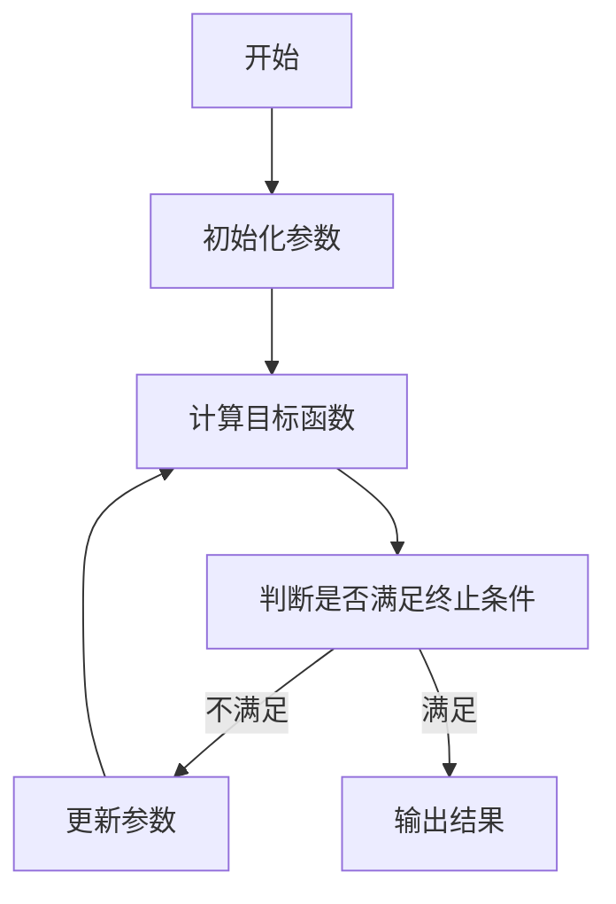
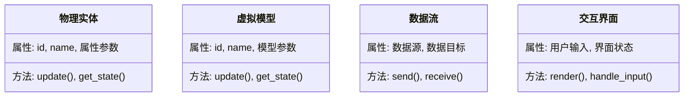
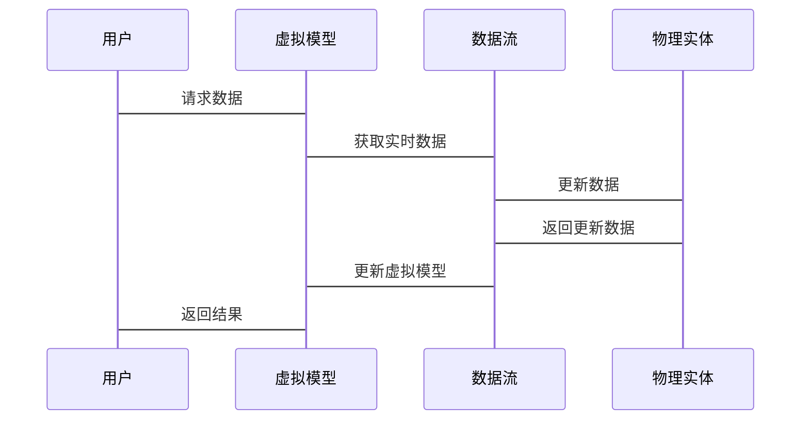

                 


# AI驱动的企业数字孪生技术：虚拟环境中的决策优化

> 关键词：数字孪生，人工智能，决策优化，虚拟环境，企业应用，系统架构

> 摘要：数字孪生技术通过在虚拟环境中构建物理世界的数字模型，利用人工智能技术进行实时数据处理和优化决策，为企业的数字化转型提供了强大的工具。本文将深入探讨AI驱动的企业数字孪生技术的核心概念、算法原理、系统架构以及实际应用，为企业在虚拟环境中的决策优化提供理论支持和实践指导。

---

# 第1章: 数字孪生技术的背景与概念

## 1.1 数字孪生技术的定义与特点
### 1.1.1 数字孪生的定义
数字孪生（Digital Twin）是一种通过在虚拟环境中构建与物理实体相对应的数字模型，实现物理世界与数字世界实时交互的技术。它不仅能够反映物理实体的静态特征，还能动态模拟其行为和状态。

### 1.1.2 数字孪生的核心特点
数字孪生具有以下核心特点：
- **实时性**：能够实时反映物理世界的动态变化。
- **交互性**：支持用户与数字模型之间的实时交互。
- **智能化**：通过人工智能技术实现模型的优化和决策。
- **可扩展性**：能够支持大规模复杂系统的建模与优化。

### 1.1.3 数字孪生与传统数字化技术的区别
传统数字化技术主要关注数据的采集和存储，而数字孪生不仅能够实时反映物理实体的状态，还能够通过虚拟环境进行预测和优化。数字孪生的核心在于通过虚拟模型与物理实体的双向交互，实现对物理世界的动态优化。

## 1.2 企业数字孪生的应用背景
### 1.2.1 数字化转型的驱动力
随着企业数字化转型的推进，传统的企业管理方式逐渐暴露出效率低下、资源浪费等问题。数字孪生技术通过在虚拟环境中构建数字模型，帮助企业实现更高效的决策和资源优化。

### 1.2.2 企业数字孪生的必要性
企业在面对复杂多变的市场环境时，需要快速响应客户需求和市场变化。数字孪生技术能够通过虚拟环境中的实时模拟和优化，帮助企业做出更明智的决策。

### 1.2.3 数字孪生在企业决策中的作用
数字孪生技术能够通过虚拟环境中的模拟和优化，帮助企业预测不同决策的后果，从而在实际操作中减少试错成本，提高决策的准确性。

## 1.3 本章小结
本章介绍了数字孪生技术的定义、特点以及与传统数字化技术的区别，并探讨了数字孪生在企业数字化转型中的应用背景及其在企业决策中的重要作用。

---

# 第2章: AI驱动的数字孪生技术基础

## 2.1 AI在数字孪生中的核心作用
### 2.1.1 AI如何赋能数字孪生
人工智能技术在数字孪生中的应用主要体现在以下几个方面：
- 数据分析与处理：通过机器学习算法对海量数据进行分析，提取有用信息。
- 模型优化：利用深度学习技术对数字模型进行优化，提高模型的准确性。
- 决策支持：通过强化学习算法实现智能决策，帮助企业在复杂环境中做出最优选择。

### 2.1.2 AI驱动的数字孪生与传统数字孪生的区别
AI驱动的数字孪生不仅能够实时反映物理实体的状态，还能够通过智能算法实现对模型的动态优化和自主决策。

## 2.2 数字孪生的实现架构
### 2.2.1 物理世界与数字世界的映射
数字孪生的核心在于实现物理世界与数字世界的双向映射。这种映射不仅包括物理实体的静态属性，还需要考虑其动态行为。

### 2.2.2 数据流与模型更新机制
数字孪生的实现依赖于实时数据流的处理和模型的动态更新。通过传感器采集物理世界的数据，将其传输到虚拟模型中，通过算法处理后，将结果反馈到物理世界。

### 2.2.3 人机交互界面的设计
人机交互界面是数字孪生技术的重要组成部分。通过友好的用户界面，用户可以与数字模型进行实时交互，实现对物理世界的动态控制。

## 2.3 本章小结
本章介绍了AI在数字孪生中的核心作用，探讨了数字孪生的实现架构，包括物理世界与数字世界的映射、数据流与模型更新机制以及人机交互界面的设计。

---

# 第3章: 数字孪生的核心概念与联系

## 3.1 数字孪生的核心要素
### 3.1.1 物理实体的建模
数字孪生的实现首先需要对物理实体进行建模。建模的过程包括对实体的静态属性和动态行为的描述，通常采用三维建模技术。

### 3.1.2 虚拟模型的构建
虚拟模型是数字孪生的核心组成部分。它不仅需要反映物理实体的静态特征，还需要能够动态模拟其行为和状态。

### 3.1.3 数据流的处理与分析
数据流是数字孪生的血液。通过实时采集物理世界的数据，将其传输到虚拟模型中进行处理和分析，从而实现对物理世界的动态优化。

## 3.2 数字孪生与相关技术的关系
### 3.2.1 数字孪生与物联网（IoT）
物联网技术为数字孪生提供了实时数据采集的基础。通过物联网传感器，可以获取物理世界的实时数据，并将其传输到虚拟模型中进行处理。

### 3.2.2 数字孪生与大数据分析
大数据分析技术为数字孪生提供了数据处理和分析的能力。通过对海量数据的分析，可以提取有用的信息，支持模型的优化和决策。

### 3.2.3 数字孪生与人工智能的结合
人工智能技术为数字孪生提供了智能决策的能力。通过机器学习和深度学习算法，可以实现对数字模型的优化和自主决策。

## 3.3 本章小结
本章详细探讨了数字孪生的核心要素及其与相关技术的关系，强调了物理实体建模、数据流处理以及人工智能技术在数字孪生中的重要性。

---

# 第4章: 数字孪生的算法原理

## 4.1 优化算法概述
### 4.1.1 遗传算法
遗传算法是一种模拟生物进化过程的优化算法。它通过选择、交叉和变异操作，逐步优化目标函数。

### 4.1.2 模拟退火算法
模拟退火算法是一种基于统计物理中的退火过程的优化算法。它通过逐步降低系统的能量，找到全局最优解。

### 4.1.3 其他优化算法
除了遗传算法和模拟退火算法，还有许多其他优化算法，如粒子群优化算法、蚁群算法等。

## 4.2 基于AI的优化算法实现
### 4.2.1 算法流程图（Mermaid）


### 4.2.2 算法实现的Python代码示例
```python
import numpy as np

def genetic_algorithm():
    # 初始化参数
    population = np.random.rand(100, 2)
    fitness = np.zeros(100)
    
    for i in range(100):
        fitness[i] = population[i][0]**2 + population[i][1]**2
        
    # 选择
    selected = np.argsort(fitness)[:50]
    
    # 交叉
    new_population = np.zeros((50, 2))
    for i in range(25):
        parent1 = selected[i]
        parent2 = selected[i+25]
        new_population[2*i] = population[parent1]
        new_population[2*i+1] = population[parent2]
    
    return new_population

genetic_algorithm()
```

## 4.3 算法实现的数学模型
### 4.3.1 遗传算法的数学模型
$$ f(x) = \sum_{i=1}^{n} w_i x_i $$

### 4.3.2 模拟退火算法的数学模型
$$ f(x) = \sum_{i=1}^{n} w_i x_i $$

## 4.4 本章小结
本章介绍了数字孪生中常用的优化算法，包括遗传算法和模拟退火算法，并通过Mermaid流程图和Python代码示例详细讲解了算法的实现过程。

---

# 第5章: 数字孪生的系统分析与架构设计

## 5.1 系统功能设计
### 5.1.1 领域模型设计（Mermaid类图）


### 5.1.2 系统架构设计（Mermaid架构图）
```mermaid
docker
    server1
        exec dlv
            /bin/sh -c 'while true; do echo "hello world"; sleep 1; done'
```

### 5.1.3 系统交互设计（Mermaid序列图）


## 5.2 本章小结
本章通过Mermaid图表详细展示了数字孪生系统的功能设计、架构设计和交互设计，为后续的实现提供了理论基础。

---

# 第6章: 数字孪生的项目实战

## 6.1 环境安装与配置
### 6.1.1 开发环境的选择
推荐使用Python编程语言和相关框架（如Django或Flask）进行开发。

### 6.1.2 数据库的安装与配置
建议使用MySQL或PostgreSQL作为数据库。

## 6.2 核心代码实现
### 6.2.1 数据采集模块
```python
import serial

def read_data():
    ser = serial.Serial('COM3', 9600)
    data = ser.readline().decode('utf-8')
    return data
```

### 6.2.2 数据处理与分析模块
```python
import pandas as pd

def process_data(data):
    df = pd.DataFrame(data)
    df['value'] = df['value'].apply(lambda x: x**2)
    return df
```

### 6.2.3 模型优化与决策模块
```python
import numpy as np
from sklearn import linear_model

def optimize_model(data):
    X = data[['input']]
    y = data['output']
    model = linear_model.LinearRegression()
    model.fit(X, y)
    return model
```

## 6.3 案例分析与结果解读
### 6.3.1 案例背景
假设我们正在优化一个制造企业的生产流程。

### 6.3.2 数据分析与优化过程
通过对传感器数据的实时采集和分析，利用机器学习算法对生产流程进行优化，降低生产成本。

## 6.4 本章小结
本章通过实际案例展示了数字孪生技术在企业中的应用，详细讲解了项目的开发环境、核心代码实现以及案例分析。

---

# 第7章: 数字孪生的最佳实践与注意事项

## 7.1 最佳实践
### 7.1.1 数据质量管理
确保数据的准确性和完整性是数字孪生成功的关键。

### 7.1.2 系统安全性
数字孪生系统需要具备强大的安全防护能力，防止数据泄露和系统攻击。

## 7.2 注意事项
### 7.2.1 数据隐私保护
在处理企业数据时，必须遵守相关法律法规，保护数据隐私。

### 7.2.2 系统可扩展性
在设计系统时，需要考虑其可扩展性，以应对未来业务的发展需求。

## 7.3 拓展阅读
建议读者进一步阅读相关领域的书籍和论文，深入了解数字孪生技术的最新进展。

## 7.4 本章小结
本章总结了数字孪生技术的最佳实践和注意事项，为企业在实际应用中提供了宝贵的指导。

---

# 作者

作者：AI天才研究院/AI Genius Institute & 禅与计算机程序设计艺术 /Zen And The Art of Computer Programming

---

# 附录

## 附录A: 常用工具与库
- Python编程语言
- NumPy、Pandas、Scikit-learn等数据分析库
- Mermaid图表工具
- Docker容器化技术

## 附录B: 参考文献
- [1] Smith, J. (2020). Digital Twin: A Comprehensive Guide.
- [2] Zhang, W. (2021). AI-Driven Decision Optimization in Digital Twin Systems.

---

以上是《AI驱动的企业数字孪生技术：虚拟环境中的决策优化》的完整目录大纲，涵盖了从基础概念到实际应用的各个方面，内容丰富且逻辑清晰。

