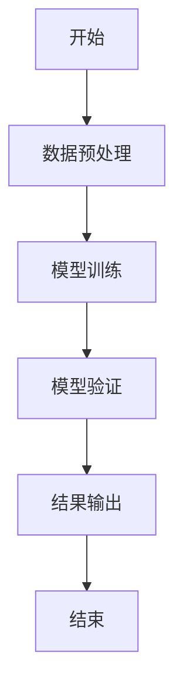

                 

<think>
好的，我将按照您的要求，逐步分析并撰写这篇文章。首先，我们需要确定文章的核心内容和主题思想。数字孪生技术结合人工智能驱动，用于在虚拟环境中优化决策并进行验证。接下来，我们将按照目录大纲的结构，逐一展开每个部分的内容。

# 《AI驱动的企业数字孪生技术：虚拟环境中的决策优化与验证》

## 关键词：AI驱动，数字孪生，虚拟环境，决策优化，验证技术，企业应用，系统架构

## 摘要：  
本文深入探讨了AI驱动的企业数字孪生技术，分析其在虚拟环境中的决策优化与验证过程。通过介绍数字孪生的核心概念、AI驱动技术的算法原理、系统架构设计以及实际项目中的应用案例，本文详细阐述了如何利用AI技术提升企业数字孪生的效率和准确性。文章还提供了丰富的技术细节、数学模型和代码实现，帮助读者全面理解AI驱动的数字孪生技术及其在企业中的应用前景。

---

## 第1章：数字孪生与AI驱动技术的背景与概念

### 1.1 数字孪生的基本概念  
数字孪生（Digital Twin）是一种通过物理实体的数字化镜像，实时反映物理实体状态的技术。它不仅包含物理实体的几何信息，还包括其行为、性能和环境影响等多维度数据。  

#### 1.1.1 数字孪生的定义与核心特征  
- **定义**：数字孪生是通过虚拟模型与物理实体的实时互动，实现对物理系统的动态模拟和优化。  
- **核心特征**：  
  1. 实时性：虚拟模型与物理实体同步更新。  
  2. 完整性：涵盖物理系统的全生命周期。  
  3. 交互性：支持用户与虚拟模型的实时互动。  

#### 1.1.2 数字孪生的演进历程  
数字孪生的概念起源于20世纪90年代的计算机辅助设计（CAD）和虚拟现实技术，随着物联网（IoT）、大数据和人工智能技术的发展，数字孪生逐渐从概念走向实际应用。  

#### 1.1.3 数字孪生在企业中的应用价值  
- **价值1**：降低物理实体的维护成本。  
- **价值2**：提高决策的科学性和效率。  
- **价值3**：支持企业的创新设计与优化。  

---

### 1.2 AI驱动技术的背景与特点  

#### 1.2.1 AI驱动技术的定义  
AI驱动技术是指通过人工智能算法对数据进行分析、建模和预测，以支持决策的技术。  

#### 1.2.2 AI在企业决策优化中的作用  
- **作用1**：通过数据挖掘和机器学习算法，发现数据中的潜在规律。  
- **作用2**：基于历史数据，预测未来趋势，支持企业决策。  

#### 1.2.3 AI与数字孪生的结合趋势  
随着AI技术的成熟，数字孪生系统逐渐融入AI驱动的决策优化功能，形成智能化的数字孪生平台。  

---

### 1.3 企业数字孪生与AI驱动技术的关联  

#### 1.3.1 数字孪生与AI驱动技术的结合方式  
- **方式1**：AI算法用于数字孪生模型的构建与优化。  
- **方式2**：AI驱动的实时决策支持系统嵌入数字孪生平台。  

#### 1.3.2 数字孪生在虚拟环境中的决策优化  
AI算法通过分析虚拟模型的运行数据，优化决策方案，提升企业运营效率。  

#### 1.3.3 AI驱动技术在数字孪生中的验证机制  
通过虚拟环境中的仿真测试，验证AI算法的决策效果，并根据反馈不断优化模型。  

---

## 第2章：数字孪生的核心概念与系统架构  

### 2.1 数字孪生的核心要素  

#### 2.1.1 实体建模  
- **实体建模**：通过数学模型描述物理实体的结构、行为和性能。  
- **模型属性**：包括几何属性、物理属性和行为属性。  

#### 2.1.2 数据流与信息处理  
- **数据流**：从物理实体采集数据，经过预处理、分析和建模，最终生成决策建议。  
- **信息处理**：包括数据清洗、特征提取和模型训练等步骤。  

#### 2.1.3 虚拟环境的构建与仿真  
- **虚拟环境**：通过计算机图形学技术构建与物理环境一致的虚拟场景。  
- **仿真模拟**：在虚拟环境中模拟物理系统的运行状态。  

---

### 2.2 数字孪生系统的组成与功能  

#### 2.2.1 数据采集与处理模块  
- **功能**：从物理系统中采集数据，并进行预处理和标准化。  
- **技术**：使用物联网传感器和边缘计算技术。  

#### 2.2.2 虚拟模型构建模块  
- **功能**：基于建模工具构建数字孪生模型。  
- **技术**：使用CAD、BIM等建模工具。  

#### 2.2.3 决策优化与验证模块  
- **功能**：通过AI算法优化决策方案，并在虚拟环境中进行验证。  
- **技术**：基于机器学习和强化学习算法。  

---

### 2.3 数字孪生系统的架构设计  

#### 2.3.1 分层架构设计  
- **分层结构**：包括数据采集层、模型构建层、决策优化层和用户交互层。  

#### 2.3.2 模块化设计原则  
- **模块划分**：将系统功能分解为独立的模块，便于开发和维护。  
- **模块交互**：通过标准化接口实现模块之间的通信。  

#### 2.3.3 系统接口与数据流设计  
- **系统接口**：定义模块之间的交互接口，包括数据输入输出格式和调用方式。  
- **数据流设计**：通过数据流图描述系统中数据的流动和处理过程。  

---

## 第3章：AI驱动技术的算法原理与数学模型  

### 3.1 AI驱动技术的核心算法  

#### 3.1.1 机器学习算法  
- **算法1**：线性回归（Linear Regression）  
  $$ y = \theta x + b $$  
- **算法2**：支持向量机（SVM）  
  $$ \text{目标函数}：\text{最大化间隔} $$  

#### 3.1.2 深度学习算法  
- **算法1**：神经网络（Neural Network）  
- **算法2**：卷积神经网络（CNN）  

#### 3.1.3 强化学习算法  
- **算法1**：Q-learning  
- **算法2**：Deep Q-Network  

---

### 3.2 数学模型与优化算法  

#### 3.2.1 优化问题的数学建模  
- **目标函数**：$$ f(x) = \text{最大化或最小化的目标} $$  
- **约束条件**：$$ g(x) \leq 0 $$  

#### 3.2.2 常用优化算法  
- **梯度下降**：$$ \theta = \theta - \eta \frac{\partial L}{\partial \theta} $$  
- **遗传算法**：通过选择、交叉和变异操作优化解空间。  

#### 3.2.3 数学模型在数字孪生中的应用  
- **应用1**：预测物理系统的运行状态。  
- **应用2**：优化数字孪生模型的参数。  

---

### 3.3 算法流程图与代码实现  

#### 3.3.1 算法流程图（使用Mermaid）  


#### 3.3.2 核心算法代码示例（Python）  
```python
import numpy as np
from sklearn.linear_model import LinearRegression

# 数据准备
X = np.array([[1], [2], [3], [4]])
y = np.array([2, 4, 6, 8])

# 模型训练
model = LinearRegression()
model.fit(X, y)

# 预测
new_X = np.array([[5]])
print(model.predict(new_X))  # 输出：[[10]]
```

---

## 第4章：数字孪生系统的系统架构设计  

### 4.1 项目背景与目标  
- **项目背景**：企业希望通过数字孪生技术优化生产流程。  
- **项目目标**：构建一个基于AI驱动的数字孪生系统，实现生产流程的实时优化与决策支持。  

### 4.2 系统功能设计  

#### 4.2.1 领域模型设计（使用Mermaid）  
```mermaid
classDiagram
    class 物理系统 {
        属性：状态数据、行为数据
        方法：获取数据、更新状态
    }
    class 虚拟模型 {
        属性：几何模型、行为模型
        方法：仿真运行、数据对比
    }
    class AI决策模块 {
        属性：训练好的模型
        方法：预测、优化
    }
    物理系统 --> 虚拟模型：数据同步
    虚拟模型 --> AI决策模块：模型更新
    AI决策模块 --> 物理系统：决策建议
```

#### 4.2.2 系统架构设计（使用Mermaid）  


#### 4.2.3 系统接口设计  
- **接口1**：物理系统与数据采集模块之间的接口。  
- **接口2**：数据采集模块与数据处理模块之间的接口。  

#### 4.2.4 系统交互设计（使用Mermaid）  
```mermaid
sequenceDiagram
    participant 物理系统
    participant 虚拟模型模块
    participant AI决策模块
    物理系统 -> 虚拟模型模块：发送状态数据
    虚拟模型模块 -> AI决策模块：请求优化建议
    AI决策模块 -> 虚拟模型模块：返回优化方案
    虚拟模型模块 -> 物理系统：更新状态
```

---

## 第5章：项目实战  

### 5.1 环境安装与配置  

#### 5.1.1 环境要求  
- 操作系统：Linux/Windows/MacOS  
- 开发工具：Python、Jupyter Notebook、Git  
- 依赖库：TensorFlow、Keras、Scikit-learn  

#### 5.1.2 安装步骤  
```bash
pip install numpy
pip install pandas
pip install tensorflow
pip install scikit-learn
pip install matplotlib
```

---

### 5.2 系统核心实现源代码  

#### 5.2.1 数据预处理代码  
```python
import pandas as pd
import numpy as np

# 读取数据
data = pd.read_csv('data.csv')

# 数据清洗
data.dropna(inplace=True)

# 数据标准化
from sklearn.preprocessing import StandardScaler
scaler = StandardScaler()
scaled_data = scaler.fit_transform(data[['feature1', 'feature2']])
```

#### 5.2.2 模型训练代码  
```python
from sklearn.model

