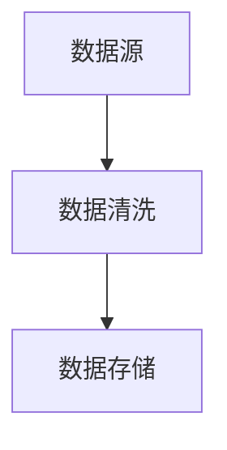
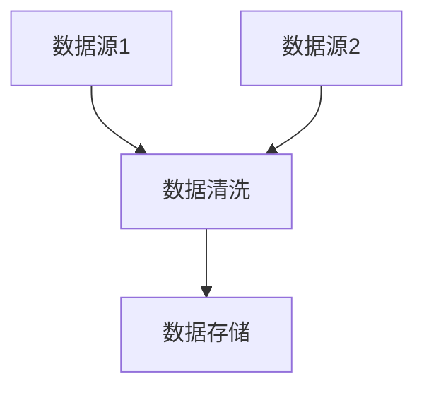
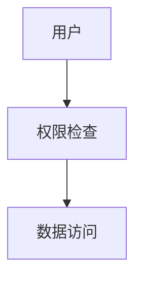
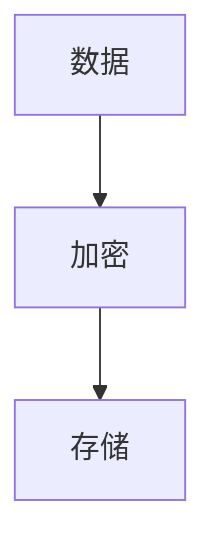
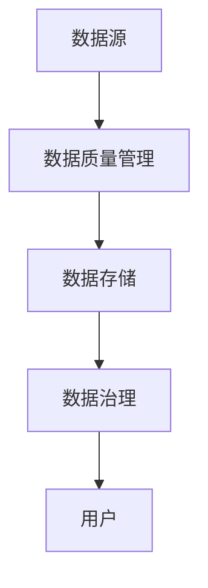
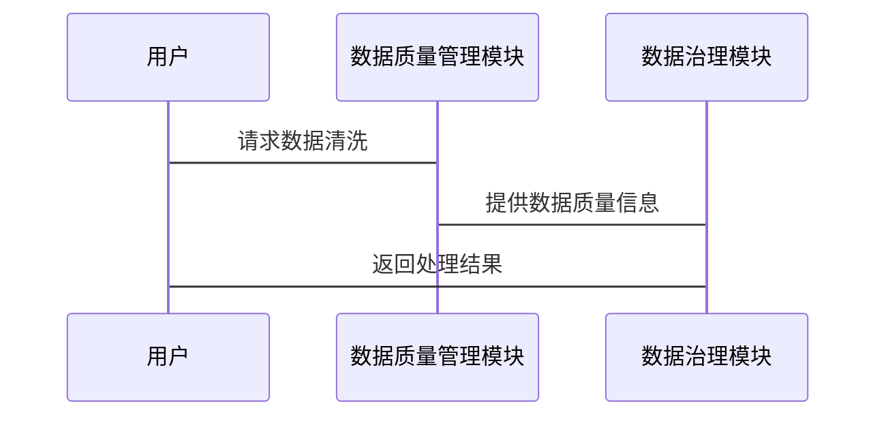

                 


# AI驱动的企业数据质量管理与治理

> 关键词：数据质量管理，数据治理，AI驱动，企业数据管理，数据治理架构

> 摘要：本文详细探讨了AI驱动的企业数据质量管理与治理的核心概念、算法原理、系统架构及实际应用。通过背景介绍、核心概念对比、算法实现、系统设计、项目实战和最佳实践等多维度分析，系统阐述了AI技术在企业数据质量管理与治理中的关键作用及其实际应用价值。

---

## 第1章: 企业数据质量管理与治理的背景介绍

### 1.1 数据质量管理的背景
#### 1.1.1 数据质量管理的定义
数据质量管理是指通过技术手段和管理方法，确保数据的准确性、一致性、完整性、及时性和安全性。它是企业信息化建设的重要组成部分。

#### 1.1.2 数据质量管理的重要性
数据质量管理是企业数据治理的基础，直接影响企业的决策能力和竞争力。随着数字化转型的推进，数据质量管理的重要性日益凸显。

#### 1.1.3 数据质量管理的主要挑战
- 数据来源多样化，导致数据一致性难以保证。
- 数据量大，难以实时处理。
- 数据孤岛现象严重，难以统一管理。

### 1.2 数据治理的背景
#### 1.2.1 数据治理的定义
数据治理是通过制定政策、流程和规范，确保数据在企业内得到合理使用、共享和保护。它是企业数据管理的高级阶段。

#### 1.2.2 数据治理的重要性
数据治理是企业数字化转型的核心，能够提升数据的价值，降低数据风险。

#### 1.2.3 数据治理的主要挑战
- 数据孤岛问题严重。
- 数据安全和隐私保护难度大。
- 数据治理涉及多个部门和角色，协调复杂。

### 1.3 数据质量管理与治理的解决方案
#### 1.3.1 数据质量管理的解决方案
- 引入自动化工具，提高数据处理效率。
- 建立数据质量标准，规范数据管理流程。

#### 1.3.2 数据治理的解决方案
- 制定数据治理政策和规范。
- 建立数据治理组织，明确责任分工。

#### 1.3.3 AI驱动的数据质量管理与治理的优势
- AI技术能够提高数据处理的效率和准确性。
- AI能够实时监控数据质量，快速响应问题。
- AI能够预测数据风险，提前采取措施。

---

## 第2章: 数据质量管理与治理的核心概念与联系

### 2.1 数据质量管理与治理的核心概念
#### 2.1.1 数据质量管理的核心概念
- 数据质量维度：包括准确性、完整性、一致性、及时性、规范性等。
- 数据质量评估方法：基于规则的评估、基于统计的评估、基于机器学习的评估。

#### 2.1.2 数据治理的核心概念
- 数据治理框架：包括数据所有权、数据访问权限、数据生命周期管理。
- 数据治理工具：包括数据目录、数据血缘分析、数据监控等。

#### 2.1.3 数据质量管理与治理的关系
数据质量管理是数据治理的基础，数据治理为数据质量管理提供政策和规范支持。

### 2.2 数据质量管理与治理的核心原理
#### 2.2.1 数据质量管理的原理
- 数据清洗：通过规则匹配和机器学习模型识别并纠正数据错误。
- 数据整合：将分散在不同系统中的数据进行标准化和集成。

#### 2.2.2 数据治理的原理
- 数据建模：通过数据建模工具设计数据结构和关系。
- 数据访问控制：基于角色和权限管理数据访问。

#### 2.2.3 数据质量管理与治理的协同机制
- 数据质量管理为数据治理提供数据质量信息。
- 数据治理为数据质量管理提供政策和规范支持。

### 2.3 数据质量管理与治理的核心要素对比
#### 2.3.1 数据质量管理与治理的对比表格
| 要素 | 数据质量管理 | 数据治理 |
|------|--------------|----------|
| 目标 | 提高数据质量 | 确保数据合规 |
| 方法 | 数据清洗、数据整合 | 数据建模、数据访问控制 |
| 工具 | 数据清洗工具、数据集成工具 | 数据治理平台、数据目录 |

#### 2.3.2 数据质量管理与治理的ER实体关系图
```mermaid
er
    entity 数据质量管理 (dqmgmt) {
        id
        数据质量标准
        数据清洗规则
    }
    entity 数据治理 (d_governance) {
        id
        数据治理政策
        数据访问权限
    }
    dqmgmt --> 数据质量管理工具
    d_governance --> 数据治理工具
```

---

## 第3章: 数据质量管理与治理的算法原理讲解

### 3.1 数据质量管理的算法流程
#### 3.1.1 数据清洗算法


代码实现：
```python
import pandas as pd

def data_cleaning(df):
    # 删除空值
    df.dropna(inplace=True)
    # 去重
    df.drop_duplicates(inplace=True)
    return df

# 示例数据
data = {'name': ['Alice', 'Bob', 'Charlie', 'Bob', 'Dave'], 
        'age': [25, 30, 25, 30, 45]}
df = pd.DataFrame(data)
df_cleaned = data_cleaning(df)
print(df_cleaned)
```

#### 3.1.2 数据整合算法


### 3.2 数据治理的算法流程
#### 3.2.1 数据访问控制算法


代码实现：
```python
def access_control(username, action):
    # 获取用户角色
    role = get_user_role(username)
    # 判断操作是否允许
    if action == 'read' and role == 'admin':
        return True
    elif action == 'write' and role == 'user':
        return True
    else:
        return False

# 示例调用
access_control('admin', 'read')
```

#### 3.2.2 数据安全算法


### 3.3 AI驱动的数据质量管理与治理算法
#### 3.3.1 数据质量预测算法
使用机器学习模型预测数据质量：
```python
from sklearn.linear_model import LogisticRegression

# 示例数据
X = df[['age', 'salary']]
y = df['label']

model = LogisticRegression()
model.fit(X, y)
```

#### 3.3.2 数据风险评估算法
使用概率论模型评估数据风险：
$$ P(风险) = \sum_{i=1}^{n} P(属性_i \text{异常}) $$

---

## 第4章: 数据质量管理与治理的系统架构设计

### 4.1 系统功能设计
#### 4.1.1 数据质量管理模块
- 数据清洗
- 数据整合
- 数据质量评估

#### 4.1.2 数据治理模块
- 数据建模
- 数据访问控制
- 数据安全

### 4.2 系统架构设计


### 4.3 接口设计
- 数据质量管理接口：提供数据清洗、数据整合功能。
- 数据治理接口：提供数据建模、数据访问控制功能。

### 4.4 交互设计


---

## 第5章: 项目实战

### 5.1 环境安装
- Python 3.8+
- Pandas、Scikit-learn、Flask

### 5.2 核心代码实现
```python
from flask import Flask
from sklearn.linear_model import LogisticRegression

app = Flask(__name__)

@app.route('/data_cleaning', methods=['POST'])
def data_cleaning():
    # 获取数据
    data = request.json
    df = pd.DataFrame(data)
    # 数据清洗
    df.dropna(inplace=True)
    df.drop_duplicates(inplace=True)
    return jsonify(df.to_dict())

if __name__ == '__main__':
    app.run()
```

### 5.3 案例分析
- 数据清洗案例：清洗脏数据。
- 数据整合案例：整合多个数据源。
- 数据治理案例：实现数据访问控制。

### 5.4 项目小结
通过项目实战，我们验证了AI驱动的数据质量管理与治理的有效性，同时也发现了需要进一步优化的地方。

---

## 第6章: 最佳实践与小结

### 6.1 最佳实践
- 数据质量管理：定期进行数据清洗和整合。
- 数据治理：建立数据治理政策和规范，明确数据所有权和访问权限。

### 6.2 小结
AI驱动的企业数据质量管理与治理是企业数字化转型的重要组成部分，通过技术手段和管理方法的结合，能够有效提高数据质量，降低数据风险。

### 6.3 注意事项
- 数据治理需要企业内部的广泛参与和协调。
- 数据质量管理需要结合具体业务场景进行定制化处理。

### 6.4 拓展阅读
- 《数据质量管理实战》
- 《企业数据治理指南》
- 《AI驱动的数据分析与挖掘》

---

作者：AI天才研究院/AI Genius Institute & 禅与计算机程序设计艺术 /Zen And The Art of Computer Programming

