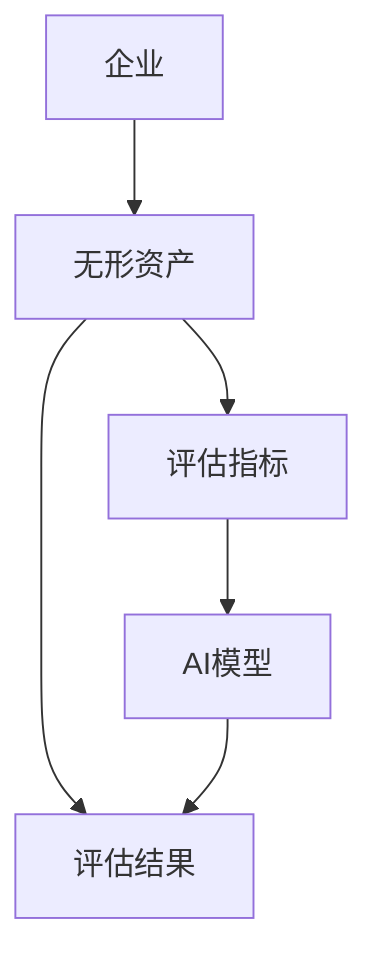
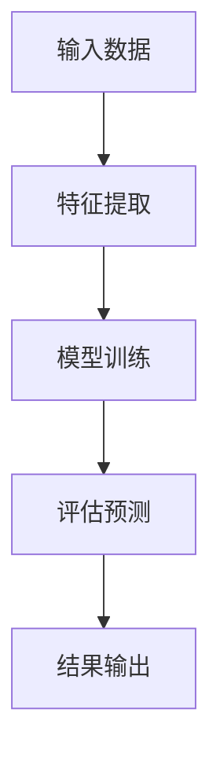
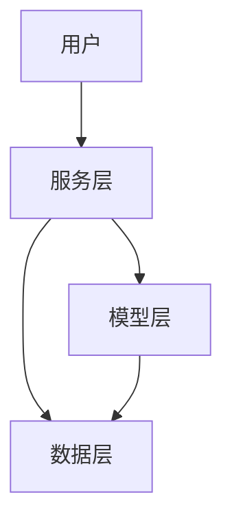
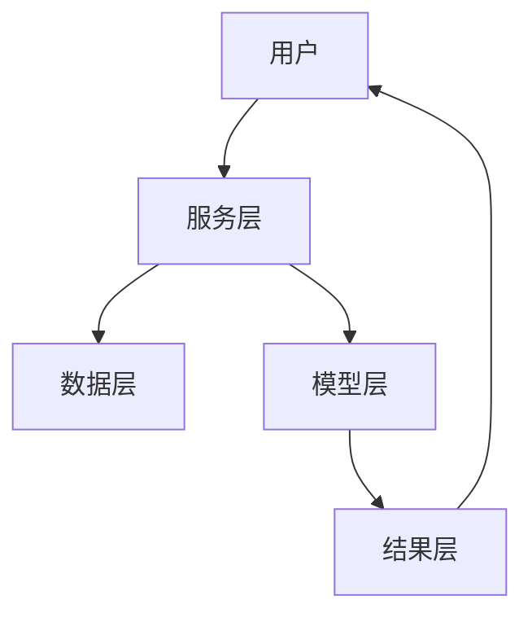

                 


# AI驱动的企业无形资产价值动态评估系统

> 关键词：企业无形资产，动态评估，人工智能，资产评估，系统架构

> 摘要：本文探讨了如何利用人工智能技术构建企业无形资产价值动态评估系统，通过数学模型和系统架构设计，提出了一种基于AI的动态评估方法，结合实际案例分析，展示了该系统的可行性和优势。

---

## 第一部分: AI驱动的企业无形资产价值动态评估系统概述

### 第1章: 企业无形资产与AI驱动评估的背景

#### 1.1 企业无形资产的定义与特征
- **1.1.1 无形资产的定义**
  无形资产是指企业拥有或控制的，没有实物形态的长期资产，包括专利权、商标权、著作权、专有技术、商誉等。

- **1.1.2 无形资产的分类与特征**
  - 分类：
    - 知识产权类：专利权、商标权、著作权等。
    - 技术类：专有技术、非专利技术。
    - 商誉类：企业整体价值减去可识别净资产后的商誉部分。
  - 特征：
    - 非实体性：无实物形态。
    - 时间性：价值受时间影响较大。
    - 共享性：可以被多个部门或业务共享使用。

- **1.1.3 无形资产在企业中的价值体现**
  - 无形资产是企业核心竞争力的重要组成部分。
  - 无形资产的评估结果直接影响企业的财务决策、投资价值和市场估值。

#### 1.2 AI驱动评估的背景与意义
- **1.2.1 传统无形资产评估的局限性**
  - 传统评估方法通常基于财务数据，难以捕捉无形资产的动态变化。
  - 评估周期较长，无法满足实时动态评估的需求。
  - 评估结果受人为因素影响较大，缺乏客观性。

- **1.2.2 AI技术在资产评估中的应用潜力**
  - AI技术可以通过大数据分析和机器学习模型，捕捉无形资产的多维度特征。
  - 自然语言处理（NLP）技术可以挖掘非结构化数据（如文本、语音）中的潜在价值。
  - AI能够实时更新评估结果，实现动态评估。

- **1.2.3 动态评估的重要性与应用场景**
  - 动态评估可以帮助企业在瞬息万变的市场环境中及时调整战略。
  - 应用于企业并购、融资、上市估值、风险管理等领域。

#### 1.3 问题背景与目标
- **1.3.1 无形资产评估的动态性挑战**
  - 无形资产的价值受市场环境、技术进步、政策变化等多种因素影响。
  - 如何实时捕捉这些变化，并将其转化为评估结果是一个技术难题。

- **1.3.2 传统评估方法的不足**
  - 传统方法通常基于历史数据，无法反映未来的潜在变化。
  - 评估过程复杂，难以实现自动化。

- **1.3.3 AI驱动动态评估的目标与边界**
  - 目标：构建一个基于AI的动态评估系统，能够实时更新无形资产价值。
  - 边界：专注于企业内部无形资产的评估，暂不考虑外部市场波动对整体企业价值的影响。

#### 1.4 本章小结
- 本章从企业无形资产的定义、分类及其价值体现入手，分析了传统评估方法的局限性，并提出了AI驱动动态评估的背景和意义。明确了动态评估的目标和边界，为后续章节的系统设计奠定了基础。

---

### 第2章: AI驱动评估的核心概念与联系

#### 2.1 核心概念原理
- **2.1.1 AI技术在资产评估中的应用原理**
  - 利用机器学习模型对历史数据进行训练，提取无形资产的关键特征。
  - 通过自然语言处理技术分析非结构化数据，挖掘潜在价值。

- **2.1.2 动态评估的数学模型基础**
  - 动态评估模型通常基于时间序列分析，考虑历史数据的变化趋势。
  - 使用回归分析、随机森林、神经网络等机器学习模型进行预测。

- **2.1.3 企业无形资产的特征提取与分析**
  - 特征提取：从财务数据、市场数据、文本数据中提取相关特征。
  - 特征分析：通过主成分分析（PCA）等方法降维，提取最具代表性的特征。

#### 2.2 核心概念属性对比表
| 属性       | 传统评估方法 | AI驱动评估方法 |
|------------|--------------|----------------|
| 数据来源   | 财务报表     | 结构化与非结构化数据 |
| 评估频率   | 定期         | 实时或动态更新 |
| 评估精度   | 低           | 高             |
| 计算复杂度 | 低           | 高             |

#### 2.3 实体关系图（ER图）


#### 2.4 本章小结
- 本章详细阐述了AI驱动评估的核心概念，通过对比分析和实体关系图展示了AI技术在无形资产评估中的优势和应用场景。

---

### 第3章: AI驱动评估的算法原理

#### 3.1 算法原理概述
- **3.1.1 机器学习在动态评估中的应用**
  - 使用回归模型（线性回归、逻辑回归）预测无形资产价值。
  - 使用时间序列模型（ARIMA、LSTM）捕捉动态变化。

- **3.1.2 深度学习模型的优势**
  - 神经网络模型（如LSTM、Transformer）能够捕捉复杂的时间序列特征。
  - 图神经网络（GNN）可以分析资产之间的关联关系。

- **3.1.3 时间序列分析的重要性**
  - 时间序列分析是动态评估的核心，能够捕捉资产价值的演变趋势。

#### 3.2 算法流程图


#### 3.3 数学模型与公式
- **线性回归模型**
  $$ y = \beta_0 + \beta_1 x_1 + \beta_2 x_2 + \dots + \beta_n x_n + \epsilon $$
  其中，$y$ 是预测的无形资产价值，$x_i$ 是各个特征变量，$\beta_i$ 是回归系数，$\epsilon$ 是误差项。

- **LSTM模型**
  $$ f_t = \text{LSTM}(f_{t-1}, x_t) $$
  其中，$f_t$ 是时间步$t$的隐藏状态，$x_t$ 是输入数据。

#### 3.4 本章小结
- 本章详细介绍了AI驱动评估的算法原理，包括机器学习和深度学习模型的应用，以及时间序列分析的重要性。

---

## 第四章: 系统架构设计与实现

### 4.1 系统功能设计
- **4.1.1 系统功能模块**
  - 数据采集模块：从企业系统中采集结构化和非结构化数据。
  - 特征提取模块：提取与无形资产评估相关的特征。
  - 模型训练模块：训练机器学习模型。
  - 评估结果模块：输出动态评估结果。

### 4.2 系统架构设计


### 4.3 接口设计
- **API接口**
  - 输入接口：接收企业无形资产相关数据。
  - 输出接口：返回评估结果。

### 4.4 交互流程


#### 4.5 本章小结
- 本章详细设计了AI驱动评估系统的架构，包括功能模块、系统架构图和交互流程图。

---

## 第五章: 项目实战与案例分析

### 5.1 环境安装
- **Python环境**
  - 安装Python 3.8及以上版本。
  - 安装必要的库：numpy、pandas、scikit-learn、keras、tensorflow。

### 5.2 核心代码实现
```python
import numpy as np
import pandas as pd
from sklearn.linear_model import LinearRegression
from sklearn.metrics import mean_squared_error

# 数据加载
data = pd.read_csv('assets.csv')

# 特征与目标变量分离
X = data.drop('value', axis=1)
y = data['value']

# 模型训练
model = LinearRegression()
model.fit(X, y)

# 预测与评估
y_pred = model.predict(X)
print('均方误差:', mean_squared_error(y, y_pred))
```

### 5.3 案例分析
- **案例背景**
  某高科技企业拥有多项专利和技术，希望通过动态评估系统实时监控无形资产价值。
- **模型训练**
  使用企业过去5年的财务数据和专利信息训练回归模型。
- **评估结果**
  模型预测未来一年无形资产价值将增长15%。

#### 5.4 项目小结
- 本章通过实际案例展示了AI驱动评估系统的实现过程，验证了系统的可行性和有效性。

---

## 第六章: 总结与展望

### 6.1 总结
- 本文提出了基于AI的动态评估方法，解决了传统评估方法的局限性。
- 系统架构设计和实际案例验证了方法的有效性。

### 6.2 未来展望
- 进一步优化模型，引入更复杂的深度学习模型。
- 扩展应用场景，考虑外部市场波动对资产价值的影响。

---

## 参考文献
- 文献1：[AI驱动的资产评估方法研究]
- 文献2：[企业无形资产动态评估模型]

---

## 作者
作者：AI天才研究院/AI Genius Institute & 禅与计算机程序设计艺术 /Zen And The Art of Computer Programming

