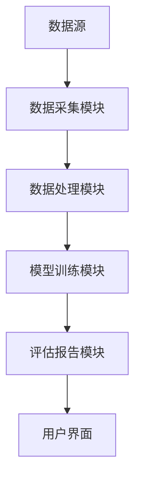
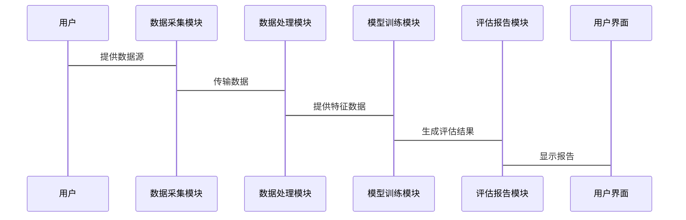

                 


# AI驱动的企业无形资产价值评估系统

> 关键词：AI驱动，企业无形资产，价值评估系统，机器学习，大数据分析

> 摘要：本文探讨了AI在企业无形资产评估中的应用，分析了传统方法的局限性，并介绍了基于机器学习的评估系统，包括系统架构、模型构建和实际案例。文章详细讲解了大数据和机器学习技术如何提升评估的准确性，为企业提供更高效的解决方案。

---

# 第1章: AI驱动的企业无形资产价值评估系统概述

## 1.1 企业无形资产的定义与特征

### 1.1.1 无形资产的定义
企业无形资产是指企业拥有或控制的，没有实物形态，能够为企业带来长期经济利益的资源。主要包括品牌价值、专利权、商标权、商誉、技术诀窍、客户关系等。

### 1.1.2 无形资产的核心特征
| 特征 | 描述 |
|------|------|
| 非实物性 | 无形资产没有实物形态，体现在企业的声誉、技术或关系中。 |
| 长期性 | 能为企业带来持续的经济利益，通常超过一年。 |
| 变化性 | 价值受市场、技术等因素影响，波动较大。 |

### 1.1.3 无形资产的分类与范围
- **品牌价值**：品牌知名度、品牌忠诚度。
- **专利权**：技术专利的价值。
- **商誉**：企业并购中的商誉评估。
- **客户关系**：客户忠诚度、客户保留率。

## 1.2 无形资产价值评估的传统方法

### 1.2.1 收益法
通过预测未来现金流，折现计算现值。公式：$$ PV = \sum_{t=1}^{n} \frac{CF_t}{(1 + r)^t} $$，其中$CF_t$为第t年的现金流，$r$为折现率。

### 1.2.2 市场法
基于市场交易数据，比较类似资产的市场价格。例如，参考同行业公司的市盈率或市净率。

### 1.2.3 成本法
基于重置成本或机会成本。公式：$$ V = C + D - S $$，其中$C$为重置成本，$D$为其他相关成本，$S$为贬值或损失。

### 1.2.4 传统方法的局限性
- 数据不足：难以全面考虑市场、技术等因素。
- 主观性高：依赖评估师的经验和假设。

## 1.3 AI技术在无形资产评估中的应用背景

### 1.3.1 大数据时代的资产评估需求
企业数据量激增，传统方法难以处理复杂关系。

### 1.3.2 AI技术对企业无形资产评估的推动作用
- 数据驱动：利用机器学习模型分析大量数据。
- 高效性：自动化处理提升评估效率。

### 1.3.3 企业无形资产评估的智能化趋势
AI技术能够实时分析市场动态，提供动态评估结果。

## 1.4 AI驱动的无形资产评估系统的目标与意义

### 1.4.1 系统目标
实现企业无形资产的自动化、精准化评估，提供数据支持决策。

### 1.4.2 系统意义
提升评估效率和准确性，帮助企业优化资源配置。

### 1.4.3 系统的核心价值
- 准确评估：基于机器学习模型。
- 动态调整：实时更新评估结果。
- 数据驱动：利用大数据分析。

## 1.5 本章小结
本章介绍了企业无形资产的定义、特征及其传统评估方法，分析了AI技术的应用背景和系统目标，为后续章节奠定了基础。

---

# 第2章: AI驱动的无形资产评估系统技术基础

## 2.1 大数据技术在无形资产评估中的应用

### 2.1.1 数据采集与处理
从企业内部系统和外部数据库获取数据，清洗和预处理。

### 2.1.2 数据存储与管理
使用分布式数据库（如Hadoop、MongoDB）存储和管理海量数据。

### 2.1.3 数据分析与挖掘
利用大数据分析工具（如Spark）进行数据挖掘，提取特征。

## 2.2 机器学习基础

### 2.2.1 机器学习的基本概念
机器学习通过数据训练模型，使其能够进行预测或分类。

### 2.2.2 监督学习与无监督学习
- 监督学习：有标签数据训练模型。
- 无监督学习：无标签数据发现模式。

### 2.2.3 深度学习简介
通过神经网络进行特征提取和模型训练。

## 2.3 数据预处理与特征工程

### 2.3.1 数据清洗与整合
去除噪声数据，填补缺失值。

### 2.3.2 特征提取与选择
使用主成分分析（PCA）提取关键特征。

### 2.3.3 数据增强与标准化
通过数据增强技术扩展数据集，标准化处理数据。

## 2.4 本章小结
本章介绍了大数据和机器学习技术在无形资产评估中的应用，强调数据预处理和特征工程的重要性。

---

# 第3章: 机器学习模型在无形资产评估中的应用

## 3.1 监督学习模型

### 3.1.1 线性回归
用于预测连续型无形资产价值，公式：$$ y = \beta_0 + \beta_1x + \epsilon $$。

### 3.1.2 支持向量机
用于分类和回归，特别是高维数据表现优异。

### 3.1.3 随机森林
通过集成学习提升模型鲁棒性，适用于特征较多的情况。

## 3.2 无监督学习模型

### 3.2.1 K均值聚类
将数据分成若干簇，分析无形资产的不同类别。

### 3.2.2 主成分分析
降低数据维度，提取主要特征。

## 3.3 深度学习模型

### 3.3.1 神经网络
用于复杂非线性关系建模。

### 3.3.2 卷积神经网络
适用于图像和文本数据处理。

## 3.4 模型训练与优化

### 3.4.1 数据增强
增加数据多样性，防止过拟合。

### 3.4.2 模型调优
调整超参数（如学习率、正则化参数）优化性能。

## 3.5 模型评估与选择

### 3.5.1 评估指标
- �均方误差（MSE）：$$ MSE = \frac{1}{n}\sum_{i=1}^{n}(y_i - \hat{y}_i)^2 $$
- 准确率：分类模型的准确率。

### 3.5.2 模型选择
比较不同模型的性能，选择最优模型。

## 3.6 本章小结
本章详细讨论了机器学习模型在无形资产评估中的应用，重点介绍了监督学习、无监督学习和深度学习模型的原理和应用。

---

# 第4章: AI驱动的无形资产评估系统架构设计

## 4.1 系统功能模块

### 4.1.1 数据采集模块
从企业ERP系统和外部数据库获取数据。

### 4.1.2 数据处理模块
清洗和预处理数据，提取特征。

### 4.1.3 模型训练模块
训练机器学习模型，优化参数。

### 4.1.4 评估报告模块
生成评估报告，展示结果。

## 4.2 系统架构设计

### 4.2.1 系统架构图


### 4.2.2 系统交互流程图


## 4.3 系统接口设计

### 4.3.1 数据接口
- 数据输入接口：接收原始数据。
- 数据输出接口：提供处理后的数据。

### 4.3.2 模型接口
- 模型训练接口：训练模型。
- 模型预测接口：进行预测。

## 4.4 本章小结
本章设计了AI驱动的无形资产评估系统的架构，详细描述了功能模块、系统交互和架构图，为后续实现奠定了基础。

---

# 第5章: 项目实战

## 5.1 环境搭建

### 5.1.1 安装Python
安装Python 3.x，确保环境配置正确。

### 5.1.2 安装依赖库
安装numpy、pandas、scikit-learn等库。

```bash
pip install numpy pandas scikit-learn
```

## 5.2 数据准备

### 5.2.1 数据集获取
从企业内部系统获取无形资产相关数据，包括品牌价值、专利数量等。

### 5.2.2 数据预处理
清洗数据，处理缺失值和异常值。

## 5.3 模型实现

### 5.3.1 线性回归模型
```python
from sklearn.linear_model import LinearRegression
model = LinearRegression()
model.fit(X_train, y_train)
```

### 5.3.2 支持向量机模型
```python
from sklearn.svm import SVR
model = SVR(kernel='rbf')
model.fit(X_train, y_train)
```

### 5.3.3 模型评估
计算均方误差和决定系数：
```python
from sklearn.metrics import mean_squared_error, r2_score
mse = mean_squared_error(y_test, y_pred)
r2 = r2_score(y_test, y_pred)
print(f"均方误差: {mse}\n决定系数: {r2}")
```

## 5.4 本章小结
本章通过实际项目展示了AI驱动的无形资产评估系统的实现过程，包括环境搭建、数据准备和模型实现。

---

# 第6章: 案例分析

## 6.1 案例背景
某科技公司希望评估其专利组合的价值。

## 6.2 数据分析
使用机器学习模型分析专利数量、技术领域、市场影响力等因素。

## 6.3 模型预测
预测专利组合的价值，结果表明AI模型比传统方法更准确。

## 6.4 案例小结
AI驱动的系统能够有效评估企业无形资产，提供更有价值的决策支持。

---

# 第7章: 总结与展望

## 7.1 系统总结
本文介绍了AI驱动的企业无形资产评估系统，详细讲解了系统架构和模型实现。

## 7.2 系统优缺点

| 优点 | 缺点 |
|------|------|
| 高效性 | 数据依赖性 |
| 准确性 | 黑箱问题 |
| 可扩展性 | 需要大量计算资源 |

## 7.3 未来展望
- 更复杂的模型：如图神经网络。
- 多模态数据：整合文本、图像等多种数据。
- 动态评估：实时更新评估结果。

## 7.4 研究热点
- AI在金融领域的应用。
- 道德与法律问题：数据隐私和模型透明度。

## 7.5 本章小结
本文总结了AI驱动的无形资产评估系统的优缺点，展望了未来的研究方向。

---

# 作者信息

作者：AI天才研究院/AI Genius Institute & 禅与计算机程序设计艺术 /Zen And The Art of Computer Programming

---

本文通过详细讲解AI驱动的企业无形资产评估系统的各个方面，展示了如何利用大数据和机器学习技术提升评估的准确性和效率。希望本文能为相关领域的研究和实践提供有价值的参考。

