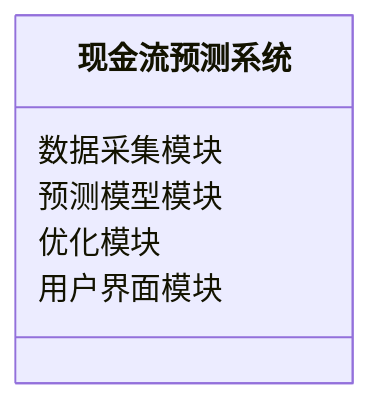
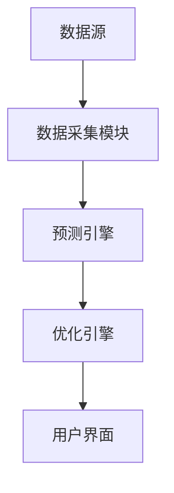
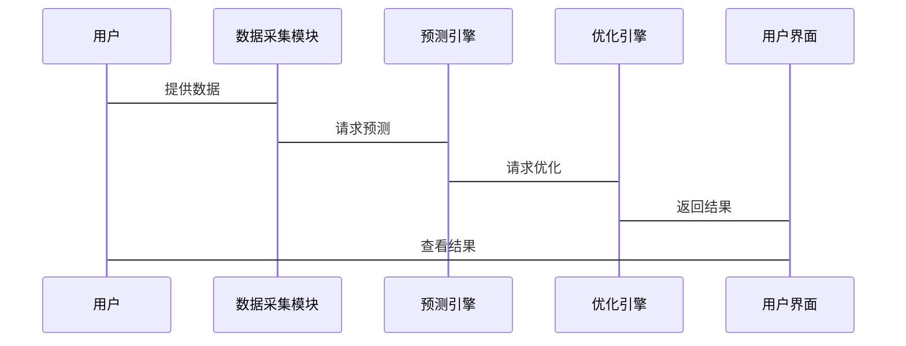

                 


# AI驱动的企业现金流优化与预测系统

> 关键词：AI技术，现金流预测，现金流优化，LSTM网络，时间序列分析，企业财务管理

> 摘要：  
本文详细探讨了AI技术在企业现金流优化与预测中的应用。通过分析现金流预测的数学模型、AI算法的实现、系统设计与架构、项目实战以及最佳实践，本文为企业提供了一套基于AI的现金流优化与预测解决方案。文章从背景介绍、核心概念、算法原理、系统架构到项目实现，层层深入，全面解析了如何利用AI技术提升企业现金流管理的准确性和效率。

---

# 第一部分: AI驱动的企业现金流优化与预测系统概述

## 第1章: 企业现金流优化与预测的背景与挑战

### 1.1 企业现金流管理的重要性
现金流是企业的生命线，直接关系到企业的生存与发展。现金流预测与优化能够帮助企业更好地规划资金使用、降低财务风险、提高资金利用效率。

#### 1.1.1 现金流在企业运营中的核心地位
现金流是企业运营的核心，它直接影响企业的偿债能力、投资能力和运营能力。现金流管理是企业财务管理的重要组成部分。

#### 1.1.2 现金流预测与优化的必要性
在经济波动加剧的背景下，企业需要准确预测未来的现金流，以便更好地应对不确定性。现金流优化可以帮助企业降低财务风险，提高资金使用效率。

#### 1.1.3 传统现金流管理的局限性
传统现金流管理方法依赖于历史数据和经验判断，存在预测精度低、优化效果有限等问题。随着数据量的增加和算法的进步，AI技术为企业提供了更高效的解决方案。

### 1.2 AI技术在企业财务管理中的应用
AI技术的应用正在改变企业财务管理的方式，尤其是在现金流预测与优化方面。

#### 1.2.1 AI技术的基本概念与特点
AI技术是指通过模拟人类智能的算法和模型，实现自动化决策和优化。其特点是数据驱动、自适应性和高效率。

#### 1.2.2 AI在财务预测中的优势
AI技术能够处理海量数据，发现复杂模式，并提供高精度的预测结果。与传统方法相比，AI在财务预测中的优势在于其快速性和准确性。

#### 1.2.3 企业现金流优化与预测的AI驱动模式
通过AI技术，企业可以实时分析财务数据，预测未来的现金流，并优化资金分配策略。

### 1.3 企业现金流预测与优化的挑战
尽管AI技术在现金流预测与优化中表现出巨大潜力，但实际应用中仍面临诸多挑战。

#### 1.3.1 数据质量与完整性问题
数据的质量和完整性直接影响预测的准确性。企业需要确保数据的准确性和一致性。

#### 1.3.2 模型选择与优化的复杂性
不同场景下的现金流预测可能需要不同的算法，选择合适的模型并进行优化是一个复杂的过程。

#### 1.3.3 实际应用中的不确定性
现金流预测受多种外部因素影响，如市场波动、政策变化等，这些不确定性增加了预测的难度。

### 1.4 本章小结
本章介绍了企业现金流管理的重要性，分析了AI技术在现金流预测与优化中的应用潜力，同时也指出了实际应用中的挑战。

---

# 第二部分: 现金流预测与优化的核心概念与理论基础

## 第2章: 现金流预测的数学模型与算法原理

### 2.1 现金流预测的数学模型
现金流预测需要依赖数学模型来分析时间序列数据，识别趋势和周期性。

#### 2.1.1 时间序列分析模型
时间序列分析模型是现金流预测的核心工具之一。

##### ARIMA模型
ARIMA（自回归积分滑动平均模型）是一种常用的时间序列分析模型。它通过自回归和滑动平均机制来预测未来的值。

##### LSTM网络
长短期记忆网络（LSTM）是一种深度学习模型，特别适用于时间序列数据的预测。

##### 其他时间序列预测算法
还包括Prophet模型、GARCH模型等。

#### 2.1.2 机器学习模型
机器学习模型如随机森林、支持向量机（SVM）也可以用于现金流预测。

#### 2.1.3 深度学习模型
深度学习模型如卷积神经网络（CNN）和LSTM网络在时间序列预测中表现出色。

### 2.2 现金流预测的核心算法
现金流预测的准确性依赖于算法的选择和优化。

#### 2.2.1 ARIMA模型
ARIMA模型通过自回归和滑动平均机制来预测未来的现金流。其核心思想是利用历史数据中的趋势和周期性。

#### 2.2.2 LSTM网络
LSTM网络通过长短期记忆单元来捕捉时间序列中的长期依赖关系，特别适合处理复杂的非线性数据。

#### 2.2.3 其他时间序列预测算法
包括Prophet模型、GARCH模型等。

### 2.3 现金流优化的数学模型
现金流优化需要构建数学模型来找到最优的资金分配策略。

#### 2.3.1 线性规划模型
线性规划是一种优化方法，适用于目标函数和约束条件均为线性的情况。

#### 2.3.2 遗传算法
遗传算法是一种基于生物进化论的优化方法，适用于复杂的非线性问题。

#### 2.3.3 其他优化方法
包括模拟退火、粒子群优化等。

### 2.4 现金流预测与优化的对比分析
为了更好地理解不同模型的特点，我们需要进行对比分析。

#### 2.4.1 模型特点对比表
| 模型类型       | 优点                           | 缺点                               |
|----------------|--------------------------------|------------------------------------|
| ARIMA         | 简单，适合线性数据             | 不适合非线性数据                   |
| LSTM          | 能捕捉长期依赖关系             | 计算复杂，需要大量数据             |
| 线性规划       | 易于实现，适合线性优化问题     | 不适合非线性优化问题               |
| 遗传算法       | 适合复杂非线性问题             | 计算成本高                         |

#### 2.4.2 ER实体关系图架构
```mermaid
erd
entity 现金流预测系统 {
  <属性> 预测结果
  <属性> 时间戳
}
entity 现金流优化系统 {
  <属性> 优化策略
  <属性> 目标函数
}
```

---

# 第三部分: 现金流预测与优化的AI算法实现

## 第3章: 基于LSTM的现金流预测算法

### 3.1 LSTM网络的基本原理
LSTM网络通过遗忘门、输入门和输出门来处理时间序列数据。

#### 3.1.1 LSTM的基本结构
LSTM网络由细胞状态、遗忘门、输入门和输出门组成。

#### 3.1.2 LSTM的遗忘门、输入门和输出门
遗忘门控制哪些信息需要遗忘，输入门控制哪些新信息需要存储，输出门控制哪些信息需要输出。

#### 3.1.3 LSTM的训练过程
LSTM的训练过程包括正向传播和反向传播，通过梯度下降优化模型参数。

### 3.2 基于LSTM的现金流预测流程
现金流预测的流程包括数据预处理、模型训练和预测评估。

#### 3.2.1 数据预处理
数据预处理包括数据清洗、归一化和滑动窗口分割。

#### 3.2.2 模型训练
模型训练包括定义损失函数、选择优化器和训练数据。

#### 3.2.3 模型预测与评估
模型预测包括输入测试数据，输出预测结果，并通过均方误差（MSE）或均绝对误差（MAE）评估预测准确性。

### 3.3 LSTM算法的Python实现
以下是LSTM算法的Python实现代码示例：

```python
import numpy as np
from tensorflow.keras.models import Sequential
from tensorflow.keras.layers import LSTM, Dense, Dropout

# 数据预处理
data = ...  # 输入数据
X_train, y_train = data_preprocessing(data)

# 模型构建
model = Sequential()
model.add(LSTM(64, input_shape=(timesteps, features)))
model.add(Dropout(0.2))
model.add(Dense(1))
model.compile(loss='mean_squared_error', optimizer='adam')

# 模型训练
model.fit(X_train, y_train, epochs=100, batch_size=32)
```

### 3.4 算法原理的数学模型和公式
LSTM的核心思想是通过细胞状态和门控机制来捕捉时间序列中的长期依赖关系。

#### 遗忘门（Forget Gate）
$$ f_t = \sigma(w_f \cdot [h_{t-1}, x_t] + b_f) $$

#### 输入门（Input Gate）
$$ i_t = \sigma(w_i \cdot [h_{t-1}, x_t] + b_i) $$
$$ c_t = f_t \cdot c_{t-1} + i_t \cdot tanh(w_c \cdot [h_{t-1}, x_t] + b_c) $$

#### 输出门（Output Gate）
$$ o_t = \sigma(w_o \cdot [h_{t-1}, x_t] + b_o) $$
$$ h_t = o_t \cdot tanh(c_t) $$

---

# 第四部分: 现金流预测与优化的系统设计与架构

## 第4章: 系统设计与架构

### 4.1 系统功能设计
现金流预测与优化系统包括数据采集、预测模型、优化模块和用户界面。

#### 4.1.1 领域模型


### 4.2 系统架构设计
系统架构采用微服务架构，包括数据采集、预测引擎、优化引擎和用户界面。

#### 4.2.1 系统架构


### 4.3 系统接口设计
系统接口包括数据输入接口、模型调用接口和结果展示接口。

### 4.4 系统交互
系统交互流程包括数据采集、模型调用和结果展示。

#### 4.4.1 系统交互流程


---

# 第五部分: 项目实战

## 第5章: 项目实战

### 5.1 环境安装
项目实战需要安装Python、TensorFlow、Flask等工具。

#### 5.1.1 安装Python
```bash
python --version
pip install --upgrade pip
```

#### 5.1.2 安装TensorFlow
```bash
pip install tensorflow
pip install tensorflow.keras
```

#### 5.1.3 安装Flask
```bash
pip install flask
```

### 5.2 系统核心实现源代码
以下是现金流预测与优化系统的Python代码示例：

```python
import numpy as np
import pandas as pd
from tensorflow.keras.models import Sequential
from tensorflow.keras.layers import LSTM, Dense, Dropout
from sklearn.preprocessing import MinMaxScaler

# 数据预处理
data = pd.read_csv('cash_flow.csv')
data = data.values
data = data.astype('float32')

# 归一化
scaler = MinMaxScaler(feature_range=(0, 1))
data = scaler.fit_transform(data)

# 滑动窗口分割
timesteps = 30
features = 1
train_samples = len(data) - timesteps

X_train = np.zeros((train_samples, timesteps, features))
y_train = np.zeros((train_samples, 1))

for i in range(train_samples):
    X_train[i] = data[i:i+timesteps, 0:features]
    y_train[i] = data[i+timesteps, 0]

# 模型构建
model = Sequential()
model.add(LSTM(64, input_shape=(timesteps, features)))
model.add(Dropout(0.2))
model.add(Dense(1))
model.compile(loss='mean_squared_error', optimizer='adam')

# 模型训练
model.fit(X_train, y_train, epochs=100, batch_size=32)

# 模型预测
test_samples = 1
X_test = np.zeros((test_samples, timesteps, features))
X_test[0] = data[-timesteps:, 0:features]
predicted = model.predict(X_test)
predicted = scaler.inverse_transform(predicted)
```

### 5.3 代码应用解读与分析
代码实现了基于LSTM的现金流预测系统，包括数据预处理、模型训练和预测评估。

#### 5.3.1 数据预处理
数据预处理包括数据清洗、归一化和滑动窗口分割。

#### 5.3.2 模型训练
模型训练包括定义损失函数、选择优化器和训练数据。

#### 5.3.3 模型预测
模型预测包括输入测试数据，输出预测结果，并通过归一化还原预测结果。

### 5.4 实际案例分析和详细讲解剖析
通过实际案例分析，我们可以看到AI驱动的现金流预测系统在实际应用中的效果。

#### 5.4.1 实际案例分析
假设我们有一个企业的现金流数据，我们可以使用上述代码进行预测。

#### 5.4.2 详细讲解剖析
通过详细讲解代码实现，我们可以看到AI驱动的现金流预测系统的实现过程。

### 5.5 项目小结
本章通过实际案例分析，详细讲解了AI驱动的现金流预测系统的实现过程，展示了AI技术在企业财务管理中的巨大潜力。

---

# 第六部分: 总结与展望

## 第6章: 总结与展望

### 6.1 系统实现总结
通过本章的分析，我们可以看到AI驱动的现金流预测系统在实际应用中的巨大潜力。

### 6.2 优化方向与展望
未来的研究方向包括引入更先进的AI算法、优化模型结构、提高数据质量等。

### 6.3 最佳实践 tips
在实际应用中，企业需要注意数据质量、模型选择和优化策略的制定。

### 6.4 本章小结
本章总结了AI驱动的现金流预测系统的实现过程，并展望了未来的研究方向。

---

# 作者：AI天才研究院 & 禅与计算机程序设计艺术

