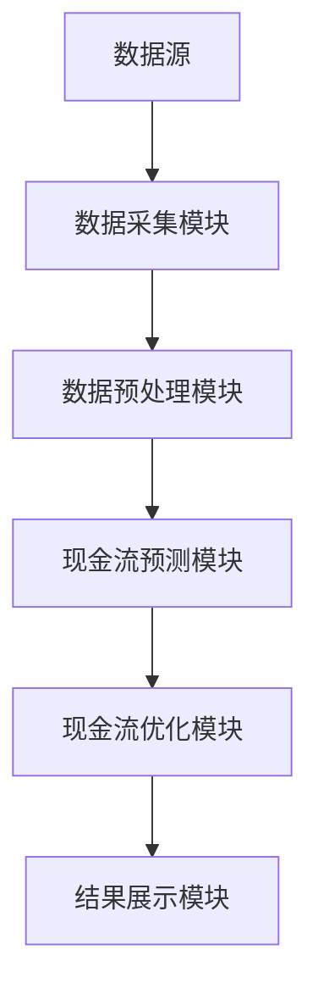

                 


# AI驱动的企业现金流优化系统设计

> 关键词：现金流优化，人工智能，企业财务管理，预测模型，系统架构设计

> 摘要：随着企业数字化转型的推进，现金流优化成为企业生存和发展的关键。本文详细探讨了基于人工智能的企业现金流优化系统的整体设计，从背景、核心概念、算法原理、系统架构到实战项目，系统性地分析了AI在现金流优化中的应用，并通过具体案例展示了系统的实现过程。

---

# 第一部分: 企业现金流优化的背景与意义

## 第1章: 企业现金流优化的背景与意义

### 1.1 企业现金流管理的重要性

- **1.1.1 企业现金流管理的核心目标**  
  现金流管理的核心目标是确保企业在任何时候都有足够的流动性来支付债务、维持运营并抓住发展机会。现金流管理直接影响企业的生存能力和盈利能力。

- **1.1.2 现金流管理对企业生存与发展的意义**  
  现金流是企业的生命线，良好的现金流管理可以降低企业的财务风险，提高抗压能力，同时为企业创造更多价值。

- **1.1.3 AI技术在现金流管理中的应用潜力**  
  人工智能技术可以通过大数据分析和预测模型，帮助企业在复杂多变的市场环境中优化现金流管理，提升决策的准确性和效率。

### 1.2 现金流优化的挑战与机遇

- **1.2.1 现金流管理的传统方法与局限性**  
  传统方法依赖于财务人员的经验和手工计算，存在效率低、准确度不足、难以应对复杂场景等问题。

- **1.2.2 数据驱动与AI驱动的优化优势**  
  数据驱动和AI技术的应用可以显著提高现金流预测的准确性和优化的效率，帮助企业更好地应对市场波动和风险。

- **1.2.3 数字化转型对企业现金流优化的影响**  
  数字化转型为企业提供了更多的数据来源和分析工具，使得AI技术在现金流优化中的应用成为可能。

### 1.3 AI驱动现金流优化的系统性思考

- **1.3.1 系统性优化的核心理念**  
  系统性优化强调从整体出发，将现金流预测、优化和执行作为一个整体来考虑，而非单独处理各个环节。

- **1.3.2 AI技术在现金流优化中的应用场景**  
  AI技术可以应用于现金流预测、风险评估、资金调度优化等多个环节，通过数据驱动的方式提升管理效率。

- **1.3.3 企业现金流优化系统的边界与外延**  
  现金流优化系统的边界包括企业的内部财务数据和外部市场数据，外延则涉及与供应链、银行等外部系统的交互。

---

# 第二部分: AI驱动现金流优化的核心概念与原理

## 第2章: 现金流优化系统的数学模型与算法

### 2.1 现金流优化的数学模型

- **2.1.1 现金流预测的线性回归模型**  
  线性回归模型通过建立现金流与影响因素之间的线性关系，预测未来的现金流。例如，可以将销售额、季节性因素等作为自变量，现金流作为因变量。

  $$ y = \beta_0 + \beta_1x_1 + \beta_2x_2 + \cdots + \beta_nx_n + \epsilon $$

- **2.1.2 基于时间序列的现金流预测模型**  
  时间序列模型（如ARIMA）可以利用历史数据预测未来的现金流，特别适用于具有明显趋势或周期性的数据。

- **2.1.3 现金流优化的动态规划模型**  
  动态规划模型通过分阶段优化，找到现金流的最大化路径或最小化成本的方案。

### 2.2 AI驱动的现金流优化算法

- **2.2.1 基于强化学习的现金流优化算法**  
  强化学习通过模拟环境中的决策过程，优化现金流管理策略。例如，可以使用Q-learning算法来优化资金分配。

  $$ Q(s,a) = r + \gamma \max Q(s',a') $$

- **2.2.2 基于神经网络的现金流预测与优化**  
  神经网络可以通过非线性关系捕捉复杂的现金流变化模式，提高预测的准确性。

- **2.2.3 算法的优缺点对比**  
  表格对比了线性回归、时间序列模型和强化学习在预测精度、计算复杂度和适用场景方面的优缺点。

### 2.3 算法实现的数学推导

- **2.3.1 线性回归模型的数学公式**  
  $$ y = \beta_0 + \beta_1x + \epsilon $$

- **2.3.2 强化学习算法的数学模型**  
  $$ Q(s,a) = r + \gamma \max Q(s',a') $$

---

# 第三部分: AI驱动现金流优化系统的架构设计

## 第3章: 系统架构与功能模块设计

### 3.1 系统架构概述

- **3.1.1 分层架构设计**  
  系统采用分层架构，包括数据层、计算层、应用层和展示层。

- **3.1.2 模块化设计原则**  
  每个功能模块独立设计，便于维护和扩展。

- **3.1.3 系统架构的可扩展性**  
  系统架构设计充分考虑未来可能的功能扩展和性能提升。

### 3.2 核心功能模块设计

- **3.2.1 数据采集与预处理模块**  
  负责收集企业内部和外部的财务数据，并进行清洗和转换。

- **3.2.2 现金流预测模块**  
  使用机器学习模型对未来的现金流进行预测。

- **3.2.3 现金流优化模块**  
  基于预测结果，优化资金分配和管理策略。

- **3.2.4 结果展示与反馈模块**  
  将优化结果以可视化形式展示，并提供反馈机制。

### 3.3 系统架构的Mermaid图



---

# 第四部分: 系统实现与项目实战

## 第4章: 环境搭建与系统实现

### 4.1 环境配置

- **4.1.1 安装Python和相关库**  
  需要安装的库包括Pandas、NumPy、Scikit-learn、TensorFlow等。

### 4.2 系统核心实现源代码

- **4.2.1 数据采集与预处理代码**  
  ```python
  import pandas as pd
  df = pd.read_csv('cash_flow_data.csv')
  df = df.dropna()
  ```

- **4.2.2 现金流预测代码**  
  ```python
  from sklearn.linear_model import LinearRegression
  model = LinearRegression()
  model.fit(X_train, y_train)
  ```

- **4.2.3 现金流优化代码**  
  ```python
  import numpy as np
  def optimize_cash_flow(predicted_flows):
      return np.max(predicted_flows)
  ```

### 4.3 项目实战与案例分析

- **4.3.1 实际案例分析**  
  通过一个具体企业案例，展示系统的实现过程和优化效果。

- **4.3.2 优化结果与反馈**  
  展示优化后的现金流状况，并根据反馈进一步调整模型参数。

---

# 第五部分: 最佳实践与总结

## 第5章: 最佳实践与总结

### 5.1 最佳实践

- **5.1.1 数据质量的重要性**  
  数据的准确性和完整性直接影响预测和优化的效果。

- **5.1.2 模型选择与调优**  
  根据实际情况选择合适的模型，并进行参数调优以提高性能。

### 5.2 小结

- **5.2.1 系统设计的核心思想**  
  系统性优化和数据驱动是AI驱动现金流优化的核心思想。

- **5.2.2 未来发展趋势**  
  随着AI技术的不断发展，现金流优化系统将更加智能化和个性化。

---

# 作者

作者：AI天才研究院/AI Genius Institute & 禅与计算机程序设计艺术 /Zen And The Art of Computer Programming

