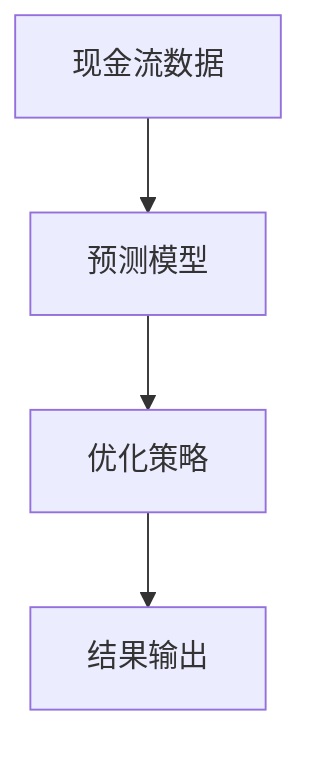
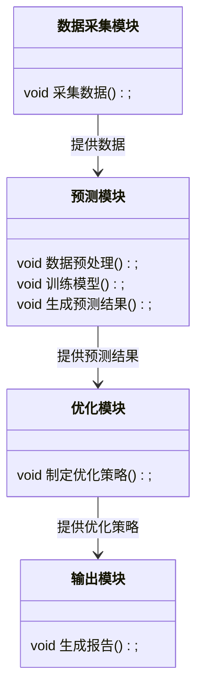
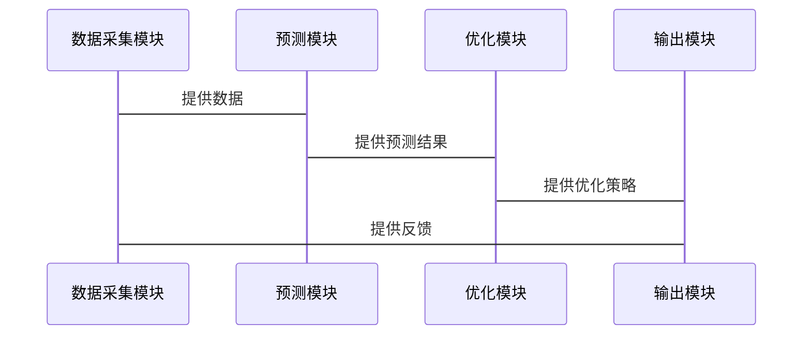

                 


# AI驱动的企业现金流周期优化系统

> 关键词：AI技术，现金流优化，预测模型，时间序列分析，风险评估，企业财务

> 摘要：本文将探讨如何利用人工智能技术优化企业现金流周期，从背景分析到系统架构设计，详细阐述现金流预测、风险评估、优化策略等关键环节，并结合实际案例，展示如何通过AI驱动实现企业现金流的高效管理。

---

# 第一部分: 企业现金流周期优化的背景与意义

## 第1章: 企业现金流周期优化的背景与意义

### 1.1 企业现金流周期的基本概念

#### 1.1.1 企业现金流周期的定义
现金流周期（Cash Flow Cycle）是指企业从收到现金到支付现金的时间间隔。这个周期包括了企业从客户那里收到现金，用于支付供应商、员工以及其他支出，最后再次获得现金的过程。现金流周期的长短直接影响企业的流动性、偿债能力和运营效率。

#### 1.1.2 现金流周期对企业经营的影响
现金流是企业的生命线，现金流周期的长短直接关系到企业的生存和发展。一个长的现金流周期意味着企业需要更多的时间来回收资金，这可能导致资金链断裂的风险增加；而一个短的现金流周期则能够提高资金的使用效率，降低财务风险。

#### 1.1.3 现金流周期优化的必要性
在现代商业环境中，企业面临着复杂多变的市场环境和激烈的竞争压力。优化现金流周期可以帮助企业更好地应对市场波动，降低财务风险，提高资金使用效率，从而增强企业的竞争力。

### 1.2 AI在企业现金流管理中的应用现状

#### 1.2.1 传统现金流管理方法的局限性
传统的现金流管理方法通常依赖于历史数据和经验判断，这种方法在面对复杂多变的市场环境时往往显得力不从心。例如，传统方法难以准确预测未来的现金流波动，也无法快速响应市场变化。

#### 1.2.2 AI技术在现金流预测中的优势
人工智能技术，特别是机器学习和深度学习，具有强大的数据处理和模式识别能力。通过分析大量的历史数据和市场信息，AI可以更准确地预测现金流的变化趋势，帮助企业在面对不确定的市场环境时做出更明智的决策。

#### 1.2.3 当前企业现金流管理的痛点与挑战
当前企业现金流管理的痛点主要包括以下几点：
- 数据的实时性和准确性不足
- 现金流预测的准确性有待提高
- 现金流优化策略的制定缺乏科学性
- 风险评估和应对措施不够完善

### 1.3 本章小结
本章通过介绍现金流周期的基本概念、企业现金流管理的重要性以及AI技术在现金流管理中的应用现状，强调了优化现金流周期的必要性，并指出了当前企业在现金流管理中存在的痛点和挑战。

---

# 第二部分: 现金流周期优化的核心概念与联系

## 第2章: 现金流周期优化的核心概念

### 2.1 现金流预测模型

#### 2.1.1 时间序列预测的基本原理
时间序列预测是一种基于历史数据预测未来趋势的方法。现金流预测可以通过分析过去一段时间内的现金流数据，识别出其中的规律和趋势，从而预测未来的现金流情况。

#### 2.1.2 现金流预测的关键特征分析
在进行现金流预测时，需要考虑以下关键特征：
- 周期性：现金流往往具有一定的周期性，例如季节性波动。
- 趋势性：现金流可能呈现出上升或下降的趋势。
- 随机性：现金流受到多种不确定因素的影响，具有随机性。

#### 2.1.3 现金流预测的准确性评估
现金流预测的准确性可以通过以下指标进行评估：
- 均方误差（MSE）
- 平均绝对误差（MAE）
- 毛利率（R²）

### 2.2 现金流风险评估与优化

#### 2.2.1 现金流波动性分析
现金流的波动性反映了现金流的变化程度。高波动性的现金流意味着企业的财务状况不稳定，风险较高。

#### 2.2.2 现金流风险的量化方法
现金流风险可以通过以下方法进行量化：
- 方差和标准差：用于衡量现金流的波动性。
- 风险价值（VaR）：用于估计在一定置信水平下可能的最大损失。

#### 2.2.3 现金流优化的目标与边界
现金流优化的目标是在满足企业运营需求的前提下，尽可能缩短现金流周期，提高资金使用效率。优化的边界包括：
- 确保企业偿债能力
- 维持企业运营的连续性
- 符合相关法律法规

### 2.3 现金流周期优化系统的构成要素

#### 2.3.1 数据输入模块
数据输入模块负责收集和整理企业的历史现金流数据以及其他相关数据，例如销售数据、市场数据等。

#### 2.3.2 预测模型模块
预测模型模块基于收集到的数据，利用机器学习算法进行现金流预测。

#### 2.3.3 优化策略模块
优化策略模块根据预测结果，制定出最优的现金流管理策略。

#### 2.3.4 结果输出模块
结果输出模块将优化策略以直观的方式呈现给企业决策者，例如生成报告或提供实时反馈。

### 2.4 核心概念的联系与对比

#### 2.4.1 现金流预测模型的对比分析

| 模型名称 | 基础原理 | 优点 | 缺点 |
|----------|----------|------|------|
| 线性回归 | 假设变量之间存在线性关系 | 简单易懂 | 无法捕捉非线性关系 |
| ARIMA    | 基于时间序列的自回归和移动平均模型 | 能够捕捉趋势和周期性 | 对异常值敏感 |
| 随机森林 | 基于决策树的集成学习方法 | 高精度，能够捕捉复杂关系 | 黑箱模型，解释性差 |

#### 2.4.2 现金流周期优化系统的实体关系图


---

# 第三部分: 现金流周期优化系统的算法原理

## 第3章: 现金流预测算法原理

### 3.1 线性回归模型

#### 3.1.1 线性回归模型的数学公式
线性回归模型的数学公式为：
$$ y = \beta_0 + \beta_1 x + \epsilon $$
其中，$y$ 是预测目标，$x$ 是自变量，$\beta_0$ 和 $\beta_1$ 是回归系数，$\epsilon$ 是误差项。

#### 3.1.2 线性回归模型的实现步骤
1. 数据预处理：收集和整理数据，处理缺失值和异常值。
2. 模型训练：利用最小二乘法求解回归系数。
3. 模型评估：计算回归模型的均方误差（MSE）和决定系数（R²）。
4. 模型优化：通过调整模型参数或引入正则化项来提高模型的泛化能力。

#### 3.1.3 线性回归模型的优缺点
- 优点：简单易懂，计算速度快。
- 缺点：无法捕捉非线性关系，容易受到异常值的影响。

### 3.2 时间序列预测模型（ARIMA）

#### 3.2.1 ARIMA模型的数学公式
ARIMA模型的数学公式为：
$$ (1 - B)^d (1 - \phi_1 B - \dots - \phi_p B^p)(1 - \theta_1 B - \dots - \theta_q B^q) X_t = \epsilon_t $$
其中，$d$ 是差分的阶数，$p$ 是自回归阶数，$q$ 是移动平均阶数，$\phi_i$ 是自回归系数，$\theta_i$ 是移动平均系数，$\epsilon_t$ 是白噪声。

#### 3.2.2 ARIMA模型的实现步骤
1. 数据预处理：对数据进行差分处理，使其平稳。
2. 模型参数选择：通过网格搜索等方法选择最优的模型参数。
3. 模型训练：利用最大似然估计法估计模型参数。
4. 模型评估：计算模型的均方误差（MSE）和准确率。
5. 模型预测：利用训练好的模型进行未来现金流的预测。

#### 3.2.3 ARIMA模型的优缺点
- 优点：能够捕捉时间序列的趋势和周期性。
- 缺点：对异常值敏感，模型选择较为复杂。

### 3.3 机器学习模型（随机森林）

#### 3.3.1 随机森林模型的数学公式
随机森林模型是一种基于决策树的集成学习方法，其数学公式较为复杂，通常通过投票或平均的方式进行预测。

#### 3.3.2 随机森林模型的实现步骤
1. 数据预处理：收集和整理数据，处理缺失值和异常值。
2. 特征选择：选择对现金流预测影响较大的特征。
3. 模型训练：通过随机采样和特征采样生成多棵决策树，并将这些树集成起来。
4. 模型评估：计算模型的准确率、召回率和F1分数。
5. 模型预测：利用训练好的随机森林模型进行未来现金流的预测。

#### 3.3.3 随机森林模型的优缺点
- 优点：高精度，能够捕捉复杂关系。
- 缺点：黑箱模型，解释性差。

---

# 第四部分: 现金流周期优化系统的架构设计

## 第4章: 系统架构设计

### 4.1 系统功能设计

#### 4.1.1 数据采集模块
数据采集模块负责从企业的财务系统中获取现金流数据以及其他相关数据，例如销售数据、市场数据等。

#### 4.1.2 预测模块
预测模块基于历史数据，利用机器学习算法进行现金流预测，并生成预测结果。

#### 4.1.3 优化模块
优化模块根据预测结果，结合企业的实际需求，制定出最优的现金流管理策略。

#### 4.1.4 输出模块
输出模块将优化策略以直观的方式呈现给企业决策者，例如生成报告或提供实时反馈。

### 4.2 系统架构设计

#### 4.2.1 系统类图


#### 4.2.2 系统交互图


---

# 第五部分: 现金流周期优化系统的项目实战

## 第5章: 项目实战

### 5.1 环境安装与配置

#### 5.1.1 安装Python环境
建议使用Anaconda作为Python环境管理工具，可以通过官方网站下载并安装。

#### 5.1.2 安装必要的Python库
需要安装以下Python库：
- `pandas`：用于数据处理
- `numpy`：用于数值计算
- `scikit-learn`：用于机器学习算法
- `matplotlib`：用于数据可视化
- `pymysql`：用于数据库连接

安装命令：
```bash
pip install pandas numpy scikit-learn matplotlib pymysql
```

### 5.2 系统核心代码实现

#### 5.2.1 数据预处理
```python
import pandas as pd
import numpy as np

# 读取数据
data = pd.read_csv('cash_flow.csv')

# 处理缺失值
data = data.dropna()

# 标准化数据
from sklearn.preprocessing import StandardScaler
scaler = StandardScaler()
data_scaled = scaler.fit_transform(data)
```

#### 5.2.2 训练现金流预测模型
```python
from sklearn.ensemble import RandomForestRegressor

# 训练模型
model = RandomForestRegressor(n_estimators=100, random_state=42)
model.fit(X_train, y_train)

# 预测结果
y_pred = model.predict(X_test)
```

#### 5.2.3 制定优化策略
```python
# 计算预测误差
error = abs(y_pred - y_test).mean()

# 根据误差调整优化策略
if error < 0.1:
    print("策略1：维持当前现金流周期")
elif error < 0.2:
    print("策略2：优化应收账款管理")
else:
    print("策略3：加强现金流监控")
```

### 5.3 案例分析与详细解读

#### 5.3.1 案例背景
某制造企业过去一年的现金流数据如下：
| 月份 | 现金流入（万元） | 现金流出（万元） | 净现金流（万元） |
|------|------------------|------------------|------------------|
| 1月  | 100              | 80               | 20               |
| 2月  | 120              | 90               | 30               |
| 3月  | 150              | 100              | 50               |
| ...  | ...              | ...              | ...              |

#### 5.3.2 数据预处理
使用`pandas`和`numpy`对数据进行清洗和标准化处理，确保数据的完整性和一致性。

#### 5.3.3 模型训练与预测
利用随机森林回归模型对未来的现金流进行预测，并评估模型的准确性。

#### 5.3.4 优化策略制定
根据预测结果和实际现金流的误差，制定相应的优化策略，例如优化应收账款管理或加强现金流监控。

---

# 第六部分: 总结与展望

## 第6章: 总结与展望

### 6.1 本章总结
本文详细探讨了AI驱动的企业现金流周期优化系统，从背景分析到系统架构设计，再到项目实战，全面阐述了如何利用人工智能技术优化企业的现金流管理。通过实际案例的分析，展示了AI技术在现金流预测和优化中的强大能力。

### 6.2 未来展望
随着AI技术的不断发展，现金流周期优化系统将更加智能化和自动化。未来的研究方向可能包括：
- 更加精准的现金流预测模型
- 更加高效的现金流优化算法
- 更加智能的现金流管理系统

### 6.3 最佳实践 tips
- 数据质量是现金流预测的关键，确保数据的完整性和准确性。
- 在选择模型时，需根据具体业务需求和数据特征进行选择。
- 定期更新模型参数，以适应市场环境的变化。

---

# 作者：AI天才研究院/AI Genius Institute & 禅与计算机程序设计艺术 /Zen And The Art of Computer Programming

