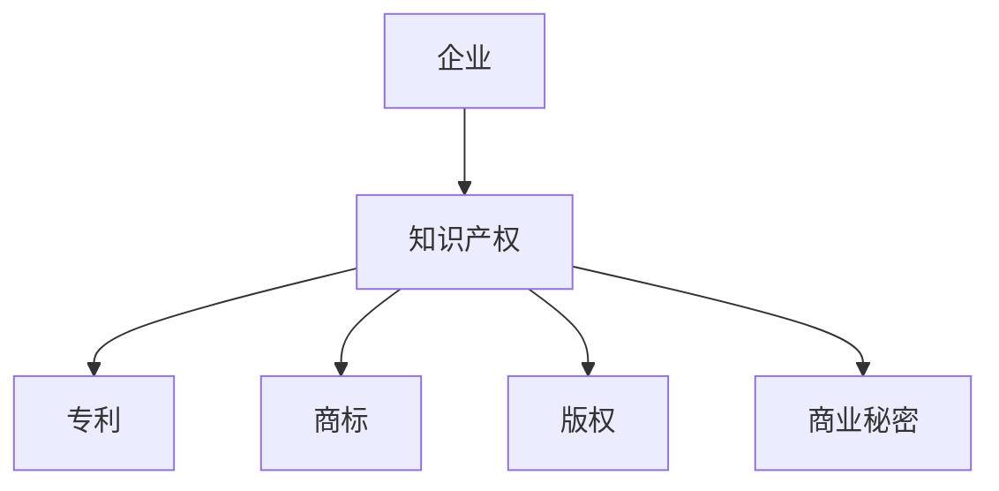
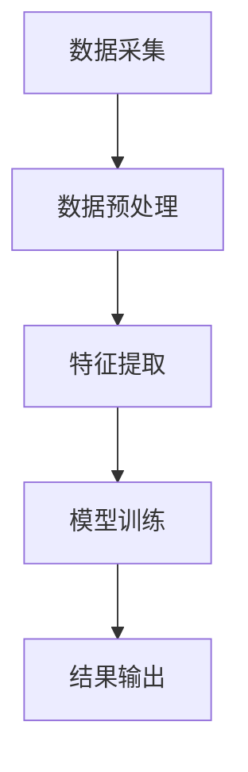
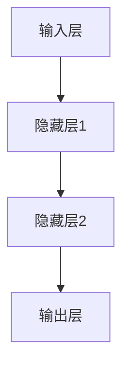
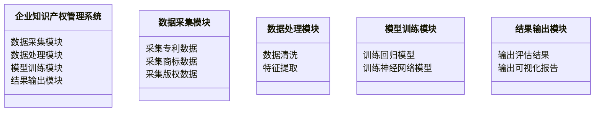
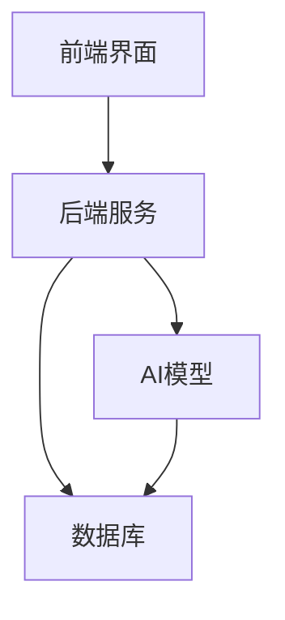

                 


# AI驱动的企业知识产权价值评估与管理

> 关键词：AI技术，知识产权，价值评估，企业管理，机器学习

> 摘要：随着人工智能技术的飞速发展，其在企业知识产权价值评估与管理中的应用日益广泛。本文将从AI技术的基本概念出发，详细探讨其在知识产权价值评估中的核心原理、算法流程、系统架构设计，以及在实际项目中的应用案例。通过分析AI技术的优势与挑战，本文旨在为企业提供一套高效、准确的知识产权价值评估与管理方案。

---

# 第一部分: AI驱动的企业知识产权价值评估与管理概述

## 第1章: 企业知识产权价值评估的背景与挑战

### 1.1 知识产权的基本概念与分类

知识产权是企业重要的无形资产，主要包括专利、商标、版权和商业秘密等类别。这些资产不仅体现了企业的技术创新能力，还直接影响企业的市场竞争力和经济价值。传统上，知识产权的评估主要依赖于人工分析和经验判断，这种方法不仅耗时，而且容易受到主观因素的影响，难以保证评估的准确性和全面性。

### 1.2 传统知识产权评估方法的局限性

传统的知识产权评估方法主要包括市场法、成本法和收益法。这些方法在实际应用中存在以下问题：
1. **数据获取难度大**：需要收集大量的市场交易数据和历史案例，数据获取成本高。
2. **评估周期长**：人工分析需要大量时间，难以满足企业快速决策的需求。
3. **结果不够准确**：由于人为因素的干扰，评估结果可能存在偏差。

### 1.3 AI技术在知识产权评估中的应用前景

人工智能技术的快速发展为企业知识产权价值评估带来了新的机遇。AI技术可以通过自然语言处理（NLP）、机器学习和深度学习等方法，快速分析海量数据，提取关键信息，从而提高评估的准确性和效率。此外，AI技术还可以帮助企业发现潜在的知识产权风险，优化知识产权管理策略。

---

## 第2章: 企业知识产权价值评估的核心概念与联系

### 2.1 核心概念原理

知识产权价值评估的核心在于将复杂的法律和市场因素转化为可量化的指标。AI驱动的评估方法通过构建数学模型，将专利的技术复杂度、市场应用前景和法律风险等因素进行量化分析，从而得出知识产权的综合价值。

### 2.2 核心概念属性特征对比表格

以下表格对比了传统评估方法和AI驱动评估方法在数据来源、分析速度、精度和适用场景等方面的差异：

| 比较维度         | 传统评估方法               | AI驱动评估方法               |
|------------------|----------------------------|------------------------------|
| 数据来源         | 结构化数据                 | 结构化+非结构化数据           |
| 分析速度         | 较慢                      | 快速                        |
| 精度             | 较低                      | 高                          |
| 适用场景         | 简单场景                  | 复杂场景                    |

### 2.3 ER实体关系图架构

以下是企业知识产权价值评估的核心概念关系图：



---

## 第3章: AI驱动知识产权价值评估的算法原理

### 3.1 算法原理概述

AI驱动的知识产权价值评估主要基于机器学习和深度学习算法。以下是几种常用的算法及其应用场景：

1. **机器学习**：适用于基于历史数据的模式识别和预测。例如，可以利用线性回归模型预测专利的市场价值。
2. **深度学习**：适用于复杂的非结构化数据处理，如自然语言处理（NLP）。例如，可以利用神经网络模型分析专利文本的技术复杂度。

### 3.2 算法流程图

以下是AI驱动知识产权价值评估的算法流程图：



### 3.3 数学模型与公式

#### 3.3.1 线性回归模型

线性回归模型用于预测知识产权的市场价值，公式如下：

$$ y = \beta_0 + \beta_1x_1 + \beta_2x_2 + \dots + \beta_nx_n $$

其中：
- $y$ 表示预测的市场价值
- $\beta_0$ 是截距
- $x_i$ 是各个特征变量
- $\beta_i$ 是对应的回归系数

#### 3.3.2 神经网络模型

神经网络模型用于处理复杂的非结构化数据，例如专利文本分析。以下是一个简单的神经网络结构示意图：



---

## 第4章: AI驱动知识产权价值评估的系统架构设计

### 4.1 系统功能设计

以下是系统功能设计的领域模型：



### 4.2 系统架构设计

以下是系统的整体架构图：



### 4.3 系统接口设计

以下是系统的接口设计：

1. 数据接口：负责与外部数据源对接，获取专利、商标等数据。
2. 模型接口：负责与AI模型对接，进行数据处理和预测。
3. 输出接口：负责将评估结果输出到前端界面或报告中。

---

## 第5章: AI驱动知识产权价值评估的项目实战

### 5.1 项目背景

本项目旨在利用AI技术对企业专利的市场价值进行评估。我们选择某科技企业的专利数据作为案例，分析其技术复杂度、市场应用前景和法律风险。

### 5.2 项目环境配置

以下是项目环境配置：

- 操作系统：Linux
- 编程语言：Python
- 开发工具：Jupyter Notebook
- 数据库：MySQL

### 5.3 核心代码实现

以下是核心代码实现：

```python
# 数据清洗代码
import pandas as pd
data = pd.read_csv('patent_data.csv')
data.dropna(inplace=True)
data.to_csv('cleaned_data.csv', index=False)

# 模型训练代码
from sklearn.linear_model import LinearRegression
from sklearn.metrics import mean_squared_error
from sklearn.model_selection import train_test_split

X = data[['技术复杂度', '市场前景', '法律风险']]
y = data['市场价值']

X_train, X_test, y_train, y_test = train_test_split(X, y, test_size=0.2, random_state=42)

model = LinearRegression()
model.fit(X_train, y_train)
y_pred = model.predict(X_test)
print('均方误差:', mean_squared_error(y_test, y_pred))
```

### 5.4 项目小结

通过本项目，我们成功利用AI技术对企业专利的市场价值进行了评估。模型的均方误差较低，说明评估结果具有较高的准确性。这为企业优化知识产权管理策略提供了有力支持。

---

## 第6章: AI驱动知识产权价值评估的最佳实践与小结

### 6.1 最佳实践

1. 数据预处理：确保数据的完整性和准确性。
2. 模型选择：根据具体场景选择合适的算法。
3. 结果分析：结合业务背景对评估结果进行解释和优化。

### 6.2 小结

本文详细探讨了AI驱动的企业知识产权价值评估与管理的各个方面，包括核心概念、算法原理、系统架构设计和项目实战。通过实际案例分析，我们验证了AI技术在知识产权评估中的优势和潜力。未来，随着AI技术的不断发展，其在知识产权管理中的应用将更加广泛和深入。

---

作者：AI天才研究院/AI Genius Institute & 禅与计算机程序设计艺术 /Zen And The Art of Computer Programming

