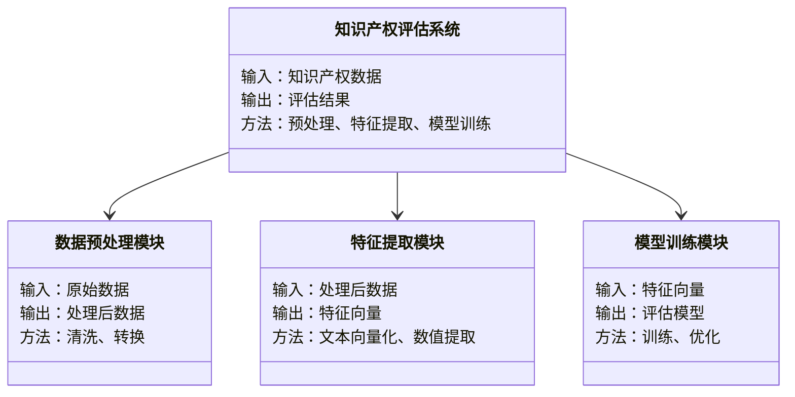

                 


# AI驱动的企业知识产权价值评估系统

> 关键词：人工智能，知识产权，价值评估，企业价值，技术驱动，知识图谱

> 摘要：随着人工智能技术的快速发展，知识产权在企业中的价值评估变得越来越重要。本文探讨了如何利用AI技术构建企业知识产权价值评估系统，涵盖了知识产权的基本概念、评估指标、AI算法原理、系统架构设计以及实际应用案例。通过深入分析，本文旨在为企业提供一种高效、准确的知识产权价值评估方法，助力企业做出明智的决策。

---

## 第一部分：AI驱动的企业知识产权价值评估系统概述

### 第1章：企业知识产权价值评估的背景与意义

#### 1.1 知识产权的基本概念
##### 1.1.1 知识产权的定义与分类
知识产权（Intellectual Property，IP）是指人们在创造性的智力劳动中产生的成果所享有的权利。它主要分为以下几类：
- **专利权**：保护发明的实用性，涵盖发明专利、实用新型专利和外观设计专利。
- **商标权**：用于区分商品或服务的来源，保护品牌标识。
- **著作权**：保护文学、艺术和科学作品的原创性。
- **商业秘密**：未公开的商业信息，具有经济价值并采取保密措施。

##### 1.1.2 企业知识产权的重要性
知识产权是企业的核心资产之一，能够为企业带来竞争优势。它不仅保护了企业的创新成果，还能通过转让、许可等方式为企业创造经济价值。

##### 1.1.3 知识产权价值评估的必要性
随着市场竞争的加剧，知识产权的价值在企业并购、融资等活动中变得至关重要。准确评估知识产权的价值，能够帮助企业做出更明智的决策。

#### 1.2 AI在知识产权管理中的作用
##### 1.2.1 AI技术对企业知识产权管理的赋能
AI技术可以通过自动化处理和数据分析，提高知识产权的检索、分类和评估效率。

##### 1.2.2 AI在知识产权检索与分析中的应用
AI可以利用自然语言处理技术，快速检索和分析大量的专利文献，帮助企业发现技术趋势和竞争对手的动态。

##### 1.2.3 AI驱动的知识产权价值评估的优势
AI能够基于海量数据，构建复杂的数学模型，提供更精准的价值评估结果。

#### 1.3 企业知识产权价值评估系统的核心价值
##### 1.3.1 提高评估效率
通过自动化和智能化手段，显著缩短评估时间。

##### 1.3.2 增强评估准确性
AI算法能够处理复杂的数据关系，减少人为误差，提高评估的准确性。

##### 1.3.3 为企业决策提供数据支持
知识产权价值评估结果能够为企业并购、投资决策提供重要参考。

#### 1.4 本章小结
本章介绍了知识产权的基本概念、企业知识产权管理的重要性，以及AI技术在其中发挥的作用。通过AI驱动的知识产权价值评估系统，企业能够更高效、准确地进行知识产权管理。

---

## 第二部分：知识产权价值评估的核心概念与联系

### 第2章：知识产权价值评估的核心要素

#### 2.1 知识产权的分类与属性
##### 2.1.1 专利
专利是保护发明创造的法律工具，具有独占性、时间性和地域性。

##### 2.1.2 商标
商标是区分商品或服务来源的标识，具有显著性和独特性。

##### 2.1.3 著作权
著作权保护文学、艺术和科学作品的原创性，包括版权和邻接权。

##### 2.1.4 商业秘密
商业秘密是未公开的商业信息，具有实用性和保密性。

#### 2.2 知识产权价值的影响因素
##### 2.2.1 技术先进性
技术越先进，知识产权的市场价值越高。

##### 2.2.2 市场需求
市场需求越大，知识产权的经济价值越高。

##### 2.2.3 法律保护力度
法律保护越完善，知识产权的价值越容易实现。

##### 2.2.4 经济效益
知识产权的经济效益是其价值的重要体现。

#### 2.3 知识产权价值评估的指标体系
##### 2.3.1 技术指标
包括技术的创新性、实用性和可扩展性。

##### 2.3.2 市场指标
包括市场规模、竞争情况和市场需求。

##### 2.3.3 法律指标
包括法律保护的力度、权利的有效性和法律风险。

##### 2.3.4 经济指标
包括经济收益、成本和投资回报率。

#### 2.4 本章小结
本章详细介绍了知识产权的分类、价值影响因素和评估指标体系，为后续的AI价值评估提供了理论基础。

---

## 第三部分：知识产权价值评估的算法原理

### 第3章：基于AI的知识产权价值评估算法

#### 3.1 知识产权文本相似度计算
##### 3.1.1 文本预处理
包括分词、去除停用词和词干提取等步骤。

##### 3.1.2 向量空间模型
将文本转换为向量表示，计算向量之间的相似度。

##### 3.1.3 深度学习模型
使用如BERT等模型进行文本表示，计算相似度。

#### 3.2 知识产权分类与聚类算法
##### 3.2.1 分类算法
包括支持向量机（SVM）、随机森林和神经网络等。

##### 3.2.2 聚类算法
包括K-means、层次聚类和DBSCAN等。

##### 3.2.3 混淆矩阵与评估指标
包括准确率、召回率和F1值等。

#### 3.3 知识产权价值预测模型
##### 3.3.1 线性回归模型
用于预测连续型变量，如知识产权的经济价值。

##### 3.3.2 支持向量机模型
适用于分类和回归问题，具有较高的准确率。

##### 3.3.3 神经网络模型
通过多层感知机或卷积神经网络进行复杂模式识别。

#### 3.4 算法实现的数学模型与公式
##### 3.4.1 文本相似度计算公式
$$ \text{相似度} = \frac{\sum w_i \cdot x_i \cdot y_i}{\sqrt{\sum w_i^2 x_i^2} \cdot \sqrt{\sum w_i^2 y_i^2}} $$

##### 3.4.2 线性回归模型
$$ y = \beta_0 + \beta_1 x + \epsilon $$

---

## 第四部分：系统分析与架构设计

### 第4章：系统分析与架构设计

#### 4.1 系统功能设计
##### 4.1.1 领域模型类图


#### 4.2 系统架构设计
##### 4.2.1 系统架构图


---

## 第五部分：项目实战

### 第5章：项目实战

#### 5.1 环境安装
安装Python、TensorFlow、Keras等工具。

#### 5.2 核心代码实现
```python
import numpy as np
from sklearn.metrics.pairwise import cosine_similarity

# 示例代码：计算文本相似度
def calculate_similarity(text1, text2):
    vectorizer = TfidfVectorizer()
    vectors = vectorizer.fit_transform([text1, text2])
    return cosine_similarity(vectors[0], vectors[1])

# 示例代码：线性回归模型
from sklearn.linear_model import LinearRegression
model = LinearRegression()
model.fit(X, y)
```

#### 5.3 案例分析
以某企业专利评估为例，展示系统如何进行数据处理、特征提取和模型训练。

#### 5.4 项目总结
总结项目实施过程中的经验教训，提出改进建议。

---

## 第六部分：最佳实践与小结

### 第6章：最佳实践与小结

#### 6.1 最佳实践
- 数据质量是关键，确保数据的准确性和完整性。
- 模型调优是提升评估准确性的关键。
- 遵守法律法规，确保知识产权评估的合法性。

#### 6.2 小结
本文详细探讨了AI驱动的企业知识产权价值评估系统，从理论到实践，为企业提供了高效、准确的评估方法。

---

## 作者：AI天才研究院/AI Genius Institute & 禅与计算机程序设计艺术 /Zen And The Art of Computer Programming

---

希望这篇文章能够为您提供清晰的思路和详细的指导，帮助您构建一个高效、准确的AI驱动企业知识产权价值评估系统。

