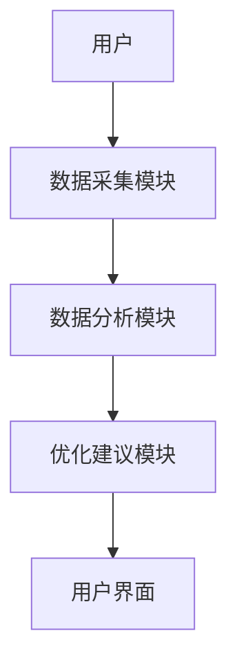

                 


# AI驱动的企业知识产权战略：专利组合优化与布局的智能化

## 关键词：AI, 知识产权, 专利组合, 优化布局, 智能化, 技术驱动

## 摘要：  
随着人工智能技术的快速发展，企业知识产权管理正在经历一场深刻的变革。传统的专利管理方式逐渐被智能化的专利组合优化与布局所取代。本文将深入探讨AI技术如何驱动企业知识产权战略，从专利组合优化的核心概念到智能化布局的实现，再到实际案例分析，为企业提供一条清晰的路径，以在激烈的市场竞争中构建高效的知识产权保护体系。

---

## 第一部分: AI驱动的企业知识产权战略基础

### 第1章: 知识产权与专利管理概述

#### 1.1 知识产权的基本概念
##### 1.1.1 知识产权的定义与范围  
知识产权（Intellectual Property，IP）是指人类在智力活动领域创造的成果，主要包括专利权、商标权、著作权、外观设计权等。专利权是其中最重要的形式之一，涉及技术发明的保护。  

##### 1.1.2 专利的基本概念与特点  
专利是一种法律保护机制，用于保护发明人对其发明的独占权。专利的核心特点包括：  
- **独占性**：专利权人在一定期限内对发明享有 exclusive 的使用权和转让权。  
- **地域性**：专利权具有地域性，仅在授权的国家或地区内有效。  
- **时间性**：专利权的有效期通常为 20 年（发明专利）或 15 年（实用新型专利）。  

##### 1.1.3 企业知识产权管理的重要性  
企业知识产权管理是企业创新战略的核心组成部分。通过有效的知识产权管理，企业可以保护自身的创新成果，防止竞争对手的侵权，同时也能通过专利布局获取商业竞争优势。  

---

#### 1.2 AI技术在知识产权管理中的应用  
##### 1.2.1 AI技术的基本概念与发展趋势  
人工智能（AI）是模拟人类智能的计算机系统，其核心技术包括机器学习（ML）、自然语言处理（NLP）、计算机视觉（CV）等。AI技术的发展为企业知识产权管理提供了新的工具和方法。  

##### 1.2.2 AI在知识产权管理中的优势  
AI技术在知识产权管理中的优势主要体现在以下几点：  
- **高效性**：AI能够快速处理海量专利数据，帮助企业在短时间内完成专利检索、分析和评估。  
- **准确性**：AI通过深度学习模型可以识别潜在的专利风险和机会，提高专利分析的准确性。  
- **智能化**：AI能够根据企业的技术创新方向，自动推荐相关的专利布局策略。  

##### 1.2.3 企业知识产权战略的智能化转型  
企业的知识产权战略需要从传统的被动防御模式向主动进攻模式转变。通过AI技术，企业可以实现专利组合的动态优化，确保专利布局与企业战略目标保持一致。  

---

#### 1.3 专利组合优化与布局的核心要素  
##### 1.3.1 专利组合的定义与作用  
专利组合是指一组相互关联的专利，共同构成企业的知识产权保护体系。专利组合的作用包括：  
- 提高企业的技术竞争力；  
- 降低专利被无效的风险；  
- 实现技术覆盖的最大化。  

##### 1.3.2 专利布局的策略与目标  
专利布局的策略包括：  
- **技术布局**：围绕企业的核心技术进行专利申请，确保技术领域的全面覆盖。  
- **地域布局**：根据目标市场选择专利申请的国家或地区。  
- **时间布局**：合理安排专利的申请时间，确保专利的有效期与技术生命周期相匹配。  

##### 1.3.3 智能化专利管理的必要性  
随着技术的快速迭代，企业需要不断调整专利组合以应对市场变化。AI技术能够帮助企业实现专利管理的智能化，提高专利布局的效率和效果。  

---

## 第2章: 企业知识产权战略的背景与挑战

### 2.1 企业知识产权管理的现状  
#### 2.1.1 传统专利管理的局限性  
传统的专利管理方式主要依赖人工操作，存在效率低、成本高、覆盖面窄等问题。例如，企业在专利检索和分析时，往往需要投入大量的人力和时间。  

#### 2.1.2 知识产权保护的全球化趋势  
随着全球化的深入，企业的技术成果可能面临跨国竞争。如何在全球范围内进行专利布局，成为企业知识产权管理的重要挑战。  

#### 2.1.3 企业专利布局的复杂性与挑战  
专利布局需要考虑技术、市场、法律等多个因素，复杂性较高。企业需要在有限的资源条件下，找到最优的专利组合策略。  

---

### 2.2 AI技术在专利管理中的应用背景  
#### 2.2.1 数据驱动的知识产权管理  
AI技术的核心是数据驱动的分析能力。通过AI技术，企业可以利用大数据分析技术，从海量专利数据中提取有价值的信息。  

#### 2.2.2 智能化专利分析工具的发展  
随着NLP和深度学习技术的进步，智能化专利分析工具逐渐成熟。这些工具能够自动识别专利的技术领域、发明人、申请日期等信息，并生成分析报告。  

#### 2.2.3 企业创新与知识产权保护的平衡  
企业在创新过程中需要平衡研发投入与知识产权保护的关系。AI技术可以帮助企业在创新早期阶段就进行专利布局，避免后期的专利纠纷。  

---

### 2.3 专利组合优化的智能化需求  
#### 2.3.1 专利组合优化的定义与目标  
专利组合优化的目标是通过调整专利组合的结构和内容，最大化专利的价值。  

#### 2.3.2 AI技术在专利组合优化中的作用  
AI技术可以通过以下方式优化专利组合：  
- **技术分析**：基于AI的文本挖掘技术，分析专利的技术内容，识别潜在的技术空白。  
- **数据挖掘**：通过机器学习算法，发现专利之间的关联性，优化专利组合的覆盖范围。  
- **风险评估**：利用AI进行专利稳定性分析，降低专利被无效的风险。  

#### 2.3.3 企业知识产权战略的智能化转型  
企业需要将AI技术融入知识产权战略，构建智能化的专利管理平台，实现专利组合的动态优化和高效管理。  

---

## 第3章: 专利组合优化的核心概念与技术

### 3.1 专利组合优化的基本原理  
#### 3.1.1 专利组合优化的定义与目标  
专利组合优化是指通过对专利组合的结构和内容进行调整，以实现专利组合的最大价值。  

#### 3.1.2 专利组合优化的关键因素  
专利组合优化的关键因素包括：  
- 技术相关性：专利之间的技术关联性影响组合的整体价值。  
- 市场覆盖：专利组合是否覆盖目标市场。  
- 时间因素：专利的有效期与技术生命周期的匹配。  

---

#### 3.1.3 AI技术在专利组合优化中的应用  
AI技术可以通过以下方式优化专利组合：  
- **技术分析**：基于NLP技术，分析专利的技术内容，识别技术趋势。  
- **数据挖掘**：利用机器学习算法，发现专利之间的关联性，优化组合的覆盖范围。  
- **风险评估**：通过AI进行专利稳定性分析，降低专利被无效的风险。  

---

### 3.2 专利组合优化的算法原理  
#### 3.2.1 专利组合优化的算法选择  
常用的专利组合优化算法包括：  
- 协同过滤算法：用于推荐相关的专利组合。  
- 聚类分析算法：用于发现专利之间的相似性。  
- 深度学习算法：用于复杂的专利组合优化问题。  

#### 3.2.2 专利组合优化的数学模型  
以下是一个简单的专利组合优化模型：  

$$
\text{目标函数} = \sum_{i=1}^{n} w_i \cdot x_i
$$  

其中，$w_i$ 是专利 $i$ 的权重，$x_i$ 是专利 $i$ 是否被选入组合的变量。  

---

#### 3.2.3 专利组合优化的实现步骤  
1. **数据采集**：收集相关专利数据。  
2. **数据预处理**：清洗和标注数据。  
3. **模型训练**：基于机器学习算法训练模型。  
4. **优化建议**：根据模型结果生成专利组合优化建议。  

---

## 第4章: 企业知识产权战略的智能化实现

### 4.1 智能化专利管理平台的建设  
#### 4.1.1 系统功能设计  
智能化专利管理平台的功能模块包括：  
- 数据采集模块：从专利数据库中获取专利数据。  
- 数据分析模块：利用AI技术进行专利分析。  
- 优化建议模块：生成专利组合优化建议。  

#### 4.1.2 系统架构设计  
智能化专利管理平台的系统架构如下：  



---

### 4.2 智能化专利管理的实现技术  
#### 4.2.1 NLP技术在专利分析中的应用  
自然语言处理（NLP）技术可以帮助企业从专利文本中提取关键词和主题，进行技术趋势分析。  

#### 4.2.2 机器学习算法在专利组合优化中的应用  
机器学习算法可以用于专利组合的推荐和优化。例如，基于协同过滤算法的专利推荐系统可以帮助企业快速找到相关的专利组合。  

---

### 4.3 智能化专利管理的案例分析  
#### 4.3.1 案例背景  
某高科技企业希望优化其人工智能领域的专利组合。  

#### 4.3.2 数据采集与分析  
通过AI技术，企业从全球专利数据库中筛选出与人工智能相关的专利，并进行技术分析。  

#### 4.3.3 优化建议  
AI系统根据分析结果，推荐了一系列与企业技术方向匹配的专利组合，并评估了这些专利的稳定性。  

---

## 第5章: 项目实战与最佳实践

### 5.1 项目环境与工具安装  
#### 5.1.1 开发环境  
- 操作系统：Linux/Windows/macOS  
- 开发工具：Python、Jupyter Notebook  
- 专利数据库：PatentScope、.patentdb  

#### 5.1.2 AI库安装  
- 使用 `scikit-learn` 进行机器学习分析。  
- 使用 `nltk` 和 `spaCy` 进行自然语言处理。  

---

### 5.2 核心算法实现  
#### 5.2.1 专利组合优化算法实现  
以下是一个基于协同过滤算法的专利组合优化示例代码：  

```python
from sklearn.metrics.pairwise import cosine_similarity

# 假设 patent_matrix 是专利的特征向量矩阵
similarity_matrix = cosine_similarity(patent_matrix)

# 找出与目标专利最相似的专利
def get_recommendations(patent_id):
    similarities = similarity_matrix[patent_id]
    return sorted(enumerate(similarities), key=lambda x: x[1], reverse=True)
```

#### 5.2.2 优化建议生成  
通过分析专利的相似性矩阵，系统可以自动生成专利组合优化建议，并评估每个组合的价值。  

---

### 5.3 项目实战与案例分析  
#### 5.3.1 案例背景  
某企业希望在人工智能领域构建一个强大的专利组合。  

#### 5.3.2 数据分析与处理  
通过AI技术，企业从全球专利数据库中筛选出与人工智能相关的专利，并进行技术分析。  

#### 5.3.3 优化建议  
AI系统根据分析结果，推荐了一系列与企业技术方向匹配的专利组合，并评估了这些专利的稳定性。  

---

## 第6章: 结论与展望

### 6.1 结论  
通过AI技术，企业可以实现专利组合优化与布局的智能化，提高知识产权管理的效率和效果。  

### 6.2 未来展望  
未来，随着AI技术的进一步发展，企业知识产权管理将更加智能化和自动化。例如，基于深度学习的专利分析技术将帮助企业发现更深层次的技术关联性。  

---

## 总结  
本文详细探讨了AI技术在企业知识产权战略中的应用，从专利组合优化的核心概念到智能化布局的实现，再到实际案例分析，为企业提供了一条清晰的路径，以在激烈的市场竞争中构建高效的知识产权保护体系。  

---

## 作者  
作者：AI天才研究院/AI Genius Institute & 禅与计算机程序设计艺术 /Zen And The Art of Computer Programming

