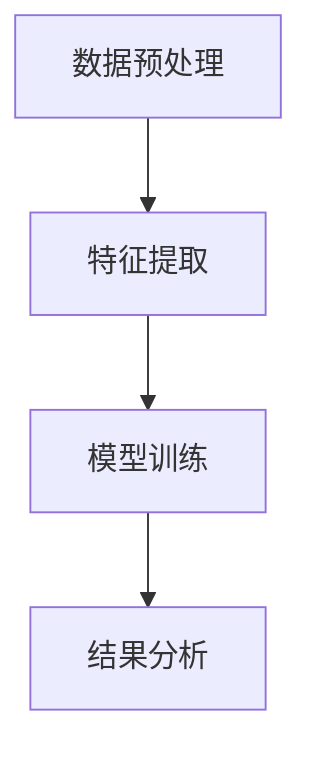
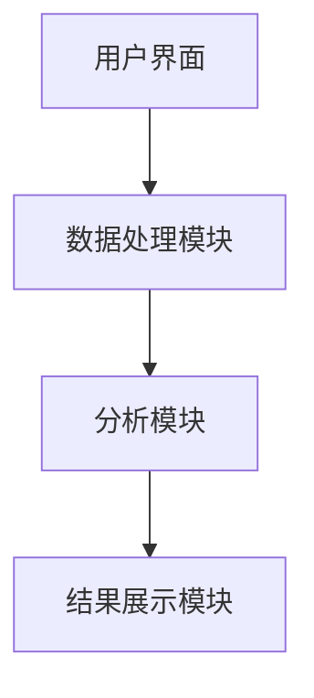

                 


# AI驱动的企业知识产权管理：专利分析与战略规划

---

## 关键词：
- 人工智能、AI、企业知识产权管理、专利分析、战略规划、技术分析、知识产权保护

---

## 摘要：
随着人工智能技术的快速发展，企业知识产权管理迎来了新的变革。AI技术在专利分析与战略规划中的应用，极大地提升了知识产权管理的效率和准确性。本文将详细探讨AI在专利分析中的核心算法与技术原理，分析其在知识产权战略规划中的实际应用，并通过具体案例展示AI如何帮助企业制定科学的知识产权管理策略。文章内容涵盖背景介绍、核心概念、算法原理、系统架构设计、项目实战及最佳实践，为企业在AI驱动的知识产权管理领域提供深入的指导。

---

## 第一部分：背景与概述

### 第1章：AI驱动的知识产权管理概述

#### 1.1 企业知识产权管理的重要性

知识产权是企业在市场竞争中的核心资产之一。专利分析不仅帮助企业识别技术趋势，还能为研发方向和战略布局提供数据支持。传统的专利分析依赖人工梳理，耗时且效率低下。AI技术的引入，通过自然语言处理和机器学习等技术，显著提升了专利分析的效率和准确性。

#### 1.2 AI在专利分析中的应用背景

AI技术在专利分析中的应用，主要体现在以下几个方面：
- **数据处理**：AI能够快速提取专利文本中的关键信息，如技术领域、发明人、申请日期等。
- **技术趋势预测**：通过分析大量专利数据，AI可以识别出技术发展的趋势和热点领域。
- **竞争分析**：AI能够帮助企业了解竞争对手的专利布局，制定更有针对性的知识产权战略。

#### 1.3 专利分析与战略规划的核心要素

专利分析的核心要素包括：
- **专利数据**：包括专利申请数量、技术领域分布、申请人信息等。
- **技术分析**：通过文本挖掘和语义分析，识别技术关键词和创新点。
- **竞争分析**：分析竞争对手的专利布局，评估自身技术的市场地位。

---

## 第二部分：核心概念与技术原理

### 第2章：AI驱动的专利分析

#### 2.1 核心概念与技术原理

AI在专利分析中的核心算法包括：
- **自然语言处理（NLP）**：用于提取专利文本中的关键信息和关键词。
- **机器学习（ML）**：用于分类、聚类和预测，帮助识别技术趋势和潜在风险。

#### 2.2 专利分析的核心算法与流程

以下是专利分析的流程图：



#### 2.3 数学模型与公式

在专利分析中，常用的数学模型包括余弦相似度和聚类分析。例如，计算两个专利文本的相似度：

$$ \cos\theta = \frac{\vec{A} \cdot \vec{B}}{|\vec{A}| |\vec{B}|} $$

其中，$\vec{A}$和$\vec{B}$分别表示两个专利文本的向量表示。

---

## 第三部分：系统分析与架构设计

### 第3章：AI驱动的知识产权管理系统

#### 3.1 系统功能设计

系统的功能模块包括：
- 数据采集与处理
- 技术分析与预测
- 可视化展示
- 战略规划支持

#### 3.2 系统架构设计

以下是系统架构图：



---

## 第四部分：项目实战

### 第4章：AI驱动的专利分析项目实战

#### 4.1 环境安装与配置

所需工具包括Python、Scikit-learn、NLTK、Gensim等。

#### 4.2 核心代码实现

以下是专利分类的Python代码示例：

```python
from sklearn.feature_extraction.text import TfidfVectorizer
from sklearn.cluster import KMeans

# 假设专利文本存储在列表texts中
vectorizer = TfidfVectorizer()
X = vectorizer.fit_transform(texts)

# 使用K-means进行聚类
num_clusters = 5
km = KMeans(n_clusters=num_clusters)
km.fit(X)

# 获取每个文本的聚类结果
clusters = km.fit_predict(X)
```

#### 4.3 案例分析与结果解读

以某技术领域的专利分析为例，通过AI分析得出该领域的技术趋势和主要竞争对手的专利布局。

---

## 第五部分：战略规划与决策支持

### 第5章：AI驱动的知识产权战略规划

#### 5.1 专利分析在战略规划中的应用

AI通过分析专利数据，帮助企业制定更具前瞻性的知识产权战略，包括技术研发方向、专利布局优化和风险预警。

#### 5.2 案例分析

以某高科技企业为例，通过AI分析其竞争对手的专利布局，制定技术研发和专利申请的优先级。

---

## 第六部分：最佳实践与总结

### 第6章：总结与展望

#### 6.1 最佳实践

- 数据质量是专利分析的基础，确保数据的完整性和准确性。
- 结合企业的实际需求，灵活调整分析模型和工具。

#### 6.2 小结

AI技术的应用极大地提升了企业知识产权管理的效率和精准度，为企业制定科学的知识产权战略提供了有力支持。

---

## 作者信息

作者：AI天才研究院（AI Genius Institute） & 禅与计算机程序设计艺术（Zen And The Art of Computer Programming）

---

通过本文的详细分析，读者可以深入了解AI在企业知识产权管理中的应用，掌握专利分析的核心技术与方法，为企业在AI驱动的知识产权管理领域提供有力指导。

