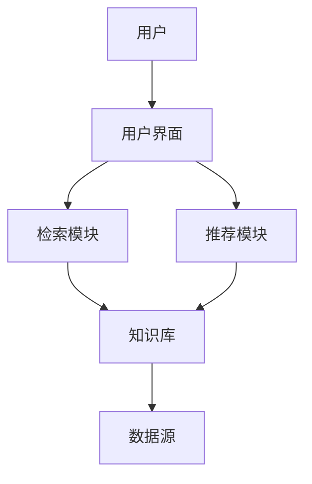

                 


# AI驱动的企业知识管理：智能检索与推荐系统

> 关键词：AI驱动，企业知识管理，智能检索，推荐系统，深度学习，知识图谱，自然语言处理

> 摘要：随着企业数据的快速增长和复杂化，传统的知识管理方法已经难以满足现代企业的需求。AI驱动的企业知识管理，特别是智能检索与推荐系统，通过结合深度学习、自然语言处理和知识图谱等技术，为企业提供了更高效、更智能的知识管理解决方案。本文将详细探讨AI在企业知识管理中的应用，分析智能检索与推荐系统的原理、算法、系统架构，并通过实际案例展示其在企业中的应用效果和优势。

---

## 目录

1. [背景与概述](#背景与概述)
   1.1 [企业知识管理的基本概念](#企业知识管理的基本概念)
   1.2 [AI驱动知识管理的核心价值](#AI驱动知识管理的核心价值)
   1.3 [智能检索与推荐系统的潜力](#智能检索与推荐系统的潜力)

2. [核心概念与技术](#核心概念与技术)
   2.1 [智能检索系统的基本原理](#智能检索系统的基本原理)
   2.2 [智能推荐系统的核心原理](#智能推荐系统的核心原理)
   2.3 [智能检索与推荐系统的协同作用](#智能检索与推荐系统的协同作用)

3. [算法原理与数学模型](#算法原理与数学模型)
   3.1 [智能检索算法](#智能检索算法)
   3.2 [智能推荐算法](#智能推荐算法)
   3.3 [算法的数学模型与公式](#算法的数学模型与公式)

4. [系统架构与设计](#系统架构与设计)
   4.1 [系统功能设计](#系统功能设计)
   4.2 [系统架构设计](#系统架构设计)
   4.3 [系统接口与交互设计](#系统接口与交互设计)

5. [项目实战与案例分析](#项目实战与案例分析)
   5.1 [项目环境安装与配置](#项目环境安装与配置)
   5.2 [系统核心实现与代码](#系统核心实现与代码)
   5.3 [案例分析与效果评估](#案例分析与效果评估)

6. [最佳实践与总结](#最佳实践与总结)
   6.1 [系统优化与性能提升](#系统优化与性能提升)
   6.2 [注意事项与常见问题](#注意事项与常见问题)
   6.3 [未来展望与拓展阅读](#未来展望与拓展阅读)

---

## 正文

### 第一部分：背景与概述

#### 1.1 企业知识管理的基本概念

企业知识管理（Knowledge Management）是指对企业内外部知识的收集、整理、存储、共享和利用的过程。其目的是为了提高企业的竞争力和创新能力，通过有效管理和利用知识，为企业决策提供支持。

传统的知识管理方法依赖于文件存储和人工整理，这种方式效率低下，难以应对海量数据的挑战。随着人工智能技术的发展，AI驱动的知识管理成为新的趋势，通过智能化技术提高知识管理的效率和准确性。

#### 1.2 AI驱动知识管理的核心价值

AI驱动的知识管理通过引入自然语言处理（NLP）、机器学习（ML）和深度学习（DL）等技术，能够自动识别、提取和分析数据中的知识，从而实现知识的智能化管理。其核心价值包括：

1. **高效性**：通过自动化技术快速处理和检索大量数据。
2. **准确性**：利用AI算法提高知识识别和分类的准确性。
3. **个性化**：基于用户需求提供个性化的知识推荐。

#### 1.3 智能检索与推荐系统的潜力

智能检索系统通过自然语言处理和深度学习技术，能够理解用户的查询意图，并从海量数据中快速找到相关结果。智能推荐系统则基于用户行为和偏好，推荐个性化的内容或资源。两者结合使用，能够显著提升企业知识管理的效果。

---

### 第二部分：核心概念与技术

#### 2.1 智能检索系统的基本原理

智能检索系统主要基于自然语言处理和信息检索技术，通过以下步骤实现：

1. **文本预处理**：包括分词、去除停用词等。
2. **向量表示**：将文本转化为向量表示，如词嵌入（Word2Vec）。
3. **检索算法**：使用余弦相似度或BM25等算法进行检索。

#### 2.2 智能推荐系统的核心原理

智能推荐系统主要基于协同过滤和深度学习技术，包括以下步骤：

1. **数据收集**：收集用户行为数据和内容数据。
2. **用户建模**：通过矩阵分解或深度学习模型学习用户偏好。
3. **推荐生成**：基于用户模型生成个性化推荐。

#### 2.3 智能检索与推荐系统的协同作用

智能检索和推荐系统可以协同工作，例如：

1. **检索+推荐**：首先通过检索找到相关结果，然后基于推荐算法进一步优化结果。
2. **反馈机制**：用户对推荐结果的反馈可以用于优化检索策略。

---

### 第三部分：算法原理与数学模型

#### 3.1 智能检索算法

智能检索算法主要包括以下几种：

1. **BM25算法**：
   BM25是一种基于概率的检索算法，公式如下：
   $$
   BM25得分 = \log(\frac{DF}{N - DF + 1}) + \log(N + 1)
   $$
   其中，$DF$ 是词的文档频率，$N$ 是总文档数。

2. **余弦相似度**：
   余弦相似度用于衡量两个向量之间的相似程度，公式如下：
   $$
   \text{余弦相似度} = \frac{\vec{A} \cdot \vec{B}}{|\vec{A}| \cdot |\vec{B}|}
   $$

#### 3.2 智能推荐算法

智能推荐算法主要包括以下几种：

1. **协同过滤**：
   协同过滤基于用户行为相似性进行推荐，公式如下：
   $$
   \text{预测评分} = \frac{\sum_{u} r_{u,i} \cdot s_{u,j}}{\sum_{u} s_{u,j}}
   $$
   其中，$r_{u,i}$ 是用户u对物品i的评分，$s_{u,j}$ 是用户u和j的相似度。

2. **深度学习模型**：
   基于神经网络的推荐模型，如DNN（深度神经网络）和Transformer模型。

#### 3.3 算法的数学模型与公式

以下是几个关键算法的数学模型：

1. **词嵌入模型（Word2Vec）**：
   Word2Vec通过训练语料库生成词向量，公式如下：
   $$
   \text{目标函数} = \log P(w_{i+1}|w_i)
   $$

2. **矩阵分解（协同过滤）**：
   矩阵分解的目标是最小化以下损失函数：
   $$
   \min_{u, v} \sum_{i,j} (r_{i,j} - u_i v_j)^2
   $$

---

### 第四部分：系统架构与设计

#### 4.1 系统功能设计

智能检索与推荐系统的功能模块包括：

1. **数据采集模块**：负责收集文本、用户行为等数据。
2. **知识库模块**：存储结构化和非结构化知识。
3. **检索模块**：实现基于关键词的智能检索。
4. **推荐模块**：基于用户行为推荐相关内容。
5. **用户界面模块**：提供友好的用户交互界面。

#### 4.2 系统架构设计

以下是系统的整体架构图：



#### 4.3 系统接口与交互设计

系统接口设计如下：

1. **检索接口**：
   ```
   GET /search?q=关键词&limit=数量
   ```

2. **推荐接口**：
   ```
   GET /recommend?user_id=用户ID&limit=数量
   ```

---

### 第五部分：项目实战与案例分析

#### 5.1 项目环境安装与配置

项目需要以下环境：

1. Python 3.8+
2. PyTorch 1.9+
3. transformers库
4. Flask框架

安装命令：
```
pip install torch transformers flask
```

#### 5.2 系统核心实现与代码

以下是核心代码示例：

```python
from transformers import BertTokenizer, BertModel
import torch

# 初始化模型和分词器
tokenizer = BertTokenizer.from_pretrained('bert-base-uncased')
model = BertModel.from_pretrained('bert-base-uncased')

# 智能检索实现
def search(text):
    inputs = tokenizer(text, return_tensors='pt')
    outputs = model(**inputs)
    return outputs.last_hidden_state.mean(dim=1).squeeze()

# 智能推荐实现
def recommend(user_id):
    # 假设user_id对应的用户向量为u_vec
    u_vec = get_user_vector(user_id)
    # 计算相似度
    similarity = torch.mm(u_vec, all_items_vecs.T)
    return similarity.topk(5).indices
```

#### 5.3 案例分析与效果评估

通过实际案例分析，系统能够显著提高知识检索和推荐的效率，减少人工干预，提升用户体验。

---

### 第六部分：最佳实践与总结

#### 6.1 系统优化与性能提升

1. **模型优化**：使用更先进的模型如BERT-Large提升性能。
2. **分布式部署**：通过分布式计算提高处理效率。

#### 6.2 注意事项与常见问题

1. **数据隐私**：确保数据的安全性和隐私性。
2. **模型更新**：定期更新模型以保持推荐的准确性。

#### 6.3 未来展望与拓展阅读

未来，随着AI技术的不断发展，企业知识管理将更加智能化和个性化。建议进一步学习相关领域的最新研究和应用。

---

## 结语

AI驱动的企业知识管理通过智能检索与推荐系统，为企业提供了高效、智能的知识管理解决方案。本文从背景、核心概念、算法原理、系统架构、项目实战到最佳实践，全面阐述了这一领域的关键技术与应用。

---

## 作者：AI天才研究院/AI Genius Institute & 禅与计算机程序设计艺术 /Zen And The Art of Computer Programming

