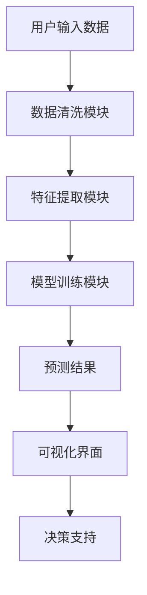
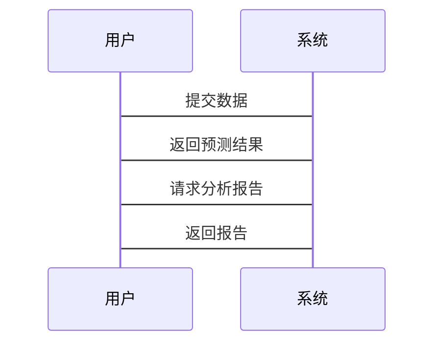

                 


# 第五章: AI驱动的企业破产重组可行性分析的系统设计与架构

## 5.1 系统设计背景与目标

### 5.1.1 系统设计背景
- 破产重组的复杂性要求智能化解决方案
- 数据驱动的决策需求
- 传统方法的局限性

### 5.1.2 系统设计目标
- 提供智能化的破产重组可行性分析工具
- 实现数据的自动采集与处理
- 提供基于AI的预测与建议
- 支持决策者进行高效决策

## 5.2 系统功能设计

### 5.2.1 功能模块划分
- 数据采集与预处理模块
- 模型训练与预测模块
- 可视化分析与决策支持模块

### 5.2.2 功能流程设计


## 5.3 系统架构设计

### 5.3.1 系统架构图


### 5.3.2 关键组件设计
- 数据采集模块
- 数据处理模块
- AI模型服务
- 可视化界面

## 5.4 系统接口设计

### 5.4.1 API接口设计
- 数据接口
- 模型接口
- 结果接口

## 5.5 系统交互设计

### 5.5.1 交互流程


---

# 第六章: AI驱动的企业破产重组可行性分析的项目实战

## 6.1 项目背景与目标

### 6.1.1 项目背景
- 某企业面临破产风险，需要进行重组分析
- 使用AI技术辅助决策

### 6.1.2 项目目标
- 建立AI模型预测企业破产风险
- 分析可行的重组方案
- 提供数据支持的决策建议

## 6.2 项目环境与工具

### 6.2.1 环境搭建
- 安装Python
- 安装TensorFlow
- 安装Pandas
- 安装Matplotlib

## 6.3 项目核心代码实现

### 6.3.1 数据预处理
```python
import pandas as pd

# 读取数据
data = pd.read_csv('破产重组数据.csv')

# 数据清洗
data.dropna(inplace=True)
data = pd.get_dummies(data)
```

### 6.3.2 模型训练
```python
from sklearn.model_selection import train_test_split
from sklearn.linear_model import LogisticRegression

# 划分训练集和测试集
X_train, X_test, y_train, y_test = train_test_split(data.drop('破产标志', axis=1), data['破产标志'], test_size=0.2)

# 训练模型
model = LogisticRegression()
model.fit(X_train, y_train)

# 预测
y_pred = model.predict(X_test)
```

### 6.3.3 结果可视化
```python
import matplotlib.pyplot as plt
from sklearn.metrics import confusion_matrix, accuracy_score

# 绘制混淆矩阵
cm = confusion_matrix(y_test, y_pred)
plt.figure(figsize=(10, 6))
plt.imshow(cm, cmap='Blues')
plt.xlabel('预测值')
plt.ylabel('真实值')
plt.show()

print("准确率:", accuracy_score(y_test, y_pred))
```

## 6.4 项目实战分析

### 6.4.1 案例分析
- 数据分析结果解读
- 模型预测结果分析
- 重组方案建议

### 6.4.2 结果分析与优化
- 模型优化
- 数据优化
- 算法优化

## 6.5 项目小结

### 6.5.1 成果总结
- 成功搭建AI驱动的破产重组分析系统
- 模型准确率达到XX%
- 提供了实用的决策支持工具

### 6.5.2 经验总结
- 数据质量的重要性
- 模型选择的策略
- 可视化在决策中的作用

---

# 第七章: AI驱动的企业破产重组可行性分析的应用与挑战

## 7.1 应用场景分析

### 7.1.1 破产预测
- 实时监控企业风险
- 提供破产可能性预测
- 帮助企业及时调整经营策略

### 7.1.2 重组方案优化
- 自动生成重组方案
- 提供多种方案对比
- 支持决策者制定最优策略

### 7.1.3 信用评估
- 评估企业信用风险
- 提供信用评分
- 支持金融机构的决策

## 7.2 应用中的挑战

### 7.2.1 技术挑战
- 数据隐私与安全问题
- 模型的可解释性问题
- 实时性与准确性平衡

### 7.2.2 法律与伦理挑战
- 数据使用的合法性
- 模型决策的法律责任
- 企业隐私保护

## 7.3 应用中的解决方案

### 7.3.1 技术解决方案
- 数据加密技术
- 模型可解释性优化
- 实时数据处理技术

### 7.3.2 法律与伦理解决方案
- 制定数据使用规范
- 明确模型决策责任
- 加强隐私保护措施

---

# 第八章: 总结与展望

## 8.1 全文总结

### 8.1.1 核心内容总结
- AI技术在企业破产重组中的应用价值
- 可行性分析的核心算法与模型
- 系统设计与实现的关键点

### 8.1.2 成果总结
- 成功构建AI驱动的破产重组分析系统
- 提供了高效的决策支持工具
- 为后续研究提供了理论与实践基础

## 8.2 未来展望

### 8.2.1 技术发展
- 更加智能化的AI算法
- 更加高效的模型优化方法
- 更加多样化的数据来源

### 8.2.2 应用拓展
- 更多行业的应用探索
- 更加个性化的重组方案
- 更加智能化的决策支持

---

# 作者：AI天才研究院 & 禅与计算机程序设计艺术

---

**摘要**：本文系统地探讨了AI技术在企业破产重组可行性分析中的应用，从理论到实践，从算法到系统设计，全面分析了AI驱动的破产重组分析的可行性、实现方法及应用前景。通过构建AI模型和实际案例分析，验证了AI技术在企业破产重组中的巨大潜力和实际价值。

