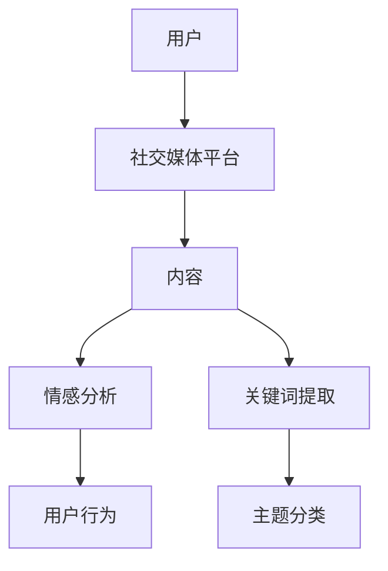
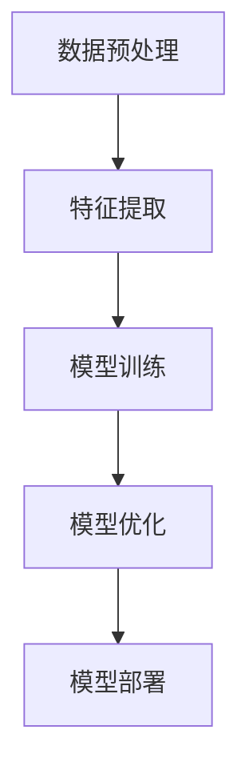
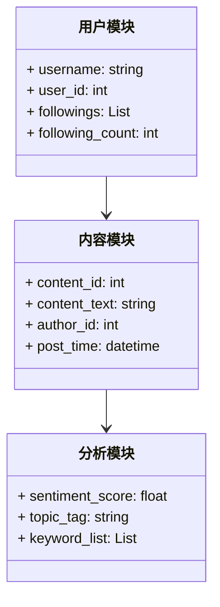
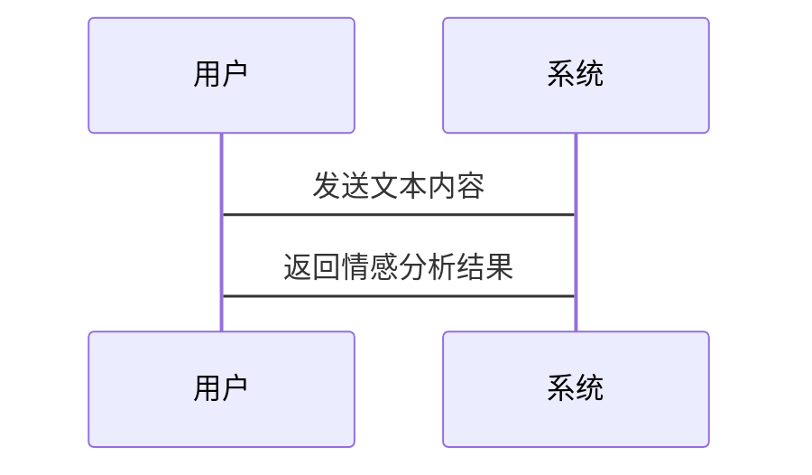

                 


# AI驱动的企业社交媒体管理：策略与实践

## 关键词：
人工智能、社交媒体管理、自然语言处理、机器学习、系统架构、企业数字化、社交媒体分析

## 摘要：
本文详细探讨了AI驱动的企业社交媒体管理的策略与实践。首先，分析了AI在社交媒体管理中的背景和重要性，介绍了核心概念和技术原理。接着，深入讲解了关键算法及其数学模型，展示了系统的架构设计。最后，通过项目实战和案例分析，总结了AI在社交媒体管理中的应用，并提出了未来的发展方向和最佳实践。

---

## 第一部分: AI驱动的企业社交媒体管理概述

### 第1章: AI与企业社交媒体管理的背景

#### 1.1 问题背景与挑战
社交媒体已成为企业与客户互动的重要渠道，但传统管理方式面临效率低、数据分析复杂等问题。AI的引入能够提升内容分发效率、优化用户互动策略，并降低运营成本。

#### 1.2 问题描述与目标
社交媒体管理的核心问题包括内容生成、用户行为预测和情感分析。AI的目标是通过自动化和智能化手段解决这些问题，提升企业的社交媒体运营效率。

#### 1.3 核心概念与联系
AI驱动的社交媒体管理包括NLP、机器学习和深度学习等技术。ER实体关系图展示了用户、平台和内容之间的关系。



---

### 第2章: AI驱动的社交媒体管理核心概念

#### 2.1 核心技术与原理
NLP用于文本处理，机器学习模型用于分类和预测，深度学习提升模型的复杂性处理能力。

#### 2.2 关键特征对比
通过表格对比不同AI技术的特征，分析其优劣势。

#### 2.3 实际应用场景
选择合适的模型和技术，优化社交媒体内容分发和用户互动策略。

---

## 第二部分: AI驱动的社交媒体管理算法原理

### 第3章: AI驱动的社交媒体管理算法原理

#### 3.1 算法流程与实现
NLP处理流程包括文本清洗、特征提取和模型训练。Mermaid图表展示流程步骤。



#### 3.2 数学模型与公式
损失函数用于模型优化，优化算法如梯度下降用于参数更新。

$$L = \frac{1}{n}\sum_{i=1}^{n}(y_i - \hat{y_i})^2$$
$$\theta = \theta - \eta \frac{\partial L}{\partial \theta}$$

#### 3.3 深度学习模型
使用sigmoid函数进行分类，模型结构如卷积神经网络（CNN）。

$$f(x) = \sigma(Wx + b)$$
$$\sigma(x) = \frac{1}{1 + e^{-x}}$$

---

## 第三部分: 系统架构与设计

### 第4章: 系统架构与设计

#### 4.1 系统架构设计
功能模块包括数据采集、分析引擎和用户界面。Mermaid类图展示模块关系。



#### 4.2 系统接口设计
RESTful API接口用于数据交互，JSON格式传输数据，如GET请求获取情感分析结果。

#### 4.3 系统交互设计
Mermaid序列图展示用户与系统之间的交互流程。



---

## 第四部分: 项目实战

### 第5章: 项目实战

#### 5.1 环境搭建
安装Python和相关库（如TensorFlow、NLTK），配置开发环境。

#### 5.2 核心代码实现
实现情感分析模型，代码示例：

```python
import numpy as np
from sklearn.model_selection import train_test_split
from sklearn.linear_model import LogisticRegression

# 数据预处理
X = data['text']
y = data['sentiment']
X_train, X_test, y_train, y_test = train_test_split(X, y, test_size=0.2)

# 特征提取
vectorizer = TfidfVectorizer()
X_train_vec = vectorizer.fit_transform(X_train)
X_test_vec = vectorizer.transform(X_test)

# 模型训练
model = LogisticRegression()
model.fit(X_train_vec, y_train)

# 模型评估
print(model.score(X_test_vec, y_test))
```

#### 5.3 案例分析
分析实际案例，如品牌声誉监控和用户行为预测，展示AI在社交媒体管理中的应用效果。

---

## 第五部分: 最佳实践与未来展望

### 第6章: 最佳实践与未来展望

#### 6.1 小结
总结AI在社交媒体管理中的应用价值和优势。

#### 6.2 注意事项
数据隐私保护、模型更新和算法优化是实际应用中的关键点。

#### 6.3 未来展望
未来，AI将进一步提升社交媒体管理的智能化水平，深度学习和大模型将发挥更大作用。

---

## 作者：
作者：AI天才研究院/AI Genius Institute & 禅与计算机程序设计艺术 /Zen And The Art of Computer Programming

---

本文系统地探讨了AI在企业社交媒体管理中的应用，从背景到实践，为读者提供了全面的视角和实用的指导。通过详细的技术分析和案例分享，帮助企业在数字化转型中更好地利用AI技术提升社交媒体管理效率。

