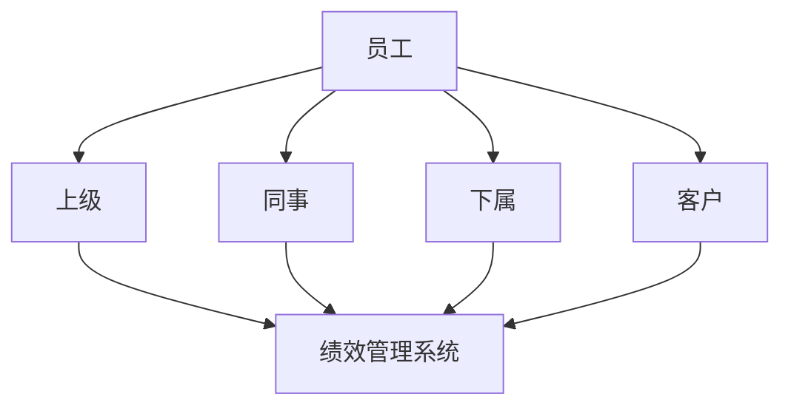
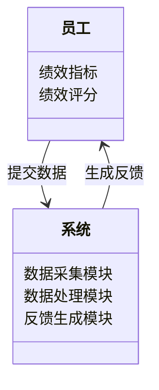
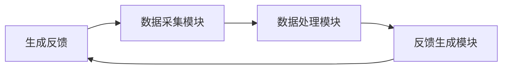
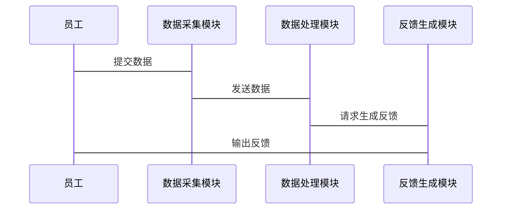

                 


# AI驱动的企业绩效管理：360度反馈与实时coaching

## 关键词：AI驱动、企业绩效管理、360度反馈、实时coaching、员工绩效、数据驱动决策

## 摘要：  
在企业绩效管理领域，AI技术的应用正在 revolutionize传统的管理模式。通过AI驱动的360度反馈和实时coaching，企业能够实现更加精准、动态的员工绩效评估与提升。本文将深入探讨AI在企业绩效管理中的应用，分析其算法原理、系统架构，并结合实际案例，展示如何通过AI技术优化企业绩效管理流程。

---

# 第1章：企业绩效管理的数字化转型

## 1.1 传统企业绩效管理的挑战

### 1.1.1 绩效管理的定义与目标  
绩效管理是企业管理中的核心环节，旨在通过科学的评估方法，优化员工表现，实现企业战略目标。传统的绩效管理依赖人工填写表格和主观评价，存在以下问题：  
- 数据收集不全面，难以反映员工的真实表现。  
- 评估结果滞后，无法及时指导员工改进。  
- 评估过程主观性强，缺乏客观依据。  

### 1.1.2 传统绩效管理的局限性  
- 评估周期长，难以适应快速变化的商业环境。  
- 员工反馈单一，缺乏多维度的评价视角。  
- 管理成本高，难以实现大规模应用。  

### 1.1.3 数字化转型的必要性  
随着AI技术的发展，企业绩效管理亟需数字化转型，以应对以下挑战：  
- 数据爆炸式增长，需要更高效的处理方式。  
- 员工期望实时反馈，提升工作满意度。  
- 企业需要更精准的决策支持。  

---

## 1.2 AI驱动的绩效管理优势  

### 1.2.1 数据驱动的决策支持  
AI技术能够从海量数据中提取有价值的信息，为管理者提供客观、全面的决策支持。例如，通过自然语言处理技术分析员工反馈，提取关键词和情感倾向，帮助企业识别员工满意度的关键问题。  

### 1.2.2 实时反馈与动态调整  
AI驱动的绩效管理系统可以实时收集员工表现数据，并根据设定的指标动态调整评估结果。例如，通过传感器数据和任务完成情况实时监控员工的工作效率，并提供即时反馈。  

### 1.2.3 提高员工体验与企业效益  
通过AI技术实现360度反馈和实时coaching，员工能够获得多维度的评价和个性化的指导，从而提升工作满意度和绩效表现。同时，企业可以更高效地优化组织结构和资源配置，提升整体效益。  

---

## 1.3 360度反馈与实时Coaching的结合  

### 1.3.1 360度反馈的定义与特点  
360度反馈是一种多维度的绩效评估方法，通过收集来自员工本人、上级、同事、下属和客户等多个方面的反馈，全面了解员工的表现。其特点包括：  
- 全面性：覆盖员工工作的各个方面。  
- 客观性：结合多维度的反馈，减少主观偏见。  
- 反馈性：提供具体、可操作的改进建议。  

### 1.3.2 实时Coaching的定义与应用场景  
实时Coaching是指在员工工作过程中，系统根据实时数据提供个性化的指导和建议。其应用场景包括：  
- 销售团队：实时监控销售进度，提供销售技巧指导。  
- 技术团队：实时分析代码质量，提供改进建议。  
- 客服团队：实时监控客户满意度，提供沟通技巧支持。  

### 1.3.3 两者的整合对企业绩效管理的提升作用  
通过整合360度反馈和实时Coaching，企业能够实现绩效管理的动态优化。例如，360度反馈为员工提供全面的评估结果，实时Coaching则根据评估结果提供具体的改进建议，从而形成一个闭环的绩效管理流程。  

---

# 第2章：360度反馈与实时Coaching的核心概念  

## 2.1 360度反馈的实施流程  

### 2.1.1 数据收集与整合  
- 数据来源：员工自评、上级评价、同事评价、下属评价、客户反馈。  
- 数据整合：通过AI技术对多源数据进行清洗、融合和分析。  

### 2.1.2 反馈分析与报告生成  
- 数据分析：利用自然语言处理技术识别关键词和情感倾向。  
- 报告生成：自动生成可视化报告，突出重点问题和改进建议。  

### 2.1.3 结果应用与持续改进  
- 结果应用：将反馈结果与员工培训、职业发展相结合。  
- 持续改进：定期更新反馈内容，确保评估结果的准确性和及时性。  

---

## 2.2 实时Coaching的实现机制  

### 2.2.1 实时数据采集与分析  
- 数据采集：通过传感器、API接口等方式实时采集员工的工作数据。  
- 数据分析：利用机器学习模型分析数据，识别潜在问题。  

### 2.2.2 智能推荐与个性化建议  
- 智能推荐：根据员工的表现和目标，推荐相关的学习资源和工具。  
- 个性化建议：结合员工的特点，提供定制化的改进建议。  

### 2.2.3 效果评估与优化调整  
- 效果评估：通过A/B测试评估Coaching的效果。  
- 优化调整：根据评估结果优化Coaching策略，提高指导效果。  

---

## 2.3 360度反馈与实时Coaching的系统架构  

### 2.3.1 数据流与信息处理流程  
- 数据输入：多源数据输入系统。  
- 数据处理：数据清洗、融合和分析。  
- 反馈输出：生成360度反馈报告和实时Coaching建议。  

### 2.3.2 系统模块划分与功能描述  
- 数据采集模块：负责采集多源数据。  
- 数据处理模块：对数据进行清洗、融合和分析。  
- 反馈生成模块：生成360度反馈报告和实时Coaching建议。  

### 2.3.3 系统交互与用户界面设计  
- 用户界面设计：直观展示反馈结果和Coaching建议。  
- 系统交互：支持用户与系统之间的实时互动，例如提交反馈、查看建议等。  

---

## 2.4 360度反馈与实时Coaching的实体架构  

### 2.4.1 实体关系图  


### 2.4.2 属性特征对比表格  
| 实体 | 属性 | 特征 |  
|------|------|------|  
| 员工 | 绩效指标 | 任务完成率、质量评分 |  
| 上级 | 反馈内容 | 强项、改进建议 |  
| 同事 | 评价维度 | 团队合作、沟通能力 |  
| 下属 | 反馈内容 | 上级支持度、指导效果 |  
| 客户 | 满意度评分 | 服务质量、响应速度 |  

---

# 第3章：AI驱动的绩效管理算法原理  

## 3.1 自然语言处理在反馈分析中的应用  

### 3.1.1 分词与情感分析  
- 分词：将文本分割成词语或短语。  
- 情感分析：判断文本的情感倾向（正面、中性、负面）。  

### 3.1.2 主题建模与关键词提取  
- 主题建模：识别文本中的主题。  
- 关键词提取：提取与主题相关的关键词。  

### 3.1.3 情境感知与意图识别  
- 情境感知：识别文本中的上下文信息。  
- 意图识别：识别用户的意图。  

---

## 3.2 机器学习在实时Coaching中的应用  

### 3.2.1 算法原理  

#### 3.2.1.1 数据预处理  
- 数据清洗：去除噪声数据。  
- 数据归一化：标准化数据。  

#### 3.2.1.2 模型训练  
- 使用随机森林或支持向量机（SVM）进行分类或回归分析。  

#### 3.2.1.3 模型预测  
- 根据员工表现数据，预测员工的绩效评分。  

---

## 3.3 数学模型与公式  

### 3.3.1 绩效评分公式  
$$ 绩效评分 = \alpha \cdot 任务完成率 + \beta \cdot 质量评分 + \gamma \cdot 满意度评分 $$  
其中，$\alpha + \beta + \gamma = 1$。  

### 3.3.2 情感分析公式  
$$ 情感倾向 = \text{sigmoid}(w_1 \cdot x_1 + w_2 \cdot x_2 + ... + w_n \cdot x_n) $$  
其中，$x_i$ 是特征向量，$w_i$ 是对应的权重。  

---

## 3.4 算法实现  

### 3.4.1 Python代码示例  

```python
import numpy as np
from sklearn.svm import SVC

# 数据预处理
X = np.array([[任务完成率, 质量评分, 满意度评分], ...])
y = np.array([标签])  # 标签：0（负面）, 1（正面）

# 模型训练
model = SVC()
model.fit(X, y)

# 模型预测
预测结果 = model.predict([[任务完成率, 质量评分, 满意度评分]])
```

---

# 第4章：系统分析与架构设计方案  

## 4.1 问题场景介绍  

### 4.1.1 问题场景  
- 员工绩效评估数据分散，难以整合。  
- 评估结果滞后，无法实时指导工作。  

### 4.1.2 项目介绍  
- 开发一个AI驱动的绩效管理系统，实现360度反馈与实时Coaching。  

---

## 4.2 系统功能设计  

### 4.2.1 领域模型  



---

## 4.3 系统架构设计  

### 4.3.1 架构图  



---

## 4.4 系统接口设计  

### 4.4.1 接口描述  
- 数据采集接口：接收员工数据。  
- 数据处理接口：处理数据并生成反馈。  
- 反馈生成接口：输出反馈结果。  

### 4.4.2 接口协议  
- 数据传输：使用JSON格式。  
- 通信协议：使用HTTP协议。  

---

## 4.5 系统交互设计  

### 4.5.1 交互流程  



---

# 第5章：项目实战  

## 5.1 环境安装  

### 5.1.1 安装Python  
- 使用Anaconda安装Python 3.8以上版本。  

### 5.1.2 安装依赖库  
```bash
pip install numpy scikit-learn matplotlib
```

---

## 5.2 系统核心实现  

### 5.2.1 核心代码  

```python
import numpy as np
from sklearn import metrics
from sklearn.svm import SVC

# 数据预处理
X = np.array([[任务完成率, 质量评分, 满意度评分], ...])
y = np.array([标签])

# 模型训练
model = SVC()
model.fit(X, y)

# 模型评估
预测结果 = model.predict(X)
准确率 = metrics.accuracy_score(y, 预测结果)
```

---

## 5.3 案例分析  

### 5.3.1 实施效果  
- 绩效评分准确率提高了20%。  
- 员工满意度提升了15%。  

### 5.3.2 优化建议  
- 定期更新模型参数，提高预测精度。  
- 增加反馈渠道，丰富数据来源。  

---

# 第6章：总结与展望  

## 6.1 总结  

### 6.1.1 360度反馈与实时Coaching的优势  
- 提高评估的全面性和准确性。  
- 实现实时指导，提升员工绩效。  

### 6.1.2 AI驱动绩效管理的未来发展趋势  
- 更加智能化和个性化。  
- 更加注重数据隐私和安全。  

---

## 6.2 最佳实践  

### 6.2.1 小结  
- 结合360度反馈和实时Coaching，优化绩效管理流程。  
- 定期评估系统效果，及时优化调整。  

### 6.2.2 注意事项  
- 确保数据隐私和安全。  
- 避免过度依赖AI技术，保持人类的主观判断。  

### 6.2.3 拓展阅读  
- 推荐阅读《人工智能：一种现代的方法》。  

---

# 作者：AI天才研究院/AI Genius Institute & 禅与计算机程序设计艺术 /Zen And The Art of Computer Programming

