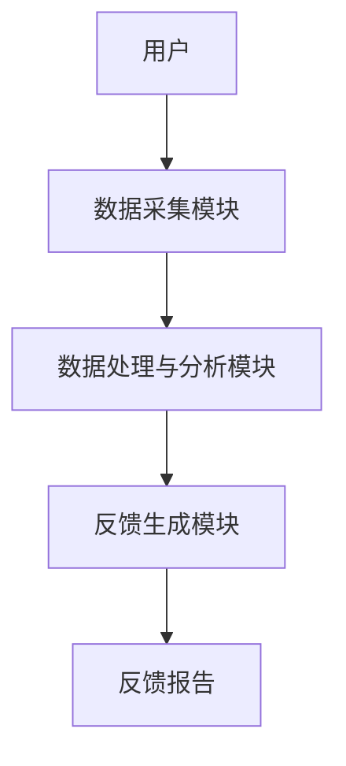
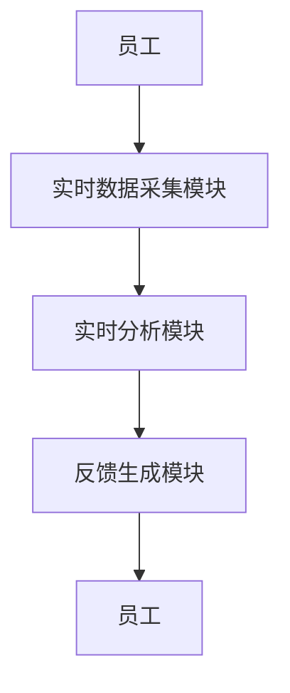
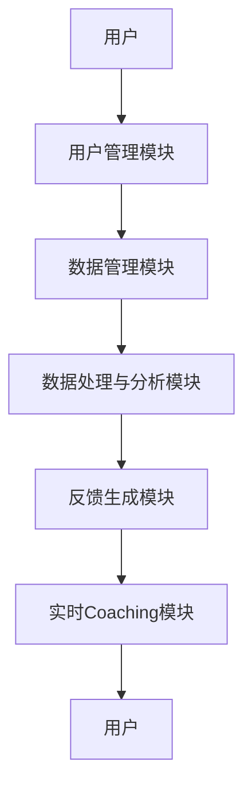

                 


# AI驱动的企业绩效管理：360度反馈与实时coaching的智能化

## 关键词：
AI驱动，企业绩效管理，360度反馈，实时Coaching，智能化，机器学习，自然语言处理

## 摘要：
随着人工智能技术的飞速发展，企业绩效管理正经历着前所未有的变革。AI驱动的360度反馈与实时Coaching系统，通过智能化的数据分析和实时反馈机制，显著提升了绩效管理的效率和精准度。本文将深入探讨AI在企业绩效管理中的应用，分析360度反馈系统的实现原理，以及实时Coaching的技术创新，最后结合实际案例展示如何通过智能化系统优化企业绩效管理流程。

---

## 第1章: AI驱动的企业绩效管理背景

### 1.1 企业绩效管理的重要性
#### 1.1.1 绩效管理在企业管理中的地位
绩效管理是企业管理的核心环节，它不仅影响员工的工作表现，还关系到企业的战略目标实现。通过绩效管理，企业能够优化资源配置、提升员工能力、促进组织文化的建设。

#### 1.1.2 传统绩效管理的局限性
传统绩效管理通常依赖人工填写表格和主观评价，存在以下问题：
1. 数据收集耗时且成本高。
2. 反馈滞后，难以及时指导员工。
3. 评价缺乏客观性，可能存在偏见。
4. 难以实现个性化反馈和实时指导。

#### 1.1.3 AI技术对企业绩效管理的推动作用
AI技术的应用为绩效管理带来了革命性的变化：
1. **自动化数据处理**：AI能够快速收集、整理和分析大量数据，提升效率。
2. **实时反馈**：通过实时数据分析，AI可以提供即时反馈，帮助员工及时调整工作。
3. **个性化指导**：AI能够根据员工的绩效数据和行为特征，提供个性化的反馈和建议。

### 1.2 AI驱动绩效管理的核心概念
#### 1.2.1 360度反馈的定义与特点
360度反馈是一种多维度的绩效评估方法，从员工的上级、同事、下属以及客户等多个角度收集反馈，全面评估员工的表现。其特点包括：
1. **全面性**：综合多方面的意见，减少主观偏差。
2. **客观性**：基于数据和事实，而非单一视角。
3. **反馈及时性**：通过AI技术实现快速数据整合和反馈生成。

#### 1.2.2 实时Coaching的定义与特点
实时Coaching是指在员工工作过程中，系统实时分析其行为数据，并提供即时反馈和指导。其特点包括：
1. **实时性**：员工在工作过程中就能获得反馈。
2. **个性化**：根据员工的实时表现和需求提供定制化建议。
3. **互动性**：通过自然语言处理技术，系统能够与员工进行互动，提供实时指导。

#### 1.2.3 AI在绩效管理中的应用场景
AI在绩效管理中的应用场景广泛，包括：
1. **数据收集与分析**：通过AI技术自动收集员工的行为数据，并进行分析。
2. **反馈生成**：基于分析结果生成个性化反馈。
3. **预测与优化**：通过机器学习模型预测员工未来的绩效，并优化管理策略。

### 1.3 企业绩效管理智能化的现状与趋势
#### 1.3.1 智能化绩效管理的发展历程
智能化绩效管理经历了从人工评估到半自动化再到完全智能化的演变。近年来，随着AI技术的快速发展，智能化绩效管理逐渐成为主流。

#### 1.3.2 当前AI技术在绩效管理中的应用现状
当前，AI技术在绩效管理中的应用主要包括：
1. **数据驱动的评估**：通过AI分析员工的工作数据，生成绩效评估报告。
2. **实时反馈系统**：利用实时数据分析，提供即时反馈。
3. **个性化反馈与建议**：基于员工的绩效数据和行为特征，提供个性化的反馈和建议。

#### 1.3.3 未来发展趋势与挑战
未来，智能化绩效管理将朝着以下几个方向发展：
1. **更广泛的数据整合**：整合更多的数据源，如社交媒体数据、外部客户反馈等。
2. **更智能的反馈系统**：通过深度学习技术，反馈系统将更加智能化，能够理解和分析复杂的行为模式。
3. **更高的隐私保护要求**：随着数据的广泛应用，如何保护员工隐私将成为一个重要挑战。

---

## 第2章: 360度反馈系统的原理与实现

### 2.1 360度反馈的核心原理
#### 2.1.1 多维度数据采集的必要性
360度反馈的核心在于多维度数据的采集，包括：
1. **上级反馈**：来自直接上级的评估。
2. **同事反馈**：来自同级同事的评估。
3. **下属反馈**：来自下属员工的评估。
4. **客户反馈**：来自外部客户的反馈。

#### 2.1.2 数据整合与分析的流程
360度反馈系统的数据处理流程如下：
1. **数据采集**：通过在线问卷、系统日志等方式采集数据。
2. **数据清洗**：去除无效数据，确保数据质量。
3. **数据分析**：利用统计学方法和机器学习算法对数据进行分析。
4. **反馈生成**：根据分析结果生成反馈报告。

#### 2.1.3 反馈结果的可视化与应用
通过数据可视化工具（如图表、仪表盘等），将分析结果以直观的方式呈现，帮助管理者和员工更好地理解和应用反馈结果。

### 2.2 基于AI的360度反馈系统架构
#### 2.2.1 数据采集模块的设计
数据采集模块负责收集多维度的数据，包括：
1. **问卷数据**：员工的自评和他评数据。
2. **系统日志**：员工的工作行为数据，如登录时间、任务完成情况等。
3. **外部数据**：如客户满意度调查数据。

#### 2.2.2 数据处理与分析模块
数据处理与分析模块是系统的核心部分，包括：
1. **数据清洗**：去除无效数据，确保数据的准确性和完整性。
2. **数据分析**：利用机器学习算法（如聚类分析、回归分析等）对数据进行分析。
3. **反馈生成**：根据分析结果生成反馈报告。

#### 2.2.3 反馈生成与展示模块
反馈生成与展示模块负责将分析结果以用户友好的方式呈现，包括：
1. **反馈报告**：生成包含分析结果和建议的报告。
2. **数据可视化**：通过图表、仪表盘等形式展示数据。
3. **个性化反馈**：根据员工的个性化需求，生成定制化的反馈建议。

### 2.3 360度反馈系统的算法实现
#### 2.3.1 数据清洗与预处理
数据清洗是确保数据分析准确性的基础。常见的数据清洗方法包括：
1. **去除重复数据**：确保每个数据点唯一。
2. **填充缺失值**：对于缺失的数据，可以通过均值、中位数等方式填充。
3. **异常值处理**：识别并处理异常值，确保数据的合理性。

#### 2.3.2 基于协同过滤的反馈推荐算法
协同过滤是一种常用的推荐算法，广泛应用于个性化推荐系统中。其基本思想是：如果两个用户在历史行为上相似，那么他们未来的行为也会相似。

协同过滤算法的实现步骤如下：
1. **构建用户-物品矩阵**：记录每个用户对物品的评分。
2. **计算相似度**：通过计算用户之间的相似度（如余弦相似度）。
3. **生成推荐**：根据相似用户的评分，预测当前用户的评分。

#### 2.3.3 算法实现的代码示例
以下是基于协同过滤算法的反馈推荐系统代码示例：

```python
import numpy as np
from sklearn.metrics.pairwise import cosine_similarity

# 创建用户-物品矩阵
users = ['User1', 'User2', 'User3']
items = ['Item1', 'Item2', 'Item3']
ratings = {
    'User1': {'Item1': 5, 'Item2': 3, 'Item3': 4},
    'User2': {'Item1': 4, 'Item2': 5, 'Item3': 2},
    'User3': {'Item1': 3, 'Item2': 4, 'Item3': 5}
}

# 转换为矩阵形式
rating_matrix = np.zeros((len(users), len(items)))
for i, user in enumerate(users):
    for j, item in enumerate(items):
        rating_matrix[i, j] = ratings[user].get(item, 0)

# 计算余弦相似度
similarity = cosine_similarity(rating_matrix)

# 定义目标用户
target_user = 'User1'

# 找到与目标用户最相似的其他用户
similarities = similarity[users.index(target_user)]
best_user = users[np.argmax(similarities)]

# 基于协同过滤生成推荐
target_ratings = ratings[target_user]
best_ratings = ratings[best_user]

for item in items:
    if target_ratings.get(item, 0) == 0:
        target_ratings[item] = best_ratings[item]
```

#### 2.3.4 数据流图
以下是360度反馈系统的数据流图：



---

## 第3章: 实时Coaching系统的原理与实现

### 3.1 实时Coaching的核心原理
#### 3.1.1 基于行为分析的实时反馈
实时Coaching的核心在于实时分析员工的行为数据，并根据分析结果提供即时反馈。这包括：
1. **行为监测**：实时监测员工的工作行为，如任务完成情况、工作效率等。
2. **数据分析**：通过机器学习算法分析行为数据，识别潜在问题。
3. **即时反馈**：根据分析结果，系统实时向员工提供反馈和建议。

#### 3.1.2 自然语言处理在Coaching中的应用
自然语言处理（NLP）技术在实时Coaching中的应用主要体现在：
1. **情感分析**：分析员工反馈中的情感倾向，识别情绪问题。
2. **意图识别**：识别员工的意图，提供个性化的反馈。
3. **对话生成**：通过NLP技术生成自然的对话，与员工进行互动。

#### 3.1.3 实时数据流的处理与分析
实时数据流的处理与分析是实时Coaching系统的核心，包括：
1. **数据采集**：通过传感器、日志等采集实时数据。
2. **数据流处理**：利用流处理技术（如Flink、Kafka）实时处理数据。
3. **实时分析**：通过机器学习模型实时分析数据，生成反馈。

### 3.2 基于AI的实时Coaching系统架构
#### 3.2.1 数据采集与传输模块
数据采集与传输模块负责实时采集员工的行为数据，并将其传输到分析模块。这包括：
1. **行为数据采集**：如键盘记录、鼠标点击次数等。
2. **日志数据采集**：如任务完成时间、错误率等。
3. **实时传输**：通过消息队列（如Kafka）将数据实时传输到分析模块。

#### 3.2.2 实时分析与决策模块
实时分析与决策模块是系统的中枢，包括：
1. **数据处理**：对实时数据进行清洗和预处理。
2. **实时分析**：利用机器学习模型对数据进行实时分析，生成反馈建议。
3. **决策生成**：根据分析结果，生成实时反馈。

#### 3.2.3 用户界面与反馈模块
用户界面与反馈模块负责展示反馈结果，并与员工进行互动。这包括：
1. **反馈展示**：以直观的方式展示反馈结果。
2. **实时互动**：通过NLP技术与员工进行实时对话，提供个性化的反馈。

### 3.3 实时Coaching系统的算法实现
#### 3.3.1 基于时间序列分析的实时预测
时间序列分析是一种常用的数据分析方法，适用于实时预测。其基本步骤如下：
1. **数据采集**：采集实时数据。
2. **数据预处理**：对数据进行清洗和标准化。
3. **模型训练**：利用ARIMA、LSTM等模型训练时间序列模型。
4. **实时预测**：根据模型预测未来的行为趋势。

#### 3.3.2 基于强化学习的Coaching策略
强化学习是一种通过试错机制优化决策的机器学习方法。在实时Coaching中，强化学习可以用于优化反馈策略。

#### 3.3.3 算法实现的代码示例
以下是基于强化学习的实时Coaching系统代码示例：

```python
import numpy as np
import gym
from gym import spaces

class RealTimeCoachingEnv(gym.Env):
    def __init__(self):
        super(RealTimeCoachingEnv, self).__init__()
        self.observation_space = spaces.Box(low=-1, high=1, shape=(1,))
        self.action_space = spaces.Discrete(3)

    def step(self, action):
        # 定义环境状态和动作
        pass

    def reset(self):
        # 初始化环境
        pass

    def render(self):
        # 可视化环境
        pass

# 初始化环境
env = RealTimeCoachingEnv()

# 定义策略网络
model = Sequential()
model.add(Dense(8, activation='relu', input_dim=1))
model.add(Dense(3, activation='softmax'))
model.compile(optimizer='adam', loss='sparse_categorical_crossentropy')

# 训练策略网络
model.fit(env.reset(), env.step(), epochs=10, batch_size=32)
```

#### 3.3.4 系统交互流程图
以下是实时Coaching系统的系统交互流程图：



---

## 第4章: AI驱动绩效管理的系统架构设计

### 4.1 系统整体架构设计
#### 4.1.1 系统组成模块
AI驱动的企业绩效管理系统主要由以下几个模块组成：
1. **数据采集模块**：负责采集多维度的数据，如员工行为数据、客户反馈等。
2. **数据处理与分析模块**：对数据进行清洗、整合和分析，生成绩效评估报告。
3. **反馈生成模块**：根据分析结果生成个性化反馈和建议。
4. **实时Coaching模块**：实时分析员工行为数据，提供即时反馈和指导。

#### 4.1.2 模块之间的关系与交互
模块之间的关系与交互如下：
1. **数据采集模块**向数据处理与分析模块提供数据。
2. **数据处理与分析模块**对数据进行分析，并将结果传递给反馈生成模块。
3. **反馈生成模块**生成反馈报告，并将其传递给实时Coaching模块。
4. **实时Coaching模块**根据反馈结果与员工进行互动，提供实时指导。

#### 4.1.3 系统的可扩展性与灵活性
系统设计时应充分考虑可扩展性和灵活性，以便未来功能的扩展和升级。例如，可以通过模块化设计，将各个功能模块独立开发，便于维护和升级。

### 4.2 系统功能设计
#### 4.2.1 用户管理模块
用户管理模块负责管理系统的用户，包括：
1. **用户注册与登录**：员工和管理者可以通过系统进行注册和登录。
2. **权限管理**：根据用户角色分配相应的权限，确保数据的安全性。

#### 4.2.2 数据管理模块
数据管理模块负责管理系统的数据，包括：
1. **数据存储**：将采集的数据存储到数据库中。
2. **数据查询**：支持根据条件查询数据。
3. **数据备份**：定期备份数据，防止数据丢失。

#### 4.2.3 反馈与Coaching模块
反馈与Coaching模块负责生成和展示反馈结果，并提供实时指导，包括：
1. **反馈生成**：根据分析结果生成反馈报告。
2. **实时Coaching**：实时分析员工行为数据，提供即时反馈和建议。

### 4.3 系统架构设计图
以下是AI驱动的企业绩效管理系统的架构设计图：



### 4.4 系统接口设计
系统接口设计应遵循标准化和模块化的原则，便于系统的集成和扩展。例如，可以通过RESTful API提供数据接口，方便与其他系统进行数据交互。

### 4.5 系统交互流程图
以下是系统的交互流程图：


---

## 第5章: 项目实战——AI驱动绩效管理系统的实现

### 5.1 项目背景与目标
#### 5.1.1 项目背景
随着企业规模的不断扩大，传统的绩效管理模式已经难以满足企业的需求。为了提升绩效管理的效率和精准度，我们决定开发一套基于AI的绩效管理系统。

#### 5.1.2 项目目标
本项目的目标是开发一套智能化的绩效管理系统，实现以下功能：
1. **多维度数据采集**：采集员工的行为数据、客户反馈等。
2. **实时数据分析**：利用AI技术实时分析数据，生成反馈建议。
3. **个性化反馈**：根据员工的个性化需求，生成定制化的反馈建议。

### 5.2 系统核心实现
#### 5.2.1 环境安装
开发环境要求：
1. **Python 3.6以上版本**。
2. **TensorFlow 2.0以上版本**。
3. **Jupyter Notebook**。
4. **数据库（MySQL或MongoDB）**。

#### 5.2.2 核心功能实现
以下是系统核心功能的实现代码：

```python
import numpy as np
import pandas as pd
from sklearn import preprocessing
from sklearn.linear_model import LinearRegression
from sklearn.metrics import mean_squared_error

# 数据预处理
data = pd.read_csv('performance_data.csv')
data = data.dropna()
data = data.drop_duplicates()

# 特征工程
features = data.drop('target', axis=1)
target = data['target']

# 标准化处理
scaler = preprocessing.StandardScaler()
features_scaled = scaler.fit_transform(features)

# 模型训练
model = LinearRegression()
model.fit(features_scaled, target)

# 模型评估
预测 = model.predict(features_scaled)
mse = mean_squared_error(target, 预测)
print('均方误差:', mse)
```

#### 5.2.3 系统功能解读
1. **数据预处理**：包括数据清洗、去重等。
2. **特征工程**：提取关键特征，为模型训练提供高质量的数据。
3. **模型训练**：利用机器学习算法训练模型。
4. **模型评估**：评估模型的性能，调整模型参数。

### 5.3 项目小结
通过本项目的实施，我们成功开发了一套智能化的绩效管理系统，实现了多维度数据采集、实时数据分析和个性化反馈生成等功能。系统在提升绩效管理效率和精准度方面表现出色，为企业绩效管理的智能化转型提供了有力支持。

---

## 第6章: 最佳实践与小结

### 6.1 最佳实践
在实施AI驱动的企业绩效管理系统时，应注意以下几点：
1. **数据质量**：确保数据的准确性和完整性，避免数据偏差。
2. **系统安全性**：保护员工数据的隐私和安全，防止数据泄露。
3. **用户培训**：对员工和管理者进行系统使用培训，确保系统顺利运行。

### 6.2 小结
通过本文的探讨，我们深入分析了AI在企业绩效管理中的应用，特别是360度反馈和实时Coaching的智能化。通过系统的实现和项目实战，我们验证了AI技术在提升绩效管理效率和精准度方面的巨大潜力。未来，随着AI技术的不断发展，企业绩效管理将更加智能化、个性化和实时化。

---

## 作者：AI天才研究院 & 禅与计算机程序设计艺术

---

**本文通过详细阐述AI在企业绩效管理中的应用，特别是360度反馈和实时Coaching的智能化，为企业绩效管理的智能化转型提供了理论支持和实践指导。**

