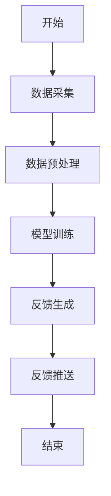
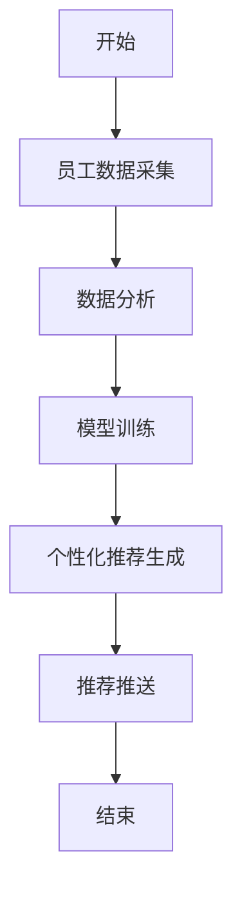
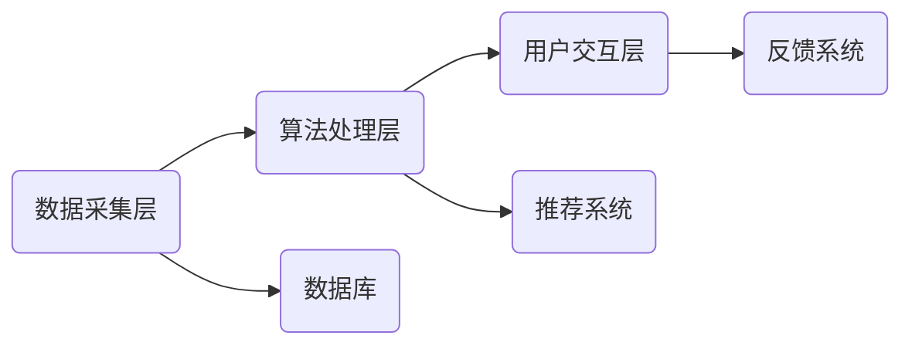

                 


# AI驱动的企业绩效管理：实时反馈与个性化发展计划

**关键词：** AI驱动，企业绩效管理，实时反馈，个性化发展计划，机器学习，自然语言处理

**摘要：** AI技术正在 revolutionize 企业绩效管理，通过实时反馈和个性化发展计划，提升员工绩效，优化组织管理。本文深入探讨AI在企业绩效管理中的应用，从实时反馈机制到个性化发展计划的实现，结合算法原理和系统设计，为企业管理者和技术开发者提供实用的见解。

---

# 第1章 企业绩效管理的数字化转型

## 1.1 企业绩效管理的定义与重要性

### 1.1.1 企业绩效管理的基本概念

企业绩效管理（Performance Management）是通过对员工的工作表现进行评估、反馈和改进，以实现组织目标的过程。传统绩效管理通常基于定期评估，而数字化转型使得绩效管理更加动态和个性化。

### 1.1.2 绩效管理在企业管理中的作用

- **目标设定：** 帮助员工明确工作目标，提升工作方向性。
- **绩效评估：** 通过数据和指标量化员工表现，提供客观评估依据。
- **反馈与改进：** 提供及时反馈，帮助员工快速调整和优化工作表现。
- **员工发展：** 通过个性化发展计划，提升员工技能和职业能力。

### 1.1.3 数字化转型对企业绩效管理的影响

- **数据驱动：** 利用大数据分析员工绩效，提供更精准的评估。
- **实时反馈：** 通过AI技术实现即时反馈，提升员工表现。
- **个性化：** 基于员工特点制定个性化发展计划，增强员工满意度和绩效。

---

## 1.2 AI在企业绩效管理中的应用背景

### 1.2.1 传统绩效管理的局限性

- **滞后性：** 传统绩效评估通常是定期进行，无法提供实时反馈。
- **主观性：** 评估结果容易受到主观因素影响，缺乏客观性。
- **缺乏个性化：** 统一的评估标准难以满足员工的个性化需求。

### 1.2.2 AI技术如何解决传统绩效管理的痛点

- **实时数据处理：** AI能够实时分析员工表现数据，提供即时反馈。
- **自动化评估：** 利用机器学习模型自动评估员工绩效，提高效率。
- **个性化推荐：** 基于员工数据，AI可以推荐适合的培训资源和发展计划。

### 1.2.3 AI驱动绩效管理的潜在价值

- **提升员工绩效：** 通过实时反馈和个性化发展计划，帮助员工更快提升。
- **优化组织管理：** AI能够分析整体绩效数据，优化组织结构和管理流程。
- **增强员工满意度：** 个性化发展计划能够满足员工的职业发展需求，提升满意度。

---

# 第2章 实时反馈与个性化发展计划的核心概念

## 2.1 实时反馈的定义与特征

### 2.1.1 实时反馈的概念

实时反馈是指在员工执行任务的过程中，系统能够即时分析其表现并提供反馈。这种方式能够帮助员工迅速调整工作策略，避免错误积累。

### 2.1.2 实时反馈的特点

- **即时性：** 反馈在任务执行过程中实时生成，无延迟。
- **准确性：** 基于实时数据和AI分析，反馈更加准确。
- **个性化：** 根据员工的具体表现提供个性化的反馈。

### 2.1.3 实时反馈在绩效管理中的应用

- **销售团队：** 实时反馈可以帮助销售团队快速调整销售策略。
- **技术支持：** 实时反馈可以及时指导技术支持人员解决问题。
- **生产线：** 实时反馈可以帮助生产线员工快速纠正操作错误。

---

## 2.2 个性化发展计划的定义与优势

### 2.2.1 个性化发展计划的概念

个性化发展计划是基于员工的个人特点、技能水平和职业目标，制定的专属发展方案。这种计划能够帮助员工有针对性地提升能力，实现职业发展。

### 2.2.2 个性化发展计划的优势

- **针对性强：** 根据员工的具体情况制定发展计划，提升效果。
- **员工满意度高：** 个性化计划能够满足员工的职业发展需求，提升满意度。
- **促进组织发展：** 通过提升员工能力，增强组织整体竞争力。

### 2.2.3 个性化发展计划与企业绩效的关系

- **绩效提升：** 个性化发展计划能够帮助员工更快提升技能，从而提高绩效。
- **员工忠诚度：** 个性化计划能够增强员工对企业的忠诚度和归属感。
- **人才保留：** 通过提供个性化发展机会，企业可以更好地留住优秀员工。

---

## 2.3 AI驱动实时反馈与个性化发展计划的核心要素

### 2.3.1 数据采集与处理

- **数据来源：** 包括员工的工作记录、销售数据、客户反馈等。
- **数据预处理：** 清洗、标准化、特征提取等步骤，确保数据质量。
- **数据存储：** 使用数据库或大数据平台存储员工绩效数据。

### 2.3.2 AI算法在实时反馈中的应用

- **自然语言处理（NLP）：** 用于分析员工的反馈内容，提取关键信息。
- **机器学习模型：** 用于预测员工绩效，识别潜在问题。
- **实时反馈系统：** 基于AI算法，即时生成反馈并推送至员工。

### 2.3.3 系统架构与实现

- **系统架构设计：** 采用分层架构，包括数据采集层、算法处理层和用户交互层。
- **系统功能模块：** 包括数据采集模块、反馈生成模块、个性化推荐模块等。
- **系统实现关键技术：** 包括AI算法实现、实时数据处理、系统集成等。

---

# 第3章 AI驱动的企业绩效管理的算法与系统实现

## 3.1 实时反馈机制的算法原理

### 3.1.1 反馈机制的数学模型

实时反馈机制可以通过时间序列分析模型来预测员工绩效。例如，使用ARIMA模型（自回归积分滑动平均模型）进行预测：

$$ ARIMA(p, d, q) $$

其中，p为自回归阶数，d为差分阶数，q为移动平均阶数。

### 3.1.2 基于AI的实时反馈算法实现

#### 算法流程图（Mermaid）



#### Python实现代码示例

```python
import pandas as pd
from sklearn.linear_model import LinearRegression

# 示例数据
data = pd.DataFrame({
    'time': range(10),
    'performance': [1, 2, 3, 4, 5, 6, 7, 8, 9, 10]
})

# 训练模型
model = LinearRegression()
model.fit(data[['time']], data['performance'])

# 预测下一个时间点的绩效
next_time = 10
predicted_performance = model.predict([[next_time]])
print(f"下一个时间点的预测绩效为：{predicted_performance[0]}")
```

---

## 3.2 个性化发展计划的算法实现

### 3.2.1 个性化推荐算法

个性化发展计划可以通过协同过滤算法或基于内容的推荐算法来实现。例如，使用基于内容的推荐算法，根据员工的技能和兴趣推荐相关的培训资源。

#### 算法流程图（Mermaid）



#### Python实现代码示例

```python
from surprise import SVD, Dataset, Reader

# 示例数据
data = Dataset.load_from_file('performance_ratings.txt', format='pm1', reader=Reader())

# 训练模型
model = SVD()
model.fit(data.build_full_trainset())

# 推荐个性化发展计划
user_id = 1
recomm, _ = model.recommend(user_id, k=3)
print(f"推荐的个性化发展计划为：{recomm}")
```

---

## 3.3 系统架构与设计

### 3.3.1 系统架构设计

系统采用分层架构，包括数据采集层、算法处理层和用户交互层。

#### 系统架构图（Mermaid）



### 3.3.2 系统功能模块设计

- **数据采集模块：** 负责采集员工的绩效数据、行为数据等。
- **算法处理模块：** 包括实时反馈算法和个性化推荐算法。
- **用户交互模块：** 提供用户界面，展示实时反馈和个性化发展计划。

---

# 第4章 项目实战：AI驱动的实时反馈与个性化发展计划系统

## 4.1 项目介绍

本项目旨在开发一个AI驱动的企业绩效管理系统，实现实时反馈和个性化发展计划的自动化。

## 4.2 环境安装与配置

- **Python 3.8+**
- **Pandas、Scikit-learn、Surprise库**

## 4.3 系统核心实现

### 4.3.1 实时反馈模块

```python
import pandas as pd
from sklearn.linear_model import LinearRegression

# 数据加载
data = pd.read_csv('performance_data.csv')

# 模型训练
model = LinearRegression()
model.fit(data[['time']], data['performance'])

# 实时预测
def get_real_time_feedback(time):
    predicted_performance = model.predict([[time]])
    return predicted_performance[0]
```

### 4.3.2 个性化推荐模块

```python
from surprise import SVD, Dataset, Reader

# 数据加载
data = Dataset.load_from_file('performance_ratings.txt', format='pm1', reader=Reader())

# 模型训练
model = SVD()
model.fit(data.build_full_trainset())

# 推荐生成
def get_personalized_recommendation(user_id):
    recommendations, _ = model.recommend(user_id, k=3)
    return recommendations
```

## 4.4 案例分析与解读

### 4.4.1 案例背景

假设我们有一个销售团队，需要通过实时反馈和个性化发展计划来提升销售业绩。

### 4.4.2 实时反馈的应用

销售人员在销售过程中，系统实时分析其销售数据，提供即时反馈，帮助其快速调整销售策略。

### 4.4.3 个性化推荐的应用

根据销售人员的历史表现和技能水平，系统推荐相关的销售培训课程和策略，帮助其提升销售能力。

## 4.5 项目小结

通过本项目的实施，我们可以看到AI技术在企业绩效管理中的巨大潜力。实时反馈和个性化发展计划不仅能够提升员工绩效，还能优化组织管理，增强员工满意度。

---

# 第5章 最佳实践与小结

## 5.1 最佳实践

- **数据质量管理：** 确保数据的准确性和完整性，避免错误反馈。
- **算法优化：** 根据实际情况不断优化AI算法，提升反馈的准确性和推荐的精准度。
- **员工隐私保护：** 在使用员工数据时，必须严格遵守隐私保护法规。

## 5.2 小结

AI技术正在 revolutionizing 企业绩效管理。通过实时反馈和个性化发展计划，企业可以更高效地提升员工绩效，优化组织管理。未来，随着AI技术的不断发展，企业绩效管理将更加智能化和个性化。

---

# 作者：AI天才研究院 & 禅与计算机程序设计艺术

**作者简介：**  
AI天才研究院（AI Genius Institute）专注于人工智能领域的研究与应用，致力于通过技术创新推动企业管理的智能化发展。

