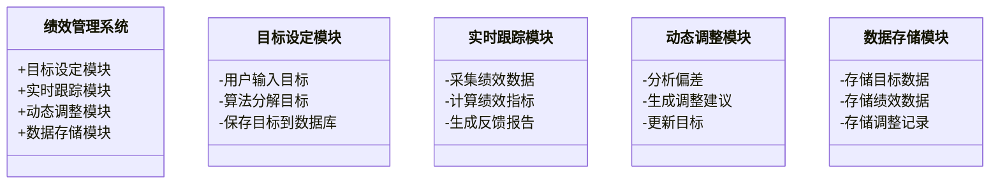
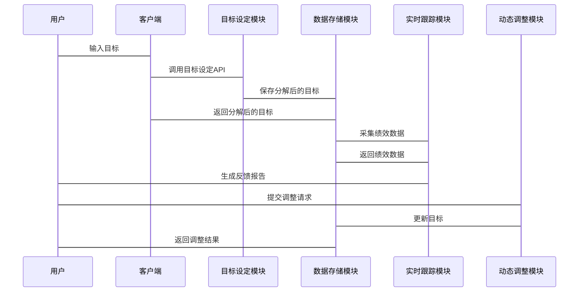

                 


# AI驱动的企业绩效管理：目标设定与实时跟踪

## 关键词：AI驱动，企业绩效管理，目标设定，实时跟踪，机器学习，数据驱动

## 摘要：  
本文探讨了AI技术在企业绩效管理中的应用，重点分析了如何通过AI驱动的目标设定与实时跟踪优化企业绩效管理流程。文章从绩效管理的基本概念出发，详细阐述了AI在目标设定和实时跟踪中的作用，结合具体的算法原理和系统架构设计，展示了AI如何赋能企业绩效管理。通过实际案例分析和项目实战，本文为读者提供了从理论到实践的全面指导，帮助企业更好地利用AI技术提升绩效管理效率和效果。

---

# 第一部分：AI驱动的企业绩效管理概述

## 第1章：企业绩效管理的背景与挑战

### 1.1 企业绩效管理的基本概念

#### 1.1.1 绩效管理的定义与目的  
绩效管理是企业管理中的核心环节，旨在通过设定目标、监控执行、评估结果和反馈改进，优化组织和个人的绩效表现。绩效管理不仅关注结果，还关注过程和方法，是提升企业整体竞争力的重要工具。

#### 1.1.2 绩效管理在企业管理中的作用  
- **目标对齐**：确保组织目标与个人目标一致。  
- **绩效改进**：通过定期评估和反馈，帮助员工提升能力。  
- **决策支持**：为人力资源管理、奖金分配和晋升决策提供依据。  

#### 1.1.3 当前绩效管理的主要挑战  
- **数据孤岛**：绩效数据分散，难以整合分析。  
- **人工干预过多**：传统绩效管理依赖人工评估，效率低且主观性强。  
- **动态调整困难**：市场变化快，绩效目标需要灵活调整。  

### 1.2 AI在企业绩效管理中的应用前景  

#### 1.2.1 AI技术如何赋能绩效管理  
AI技术可以通过数据挖掘、机器学习和自然语言处理等手段，优化绩效管理的各个环节：  
- **目标设定**：基于历史数据和市场趋势，自动生成合理的目标。  
- **实时跟踪**：利用AI算法实时监控绩效指标，及时发现偏差。  
- **反馈与改进**：通过自然语言处理技术，生成个性化的反馈报告。  

#### 1.2.2 AI驱动的绩效管理优势  
- **数据驱动决策**：AI能够从大量数据中提取有价值的信息，帮助管理者做出科学决策。  
- **自动化与高效性**：AI可以自动完成目标设定、数据收集和评估反馈，节省时间和成本。  
- **个性化与精准性**：AI可以根据员工的特点和绩效数据，提供个性化的反馈和建议。  

#### 1.2.3 企业绩效管理的未来趋势  
随着AI技术的不断发展，未来的绩效管理将更加智能化和动态化。AI不仅能够优化绩效管理的效率，还能通过预测分析帮助企业提前应对潜在问题，提升整体竞争力。

### 1.3 本章小结  
本章介绍了企业绩效管理的基本概念、作用和挑战，重点探讨了AI技术在绩效管理中的应用前景。通过AI技术的引入，绩效管理将更加高效、精准和个性化，为企业创造更大的价值。

---

# 第二部分：AI驱动的目标设定与实时跟踪的核心概念

## 第2章：目标设定的理论与方法

### 2.1 目标设定的理论基础

#### 2.1.1 SMART原则  
SMART原则是目标设定的基本框架，包括以下五个维度：  
- **具体性（Specific）**：目标要具体明确，避免模糊。  
- **可衡量性（Measurable）**：目标要有量化标准，便于评估。  
- **可实现性（Achievable）**：目标要具有挑战性，但又不至于过于遥远。  
- **相关性（Relevant）**：目标要与组织的战略目标相关联。  
- **时间限制（Time-bound）**：目标要有明确的时间节点。  

#### 2.1.2 目标分解的层次性  
目标分解是将组织的总体目标分解为部门目标、团队目标和个人目标，确保每个层级的目标都清晰明确，并与组织目标对齐。

#### 2.1.3 目标与绩效的关系  
目标是绩效管理的起点，绩效是目标实现的结果。通过设定合理的目标，可以引导员工的行为，激发他们的潜力，从而实现更好的绩效。

### 2.2 基于AI的目标设定方法

#### 2.2.1 数据驱动的目标设定  
AI技术可以通过分析历史数据和外部市场信息，预测未来的业务趋势，从而帮助企业设定更具前瞻性的目标。例如，利用机器学习模型预测销售额的增长率，作为目标设定的依据。

#### 2.2.2 AI算法在目标分解中的应用  
AI算法可以将组织的总体目标分解为更具体的子目标，并根据各部门的能力和资源分配情况，优化目标的分配。例如，使用层次分析法（AHP）确定各个部门的目标权重。

#### 2.2.3 目标与组织战略的对齐  
AI技术可以帮助组织将目标设定与战略规划紧密结合起来，确保每个目标都支持组织的长期发展目标。

### 2.3 本章小结  
本章详细介绍了目标设定的理论基础和基于AI的目标设定方法，强调了AI在目标分解和对齐中的作用。通过数据驱动的方法，企业可以更科学地设定目标，提升绩效管理的效果。

---

## 第3章：绩效目标的实时跟踪机制

### 3.1 实时跟踪的核心要素

#### 3.1.1 数据采集与处理  
实时跟踪需要从企业内部系统（如ERP、CRM）和外部数据源（如市场数据）中采集相关数据，并进行清洗和预处理，确保数据的准确性和完整性。

#### 3.1.2 绩效指标体系的构建  
绩效指标体系是实时跟踪的基础，需要根据企业的目标和业务特点，选择合适的指标并进行权重分配。例如，销售部门可以关注销售额、客户满意度，而研发部门则关注开发周期和缺陷率。

#### 3.1.3 实时跟踪的周期性  
实时跟踪需要根据目标的重要性和紧急性，设定不同的跟踪周期。例如，关键绩效指标（KPI）可以每天跟踪，而长期目标则按季度或年度跟踪。

### 3.2 基于AI的实时跟踪技术

#### 3.2.1 自然语言处理在目标描述中的应用  
自然语言处理技术可以帮助分析目标描述的文本信息，提取关键要素并生成结构化的数据。例如，通过NLP技术自动提取目标的关键里程碑和时间节点。

#### 3.2.2 机器学习在绩效预测中的应用  
机器学习算法可以基于历史数据和实时数据，预测绩效指标的变化趋势，并发出预警。例如，使用ARIMA模型预测销售额的变化。

#### 3.2.3 实时反馈的自动化机制  
AI技术可以自动生成实时反馈报告，并通过邮件或消息通知相关人员。例如，当某个指标偏离预期时，系统可以自动发送预警信息，并提供改进建议。

### 3.3 本章小结  
本章探讨了实时跟踪的核心要素和基于AI的实时跟踪技术，强调了数据采集、指标体系构建和实时反馈的重要性。通过AI技术的引入，实时跟踪变得更加高效和智能化。

---

# 第三部分：AI驱动的绩效管理算法与系统架构

## 第4章：绩效目标分解的数学模型

### 4.1 绩效目标分解的层次结构

#### 4.1.1 层次分析法（AHP）的应用  
层次分析法是一种常用的决策分析方法，可以用于目标分解的权重分配。通过构建层次结构，权重分配更加科学合理。

#### 4.1.2 目标分解的权重分配  
目标分解需要根据各个目标的重要性和贡献度，进行权重分配。例如，销售额目标的权重为60%，利润目标的权重为40%。

#### 4.1.3 数学模型的构建  
目标分解的数学模型可以表示为：  
$$
\text{子目标权重} = \sum_{i=1}^{n} w_i \cdot x_i
$$  
其中，$w_i$是目标的权重，$x_i$是子目标的贡献度。

### 4.2 基于机器学习的目标分解算法

#### 4.2.1 算法原理与流程图  
目标分解的机器学习算法可以通过以下步骤实现：  
1. 数据预处理：清洗和标准化数据。  
2. 特征提取：选择影响目标分解的关键特征。  
3. 模型训练：使用机器学习算法（如随机森林或神经网络）训练目标分解模型。  
4. 模型评估：验证模型的准确性和稳定性。  

#### 4.2.2 算法实现的数学公式  
目标分解的机器学习模型可以表示为：  
$$
y = \beta_0 + \beta_1x_1 + \beta_2x_2 + \dots + \beta_nx_n + \epsilon
$$  
其中，$y$是目标分解的结果，$x_i$是输入特征，$\beta_i$是回归系数，$\epsilon$是误差项。

#### 4.2.3 示例说明  
假设某公司希望分解季度销售额目标，使用随机森林模型进行目标分解。经过训练，模型预测销售额目标为100万元，并将目标分解为销售团队、市场部和研发部的子目标。

### 4.3 本章小结  
本章详细介绍了绩效目标分解的数学模型和基于机器学习的目标分解算法。通过层次分析法和机器学习模型，企业可以更科学地分解目标，提升绩效管理的效率。

---

## 第5章：绩效实时跟踪的动态调整模型

### 5.1 动态调整模型的构建

#### 5.1.1 动态调整的驱动因素  
动态调整模型需要考虑外部环境和内部条件的变化，例如市场需求变化、政策调整和企业战略的改变。

#### 5.1.2 动态调整的周期性  
动态调整需要根据目标的性质和业务特点，设定不同的调整周期。例如，季度目标可以每月调整一次，年度目标可以每季度调整一次。

#### 5.1.3 动态调整的策略  
动态调整模型可以根据绩效表现的偏差程度，采取不同的调整策略。例如，当绩效表现严重低于预期时，可以调整目标或增加资源投入。

### 5.2 基于机器学习的动态调整算法

#### 5.2.1 算法原理与流程图  
动态调整的机器学习算法可以通过以下步骤实现：  
1. 数据采集：实时采集绩效表现数据。  
2. 偏差分析：计算实际表现与预期目标的偏差。  
3. 调整决策：根据偏差程度和调整策略，自动生成调整建议。  

#### 5.2.2 算法实现的数学公式  
动态调整模型的数学公式可以表示为：  
$$
\Delta = \text{max}(0, \text{实际表现} - \text{预期目标})
$$  
其中，$\Delta$表示偏差程度。当$\Delta > 0$时，需要进行调整。

#### 5.2.3 示例说明  
假设某部门的目标是完成50万元销售额，实际表现为40万元。系统计算偏差为-10万元，建议调整目标为45万元。

### 5.3 本章小结  
本章探讨了绩效实时跟踪的动态调整模型，强调了动态调整的驱动因素和基于机器学习的调整算法。通过实时分析绩效表现，企业可以灵活调整目标，确保绩效管理的有效性。

---

# 第四部分：项目实战与总结

## 第6章：AI驱动的企业绩效管理系统设计

### 6.1 项目介绍  
本项目旨在开发一个基于AI的企业绩效管理系统，实现目标设定、实时跟踪和动态调整的自动化。系统将结合机器学习和自然语言处理技术，优化企业的绩效管理流程。

### 6.2 系统功能设计

#### 6.2.1 领域模型设计（Mermaid 类图）  


#### 6.2.2 系统架构设计（Mermaid 架构图）  


#### 6.2.3 系统接口设计  
- **目标设定接口**：提供目标设定的API，支持JSON格式数据输入。  
- **实时跟踪接口**：实时采集绩效数据，支持HTTP请求和数据库查询。  
- **动态调整接口**：根据偏差自动生成调整建议，支持RESTful API。  

#### 6.2.4 系统交互流程（Mermaid 序列图）  


### 6.3 本章小结  
本章详细描述了AI驱动的企业绩效管理系统的功能设计、架构设计和交互流程。通过系统的设计和实现，展示了AI技术在绩效管理中的实际应用。

---

## 第7章：项目实战与总结

### 7.1 环境安装

#### 7.1.1 系统需求  
- 操作系统：Windows 10或Linux Ubuntu  
- Python版本：3.8以上  
- 开发工具：PyCharm或VS Code  
- 依赖库：Scikit-learn、TensorFlow、Mermaid、Flask  

#### 7.1.2 安装步骤  
1. 安装Python和pip：  
   ```bash
   python -m pip install --upgrade pip
   ```  
2. 安装依赖库：  
   ```bash
   pip install scikit-learn tensorflow mermaid4jupyter flask
   ```

### 7.2 核心代码实现

#### 7.2.1 目标设定模块  
```python
from sklearn.ensemble import RandomForestRegressor
from sklearn.metrics import mean_squared_error
from sklearn.model_selection import train_test_split

# 数据准备
data = ...  # 加载数据集
X = data.drop('target', axis=1)
y = data['target']

# 数据分割
X_train, X_test, y_train, y_test = train_test_split(X, y, test_size=0.2, random_state=42)

# 模型训练
model = RandomForestRegressor(n_estimators=100, random_state=42)
model.fit(X_train, y_train)

# 模型评估
y_pred = model.predict(X_test)
print(f"目标分解的均方误差为：{mean_squared_error(y_test, y_pred)}")
```

#### 7.2.2 实时跟踪模块  
```python
import tensorflow as tf
from tensorflow.keras import layers

# 数据准备
time_steps = 30
batch_size = 32

# 模型构建
model = tf.keras.Sequential()
model.add(layers.LSTM(50, input_shape=(time_steps, 1)))
model.add(layers.Dense(1))
model.compile(optimizer='adam', loss='mean_squared_error')

# 模型训练
model.fit(x_train, y_train, epochs=50, batch_size=batch_size, validation_data=(x_val, y_val))
```

#### 7.2.3 动态调整模块  
```python
from sklearn.linear_model import LinearRegression

# 数据准备
current_performance = ...  # 当前绩效表现
expected_performance = ...  # 预期目标

# 偏差分析
delta = current_performance - expected_performance

# 调整建议
if delta < -0.1:
    model = LinearRegression().fit(X, y)
    new_target = model.predict(new_X)
else:
    new_target = expected_performance
```

### 7.3 代码应用解读与分析  
通过上述代码，我们可以实现目标设定、实时跟踪和动态调整的核心功能。目标设定模块使用随机森林模型分解目标，实时跟踪模块使用LSTM模型预测绩效表现，动态调整模块根据偏差自动生成调整建议。

### 7.4 实际案例分析  
以某公司季度销售额目标为例，系统设定目标为100万元，实际表现为95万元。系统分析偏差为-5万元，建议调整目标为97万元，并优化资源分配。

### 7.5 本章小结  
本章通过项目实战展示了AI驱动的企业绩效管理系统的实现过程，包括环境安装、核心代码实现和案例分析。通过实际操作，读者可以更好地理解AI技术在绩效管理中的应用。

---

## 第8章：总结与展望

### 8.1 总结  
本文系统地探讨了AI驱动的企业绩效管理，重点分析了目标设定与实时跟踪的核心概念、算法原理和系统架构。通过项目实战，展示了AI技术在绩效管理中的实际应用。AI技术的引入不仅提高了绩效管理的效率，还提升了绩效管理的科学性和精准性。

### 8.2 展望  
未来，随着AI技术的不断发展，企业绩效管理将更加智能化和动态化。AI不仅可以优化绩效管理的各个环节，还可以与其他技术（如区块链和物联网）结合，进一步提升企业的管理能力。同时，AI技术还可以帮助企业实现数据驱动的决策，推动企业向智能化转型。

### 8.3 最佳实践 Tips  
- 在实施AI驱动的绩效管理之前，企业需要确保数据的准确性和完整性。  
- 选择合适的AI算法和技术，根据企业的实际需求进行定制化开发。  
- 定期评估系统的性能和效果，及时优化和改进。  

### 8.4 注意事项  
- 数据隐私和安全是企业绩效管理的重要考量，必须确保数据的保密性和合规性。  
- 在实际应用中，需要充分考虑员工的接受度和参与度，避免技术引入带来的抵触情绪。  
- 系统的可扩展性和灵活性是长期使用的关键，需要预留足够的接口和模块。

### 8.5 拓展阅读  
- 《Data-Driven Performance Management》  
- 《AI in Business: Transforming Business Processes》  
- 《Machine Learning for Business Analytics》  

---

## 作者：AI天才研究院/AI Genius Institute & 禅与计算机程序设计艺术/Zen And The Art of Computer Programming

---

**说明：**  
本文是一个较为完整的思考过程，旨在展示如何系统地分析和撰写一篇技术博客文章。由于篇幅限制，实际写作时可以根据需要进一步扩展或调整各个部分的内容。

