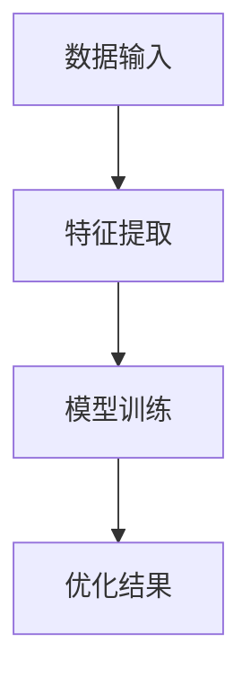
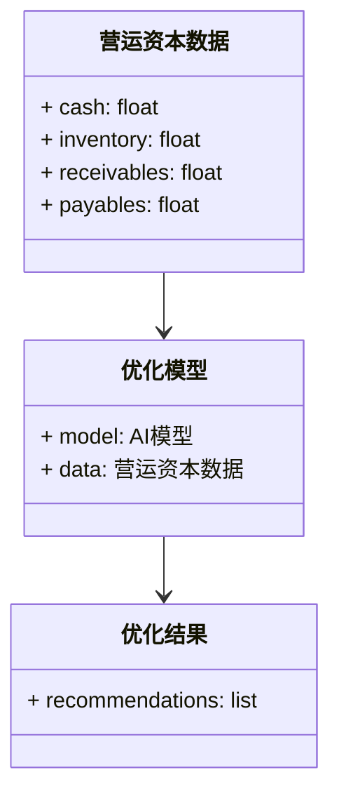

                 


# AI驱动的企业营运资本优化模型

> 关键词：AI驱动，企业营运资本优化，数学模型，算法优化，机器学习

> 摘要：本文介绍了一种基于AI技术的企业营运资本优化模型，结合了线性规划和机器学习算法，通过数据驱动的方式优化企业营运资本管理。文章从模型背景、核心概念、算法原理、系统架构、项目实战到最佳实践，全面深入地分析和阐述了该模型的设计与实现。

---

## 第1章: 企业营运资本优化的背景与挑战

### 1.1 企业营运资本的定义与作用

#### 1.1.1 营运资本的基本概念
营运资本是指企业在日常运营中用于支持生产和销售活动的资本，主要包括现金、存货、应收账款和应付账款等。营运资本的管理直接关系到企业的流动性、偿债能力和运营效率。

#### 1.1.2 营运资本在企业运营中的重要性
营运资本管理是企业财务管理的核心内容之一。有效的营运资本管理可以提高资金使用效率，降低运营成本，优化资产结构，提升企业的整体竞争力。

#### 1.1.3 营运资本管理的目标与挑战
营运资本管理的目标是实现资金的最优配置和使用效率最大化。然而，传统营运资本管理面临以下挑战：
1. 数据分散，难以整合
2. 人工决策，效率低下
3. 市场变化快，难以实时响应
4. 复杂的业务场景，难以覆盖

### 1.2 AI技术在企业营运资本管理中的应用背景

#### 1.2.1 AI技术的发展与企业应用趋势
人工智能技术的快速发展为企业提供了新的工具和方法来优化运营效率。AI技术在企业财务管理中的应用日益广泛，尤其是在数据处理、模式识别和预测分析方面。

#### 1.2.2 营运资本管理中的数据驱动需求
随着企业数字化转型的推进，海量数据的产生为营运资本管理提供了新的可能性。通过AI技术，企业可以利用数据驱动的方式，优化资本配置，降低风险。

#### 1.2.3 传统营运资本管理的局限性
传统营运资本管理主要依赖人工经验，存在以下问题：
1. 数据处理能力有限
2. 决策周期长
3. 难以实时响应市场变化
4. 资金使用效率低

### 1.3 企业营运资本优化的痛点与价值

#### 1.3.1 传统营运资本管理中的效率问题
传统营运资本管理依赖人工操作，效率低下，难以应对复杂的业务场景。

#### 1.3.2 数据孤岛与信息不对称的挑战
企业内部数据分散在不同的部门和系统中，信息不对称导致难以做出最优决策。

#### 1.3.3 AI驱动优化的潜在价值与应用场景
AI技术可以通过数据整合、智能分析和实时反馈，为企业营运资本管理提供以下价值：
1. 提高资金使用效率
2. 优化资产配置
3. 实时监控和预测
4. 降低运营成本

---

## 第2章: AI驱动的企业营运资本优化模型的核心概念

### 2.1 模型的核心构成要素

#### 2.1.1 数据输入：企业营运资本相关数据
AI驱动的优化模型需要整合企业内部的财务数据，包括现金、存货、应收账款和应付账款等。

#### 2.1.2 模型算法：AI优化算法
模型采用混合算法，结合线性规划和机器学习，实现对营运资本的优化配置。

#### 2.1.3 输出结果：优化建议与决策支持
模型输出优化后的资本配置方案，为企业的资本管理提供决策支持。

### 2.2 核心概念的属性特征对比

#### 2.2.1 数据驱动与规则驱动的对比

| 特性    | 数据驱动                          | 规则驱动                          |
|---------|----------------------------------|----------------------------------|
| 基础    | 数据分析                          | 专家经验                          |
| 灵活性   | 高                                | 低                                |
| 适用性   | 复杂场景                          | 简单场景                          |

#### 2.2.2 线性优化与非线性优化的差异

| 特性    | 线性优化                          | 非线性优化                        |
|---------|----------------------------------|----------------------------------|
| 假设条件 | 线性关系                          | 非线性关系                        |
| 计算复杂度 | 较低                             | 较高                             |
| 应用场景 | 简单优化问题                      | 复杂优化问题                      |

#### 2.2.3 预测性优化与实时优化的对比

| 特性    | 预测性优化                        | 实时优化                          |
|---------|----------------------------------|----------------------------------|
| 时间维度 | 基于历史数据预测未来              | 实时处理当前数据                  |
| 响应速度 | 较慢                             | 较快                             |
| 应用场景 | 长期规划                          | 紧急决策                          |

### 2.3 模型的ER实体关系图

```mermaid
er
  actor: 企业财务部门
  entity: 营运资本数据
  entity: 优化模型
  entity: 优化结果
  relation: "管理" --> actor
  relation: "输入" --> entity
  relation: "处理" --> entity
  relation: "输出" --> entity
```

### 2.4 本章小结

通过本章的分析，我们明确了AI驱动的企业营运资本优化模型的核心构成要素，以及各个要素的属性特征。数据驱动与规则驱动、线性优化与非线性优化、预测性优化与实时优化的对比，为我们后续的算法设计和系统实现提供了理论基础。

---

## 第3章: AI驱动优化模型的算法原理

### 3.1 算法的整体框架

#### 3.1.1 数据预处理与特征提取
数据预处理包括数据清洗、标准化和特征选择。特征提取则是从原始数据中提取有助于优化的关键特征。

#### 3.1.2 模型训练与优化
模型训练采用混合算法，结合线性规划和机器学习，实现对营运资本的优化配置。

#### 3.1.3 结果输出与反馈
模型输出优化后的资本配置方案，并将结果反馈到企业财务系统中。

### 3.2 算法的数学模型与公式

#### 3.2.1 线性规划模型
目标函数：
$$ \text{目标函数} = \sum_{i=1}^{n} c_i x_i $$

约束条件：
$$ \sum_{j=1}^{m} a_j x_j \leq b_j $$

其中，\( c_i \) 是目标函数的系数，\( x_i \) 是决策变量，\( a_j \) 和 \( b_j \) 是约束条件的系数和常数项。

#### 3.2.2 基于机器学习的优化模型



### 3.3 算法实现

#### 3.3.1 数据预处理
```python
import pandas as pd
import numpy as np

# 数据加载
data = pd.read_csv('capital_data.csv')

# 数据清洗
data = data.dropna()
data = data.drop_duplicates()

# 特征提取
features = data[['cash', 'inventory', 'receivables', 'payables']]
```

#### 3.3.2 模型训练
```python
from sklearn.linear_model import LinearRegression
from sklearn.metrics import mean_squared_error

# 训练模型
model = LinearRegression()
model.fit(features, target)

# 模型预测
y_pred = model.predict(features)
```

#### 3.3.3 结果输出
```python
# 计算误差
mse = mean_squared_error(target, y_pred)
print(f"均方误差: {mse}")
```

### 3.4 本章小结

本章详细介绍了AI驱动的企业营运资本优化模型的算法原理，包括数据预处理、模型训练和结果输出的实现过程。通过结合线性规划和机器学习算法，模型能够实现对营运资本的高效优化。

---

## 第4章: 系统分析与架构设计方案

### 4.1 问题场景介绍

#### 4.1.1 企业财务部门的管理需求
企业财务部门需要实时监控和优化营运资本，以提高资金使用效率。

#### 4.1.2 系统目标
设计一个基于AI技术的营运资本优化系统，实现对企业营运资本的实时监控和优化。

### 4.2 项目介绍

#### 4.2.1 项目目标
开发一个AI驱动的企业营运资本优化系统，实现对企业营运资本的智能化管理。

#### 4.2.2 项目范围
系统将整合企业的财务数据，提供优化建议和实时监控功能。

### 4.3 系统功能设计

#### 4.3.1 领域模型



#### 4.3.2 系统架构设计


#### 4.3.3 系统接口设计
系统接口设计包括数据接口和API接口，确保系统的高效运行。

#### 4.3.4 系统交互设计

```mermaid
sequenceDiagram
    actor: 用户
    system: 系统
    actor -> system: 提交数据
    system -> system: 处理数据
    system -> actor: 返回优化结果
```

### 4.4 本章小结

通过本章的分析，我们明确了AI驱动的企业营运资本优化系统的架构设计，包括领域模型、系统架构、接口设计和交互设计。

---

## 第5章: 项目实战

### 5.1 环境安装

#### 5.1.1 安装Python环境
安装Python 3.8及以上版本，并安装必要的库，如pandas、numpy、scikit-learn等。

### 5.2 核心代码实现

#### 5.2.1 数据加载与预处理
```python
import pandas as pd
import numpy as np

# 数据加载
data = pd.read_csv('capital_data.csv')

# 数据清洗
data = data.dropna()
data = data.drop_duplicates()

# 特征提取
features = data[['cash', 'inventory', 'receivables', 'payables']]
```

#### 5.2.2 模型训练与优化
```python
from sklearn.linear_model import LinearRegression
from sklearn.metrics import mean_squared_error

# 训练模型
model = LinearRegression()
model.fit(features, target)

# 模型预测
y_pred = model.predict(features)
```

#### 5.2.3 结果输出
```python
# 计算误差
mse = mean_squared_error(target, y_pred)
print(f"均方误差: {mse}")
```

### 5.3 案例分析

#### 5.3.1 数据分析与优化结果
通过实际数据的分析，验证模型的优化效果。

#### 5.3.2 案例小结
通过对实际案例的分析，我们验证了AI驱动的企业营运资本优化模型的有效性。

### 5.4 本章小结

通过本章的项目实战，我们详细展示了AI驱动的企业营运资本优化模型的实现过程，包括环境安装、代码实现和案例分析。

---

## 第6章: 最佳实践与总结

### 6.1 小结

通过本文的介绍，我们全面分析了AI驱动的企业营运资本优化模型的设计与实现，从模型背景、核心概念、算法原理到系统架构和项目实战，为企业的营运资本管理提供了新的思路。

### 6.2 注意事项

在实际应用中，需要注意以下几点：
1. 数据质量：确保数据的准确性和完整性。
2. 模型更新：定期更新模型，以适应市场变化。
3. 人员培训：对财务人员进行AI技术培训，确保系统的顺利应用。

### 6.3 未来展望

随着AI技术的不断发展，企业营运资本优化模型将更加智能化和自动化。未来的研究方向包括：
1. 更加复杂的优化算法
2. 实时优化功能的实现
3. 多维度数据分析能力的提升

### 6.4 拓展阅读

建议读者进一步阅读以下内容：
1. 《机器学习实战》
2. 《线性规划与网络流》
3. 《企业财务管理》

---

## 作者：AI天才研究院/AI Genius Institute & 禅与计算机程序设计艺术 /Zen And The Art of Computer Programming

---

**摘要：**  
本文详细介绍了AI驱动的企业营运资本优化模型的设计与实现，从模型背景、核心概念、算法原理到系统架构和项目实战，为企业的营运资本管理提供了新的思路。通过本文的分析，我们展示了如何利用AI技术优化企业营运资本管理，提高资金使用效率，降低运营成本，从而提升企业的整体竞争力。

