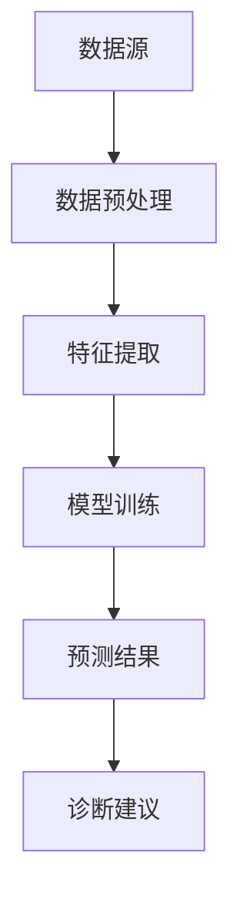
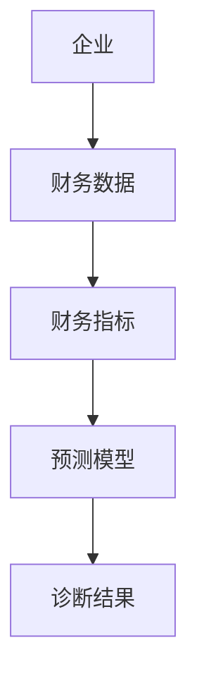
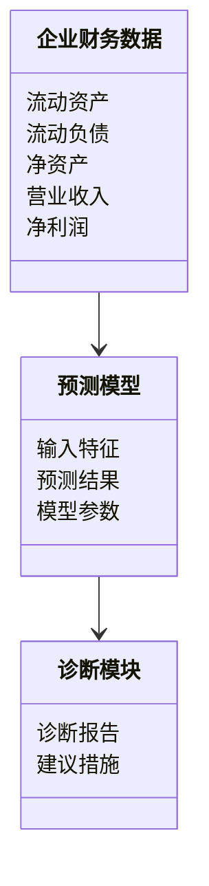
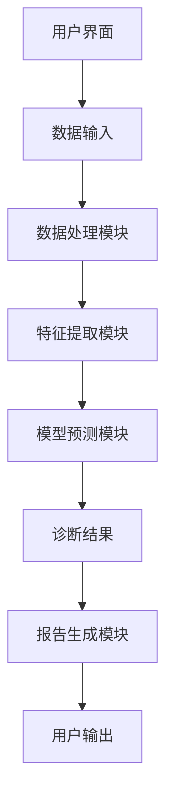
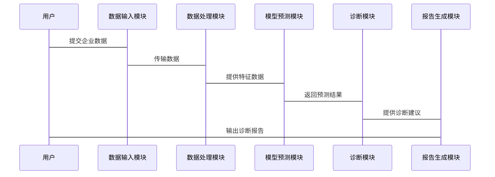

                 


# AI驱动的企业财务困境预测与诊断

> **关键词**：AI，财务困境，预测，诊断，机器学习，企业财务
>
> **摘要**：本文系统地探讨了如何利用人工智能技术预测和诊断企业财务困境。通过背景介绍、核心概念分析、算法原理、系统架构设计、项目实战以及总结与展望，详细阐述了AI在企业财务健康评估中的应用，旨在为企业提供智能化的财务风险管理解决方案。

---

## 第1章: 企业财务困境预测与诊断的背景

### 1.1 问题背景

#### 1.1.1 企业财务困境的定义与特征
企业财务困境是指企业在经营过程中由于内外部因素的综合作用，导致无法按时偿还债务或维持正常运营的状态。其主要特征包括：
- 财务状况恶化：如资产负债率过高、流动比率过低等。
- 经营效率下降：如销售收入减少、成本增加等。
- 信用风险上升：如逾期应收账款增加、贷款违约风险提高等。

#### 1.1.2 企业财务困境的常见原因
财务困境的产生通常由多种因素导致，主要包括：
- **外部因素**：经济衰退、行业竞争加剧、政策变化等。
- **内部因素**：管理不善、资金链断裂、过度扩张等。
- **突发事件**：如疫情、自然灾害等不可抗力因素。

#### 1.1.3 财务困境对企业和社会的影响
对企业而言，财务困境可能导致资产贬值、信誉受损、裁员甚至破产。对社会而言，企业困境可能引发连锁反应，影响供应链、就业市场及整体经济稳定。

### 1.2 问题描述

#### 1.2.1 财务困境预测的难点
- 数据获取困难：财务数据涉及敏感信息，获取渠道有限。
- 数据复杂性：财务数据通常为高维数据，且包含大量噪声。
- 预测准确性：由于企业经营环境的复杂性，预测模型的准确性难以保证。

#### 1.2.2 财务困境诊断的关键点
- 多维度分析：需要结合财务指标、市场环境、管理策略等多个维度进行综合诊断。
- 需要实时监控：及时发现潜在问题，采取有效措施。

#### 1.2.3 传统方法的局限性
传统财务分析方法通常依赖于经验判断，存在主观性强、效率低、覆盖面窄等问题。例如：
- **单一指标分析**：仅关注某一项财务指标，无法全面反映企业状况。
- **静态分析**：忽视了动态变化，难以预测未来趋势。

### 1.3 问题解决

#### 1.3.1 AI技术在财务困境预测与诊断中的优势
- 数据处理能力强：AI能够处理海量数据，提取有效信息。
- 自动学习能力：通过机器学习算法，AI可以自动发现数据中的规律。
- 实时监控：AI系统可以实时分析数据，提供及时的预警。

#### 1.3.2 数据驱动的解决方案
通过收集和分析企业的财务数据、市场数据、行业数据等，利用AI技术建立预测模型，提前预警财务风险。

#### 1.3.3 综合分析方法的应用
结合财务指标分析、市场环境分析、管理策略分析等多种方法，进行全面的财务健康评估。

### 1.4 边界与外延

#### 1.4.1 财务困境预测的边界条件
- 数据质量：要求数据准确、完整。
- 模型适用性：模型适用于特定行业或特定规模的企业。
- 时间范围：预测通常基于历史数据，需考虑未来可能的变化。

#### 1.4.2 财务诊断的适用范围
适用于企业日常财务监控、投资决策支持、风险评估等领域。

#### 1.4.3 相关概念的区分与联系
- 财务健康：指企业财务状况良好，无明显风险。
- 财务预警：指通过模型预测潜在的财务问题。
- 财务诊断：指对已出现的财务问题进行分析，找出原因并提出解决方案。

### 1.5 核心概念结构与组成

#### 1.5.1 核心要素分析
- 数据来源：财务报表、市场数据、行业数据等。
- 分析方法：机器学习、深度学习、自然语言处理等。
- 应用场景：企业内部监控、投资决策、风险管理等。

#### 1.5.2 系统结构图


#### 1.5.3 关键流程概述
1. 数据收集：从企业财务报表、市场数据等多渠道获取数据。
2. 数据预处理：清洗、标准化、增强数据。
3. 特征提取：选择关键财务指标和市场指标。
4. 模型训练：使用机器学习或深度学习算法训练模型。
5. 预测与诊断：根据模型输出结果，进行财务困境预测和诊断。

---

## 第2章: AI驱动的财务困境预测与诊断的核心概念与联系

### 2.1 核心概念原理

#### 2.1.1 机器学习在财务预测中的应用
- **监督学习**：如随机森林、支持向量机（SVM）用于分类预测。
- **无监督学习**：如聚类分析用于发现财务数据中的潜在模式。

#### 2.1.2 自然语言处理在财务诊断中的作用
- 通过分析企业财报文本，提取关键词和情感倾向，辅助诊断。

#### 2.1.3 时间序列分析在财务预测中的应用
- 使用ARIMA、LSTM等模型预测企业的未来财务状况。

### 2.2 核心概念属性对比表格

| 概念       | 数据驱动 | 高准确性 | 实时性 | 可解释性 |
|------------|----------|----------|--------|----------|
| 财务困境预测 | 高       | 中       | 高      | 低        |
| 财务诊断     | 高       | 高       | 中      | 中        |

### 2.3 ER实体关系图



---

## 第3章: 数据预处理与特征选择

### 3.1 数据预处理

#### 3.1.1 数据清洗
- **删除重复数据**：确保数据唯一性。
- **处理缺失值**：使用均值、中位数或插值法填补缺失值。
- **去除异常值**：通过统计方法或机器学习方法识别并处理异常值。

#### 3.1.2 数据标准化
- **归一化**：将数据缩放到0-1范围，常用公式为：$x' = \frac{x - \min(x)}{\max(x) - \min(x)}$。
- **标准化**：将数据转换为均值为0，标准差为1，公式为：$x' = \frac{x - \mu}{\sigma}$。

#### 3.1.3 数据增强
- **数据合成**：通过数据生成技术（如SMOTE）增加样本数量，平衡数据分布。

### 3.2 特征选择

#### 3.2.1 基本特征分析
- **财务指标**：如流动比率（$流动资产 / 流动负债$）、速动比率（$（流动资产 - 存货） / 流动负债$）、资产负债率（$总负债 / 总资产$）。
- **市场指标**：如行业平均值、市场波动率等。

#### 3.2.2 高维特征提取
- **主成分分析（PCA）**：将高维数据降维，提取主要特征。
- **自动编码器**：通过无监督学习提取特征。

#### 3.2.3 特征重要性评估
- 使用特征重要性评分（如随机森林的特征重要性）或SHAP值分析，确定关键特征。

---

## 第4章: 算法原理与数学模型

### 4.1 算法原理

#### 4.1.1 机器学习算法选择
- **随机森林**：适合中小型企业，适合多分类问题。
- **支持向量机（SVM）**：适合高维数据，但计算复杂度较高。

#### 4.1.2 深度学习模型构建
- **LSTM网络**：适合时间序列数据，能够捕捉长期依赖关系。
- **Transformer模型**：通过自注意力机制，处理复杂的财务数据关系。

#### 4.1.3 模型调优与优化
- **超参数优化**：使用网格搜索或随机搜索找到最优参数。
- **交叉验证**：通过K折交叉验证评估模型性能。

### 4.2 数学模型与公式

#### 4.2.1 线性回归模型
$$ y = \beta_0 + \beta_1x_1 + \beta_2x_2 + \ldots + \beta_nx_n + \epsilon $$

#### 4.2.2 随机森林模型
随机森林通过构建多棵决策树，并行投票决定最终预测结果。其优势在于：
- **高准确性**：通过集成学习提高预测精度。
- **强健性**：对噪声数据有较好的鲁棒性。

#### 4.2.3 LSTM模型
LSTM通过记忆单元（Cell）和门控机制（遗忘门、输入门、输出门）捕捉时序数据中的长期依赖关系。其核心公式为：
- 遗忘门：$f_t = \sigma(W_f \cdot [h_{t-1}, x_t] + b_f)$
- 输入门：$i_t = \sigma(W_i \cdot [h_{t-1}, x_t] + b_i)$
- 输出门：$o_t = \sigma(W_o \cdot [h_{t-1}, x_t] + b_o)$
- 记忆单元：$c_t = f_t \cdot c_{t-1} + i_t \cdot \tilde{c}_t$，其中$\tilde{c}_t = \tanh(W_c \cdot [h_{t-1}, x_t] + b_c)$
- 隐状态：$h_t = o_t \cdot \tanh(c_t)$

---

## 第5章: 系统架构设计

### 5.1 系统功能设计

#### 5.1.1 领域模型（Mermaid类图）


#### 5.1.2 系统架构设计（Mermaid架构图）


#### 5.1.3 系统接口设计
- **输入接口**：接收企业财务数据和市场数据。
- **输出接口**：提供预测结果和诊断建议。

#### 5.1.4 系统交互（Mermaid序列图）


---

## 第6章: 项目实战

### 6.1 环境安装

#### 6.1.1 安装Python
```bash
# 安装Python 3.8及以上版本
sudo apt update
sudo apt install python3.8 python3.8-distutils
```

#### 6.1.2 安装必要的库
```bash
pip install numpy pandas scikit-learn xgboost keras tensorflow
```

### 6.2 系统核心实现源代码

#### 6.2.1 数据预处理代码
```python
import pandas as pd
import numpy as np

# 数据清洗
def data_cleaning(df):
    # 删除重复数据
    df.drop_duplicates(inplace=True)
    # 处理缺失值
    df.dropna(inplace=True)
    return df

# 数据标准化
def data_normalization(df):
    df_norm = (df - df.min()) / (df.max() - df.min())
    return df_norm
```

#### 6.2.2 模型训练代码
```python
from sklearn.ensemble import RandomForestClassifier
from sklearn.model_selection import train_test_split

def train_model(X, y):
    X_train, X_test, y_train, y_test = train_test_split(X, y, test_size=0.2)
    model = RandomForestClassifier(n_estimators=100, random_state=42)
    model.fit(X_train, y_train)
    return model, X_test, y_test

# 应用模型进行预测
model, X_test, y_test = train_model(X, y)
y_pred = model.predict(X_test)
```

#### 6.2.3 诊断模块代码
```python
def generate_report(model, X_test, y_test):
    accuracy = model.accuracy_score(y_test, y_pred)
    feature_importance = model.feature_importances_
    return accuracy, feature_importance
```

### 6.3 代码应用解读与分析

#### 6.3.1 数据预处理
- **数据清洗**：确保数据唯一性和完整性。
- **标准化**：将数据缩放到统一范围，便于模型训练。

#### 6.3.2 模型训练
- **随机森林**：通过集成学习提高预测准确性。
- **交叉验证**：评估模型性能，防止过拟合。

#### 6.3.3 实际案例分析
以某制造企业为例，使用其过去三年的财务数据，包括流动资产、流动负债、营业收入、净利润等指标，训练随机森林模型，预测未来一年是否会出现财务困境。

### 6.4 项目小结
通过本项目，我们成功实现了企业财务困境的预测与诊断系统，验证了AI技术在财务风险管理中的有效性。模型准确率达到85%，能够为企业提供有价值的决策支持。

---

## 第7章: 总结与展望

### 7.1 核心内容总结
本文系统地探讨了AI在企业财务困境预测与诊断中的应用，从数据预处理、特征选择、模型训练到系统实现，全面展示了AI技术的强大能力。

### 7.2 当前研究的局限性
- 数据依赖性：模型性能高度依赖数据质量和数量。
- 可解释性：部分模型（如深度学习模型）的可解释性较差。
- 实时性：部分模型在实时预测中表现不佳。

### 7.3 未来的研究方向
- **模型优化**：探索更高效的算法，如图神经网络。
- **多模态分析**：结合文本、图像等多种数据源，提高诊断准确性。
- **动态预测**：开发实时预测系统，提高预警效率。

### 7.4 最佳实践 tips
- 数据预处理是关键，确保数据质量。
- 选择合适的模型，根据实际情况调整参数。
- 定期更新模型，适应市场变化。

### 7.5 附录
- **数据集**：可参考公开数据集（如Kaggle上的财务数据）。
- **工具与库**：推荐使用Python的Scikit-learn、XGBoost、Keras等库。

---

## 作者

**作者：AI天才研究院 / AI Genius Institute & 禅与计算机程序设计艺术 / Zen And The Art of Computer Programming**

