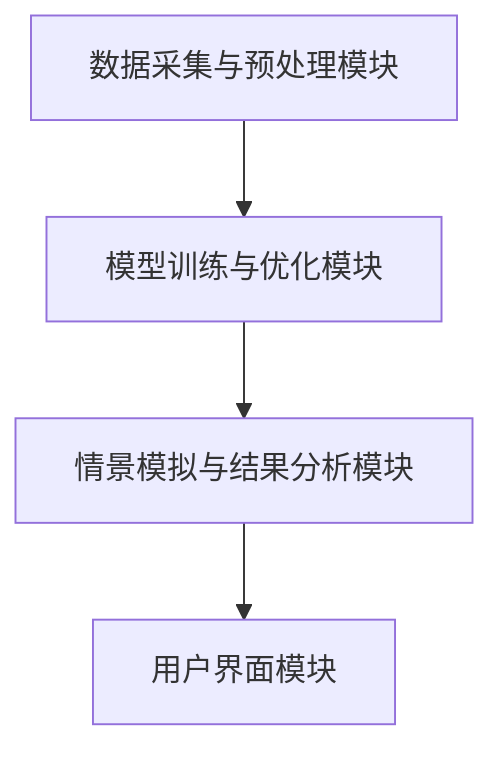

                 


# AI驱动的企业财务战略情景模拟系统

> **关键词**: AI, 企业财务, 情景模拟, 机器学习, 深度学习, 财务预测, 数字化转型

> **摘要**: 本文将详细探讨AI技术在企业财务战略情景模拟系统中的应用，分析其核心概念、算法原理、系统架构设计及实际项目实现。通过本文，读者可以全面了解AI如何驱动企业财务战略的优化与创新。

---

## 第一部分: AI驱动的企业财务战略情景模拟系统背景

### 第1章: AI驱动的企业财务战略情景模拟系统背景

#### 1.1 企业财务战略的数字化转型
##### 1.1.1 传统企业财务战略的局限性
传统的财务战略依赖于人工分析和经验判断，存在以下问题：
- 数据处理复杂：需要手动收集、整理和分析大量财务数据，效率低下。
- 决策不够精准：受主观因素影响较大，难以准确预测市场变化和风险。
- 缺乏实时性：无法快速响应市场波动和企业内部变化。

##### 1.1.2 AI技术对企业财务管理的革新作用
人工智能技术的引入，为企业财务管理带来了以下革新：
- 数据处理自动化：AI可以快速处理大量财务数据，提高效率。
- 精准预测：通过机器学习模型，可以更准确地预测市场趋势和企业绩效。
- 实时反馈：AI系统能够实时监控财务数据，及时调整策略。

##### 1.1.3 数字化财务战略的核心目标与价值
数字化财务战略的核心目标是通过AI技术优化企业财务决策，具体价值体现在：
- 提高财务预测的准确性和及时性。
- 降低财务风险，优化资源配置。
- 提升企业整体运营效率。

---

### 第2章: AI驱动的企业财务战略情景模拟系统核心概念

#### 2.1 AI在企业财务分析中的应用
##### 2.1.1 机器学习在财务预测中的应用
机器学习在财务预测中的应用包括：
- **财务数据分类**：例如，使用随机森林算法对财务报表进行分类。
- **时间序列预测**：例如，使用LSTM预测股票价格或销售额。

##### 2.1.2 自然语言处理在财务报告分析中的应用
自然语言处理（NLP）在财务报告分析中的应用包括：
- **财务报告内容理解**：通过NLP技术提取财务报告中的关键信息。
- **风险评估**：通过分析财务报告的语言特征，评估企业的财务风险。

##### 2.1.3 图神经网络在财务关系网络中的应用
图神经网络在财务关系网络中的应用包括：
- **企业间关系分析**：通过图神经网络分析企业间的关联交易和风险传导。
- **财务网络可视化**：通过图神经网络可视化企业的财务关系网络。

#### 2.2 情景模拟在企业财务战略中的应用
##### 2.2.1 情景模拟的定义与特点
情景模拟是一种通过构建多种可能的未来情景，分析其对企业财务战略的影响的技术。其特点包括：
- **多维度分析**：情景模拟可以考虑多种因素的影响，例如市场需求、政策变化等。
- **动态调整**：情景模拟可以根据实际情况动态调整策略。

##### 2.2.2 AI驱动情景模拟系统的必要性
AI驱动的情景模拟系统能够：
- **提高模拟效率**：通过AI技术快速构建和分析多种情景。
- **增强预测准确性**：通过机器学习模型提高情景模拟的准确性。

---

## 第二部分: AI驱动的企业财务战略情景模拟系统的算法原理

### 第3章: AI驱动的企业财务战略情景模拟系统的算法原理

#### 3.1 机器学习算法在财务预测中的应用
##### 3.1.1 线性回归模型
线性回归模型用于预测连续型变量，例如销售额。其数学公式为：
$$ y = \beta_0 + \beta_1x + \epsilon $$
其中，$y$ 是目标变量，$x$ 是自变量，$\beta_0$ 和 $\beta_1$ 是回归系数，$\epsilon$ 是误差项。

##### 3.1.2 支持向量机（SVM）
支持向量机用于分类和回归问题，例如将企业分为高风险和低风险。其核心思想是通过找到一个超平面，将数据分为两类。

##### 3.1.3 随机森林与梯度提升树
随机森林是一种基于决策树的集成算法，适用于分类和回归问题。梯度提升树是一种通过多次迭代优化模型的算法，适用于分类和回归问题。

#### 3.2 深度学习算法在财务分析中的应用
##### 3.2.1 神经网络在财务数据分类中的应用
神经网络是一种模仿人脑结构的算法，适用于复杂的非线性问题，例如股票价格预测。

##### 3.2.2 卷积神经网络（CNN）在财务图像识别中的应用
卷积神经网络适用于图像识别问题，例如识别财务报表中的关键信息。

##### 3.2.3 长短期记忆网络（LSTM）在时间序列预测中的应用
LSTM网络适用于时间序列预测问题，例如预测股票价格或汇率变动。

---

## 第三部分: AI驱动的企业财务战略情景模拟系统的系统架构设计

### 第4章: AI驱动的企业财务战略情景模拟系统的系统架构设计

#### 4.1 系统功能模块设计
##### 4.1.1 数据采集与预处理模块
数据采集与预处理模块负责从企业内部系统和外部数据源获取财务数据，并进行清洗和标准化处理。

##### 4.1.2 模型训练与优化模块
模型训练与优化模块负责选择合适的算法，训练模型，并进行参数调优。

##### 4.1.3 情景模拟与结果分析模块
情景模拟与结果分析模块负责构建多种可能的未来情景，模拟其对企业财务战略的影响，并分析结果。

#### 4.2 系统架构设计
##### 4.2.1 系统架构图
以下是系统架构的mermaid图：


##### 4.2.2 接口设计
系统接口设计包括：
- 数据接口：与企业财务系统对接，获取实时数据。
- 用户接口：提供友好的用户界面，方便用户操作和查看结果。

---

## 第四部分: AI驱动的企业财务战略情景模拟系统的项目实战

### 第5章: AI驱动的企业财务战略情景模拟系统的项目实战

#### 5.1 项目背景
本项目旨在帮助企业优化投资决策，通过AI技术构建情景模拟系统，分析不同市场环境下的财务表现。

#### 5.2 环境配置
项目环境配置包括：
- Python 3.8+
- Jupyter Notebook
- Scikit-learn、TensorFlow、Keras等机器学习库

#### 5.3 核心实现代码
以下是核心实现代码示例：
```python
import numpy as np
import pandas as pd
from sklearn.ensemble import RandomForestRegressor
from sklearn.metrics import mean_squared_error

# 数据加载
data = pd.read_csv('financial_data.csv')

# 数据分割
X = data.drop('target', axis=1)
y = data['target']

# 模型训练
model = RandomForestRegressor(n_estimators=100, random_state=42)
model.fit(X, y)

# 模型预测
y_pred = model.predict(X)

# 模型评估
mse = mean_squared_error(y, y_pred)
print(f'Mean Squared Error: {mse}')
```

#### 5.4 案例分析
通过上述代码，我们可以看到随机森林回归模型在财务预测中的应用。模型的均方误差越小，说明预测越准确。

---

## 第五部分: 总结与展望

### 第6章: 总结与展望

#### 6.1 总结
本文详细探讨了AI驱动的企业财务战略情景模拟系统的背景、核心概念、算法原理、系统架构设计及实际项目实现。通过本文，读者可以全面了解AI如何驱动企业财务战略的优化与创新。

#### 6.2 展望
未来，随着AI技术的不断发展，企业财务战略情景模拟系统将更加智能化和自动化。同时，AI技术与其他技术的结合，例如区块链和物联网，将进一步提升企业财务管理的效率和精准度。

---

**作者：AI天才研究院/AI Genius Institute & 禅与计算机程序设计艺术 /Zen And The Art of Computer Programming**

