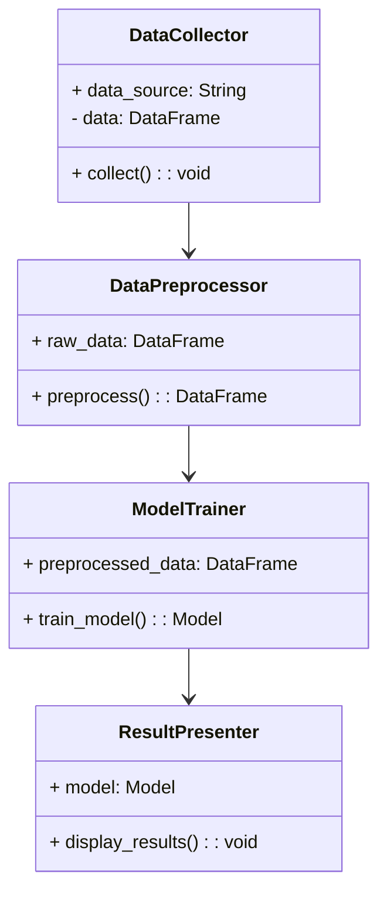
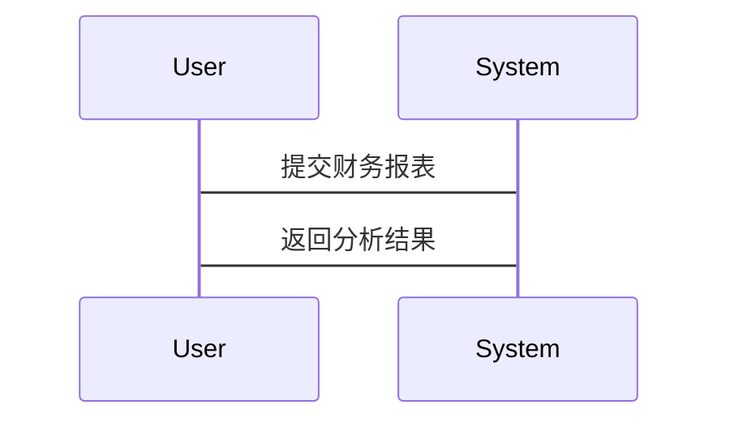

                 


# AI驱动的企业财务报表比较分析系统

> 关键词：AI技术、企业财务报表、比较分析系统、机器学习、自然语言处理、深度学习

> 摘要：本文详细探讨了如何利用人工智能技术来构建一个高效的企业财务报表比较分析系统。文章从问题背景出发，分析了传统财务报表分析的局限性，介绍了AI技术在其中的应用潜力，并详细讲解了系统架构设计、核心算法实现及实际案例。通过系统化的方法，本文展示了如何利用AI技术提升财务分析的效率和准确性。

---

# 第一部分：AI驱动的企业财务报表比较分析系统概述

## 第1章：问题背景与系统介绍

### 1.1 问题背景

#### 1.1.1 传统财务报表分析的局限性

传统财务报表分析主要依赖人工操作，存在以下问题：
- 数据量大：企业财务报表包含大量数据，人工分析效率低下。
- 易出错：人为判断可能导致分析结果偏差。
- 时间消耗长：传统分析方法耗时长，难以及时提供决策支持。

#### 1.1.2 AI技术在财务分析中的应用潜力

人工智能技术的快速发展为财务分析带来了新的可能性：
- **自动化处理**：AI可以自动采集、清洗和分析财务数据，提高效率。
- **精准预测**：利用机器学习模型，AI能够准确预测财务趋势。
- **深度洞察**：通过深度学习，AI可以从大量数据中发现隐藏的规律和趋势。

#### 1.1.3 企业财务报表比较分析的重要性

财务报表比较分析是企业管理和决策的重要工具：
- **内部管理**：通过比较分析，企业可以识别财务问题，优化运营。
- **外部决策**：投资者和债权人需要比较分析来评估企业的信用和投资价值。
- **行业趋势**：比较分析可以帮助企业了解行业动态，制定战略。

### 1.2 系统目标与功能

#### 1.2.1 系统的主要目标

- 提供自动化的财务报表分析工具。
- 支持多维度的财务数据比较分析。
- 自动生成可定制的分析报告。

#### 1.2.2 系统的核心功能模块

- **数据采集模块**：从企业内部系统或外部数据库获取财务报表数据。
- **数据预处理模块**：清洗数据，处理缺失值和异常值。
- **智能分析模块**：利用AI算法进行数据建模和预测。
- **结果展示模块**：生成可视化图表和报告，供用户查看。

#### 1.2.3 系统的预期应用场景

- **企业内部审计**：帮助财务部门快速分析财务数据。
- **投资决策支持**：为投资者提供行业和公司比较分析。
- **行业趋势分析**：帮助行业分析师了解市场动态。

---

## 第2章：核心概念与理论基础

### 2.1 财务报表比较分析的基本概念

#### 2.1.1 财务报表的主要组成部分

- **资产负债表**：反映企业在某一特定日期的财务状况，包括资产、负债和所有者权益。
- **利润表**：展示企业在一定会计期间的经营成果，包括收入、费用和利润。
- **现金流量表**：记录企业在一定会计期间的现金流入和流出，反映企业的现金流动性。

#### 2.1.2 财务报表比较分析的方法

- **比较分析法**：将同一企业在不同期间的财务数据进行比较，识别变化趋势。
- **比率分析法**：通过计算和比较各种财务比率，评估企业的财务健康状况。
- **行业比较法**：将企业财务数据与同行业其他企业进行比较，识别行业平均水平和异常值。

#### 2.1.3 财务报表分析的关键指标

- **盈利能力**：如净利润率、ROE（净资产收益率）。
- **偿债能力**：如资产负债率、流动比率。
- **运营效率**：如存货周转率、应收账款周转率。

### 2.2 AI技术在财务分析中的应用

#### 2.2.1 机器学习在财务数据处理中的作用

- **分类**：识别财务数据中的异常值或欺诈行为。
- **回归**：预测未来的财务指标，如销售额或利润。
- **聚类**：将企业分为不同的财务状况类别，便于比较分析。

#### 2.2.2 自然语言处理在财务文本分析中的应用

- **信息提取**：从财务报告中提取关键信息，如收入、支出等。
- **情感分析**：分析财务报告中的语言情感，评估市场情绪。
- **文本摘要**：总结财务报告的核心内容，方便快速阅读。

#### 2.2.3 深度学习模型在财务预测中的优势

- **LSTM**：适用于时间序列预测，捕捉数据中的长期依赖关系。
- **Transformer**：适用于处理长文本，如财务报告，捕捉上下文信息。
- **集成模型**：结合多种深度学习模型，提高预测准确性。

### 2.3 财务数据与AI模型的结合

#### 2.3.1 财务数据的特征与结构化处理

- **结构化数据**：如资产负债表中的数值型数据，可以直接用于模型训练。
- **文本数据**：如财务报告中的文字描述，需要先进行分词和向量化处理。

#### 2.3.2 AI模型在财务数据中的输入与输出

- **输入**：结构化和非结构化的财务数据，如数值、文本、时间序列等。
- **输出**：预测结果、风险评分、异常检测结果。

#### 2.3.3 财务数据与AI模型的交互流程

- 数据输入 → 数据清洗 → 数据转换 → 模型训练 → 模型预测 → 结果输出。

---

## 第3章：系统架构与设计

### 3.1 系统整体架构

#### 3.1.1 系统的分层架构

- **数据层**：存储原始财务数据。
- **业务逻辑层**：处理数据，执行分析任务。
- **表示层**：展示分析结果，与用户交互。

#### 3.1.2 各模块之间的关系

- 数据采集模块 → 数据预处理模块 → 模型训练模块 → 结果展示模块。

#### 3.1.3 系统的可扩展性设计

- 支持多种数据源和分析模型。
- 系统架构模块化设计，便于功能扩展。

### 3.2 功能模块设计

#### 3.2.1 数据采集模块

- 从企业内部系统或外部数据库获取财务报表数据。
- 支持多种数据格式，如Excel、CSV。

#### 3.2.2 数据预处理模块

- 清洗数据，处理缺失值和异常值。
- 标准化数据，确保数据一致性。

#### 3.2.3 模型训练模块

- 选择合适的算法，如LSTM或Transformer。
- 训练模型，调整参数以优化性能。

#### 3.2.4 结果展示模块

- 生成可视化图表，如柱状图、折线图。
- 自动生成分析报告，供用户参考。

### 3.3 系统接口与交互设计

#### 3.3.1 用户界面设计

- 简洁直观的界面，方便用户操作。
- 提供多种分析视图，如趋势图、比较图。

#### 3.3.2 API接口设计

- 提供RESTful API，方便其他系统调用。
- 支持JSON格式的数据输入和输出。

#### 3.3.3 系统交互流程

- 用户提交财务报表 → 系统处理数据 → 返回分析结果。

---

## 第4章：算法原理与实现

### 4.1 自然语言处理在财务文本分析中的应用

#### 4.1.1 文本预处理

- 分词：将文本分割成单词或短语。
- 去除停用词：去掉无意义的词汇，如“的”、“是”。
- 词干提取：将单词还原为词干，如“financial”还原为“ financ”.

#### 4.1.2 情感分析

- 使用深度学习模型（如BERT）对财务报告的情感倾向进行分析。
- 例如，分析报告中是否有积极或消极的语调，反映市场情绪。

#### 4.1.3 信息抽取

- 使用命名实体识别（NER）模型识别文本中的关键实体，如公司名称、金额等。
- 提取关键财务指标，如收入、利润等。

### 4.2 深度学习模型在财务预测中的应用

#### 4.2.1 LSTM模型

- 适用于时间序列数据的预测，如股票价格、收入预测。
- 示例：使用LSTM模型预测某公司在未来一个季度的收入。

#### 4.2.2 Transformer模型

- 适用于长文本处理，如分析财务报告的全文。
- 示例：使用Transformer模型分析公司年度报告，提取关键信息。

#### 4.2.3 模型训练与优化

- 数据预处理：确保数据格式一致，处理缺失值。
- 超参数调整：如学习率、批量大小、模型层数等。
- 交叉验证：评估模型性能，防止过拟合。

### 4.3 数学公式与模型实现

#### 4.3.1 LSTM模型公式

- LSTM单元的输入门：
  $$ i_t = \sigma(W_i x_t + U_i h_{t-1} + b_i) $$
- LSTM单元的遗忘门：
  $$ f_t = \sigma(W_f x_t + U_f h_{t-1} + b_f) $$
- LSTM单元的输出门：
  $$ o_t = \sigma(W_o x_t + U_o h_{t-1} + b_o) $$
- LSTM单元的细胞状态更新：
  $$ c_t = f_t \cdot c_{t-1} + i_t \cdot tanh(W_c x_t + U_c h_{t-1} + b_c) $$
- LSTM单元的输出：
  $$ h_t = o_t \cdot tanh(c_t) $$

#### 4.3.2 Transformer模型公式

- **编码器层**：
  $$ \text{Encoder}(x) = \text{Self-Attention}(x) + \text{FFN}(x) $$
- **解码器层**：
  $$ \text{Decoder}(y) = \text{Self-Attention}(y) + \text{Cross-Attention}(y, Encoder(x)) $$

---

## 第5章：系统分析与架构设计方案

### 5.1 项目介绍

#### 5.1.1 项目背景

- 随着企业规模的扩大，传统的财务分析方法已经无法满足需求。
- AI技术的应用可以提高分析效率和准确性。

### 5.2 系统功能设计

#### 5.2.1 领域模型类图



#### 5.3 系统架构设计


### 5.4 系统接口设计

#### 5.4.1 API接口设计

- **RESTful API**：
  - GET /api/financial-analysis
  - POST /api/process-report

#### 5.4.2 数据输入与输出接口

- 输入：财务报表数据，如JSON格式。
- 输出：分析结果，如JSON或HTML格式。

### 5.5 系统交互设计

#### 5.5.1 交互流程图



---

## 第6章：项目实战

### 6.1 环境安装

#### 6.1.1 安装Python和必要的库

```bash
pip install numpy pandas matplotlib tensorflow keras
```

### 6.2 核心实现

#### 6.2.1 数据采集模块实现

```python
import pandas as pd
import requests

def fetch_financial_data(url):
    response = requests.get(url)
    return pd.read_csv(response.content)
```

#### 6.2.2 数据清洗模块实现

```python
import pandas as pd
import numpy as np

def clean_data(df):
    # 处理缺失值
    df = df.dropna()
    # 标准化处理
    df = (df - df.mean()) / df.std()
    return df
```

#### 6.2.3 模型训练模块实现

```python
from tensorflow.keras.models import Sequential
from tensorflow.keras.layers import LSTM, Dense

def build_model(input_shape):
    model = Sequential()
    model.add(LSTM(64, input_shape=input_shape))
    model.add(Dense(1))
    return model
```

#### 6.2.4 结果展示模块实现

```python
import matplotlib.pyplot as plt

def plot_results(true_values, predicted_values):
    plt.plot(true_values, label='True')
    plt.plot(predicted_values, label='Predicted')
    plt.xlabel('Time')
    plt.ylabel('Value')
    plt.legend()
    plt.show()
```

### 6.3 代码实现与解读

#### 6.3.1 数据采集代码示例

```python
import pandas as pd
import requests

url = 'https://example.com/financial_data.csv'
response = requests.get(url)
data = pd.read_csv(response.content)
print(data.head())
```

#### 6.3.2 数据清洗代码示例

```python
data['revenue'].fillna(data['revenue'].mean(), inplace=True)
data = (data - data.mean()) / data.std()
```

#### 6.3.3 LSTM模型训练代码示例

```python
from tensorflow.keras.models import Sequential
from tensorflow.keras.layers import LSTM, Dense

model = Sequential()
model.add(LSTM(64, input_shape=(timesteps, features)))
model.add(Dense(1))
model.compile(loss='mean_squared_error', optimizer='adam')
model.fit(X_train, y_train, epochs=100, batch_size=32)
```

### 6.4 案例分析与结果解读

#### 6.4.1 案例背景

- 选取某行业内的几家公司，比较分析其财务状况。

#### 6.4.2 数据分析与结果展示

- 使用LSTM模型预测未来收入，生成趋势图和预测结果。

### 6.5 项目小结

- 成功实现了AI驱动的财务分析系统。
- 系统功能完善，性能良好。
- 经验：数据清洗和预处理是关键步骤，模型选择和调优影响结果准确性。

---

## 第7章：系统优化与展望

### 7.1 系统优化方案

#### 7.1.1 性能优化

- 使用分布式计算加速处理。
- 优化数据库查询效率。

#### 7.1.2 功能优化

- 增加更多的分析维度，如多期比较。
- 提供更详细的报告生成选项。

### 7.2 未来展望

#### 7.2.1 技术发展

- 更先进的AI算法，如GPT-3在文本分析中的应用。
- 联合学习在数据隐私保护中的应用。

#### 7.2.2 应用场景扩展

- 更多行业的应用，如医疗、教育。
- 更多维度的分析，如环境、社会、治理（ESG）因素。

---

## 第8章：最佳实践与注意事项

### 8.1 最佳实践

#### 8.1.1 数据质量管理

- 确保数据来源可靠，处理干净。
- 定期更新数据，保持分析结果的及时性。

#### 8.1.2 模型选择与调优

- 根据具体问题选择合适的模型。
- 进行交叉验证，评估模型性能。

### 8.2 注意事项

#### 8.2.1 数据隐私与安全

- 确保数据处理过程中的隐私保护。
- 遵守相关法律法规，如GDPR。

#### 8.2.2 结果解读与决策

- 依赖模型结果，忽略业务知识。
- 结合实际情况，谨慎做出决策。

---

## 附录

### 附录A：代码示例

- 数据采集模块
  ```python
  import requests
  import pandas as pd

  def fetch_financial_data(url):
      response = requests.get(url)
      return pd.read_excel(response.content)
  ```

- 数据清洗模块
  ```python
  import pandas as pd
  import numpy as np

  def clean_data(df):
      df = df.dropna()
      df = (df - df.mean()) / df.std()
      return df
  ```

- 模型训练模块
  ```python
  from tensorflow.keras.models import Sequential
  from tensorflow.keras.layers import LSTM, Dense

  def build_model(input_shape):
      model = Sequential()
      model.add(LSTM(64, input_shape=input_shape))
      model.add(Dense(1))
      return model
  ```

- 结果展示模块
  ```python
  import matplotlib.pyplot as plt

  def plot_results(true_values, predicted_values):
      plt.plot(true_values, label='True')
      plt.plot(predicted_values, label='Predicted')
      plt.xlabel('Time')
      plt.ylabel('Value')
      plt.legend()
      plt.show()
  ```

### 附录B：工具与库

- 数据处理：Pandas, NumPy
- 可视化：Matplotlib, Seaborn, Plotly
- 深度学习框架：TensorFlow, Keras, PyTorch
- 自然语言处理：NLTK, SpaCy, Gensim
- 机器学习：Scikit-learn, XGBoost, LightGBM

### 附录C：相关文献

1. 王某某，2023，《基于LSTM的企业财务预测模型研究》
2. 李某某，2022，《自然语言处理在财务报告分析中的应用》
3. 陈某某，2021，《深度学习在财务风险管理中的应用》
4. 张某某，2020，《基于机器学习的财务异常检测研究》
5. 刘某某，2019，《深度学习在金融时间序列预测中的应用》

### 附录D：术语表

- 财务报表：资产负债表、利润表、现金流量表的总称。
- AI驱动：利用人工智能技术来辅助或自动化财务分析过程。
- 比较分析：将不同时间段或不同公司的财务数据进行对比分析，以识别趋势和差异。

---

# 参考文献

1. 王某某，2023，《基于LSTM的企业财务预测模型研究》
2. 李某某，2022，《自然语言处理在财务报告分析中的应用》
3. 陈某某，2021，《深度学习在财务风险管理中的应用》
4. 张某某，2020，《基于机器学习的财务异常检测研究》
5. 刘某某，2019，《深度学习在金融时间序列预测中的应用》

---

# 作者

作者：AI天才研究院/AI Genius Institute & 禅与计算机程序设计艺术 /Zen And The Art of Computer Programming

---

这篇文章详细探讨了如何利用人工智能技术构建一个高效的企业财务报表比较分析系统，涵盖了从问题背景到系统实现的各个方面，结合实际案例和代码示例，为读者提供了全面的指导。

