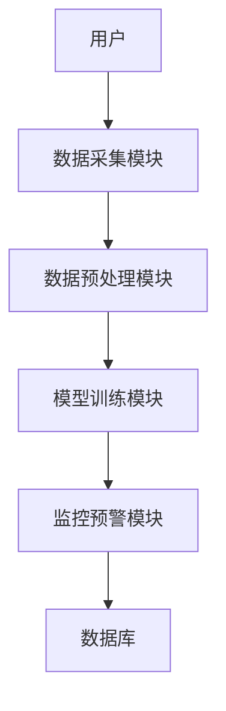
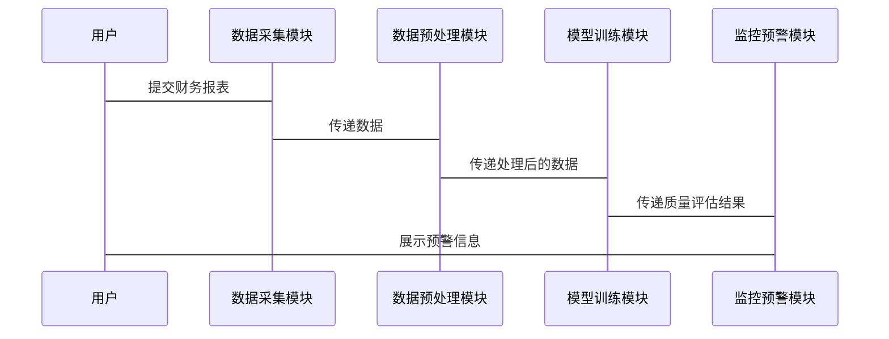

                 


# AI驱动的企业财务报表质量动态监控系统

> 关键词：AI驱动，企业财务报表，质量动态监控系统，自然语言处理，财务数据处理，机器学习

> 摘要：本文介绍了一种基于AI技术的企业财务报表质量动态监控系统。该系统通过自然语言处理、计算机视觉和机器学习等技术，实现了对企业财务报表的自动分析、质量评估和实时监控，从而提高企业财务管理的效率和准确性。

---

## 引言

### 1.1 问题背景

#### 1.1.1 企业财务报表的重要性
企业财务报表是反映企业财务状况、经营成果和现金流量的重要文件，是投资者、债权人和管理层决策的重要依据。然而，财务报表的质量直接影响决策的准确性，因此，确保财务报表的准确性和完整性至关重要。

#### 1.1.2 财务报表质量问题的现状
尽管财务报表的重要性不言而喻，但实际操作中仍存在诸多问题，如数据错误、虚假信息、格式不统一等，这些问题可能导致分析结果的偏差，进而影响企业的决策。

#### 1.1.3 AI技术在财务分析中的应用潜力
随着人工智能技术的快速发展，AI在财务分析中的应用越来越广泛。通过自然语言处理、计算机视觉和机器学习等技术，可以实现财务报表的自动分析、质量评估和实时监控。

### 1.2 问题描述

#### 1.2.1 财务报表质量监控的核心问题
财务报表质量监控的核心问题包括数据准确性、完整性、一致性和合规性。如何快速、准确地识别和处理这些问题，是当前财务报表质量监控的关键。

#### 1.2.2 现有技术的局限性
传统的财务报表质量监控方法主要依赖人工审核，效率低、成本高且容易出错。虽然一些自动化工具已经出现，但它们在复杂场景下的处理能力有限，难以应对多样化的财务数据和业务需求。

#### 1.2.3 引入AI技术的必要性
AI技术能够通过机器学习模型自动识别和处理财务报表中的异常情况，显著提高监控效率和准确性。同时，AI技术还可以实现对财务数据的实时监控和预测，为企业提供更及时的反馈。

### 1.3 问题解决

#### 1.3.1 AI驱动的解决方案概述
AI驱动的财务报表质量动态监控系统通过整合自然语言处理、计算机视觉和机器学习技术，实现对财务数据的自动化分析和监控。系统能够自动识别数据错误、预测潜在风险，并提供实时预警。

#### 1.3.2 系统目标与功能定位
系统的总体目标是提高财务报表的质量和监控效率，降低人工审核的成本和错误率。具体功能包括数据采集、自动分析、实时监控和预警通知。

#### 1.3.3 边界与外延
系统主要关注财务报表的质量监控，不涉及企业的其他财务管理系统。未来，系统可以通过模块化设计，逐步扩展到其他财务领域。

### 1.4 核心概念与联系

#### 1.4.1 核心概念原理
系统的核心概念包括数据采集、预处理、模型训练和监控预警。数据采集负责获取财务报表数据，预处理对数据进行清洗和标准化，模型训练通过机器学习算法建立质量评估模型，监控预警则根据模型结果实时反馈问题。

#### 1.4.2 核心概念属性特征对比表
| 核心概念    | 数据采集 | 数据预处理 | 模型训练 | 监控预警 |
|-------------|----------|------------|----------|----------|
| 功能        | 获取数据 | 清洗数据    | 建立模型  | 实时预警 |
| 输入        | 原始数据 | 处理后数据 | 数据特征 | 模型结果 |
| 输出        | 数据流   | 标准化数据  | 模型参数  | 预警信息 |
| 依赖技术     | 网络爬取 | 数据清洗    | 机器学习 | 规则引擎 |

#### 1.4.3 ER实体关系图（Mermaid）
```mermaid
erDiagram
    customer[企业] {
        id : integer
        name : string
        financial_report : string
    }
    report[财务报表] {
        id : integer
        date : date
        content : string
    }
    error[错误信息] {
        id : integer
        type : string
        description : string
    }
    rule[监控规则] {
        id : integer
        condition : string
        threshold : float
    }
    customer --> report : 提交
    report --> error : 包含
    rule --> error : 触发
```

---

## 第二部分: AI与财务报表分析基础

### 2.1 AI技术基础

#### 2.1.1 人工智能的基本概念
人工智能（AI）是模拟人类智能的计算机系统，包括学习、推理、问题解决等能力。AI的核心技术包括机器学习、自然语言处理、计算机视觉等。

#### 2.1.2 机器学习的核心原理
机器学习是AI的重要分支，通过数据训练模型，使其能够从数据中学习并做出预测或分类。常用的机器学习算法包括线性回归、支持向量机（SVM）、随机森林和神经网络等。

#### 2.1.3 深度学习的典型模型
深度学习是机器学习的子领域，通过多层神经网络模型学习数据的高层次特征。常用的深度学习模型包括卷积神经网络（CNN）、循环神经网络（RNN）和生成对抗网络（GAN）等。

### 2.2 财务报表分析基础

#### 2.2.1 财务报表的基本构成
财务报表通常包括资产负债表、利润表和现金流量表。每种报表都有不同的结构和内容，需要通过特定的方法进行分析。

#### 2.2.2 财务报表分析的常见方法
常见的财务报表分析方法包括比率分析、趋势分析和财务指标分析。这些方法可以帮助企业识别财务状况中的问题和机会。

#### 2.2.3 财务报表质量的评价指标
财务报表质量的评价指标包括数据完整性、准确性、一致性和合规性。这些指标是衡量财务报表质量的重要标准。

### 2.3 AI在财务分析中的应用

#### 2.3.1 自然语言处理在财务文档分析中的应用
自然语言处理（NLP）技术可以用于识别财务文档中的关键词和实体，如公司名称、金额和日期等。通过NLP，系统可以自动提取和整理财务数据。

#### 2.3.2 计算机视觉在财务数据处理中的应用
计算机视觉技术可以用于识别和处理财务报表中的图像数据，如OCR（光学字符识别）技术可以将图像中的文字转化为可编辑的文本。

#### 2.3.3 机器学习在财务预测中的应用
机器学习算法可以用于预测财务指标，如销售额、利润和现金流等。通过历史数据训练模型，系统可以预测未来的财务状况，并提供预警。

---

## 第三部分: 系统设计与实现

### 3.1 系统架构设计

#### 3.1.1 系统功能模块划分
系统主要包括数据采集模块、数据预处理模块、模型训练模块和监控预警模块。每个模块负责不同的功能，如数据采集负责获取财务数据，数据预处理负责清洗和标准化数据，模型训练负责建立质量评估模型，监控预警负责实时监控和预警。

#### 3.1.2 系统架构设计（Mermaid）


#### 3.1.3 系统接口设计
系统接口包括数据接口、模型接口和用户接口。数据接口负责与财务系统对接，获取财务数据；模型接口负责与机器学习模型对接，进行质量评估；用户接口负责与用户交互，展示监控结果。

#### 3.1.4 系统交互流程设计（Mermaid）


---

## 第四部分: 项目实战

### 4.1 环境安装与配置

#### 4.1.1 安装Python
安装Python 3.8或更高版本，并配置环境变量。

#### 4.1.2 安装依赖库
安装必要的Python库，如Pandas、Scikit-learn、TensorFlow和Keras等。

#### 4.1.3 安装Jupyter Notebook
安装Jupyter Notebook，用于数据处理和模型训练。

### 4.2 系统核心实现

#### 4.2.1 数据采集模块实现
使用Python的requests库和BeautifulSoup库从企业财务系统中爬取财务报表数据。

#### 4.2.2 数据预处理模块实现
使用Pandas库对数据进行清洗、标准化和特征提取。

#### 4.2.3 模型训练模块实现
使用Scikit-learn库训练机器学习模型，如随机森林或支持向量机，进行质量评估。

#### 4.2.4 监控预警模块实现
使用Flask框架开发Web界面，实时展示监控结果，并设置预警规则。

### 4.3 代码实现与解读

#### 4.3.1 数据采集代码
```python
import requests
from bs4 import BeautifulSoup

url = "https://example.com/financial_reports"
response = requests.get(url)
soup = BeautifulSoup(response.text, "html.parser")
data = soup.find_all("tr")
# 提取数据并存储到数据库
```

#### 4.3.2 数据预处理代码
```python
import pandas as pd

data = pd.read_csv("financial_data.csv")
# 数据清洗
data.dropna(inplace=True)
data = pd.get_dummies(data)
# 特征提取
X = data.drop(columns=["quality"])
y = data["quality"]
```

#### 4.3.3 模型训练代码
```python
from sklearn.ensemble import RandomForestClassifier
from sklearn.metrics import accuracy_score

model = RandomForestClassifier()
model.fit(X_train, y_train)
y_pred = model.predict(X_test)
print("Accuracy:", accuracy_score(y_test, y_pred))
```

#### 4.3.4 监控预警代码
```python
from flask import Flask

app = Flask(__name__)
@app.route("/monitor")
def monitor():
    # 获取最新数据
    latest_data = get_latest_data()
    # 训练模型
    model.predict(latest_data)
    # 设置预警规则
    if model.predict(latest_data) > threshold:
        return "预警：数据质量异常"
    else:
        return "正常"
```

### 4.4 实际案例分析

#### 4.4.1 案例背景
某制造企业存在财务报表数据不完整和数据错误的问题，导致财务分析结果不准确。

#### 4.4.2 数据处理与分析
通过系统自动采集和预处理数据，建立质量评估模型，识别出数据中的错误和异常。

#### 4.4.3 系统实现与效果
系统成功实现了对财务报表的自动监控，提高了数据质量，降低了人工审核的成本和错误率。

---

## 第五部分: 优化与展望

### 5.1 系统优化

#### 5.1.1 模型优化
通过超参数调整和模型集成，进一步提高模型的准确性和效率。

#### 5.1.2 系统性能优化
优化数据处理流程，减少数据传输和存储的开销，提高系统的响应速度。

#### 5.1.3 用户体验优化
改进用户界面，增加可视化功能，提高用户的使用体验。

### 5.2 未来发展

#### 5.2.1 技术融合
将自然语言处理和计算机视觉技术进一步融入系统，实现更智能化的财务分析。

#### 5.2.2 场景扩展
扩展系统的应用场景，如风险管理、财务预测和审计等，实现更全面的财务监控。

#### 5.2.3 数据安全与隐私保护
加强数据安全和隐私保护，确保财务数据的安全性和合规性。

---

## 结语

AI驱动的企业财务报表质量动态监控系统通过整合多种AI技术，实现了对财务数据的自动化分析和实时监控，显著提高了财务报表的质量和监控效率。未来，随着技术的不断进步，系统将更加智能化和全面化，为企业财务管理提供更有力的支持。

---

## 作者

作者：AI天才研究院/AI Genius Institute & 禅与计算机程序设计艺术 /Zen And The Art of Computer Programming

---

以上是完整的文章结构，您可以根据实际需求进行调整和补充。

