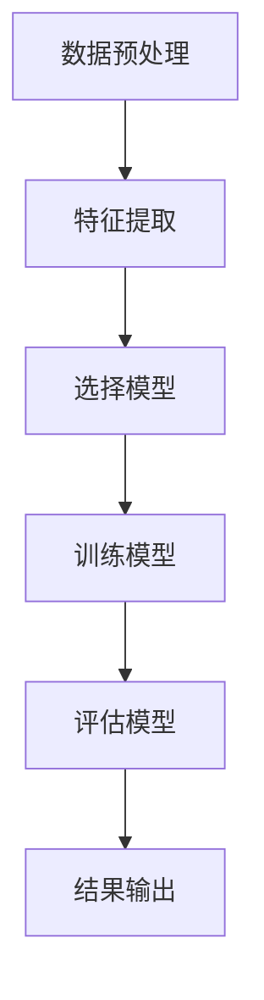
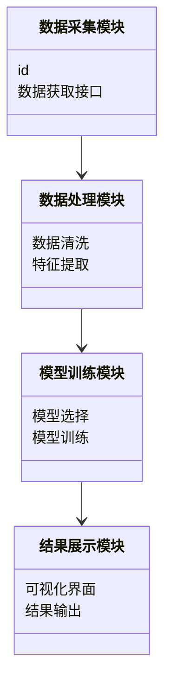

                 


# AI驱动的企业财务报表质量评估系统

> 关键词：AI技术、财务报表评估、机器学习、深度学习、系统架构设计

> 摘要：本文详细探讨了如何利用人工智能技术驱动企业财务报表质量评估系统。从背景介绍、核心概念、算法原理到系统架构设计和项目实战，全面解析了AI在财务报表评估中的应用，提供了丰富的代码示例和实际案例分析，帮助读者深入了解该系统的实现与优化。

---

## 第一部分：背景介绍

### 第1章：问题背景与核心概念

#### 1.1 问题背景

随着企业规模的不断扩大和业务的复杂化，传统的财务报表评估方法逐渐暴露出效率低下、准确性不足的问题。传统方法依赖人工审核，容易受到主观因素影响，且难以快速处理大量数据。同时，财务报表中的数据可能存在异常值或欺诈行为，这些问题需要更高效、智能的手段来解决。

#### 1.2 核心概念与系统框架

- **AI驱动**：利用机器学习和深度学习技术，从财务数据中提取特征，训练模型进行预测和分类。
- **财务报表评估**：通过对财务数据的分析，评估报表的质量，识别潜在问题或异常。

### 1.3 核心概念对比

| 概念 | 描述 | 示例 |
|------|------|------|
| 数据预处理 | 对数据进行清洗和转换，确保模型输入的正确性 | 数据标准化、缺失值处理 |
| 模型训练 | 使用训练数据训练模型，使其能够预测新数据 | 随机森林、神经网络 |
| 特征提取 | 从原始数据中提取有用的特征，提高模型性能 | 主成分分析（PCA）、TF-IDF |

### 1.4 实体关系图

```mermaid
er
  图表标题：财务报表评估系统实体关系图

  class 系统 {
    id
    name
    description
  }
  class 用户 {
    id
    username
    password
  }
  class 数据 {
    id
    content
    source
  }
  系统 --> 用户：提供访问权限
  系统 --> 数据：处理和存储
  用户 --> 数据：上传和查询
```

---

## 第二部分：AI驱动的财务报表质量评估系统原理

### 第2章：AI与财务报表评估的核心原理

#### 2.1 数据预处理与特征提取

- **数据清洗**：去除异常值、填充缺失值、处理重复数据。
- **特征选择**：使用统计方法或模型评估选择重要特征。
- **降维方法**：如主成分分析（PCA）减少数据维度。

#### 2.2 机器学习模型的应用

- **随机森林**：用于分类和回归，适合处理高维数据。
- **支持向量机（SVM）**：适用于小规模数据分类。
- **深度学习模型**：如卷积神经网络（CNN）和循环神经网络（RNN），适合处理复杂数据模式。

### 第3章：算法实现与数学模型

#### 3.1 算法流程图



#### 3.2 随机森林算法示例

```python
from sklearn.ensemble import RandomForestClassifier
import pandas as pd
import numpy as np

# 数据加载与处理
data = pd.read_csv('financial_data.csv')
X = data.drop('label', axis=1)
y = data['label']

# 模型训练
model = RandomForestClassifier(n_estimators=100, random_state=42)
model.fit(X, y)

# 模型预测
predictions = model.predict(X)
print("Predictions:", predictions)
```

#### 3.3 数学模型公式

分类问题的损失函数：

$$
L = -\frac{1}{m} \sum_{i=1}^{m} y_i \log(p_i) + (1 - y_i) \log(1 - p_i)
$$

优化方法：

$$
\theta = \theta - \alpha \frac{\partial L}{\partial \theta}
$$

其中，$\alpha$ 是学习率。

---

## 第三部分：系统架构与设计

### 第4章：系统功能模块

#### 4.1 功能模块设计



### 4.2 系统架构设计

#### 4.2.1 分层架构


---

## 第四部分：项目实战与案例分析

### 第5章：项目实战

#### 5.1 环境搭建

```bash
pip install numpy pandas scikit-learn
```

#### 5.2 核心代码实现

```python
# 数据处理代码
import pandas as pd
import numpy as np

data = pd.read_csv('financial_data.csv')
data = data.dropna()
data['label'] = data['label'].astype(int)

# 特征选择
selected_features = ['revenue', 'profit', 'expenses']
X = data[selected_features]
y = data['label']

# 模型训练
from sklearn.ensemble import RandomForestClassifier
model = RandomForestClassifier()
model.fit(X, y)

# 模型评估
from sklearn.metrics import accuracy_score
accuracy = accuracy_score(y, model.predict(X))
print("Accuracy:", accuracy)
```

### 5.3 案例分析

#### 5.3.1 数据上传与处理

用户上传财务数据，系统进行数据清洗和特征提取。

#### 5.3.2 模型训练与结果展示

训练完成后，系统生成分类结果，并通过可视化展示。

### 5.4 项目总结

通过项目实战，读者可以掌握从数据处理到模型训练的完整流程，理解AI在财务报表评估中的实际应用。

---

## 第五部分：最佳实践与小结

### 5.1 小结

本文详细介绍了AI驱动的企业财务报表质量评估系统，从背景、原理到系统设计和项目实战，帮助读者全面理解该系统的实现。

### 5.2 注意事项

- 数据隐私保护
- 模型的可解释性
- 系统的可扩展性

### 5.3 未来展望

随着AI技术的发展，财务报表评估系统将更加智能化，可能结合NLP技术进行文本分析，进一步提升评估的准确性。

---

## 作者

作者：AI天才研究院/AI Genius Institute & 禅与计算机程序设计艺术 /Zen And The Art of Computer Programming

---

通过以上结构，文章详细讲解了AI在企业财务报表质量评估中的应用，从理论到实践，帮助读者全面掌握相关知识。

