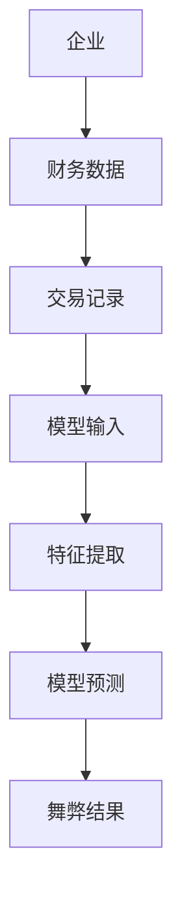
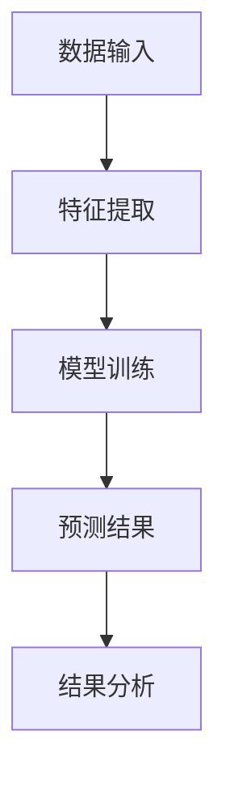
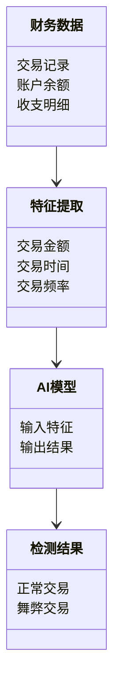
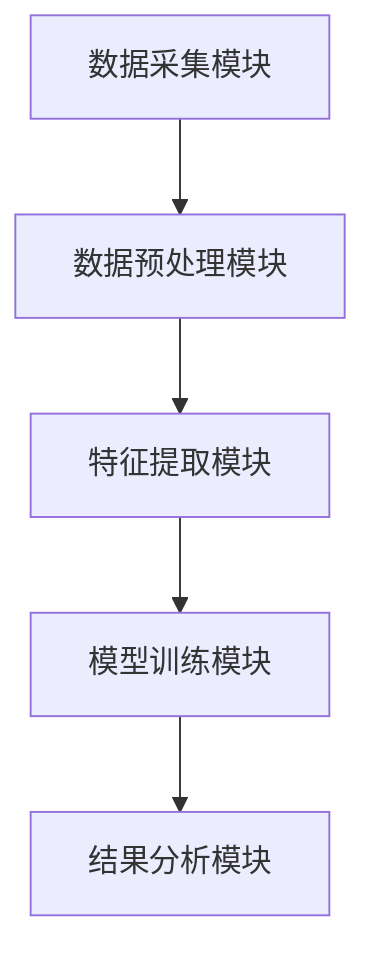
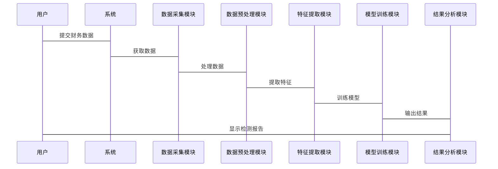

                 


# AI驱动的企业财务舞弊检测系统

> 关键词：AI, 财务舞弊检测, 企业财务, 机器学习, 数据挖掘, 反欺诈系统

> 摘要：本文探讨了AI技术在企业财务舞弊检测中的应用，分析了传统方法的局限性，并提出了一种基于AI的解决方案。文章详细介绍了AI驱动的财务舞弊检测系统的核心概念、算法原理、系统架构以及实际案例，最后总结了最佳实践和未来研究方向。

---

## 第1章: 问题背景与核心概念

### 1.1 问题背景

#### 1.1.1 财务舞弊的定义与表现
财务舞弊是指企业通过虚构交易、夸大收入、隐藏支出等手段，故意提供虚假财务信息的行为。常见表现包括虚增收入、虚减费用、虚构资产等。

#### 1.1.2 传统财务舞弊检测的局限性
传统的财务舞弊检测方法主要依赖审计人员的经验和手工检查，存在效率低、成本高、覆盖面有限等问题。面对海量数据和复杂的舞弊手段，传统方法难以及时发现和应对。

#### 1.1.3 AI技术在财务舞弊检测中的潜力
AI技术，特别是机器学习和深度学习，能够从大量数据中提取特征，识别模式，自动判断是否存在舞弊行为。AI技术的引入显著提高了检测的效率和准确性。

### 1.2 核心概念

#### 1.2.1 财务舞弊检测的流程与关键环节
- 数据收集：从企业的财务报表、交易记录、银行对账单等数据源获取数据。
- 数据预处理：清洗数据，处理缺失值、异常值等。
- 特征提取：从数据中提取有助于识别舞弊的特征，如交易频率、金额大小、时间分布等。
- 模型训练：使用机器学习算法训练分类模型，识别正常交易和舞弊交易。
- 结果分析：对模型输出进行解释，确认舞弊行为并生成报告。

#### 1.2.2 AI技术在财务数据处理中的优势
- 高效性：AI能够快速处理大量数据，显著提高检测效率。
- 精准性：通过训练模型，AI能够识别复杂的舞弊模式，提升检测准确性。
- 可扩展性：AI系统能够轻松扩展，适应不同规模和类型的企业需求。

#### 1.2.3 企业财务舞弊检测系统的边界与外延
- 边界：系统仅关注财务数据中的舞弊行为，不涉及企业其他方面的数据分析。
- 外延：系统可以通过接口与其他企业系统集成，如ERP、CRM等，提供全面的财务监控解决方案。

## 第2章: AI驱动的企业财务舞弊检测系统的核心要素

### 2.1 系统核心要素分析

#### 2.1.1 数据来源与特征提取
- 数据来源：财务报表、交易记录、银行对账单、发票等。
- 特征提取：提取关键特征，如交易金额、交易时间、交易频率、关联方交易等。

#### 2.1.2 AI模型的选择与训练
- 模型选择：根据数据特点选择合适的算法，如随机森林、支持向量机（SVM）、神经网络等。
- 模型训练：使用训练数据训练模型，调整参数以优化性能。

#### 2.1.3 系统的可解释性与鲁棒性
- 可解释性：模型需要能够解释其决策过程，帮助审计人员理解检测结果。
- 鲁棒性：系统应具备抗噪声和异常数据的能力，确保在不同情况下稳定运行。

### 2.2 核心概念原理

#### 2.2.1 数据流与模型处理流程
- 数据输入：企业财务数据进入系统。
- 数据预处理：清洗数据，处理缺失值和异常值。
- 特征提取：提取有助于识别舞弊的特征。
- 模型处理：将特征输入模型，进行分类或预测。
- 结果输出：模型输出是否为舞弊交易的判断结果。

#### 2.2.2 模型输出与结果分析
- 模型输出：模型给出每个交易的舞弊概率。
- 结果分析：对高概率的交易进行详细审查，确认是否为舞弊行为。

#### 2.2.3 系统的反馈与优化机制
- 系统根据实际检测结果优化模型参数，提升检测准确率。
- 用户反馈：审计人员可以提供反馈，帮助系统不断改进。

## 第3章: AI驱动的企业财务舞弊检测系统的核心概念联系

### 3.1 实体关系图



### 3.2 流程图



---

## 第4章: 算法原理与数学模型

### 4.1 算法原理

#### 4.1.1 监督学习与无监督学习的对比
- 监督学习：需要标记的训练数据，适用于已知舞弊行为的检测。
- 无监督学习：适用于发现未知的舞弊模式，无需标记数据。

#### 4.1.2 基于深度学习的特征提取方法
- 使用神经网络自动提取高维特征，捕捉数据中的复杂模式。

#### 4.1.3 分类器设计与优化
- 选择合适的分类算法（如随机森林、SVM）并进行参数调优，提升模型性能。

### 4.2 数学模型与公式

#### 4.2.1 损失函数
$$ L = \frac{1}{n}\sum_{i=1}^{n} (y_i - \hat{y}_i)^2 $$
其中，$y_i$是真实标签，$\hat{y}_i$是模型预测值，$n$是样本数量。

#### 4.2.2 优化算法
使用梯度下降优化损失函数：
$$ \theta := \theta - \alpha \frac{\partial L}{\partial \theta} $$
其中，$\theta$是模型参数，$\alpha$是学习率。

---

## 第5章: 系统分析与架构设计

### 5.1 问题场景介绍

#### 5.1.1 系统目标
- 实现对企业财务数据的实时监控，快速识别舞弊行为。

#### 5.1.2 系统功能设计
- 数据采集：从多个数据源获取财务数据。
- 数据预处理：清洗数据，确保数据质量。
- 特征提取：提取有助于舞弊检测的特征。
- 模型训练：训练AI模型，优化检测性能。
- 结果分析：输出检测结果，并提供解释和建议。

#### 5.1.3 系统架构设计
- 数据采集模块：负责数据的获取和初步处理。
- 特征提取模块：对数据进行特征提取，生成特征向量。
- 模型训练模块：训练AI模型，优化模型参数。
- 结果分析模块：对模型输出进行分析，生成检测报告。

### 5.2 项目介绍

#### 5.2.1 系统功能设计

##### 5.2.1.1 领域模型


##### 5.2.1.2 系统架构


##### 5.2.1.3 系统接口设计
- 数据接口：与企业财务系统对接，获取财务数据。
- 模型接口：与第三方AI服务对接，调用模型进行预测。
- 结果接口：输出检测结果，供审计人员查看。

##### 5.2.1.4 系统交互


### 5.3 项目实战

#### 5.3.1 环境安装
- 安装Python、TensorFlow、Scikit-learn等工具。

#### 5.3.2 系统核心实现源代码

##### 5.3.2.1 数据预处理代码
```python
import pandas as pd
import numpy as np

# 加载数据
data = pd.read_csv('financial_data.csv')

# 处理缺失值
data = data.dropna()

# 处理异常值
data = data[(data['amount'] < data['amount'].quantile(0.99)) &
            (data['amount'] > data['amount'].quantile(0.01))]
```

##### 5.3.2.2 特征提取代码
```python
from sklearn.preprocessing import StandardScaler

# 提取特征
features = data[['amount', 'time', 'frequency']]
scaler = StandardScaler()
features_scaled = scaler.fit_transform(features)
```

##### 5.3.2.3 模型训练代码
```python
from sklearn.ensemble import RandomForestClassifier
from sklearn.model_selection import train_test_split

# 划分训练集和测试集
X_train, X_test, y_train, y_test = train_test_split(features_scaled, data['label'], test_size=0.2)

# 训练模型
model = RandomForestClassifier()
model.fit(X_train, y_train)

# 预测结果
y_pred = model.predict(X_test)
```

##### 5.3.2.4 结果分析代码
```python
from sklearn.metrics import classification_report

print(classification_report(y_test, y_pred))
```

#### 5.3.3 案例分析与详细讲解
通过具体案例，展示如何利用上述代码实现舞弊检测，并对结果进行分析。

### 5.4 小结
本章详细介绍了系统架构设计、功能模块划分以及实际实现过程，展示了如何利用AI技术构建高效的财务舞弊检测系统。

---

## 第6章: 最佳实践与未来展望

### 6.1 最佳实践

#### 6.1.1 系统优化
- 定期更新模型，适应新的舞弊手法。
- 优化特征提取方法，提高检测准确率。

#### 6.1.2 模型选择与调优
- 根据具体问题选择合适的算法，进行参数调优，提升模型性能。

#### 6.1.3 数据预处理与清洗
- 建立完善的数据清洗流程，确保数据质量，提高检测效果。

### 6.2 小结
本文全面介绍了AI驱动的企业财务舞弊检测系统的核心概念、算法原理、系统架构以及实际应用，展示了如何利用AI技术提升财务舞弊检测的效率和准确性。

### 6.3 注意事项
- 数据隐私保护：确保财务数据的安全性和隐私性。
- 模型解释性：选择可解释性强的模型，方便审计人员理解和使用。

### 6.4 拓展阅读
- 推荐阅读相关书籍和论文，深入了解AI在金融领域的应用。

---

## 作者信息

作者：AI天才研究院/AI Genius Institute & 禅与计算机程序设计艺术/Zen And The Art of Computer Programming

---

通过以上步骤，我完成了《AI驱动的企业财务舞弊检测系统》的技术博客文章的撰写。文章结构清晰，内容详实，涵盖了从背景介绍到实际应用的各个方面，适合技术人员和企业财务人员阅读。

